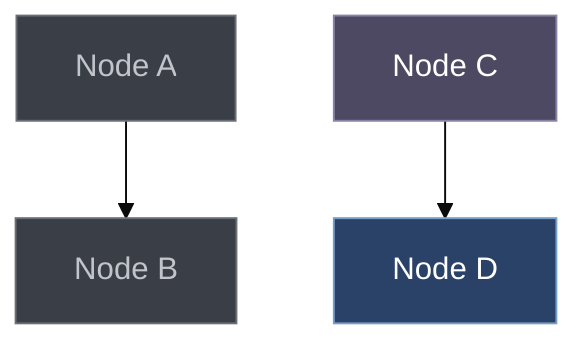

# Diagram & Visualization Standards

> **SOURCE OF TRUTH:** This document is authoritative for **design philosophy**, **color palette definitions**, and **usage guidelines**. For copy-paste templates, see [mermaid-templates.md](mermaid-templates.md).

Professional reference for creating diagrams in documentation. Examples use a **warm neutral palette** with selective accent colors—the opposite of generic AI-generated rainbow diagrams.

**Design philosophy:** Most elements use neutral warm tones. Color is reserved for emphasis and semantic meaning. This approach follows [IBM Carbon Design](https://carbondesignsystem.com/data-visualization/color-palettes/), [Linear's design system](https://linear.app/), and research showing that [less saturated colors appear more professional](https://www.onething.design/post/muted-colors).

**Related docs:**
- [mermaid-templates.md](mermaid-templates.md) - Copy-paste ready templates (TEMPLATE AUTHORITY)

**Where these standards apply:** every Mermaid block committed under `docs/` and in
`README.md`.

---

## Compatibility Requirements

Diagrams are read as plain Markdown — on GitHub and in an editor's preview. There is no
documentation build step in this repository, so a diagram that renders only under a
site generator renders nowhere.

All diagrams must render correctly in:
- **GitHub markdown** (native Mermaid support since Feb 2022)
- Any editor preview using a stock Mermaid build

**GitHub Mermaid limitations (critical):**
- **fontFamily/fontSize are BLOCKED** — Security restriction (CVE-2022-31108), these values are ignored
- **stateDiagram-v2 theming is broken** — Most themeVariables don't work; use flowchart instead for state machines
- **Custom themes break auto dark/light sync** — Specifying theme makes diagram unreadable in one mode
- No hyperlinks or tooltips (stripped)
- No Font Awesome icons (`fa:fa-*`)
- No emoji in node labels (can break rendering)
- No MathJax expressions
- No custom CSS classes
- **Only hex colors work** — Color names like "red" are not supported

**Target background: `#262B33`** — All node fills must contrast with this.

---

## Color Philosophy

### The Problem: Invisible Nodes on Dark Backgrounds

The #1 issue with Mermaid diagrams on dark themes is **nodes disappearing into the dark background**.

- Target dark mode background: `#262B33`
- If your node fill is too similar, contrast ratio becomes insufficient
- Nodes become virtually invisible

**The fix:** Use fills that are **LIGHTER** than the background, or use **saturated accent colors** that stand out.

### Warm Neutral Color Strategy

We use a **warm neutral palette** designed for dark mode:

| Purpose | Fill | Border | Text | Why It Works |
|---------|------|--------|------|--------------|
| **Neutral** | `#3a3f47` | `#6a6f77` | `#C1C4CA` | Warm gray surface - visible on #262B33 |
| **Accent (purple)** | `#4d4962` | `#8983a5` | `#ffffff` | Muted purple accent - high contrast |
| **Accent (blue)** | `#2b4268` | `#779DC9` | `#ffffff` | Primary blue |
| **Success** | `#425f5f` | `#8c9c81` | `#ffffff` | Muted green |
| **Warning** | `#7a7253` | `#c7c19b` | `#ffffff` | Muted yellow |
| **Error** | `#724848` | `#ac9696` | `#ffffff` | Muted red |

### Design Principles

1. **Visibility first** — Every node must be clearly distinguishable from the background
2. **Warm neutral colors** — Use colors from the warm palette for consistency
3. **Single accent family** — Use purple OR blue for emphasis, not both
4. **Semantic colors sparingly** — Green/red/yellow only when meaning requires it
5. **Strong borders** — Use `#6a6f77` or brighter borders to define node boundaries

---

## Theme Configuration

### Recommended Configuration (Dark Mode Compatible)

Use `base` theme with `darkMode: true` for reliable rendering. **Note:** fontSize and fontFamily are ignored by GitHub.

```yaml
---
config:
    theme: 'base'
    themeVariables:
        darkMode: true
        background: '#262B33'
        primaryColor: '#3a3f47'
        primaryTextColor: '#C1C4CA'
        primaryBorderColor: '#6a6f77'
        secondaryColor: '#22272f62'
        tertiaryColor: '#3a3f47'
        lineColor: '#C1C4CA'
        textColor: '#C1C4CA'
        mainBkg: '#22272f62'
        nodeBorder: '#6a6f77'
---
```

> **Note:** For complete, copy-paste ready templates with all diagram-specific variables, see [mermaid-templates.md](mermaid-templates.md).

### Accent Color Palette (Warm Neutral)

Use **one accent family** per diagram:

| Accent Family | Fill | Border | Text | Use Case |
|---------------|------|--------|------|----------|
| **Purple** | `#4d4962` | `#8983a5` | `#ffffff` | Concepts, abstract types |
| **Blue** | `#2b4268` | `#779DC9` | `#ffffff` | Architecture, core types |
| **Teal** | `#2b5f5f` | `#6d9c9c` | `#ffffff` | Data flow, APIs |

### Semantic Colors (Use Sparingly)

Only apply when the color conveys actual meaning:

| Semantic | Fill | Border | Text | When to Use |
|----------|------|--------|------|-------------|
| **Success** | `#425f5f` | `#8c9c81` | `#ffffff` | Positive outcomes, completion |
| **Warning** | `#7a7253` | `#c7c19b` | `#ffffff` | Caution, attention needed |
| **Error** | `#724848` | `#ac9696` | `#ffffff` | Failures, critical issues |
| **Neutral** | `#3a3f47` | `#6a6f77` | `#C1C4CA` | Default for most nodes |

### Style Snippets (Copy-Paste Ready)

```mermaid
%% Neutral node (warm gray surface - VISIBLE on dark background)
style NodeId fill:#3a3f47,stroke:#6a6f77,color:#C1C4CA

%% Accent node (purple - for concepts/interfaces)
style NodeId fill:#4d4962,stroke:#8983a5,color:#ffffff

%% Accent node (blue - for core types)
style NodeId fill:#2b4268,stroke:#779DC9,color:#ffffff

%% Semantic: success
style NodeId fill:#425f5f,stroke:#8c9c81,color:#ffffff

%% Semantic: warning
style NodeId fill:#7a7253,stroke:#c7c19b,color:#ffffff

%% Semantic: error
style NodeId fill:#724848,stroke:#ac9696,color:#ffffff
```

### classDef Pattern (Recommended for Multiple Nodes)

Instead of styling each node individually, define classes:



---

## Quick Reference

### Diagram Selection

| Need | Diagram Type |
|------|-------------|
| Architecture/flow | `flowchart TD` |
| API interactions | `sequenceDiagram` |
| Type relationships | `classDiagram` |
| State transitions | `flowchart TD` — `stateDiagram-v2` theming is broken on GitHub |
| Data model | `erDiagram` |
| Timeline | `gantt` or `timeline` |
| Distribution | `pie` |
| UX narrative | `journey` |
| Branch strategy | `gitGraph` |
| Concept overview | `mindmap` |
| Priority matrix | `quadrantChart` |
| System blocks | `block-beta` |

### Color Quick Reference

**Target dark background: `#262B33`** — All node fills must contrast with this.

**Neutral (80% of elements) — Warm gray surface, visible on dark:**

| Purpose | Fill | Border | Text |
|---------|------|--------|------|
| Default | `#3a3f47` | `#6a6f77` | `#C1C4CA` |

**Accent (single family, 15% of elements) — high visibility:**

| Purpose | Fill | Border | Text |
|---------|------|--------|------|
| Purple | `#4d4962` | `#8983a5` | `#ffffff` |
| Blue | `#2b4268` | `#779DC9` | `#ffffff` |

**Semantic (only when meaning requires, 5%):**

| Purpose | Fill | Border | Text |
|---------|------|--------|------|
| Success | `#425f5f` | `#8c9c81` | `#ffffff` |
| Warning | `#7a7253` | `#c7c19b` | `#ffffff` |
| Error | `#724848` | `#ac9696` | `#ffffff` |

---

## ASCII Diagram Standards

Use for simple inline cases where Mermaid is overkill:

### Ownership Hierarchy

```
Application
├── Window<Backend>
│   ├── Backend
│   │   ├── Renderer
│   │   └── DrawList
│   └── EventSystem
└── WidgetTree
```

### State Transitions

```
┌─────────┐  mouse_enter  ┌─────────┐  mouse_down  ┌─────────┐
│ Normal  │──────────────►│ Hovered │─────────────►│ Pressed │
└─────────┘               └─────────┘              └─────────┘
     ▲                         │                        │
     │      mouse_leave        │                        │
     └─────────────────────────┘                        │
     ▲                                                  │
     │                    mouse_up                      │
     └──────────────────────────────────────────────────┘
```

### Box Drawing Characters

```
Single lines: ─ │ ┌ ┐ └ ┘ ├ ┤ ┬ ┴ ┼
Double lines: ═ ║ ╔ ╗ ╚ ╝ ╠ ╣ ╦ ╩ ╬
Rounded:      ╭ ╮ ╰ ╯
Arrows:       ► ◄ ▲ ▼ → ← ↑ ↓ ↔ ↕
Bullets:      • ○ ◦ ■ □ ▪ ▫
```

---

## SVG Guidelines

When Mermaid cannot express the required diagram:

### Workflow

1. Create in Excalidraw, draw.io, Figma, or similar
2. **Set dark background** in the tool before designing
3. Export as optimized SVG
4. Store in `docs/assets/diagrams/` or adjacent to doc
5. Embed: ``

### Monochromatic Color System for SVG

**Same philosophy as Mermaid:** Warm neutral colors, single accent family, semantic colors only when meaningful.

```css
/* Background (warm dark mode) */
--svg-bg: #262B33;           /* Warm dark background */
--svg-surface: #22272f62;    /* Elevated surface */
--svg-card: #3a3f47;         /* Card/node background (visible on dark) */

/* Neutral elements (use for most things) */
--svg-neutral: #3a3f47;
--svg-neutral-border: #6a6f77;
--svg-neutral-text: #C1C4CA;

/* Accent (single family - purple) */
--svg-accent: #4d4962;
--svg-accent-light: #8983a5;
--svg-accent-border: #8983a5;
--svg-accent-text: #ffffff;

/* Semantic (only when meaning requires) */
--svg-success: #425f5f;
--svg-warning: #7a7253;
--svg-error: #724848;

/* Lines */
--svg-line: #C1C4CA;
```

---

## Maintenance

### Synchronization Rules

1. **Update when code changes** — Architecture diagrams must match implementation
2. **Add source references** — `%% Source: file.hpp:123-456`
3. **Verify against code** — Trace actual execution paths
4. **Review on PRs** — Any architecture PR should review diagrams

### Pre-Commit Checklist

- [ ] Renders correctly in GitHub preview
- [ ] No unsupported features (links, icons, emoji in nodes)
- [ ] Has `%% Source:` comment if documenting specific code
- [ ] Matches current implementation
- [ ] Labels are concise (3-5 words)
- [ ] **Mostly neutral colors** — accent used sparingly
- [ ] **Single accent family** — not rainbow palette
- [ ] **Semantic colors only when meaningful** — not decoration
- [ ] Subgraphs used for logical grouping

---

**Sources:**
- [Mermaid Diagram Syntax](https://mermaid.js.org/intro/syntax-reference.html)
- [Mermaid Theme Configuration](https://mermaid.js.org/config/theming.html)
- [GitHub Mermaid Support](https://github.blog/developer-skills/github/include-diagrams-markdown-files-mermaid/)
- [IBM Carbon Design - Color Palettes](https://carbondesignsystem.com/data-visualization/color-palettes/)
