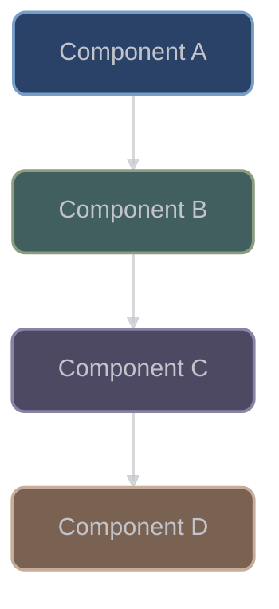
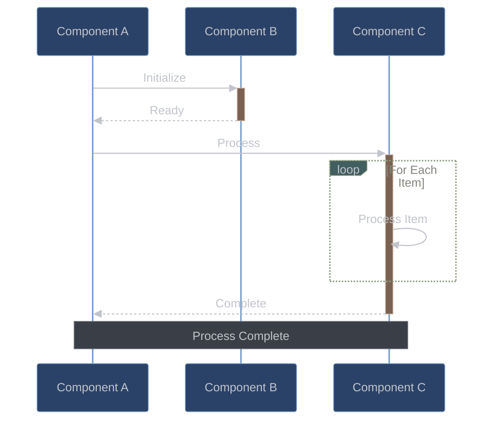
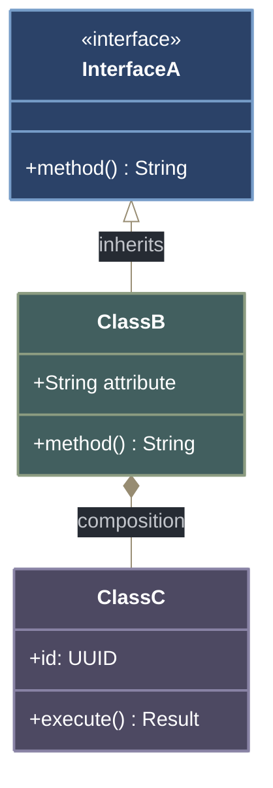
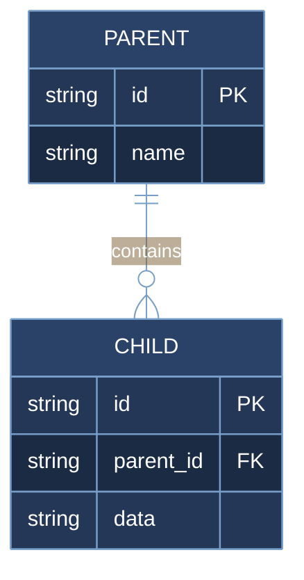
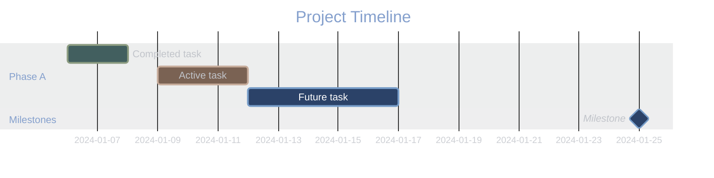
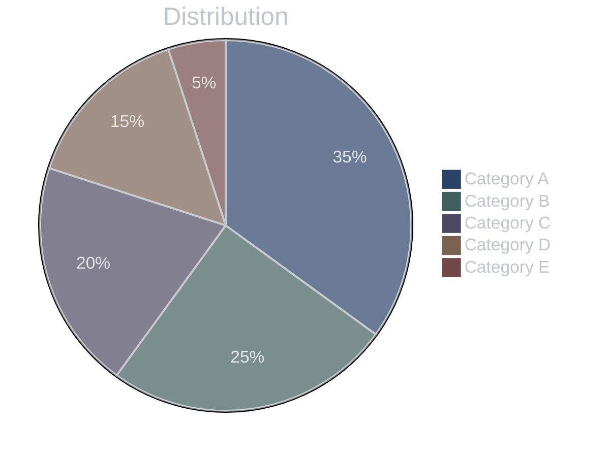
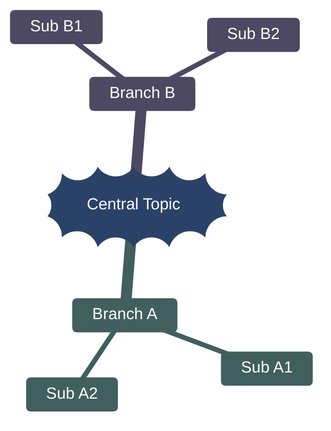
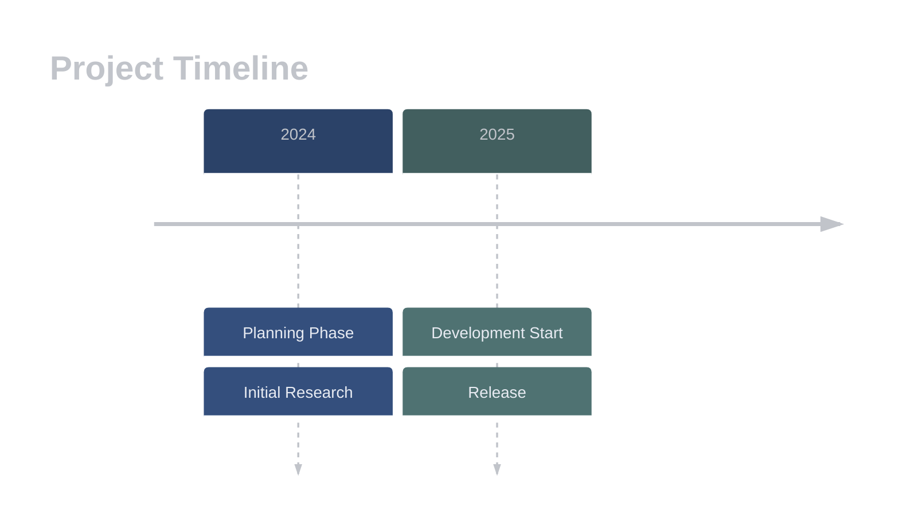
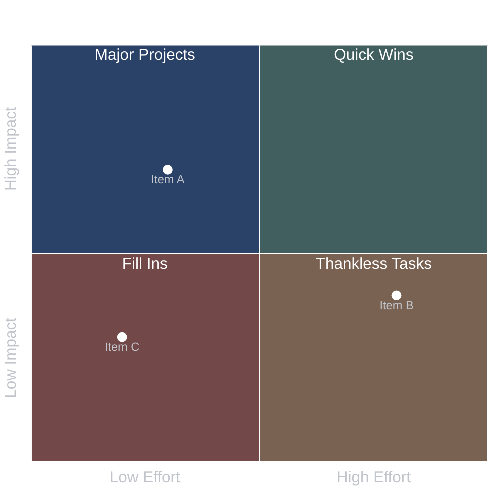

# Mermaid Diagram Templates

> **TEMPLATE REPOSITORY:** This document is authoritative for **copy-paste ready diagram templates**. For design philosophy, color rationale, and guidelines, see [diagram-standards.md](diagram-standards.md) (STANDARDS AUTHORITY).

Copy-paste ready templates for all Mermaid diagram types with complete theme configurations.

**Related docs:**
- [diagram-standards.md](diagram-standards.md) - Design philosophy, color rationale, usage guidelines (STANDARDS AUTHORITY)

> **Note:** These templates use a warm neutral palette optimized for dark backgrounds (`#262B33`).

---

## Template Index

| Diagram Type | Section | Key Variables |
|--------------|---------|---------------|
| [Flowchart](#flow-chart-template-1-simple) | Basic + Complex | `style` statements |
| [Sequence](#sequence-diagram-template) | Interactions | `actorBkg`, `actorBorder` |
| [Class](#class-diagram-template) | Types | `classDef` + `:::` syntax |
| [ER](#entity-relationship-diagram-template) | Data models | `mainBkg`, `attributeBackground*` |
| [Gantt](#gantt-chart-template) | Timelines | `taskBkgColor`, `activeTaskBkgColor` |
| [Git Graph](#git-graph-template) | Branches | `git0`-`git7`, `gitBranchLabel*` |
| [User Journey](#user-journey-template) | UX flows | `fillType0`-`fillType7` |
| [Pie](#pie-chart-template) | Distribution | `pie1`-`pie12` |
| [State](#state-diagram-template) | States | **Broken on GitHub** |
| [Mind Map](#mind-map-template) | Concepts | `cScale0`-`cScale11`, `cScaleLabel*` |
| [Timeline](#timeline-template) | History | `cScale*` |
| [Quadrant](#quadrant-chart-template) | Matrices | `quadrant*Fill` |
| [Block](#block-diagram-template) | Architecture | Inline `style` required |

---

## Flow Chart Template 1 (Simple)

## Sequence Diagram Template

## Class Diagram Template

> **Note**: Class diagrams support both `classDef` + `:::` syntax and inline `style` statements.

## Entity Relationship Diagram Template

## Gantt Chart Template

## Pie Chart Template

## Mind Map Template

> **Note**: Mind maps use `cScale0`-`cScale11` for node backgrounds. `primaryColor` does NOT work.

## Timeline Template

## Quadrant Chart Template

## Block Diagram Template

> **Note**: Block diagrams require **inline style statements** for GitHub rendering.

---

## Style Reference

> **See [diagram-standards.md](diagram-standards.md)** for the complete color palette, semantic color mapping, visual hierarchy guidelines, and style declaration format.
