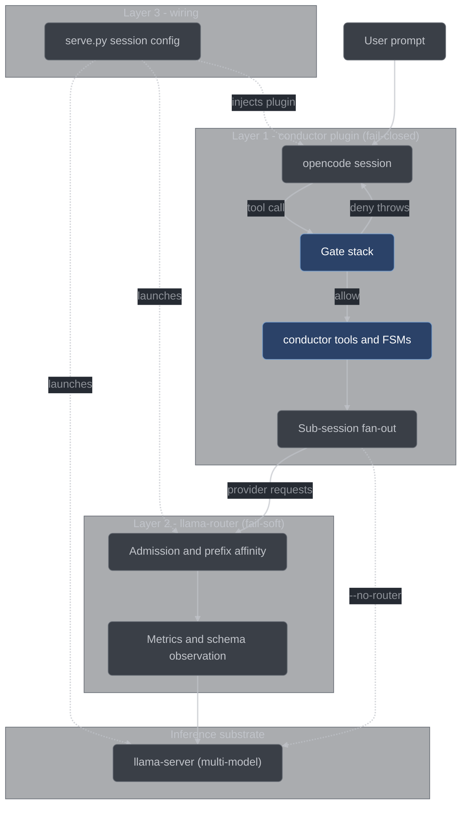

# llama-harness

A self-contained macOS/Apple-Silicon workspace for running open-weight LLMs locally on
llama.cpp, and for driving them from [opencode](https://opencode.ai). On top of that sits
**conductor**: a TDD-enforcing, adversarially-reviewed orchestration harness whose job is to
make a *local* ~27B model produce software you can trust. Everything the workspace downloads,
builds or generates lives under a small set of gitignored paths — `.data/` for models, tools and
configs, `.out/` for CMake build and install trees, plus `conductor/node_modules/` (dev types
only) and the generated `router/tests/schemas/` — so a clean checkout is one `rm -rf` away.

## What this is

**conductor** is an [opencode](https://opencode.ai) plugin plus a C++ scheduling layer. It
takes a prompt, classifies it, decomposes it into items with explicit file scopes, plans the
work, tears that plan apart with fresh reviewers, then executes each item under enforced
test-driven development — and it does all of this through a state machine that only advances
when a tool handler has re-derived the evidence itself. A model saying "tests pass" advances
nothing. See [the conductor overview](docs/user/conductor-overview.md).

**The model harness** is the substrate underneath: Python 3.9 stdlib-only scripts and a pinned
`llama.cpp` submodule that install, verify, serve and benchmark GGUF models locally. One
`llama-server` started in *multi-model mode* (llama.cpp's own `--models-preset` mode, which
upstream also calls router mode — it is not conductor's llama-router) serves every installed
model at a single endpoint and swaps weights on demand. No cloud provider is involved and no
API key is required.

opencode talks to that endpoint for every model request. It is not the only endpoint the
process can reach: opencode ships a `webfetch` tool and offers it with no permission narrowing
in any agent kind, and the `bash` tool can run `curl`. Conductor refuses both classes in a
gated session — see [HONEST-LIMITS.md](conductor/docs/HONEST-LIMITS.md) — but that is
conductor declining to use a surface that exists, not the surface being absent.

## Quickstart

```bash
./setup.sh                  # deps, submodule, tools, models, configs - interactive
scripts/serve.py            # pick a model, land in a ready shell
cd ~/your/project
opencode                    # already pointed at the served model
```

Type `exit` in that shell to stop the model. Requires Python 3.9+ (macOS ships it), plus
`git`, `cmake` and `ninja`; `setup.sh` offers to install anything missing. Longer walkthrough:
[docs/user/quickstart.md](docs/user/quickstart.md); dependency detail:
[docs/user/installation.md](docs/user/installation.md).

## conductor

### The problem

A local model writing software fails in the same ways every time:

- **Optimistic self-reporting.** It reports success it did not verify.
- **Process amnesia.** Rules stated at turn 1 are gone by turn 30.
- **Test-after theater.** The test is written once the code already passes.
- **Anchored review.** A model reviewing its own work in its own context agrees with itself.
- **Over-building.** It solves the general case nobody asked for.
- **Shortcut-taking under difficulty.** A hard test becomes a skipped test.

None of these are fixed by asking more firmly. They are fixed mechanically or not at all.

### The answer

conductor holds each run in a state machine that can only be advanced by a small set of typed
`conductor_*` tools, and every one of those handlers re-derives its own evidence: it runs the
test command, reads the git state, and computes the verdict, so the model's claim is never the
record. Around that sits a gate stack that denies out-of-order and out-of-scope actions
outright — a deny is a thrown error the model reads back as a refusal reason — and a fan-out
engine that dispatches review to **fresh sub-sessions** with no memory of writing the code,
one lens each, whose findings then face refuters before they count. Doctrine is re-injected
into every request rather than stated once, because a rule the model has to remember is a rule
it will forget.

### The three layers



Layer 1 is the only layer that can see a tool call, so every gate lives there and it is
**fail-closed**: a crash inside gate evaluation on a guarded call denies. Layer 2 gets exactly
the jobs the plugin structurally cannot do — cap in-flight requests against a server it does
not own, keep a shared KV prefix hot, validate a claim it did not itself make — and it is
**fail-soft**: it never returns a status the direct path would not have returned, its schema
guard *observes* rather than rejects, and `serve.py --no-router` runs the identical process,
just slower. Layer 3 is the wiring: `scripts/serve.py` injects the plugin, agents and
permissions into the session-scoped opencode config it already generates and launches the
router, so the harness travels into whatever workspace you `cd` into. `llama-server` is the
substrate all three sit on, not a conductor layer. See
[architecture](docs/developer/architecture.md), [llama-router](docs/developer/llama-router.md).

### What happens to every prompt

- **Classify** — `question`, `trivial` or `work`; a question is answered and the run ends.
- **Decompose** — the work becomes items, each with an explicit `fileScope` and `testScope`.
- **Plan** — per-item approach, dependencies, acceptance criteria, and a `behavioral` flag.
- **Review the plan** — a fresh skeptical pass; surviving majors force a revision and re-review.
- **Execute** — items run in dependency-ready, scope-disjoint waves under enforced TDD.
- **Report** — every terminal path writes a report, including the ones that stop early.

The per-item discipline is `PENDING → RED → TEST_VETTED → GREEN → VALIDATED → REVIEWED →
PUBLISHED`. See [run lifecycle](docs/user/run-lifecycle.md), [state machines](docs/developer/state-machines.md).

### What is actually enforced

| Mechanism                | Fires on                                  | Enforces                                                                                                                                                                                                                                                                                                          |
| ------------------------ | ----------------------------------------- | ----------------------------------------------------------------------------------------------------------------------------------------------------------------------------------------------------------------------------------------------------------------------------------------------------------------- |
| Session-registry gate    | every tool call                           | only a registered, scoped session may write; opencode's `task` sub-agent spawning is denied in every session, registered or not                                                                                                                                                                                   |
| Patch-tool refusal       | `patch` and `apply_patch`                 | refused ahead of every other gate in every session: a patch body names its targets in a form no gate parses, so no scope decision can bound it                                                                                                                                                                    |
| Git-policy gate          | any bash command containing a git segment | default-deny for any subcommand not on the read-only allow-list, matched over parsed tokens rather than substring regex                                                                                                                                                                                           |
| Edit-scope gate          | every write-shaped call                   | implementer writes its item's `fileScope` minus its `testScope`, test-writer only `testScope`, reviewers and planners write nothing, nobody writes `.conductor/**`, nobody writes outside the session's tree                                                                                                      |
| Interpreter-shape rules  | `node -e`, `python -c` and friends        | recognized write calls surface their literal path operands into the edit gate, and any interpreter program text that so much as names `.conductor` is refused outright                                                                                                                                            |
| Verify freeze            | any edit while a verify marker is live    | the tree is frozen for the duration, production and test files alike                                                                                                                                                                                                                                              |
| Phase-legality gate      | every `conductor_*` call                  | one choke point checks the caller (only `conductor_status`, `conductor_surface` and `conductor_override` are sub-session callable), then the declared arguments, then the phase rule; a tool with no rule is refused, and the same `legalTools` derivation drives the gate, the prompt injection and continuation |
| Item FSM                 | each per-item stage tool                  | a behavioral item cannot reach GREEN without an observed, vetted RED first, and an item may declare itself non-behavioral only if its `fileScope` is disjoint from `verify.behavioralPaths` — impossible for real code, trivial for a comment fix                                                                 |
| Handler-derived evidence | every FSM-advancing tool                  | the handler runs the command and classifies the failure; the model's claim is not the record                                                                                                                                                                                                                      |
| Freshness stamp          | every verify                              | a verify is start-stamped against a `HEAD`; an edit to a staged behavioral file or a moved `HEAD` voids it                                                                                                                                                                                                        |
| Foreign-red quarantine   | before each verify start-stamp            | other items' red tests are moved outside the repository so they cannot mask or pollute this item's verdict                                                                                                                                                                                                        |
| Override budget          | `conductor_override`                      | the gate must be one of `session`, `git`, `edit` — anything else is refused and spends nothing; one override per item, two per run; each records an anomaly and permanently taints the item, and over budget is a stop rather than a third override                                                               |
| Doctrine injection       | every request                             | the role's doctrine packs plus a live state block are restated every request, never remembered                                                                                                                                                                                                                    |

Full inventory: [tool reference](docs/user/tool-reference.md),
[gates and hatches](docs/user/gates-and-hatches.md), [gates internals](docs/developer/gates.md).

Every sub-session runs the *same* served model. A role selects doctrine pack, sampling
temperature, gate posture and router priority tag — never weights — because the point is to
measure what process alone buys, and mixing model sizes would destroy that measurement. The
reasoning behind this and every other standing decision is in
[`conductor/DECISIONS.md`](conductor/DECISIONS.md).

## The model harness

The Python half installs, verifies, serves and benchmarks models, with no dependencies beyond
the standard library. The one optional extra is [`rich`](https://rich.readthedocs.io), which
upgrades benchmark output to live progress bars and colored tables.

```bash
scripts/fetch_models.py list                 # catalog + what fits this machine
scripts/fetch_models.py install ornith-35b   # download, validate, configure
scripts/fetch_models.py install --category coding
scripts/fetch_models.py verify               # re-check every installed model
scripts/fetch_models.py build                # build llama-* from the pinned submodule
```

The catalog holds **24 models across five categories** — coding, general reasoning,
prose/documentation, vision, and embeddings/rerankers — with sizes measured from the
HuggingFace file tree rather than estimated. `list` reads the Metal wired limit from `sysctl`
and labels each model `fits`, `tight` or `too big`. See [docs/user/models.md](docs/user/models.md).

**Downloads are verified, not trusted.** Every install checks, in order: exact byte size,
SHA-256 against the LFS `oid` published by HuggingFace, GGUF magic and version, and
shard-count consistency read from the GGUF metadata itself. Architecture and tensor count are
recorded in `.data/models/<id>/.manifest.json`. Downloads resume at 32 MB granularity, so an
interrupted install is re-run rather than restarted.

**Tools stay in lockstep with the pinned submodule.** `fetch_models.py build` compiles nine
binaries (`llama-server`, `llama-bench`, `llama-perplexity`, `llama-cli`, `llama-mtmd-cli`,
`llama-tts`, `llama-batched-bench`, `llama-tokenize`, `llama-quantize`) into `.data/tools/`
and records the submodule commit they came from. Every `serve` and every `benchmark` re-checks
that stamp and rebuilds if the submodule moved, so the tools can never silently drift.

```bash
scripts/serve.py                             # numbered picker, then a ready shell
scripts/serve.py ornith-35b                  # skip the picker
scripts/serve.py --no-shell                  # plain foreground server
scripts/serve.py --no-router                 # talk to llama-server directly
```

`serve.py` starts one `llama-server` in multi-model mode reading
`.data/configs/llama-models.ini`, writes a session-scoped
`.data/configs/opencode.session.json` that merges in `conductor/opencode-fragment.json` and
names the model you picked as the default, and drops you
into a subshell with `OPENCODE_CONFIG` exported. Because `--models-max 1`, switching models
transparently evicts the previous one — which matters when a single model occupies 30 GB of a
64 GB machine. The server is sized for the harness's own fan-out: `--parallel` and a total
`--ctx-size` are derived from `--max-readers` (6 by default) at 32768 tokens per slot, and that
per-slot window is written into the session's opencode config as the model `limit`. `serve.py`
launches `llama-router` under a restart supervisor and points opencode at it when the session
opens a shell, a `llama-router` binary is found, and the exported
`router/tests/schemas/RouterConfig.schema.json` exists; if any of those is missing it prints a
notice and talks to `llama-server` directly, and an explicit `--router` refuses with the remedy
instead. `--no-router` runs the identical workflow without it. See
[docs/user/serving.md](docs/user/serving.md).

```bash
scripts/benchmark.py --dry-run               # plan + time estimate, runs nothing
scripts/benchmark.py --model ornith-35b
scripts/benchmark.py --resume                # skip completed cells
```

Benchmarking uses ten named presets rather than a sampling cross-product, and scores in three
tiers: **objective** (generated code is executed against hidden tests), **perplexity** (via
`llama-perplexity`), and **self-graded**, which is never mixed into the objective score. The
interesting number is calibration, `self_score − objective`. See
[docs/user/benchmarking.md](docs/user/benchmarking.md); the complete reference — every catalog
row with quant and license, every CLI flag, the validation and benchmark internals, and how to
add your own models, presets or tasks — is [`scripts/README.md`](scripts/README.md).

## Repository layout

```text
conductor/               the opencode plugin - all enforcement lives here
  core/                    pure logic: FSMs, gate predicates, scheduler, decisions
  adapter/                 I/O seams: state, journal, evidence, fan-out, injection
  plugin/index.ts          the opencode plugin factory - the module's only export
  doctrine/                nine doctrine packs, injected by role on every request
  tools/                   schema export, doctrine generation, replay, audit drivers
  tests/                   the TypeScript suite
  docs/                    OPERATIONS.md, HONEST-LIMITS.md, RUNNER-DISCOVERY.md
  DECISIONS.md             standing-decisions ledger
  opencode-fragment.json   plugin + agents + permissions, merged into the session config
router/                  the C++23 llama-router; main.cpp plus one header per concern
  tests/                   doctest suite (CMake target router-tests) + generated schemas
  UPSTREAM_CONTRACT.md     the measured llama-server /v1 contract the router must respect
dashboard/               the optional ftxui metrics TUI (CMake option CONDUCTOR_DASHBOARD)
tools/membench/          standalone memory-bandwidth probe
bench/                   benchmark task manifests, and corpus/ - the seed and
                         hidden trees the directory-sourced tasks draw from
scripts/                 Python harness (serve, fetch, benchmark) + the test gates
docs/
  user/ developer/ faq/    this documentation set
  plans/                   the immutable design plan and its phase 16-19 addendum
  build/                   STATE.json, HANDOFF.md, CORRECTIONS.md - conductor build state
  reviews/                 adversarial reviews of the plan
cmake/                   vcpkg init, warnings, clang-format
extern/llama-cpp         pinned llama.cpp submodule (configured, never built here)
extern/vcpkg             the vcpkg toolchain
setup.sh                 guided first-time install
CMakeLists.txt           llama-router, router-tests, conductor-dashboard; tools/ is a subdirectory
.data/                   everything downloaded or generated  (gitignored)
.out/                    CMake build and install trees       (gitignored)
```

## Documentation

| Page                                                                                               | What it covers                                                                                            |
| -------------------------------------------------------------------------------------------------- | --------------------------------------------------------------------------------------------------------- |
| [docs/README.md](docs/README.md)                                                                   | the documentation hub — start here and pick a track                                                       |
| [docs/user/quickstart.md](docs/user/quickstart.md)                                                 | install to first working session, end to end                                                              |
| [docs/user/README.md](docs/user/README.md)                                                         | the user guide: models, serving, running conductor, configuration, troubleshooting                        |
| [docs/developer/README.md](docs/developer/README.md)                                               | the developer guide: architecture, state machines, gates, evidence, schemas, build system                 |
| [docs/faq/README.md](docs/faq/README.md)                                                           | short answers to the questions the design keeps provoking                                                 |
| [docs/prompt-lifecycle.md](docs/prompt-lifecycle.md)                                               | one prompt followed end to end, naming the mechanism at each step and roughly what it costs in wall-clock |
| [docs/plans/2026-08-07-conductor-harness-plan.md](docs/plans/2026-08-07-conductor-harness-plan.md) | the immutable design authority the whole build is derived from                                            |

## Building the C++ side

The C++ half is the llama-router and its test binary. Configure with a preset, then build
**only** named targets:

```bash
cmake --preset clang-relwdebinfo
cmake --build .out/build/clang-relwdebinfo --target llama-router
cmake --build .out/build/clang-relwdebinfo --target router-tests
ctest --test-dir .out/build/clang-relwdebinfo
```

A bare `cmake --build` also compiles the whole vendored `extern/llama-cpp` tree, which nothing
here links — the router proxies to a separately-launched `llama-server` — so always pass
`--target`. The presets are `clang-debug`, `clang-release` and `clang-relwdebinfo`, all writing
to `.out/build/<preset>/`; every preset is gated on a macOS host. `membench` is a third,
dependency-free target that also builds with a single `c++` invocation, and
`-DCONDUCTOR_DASHBOARD=ON` adds a fourth, `conductor-dashboard`, the optional ftxui TUI over the
router's metrics ledger — it is off by default so no ordinary build pays for ftxui. Every
in-workspace header is included by its full path from the repository root —
`#include "router/version.hpp"`, never `#include "version.hpp"` — because the root is the only
user-code include root on every target that includes one; `membench` includes no workspace
header and sets no include root at all. `AUTOFORMAT_SRC_ON_CONFIGURE` defaults to `ON` and runs
clang-format over `router/`, `dashboard/` and `tools/` at configure time; pass `-D…=OFF` to
suppress it.

The TypeScript side has one canonical gate, and it is not `node --test`:

```bash
bash scripts/test-conductor.sh                                  # the whole suite
bash scripts/test-conductor.sh 'conductor/tests/gates-*.test.ts'
bash scripts/conductor-gate.sh                                  # mechanical stub scan
```

The wrapper exists because raw `node --test` lies in two directions on Node 26: a directory
positional resolves as a module and produces a bogus failure, and a glob matching zero files
exits 0. It has five legs: it parses the TAP trailer and fails unless tests ran and nothing was
skipped or marked todo at any depth; typechecks with
`tsc --noEmit`; runs the Bun dual-runtime smoke; regenerates the §2 JSON Schemas into
`router/tests/schemas/` so the C++ tests validate against the same objects the plugin enforces;
and runs the Python suite under `/usr/bin/python3 -m unittest`, failing if it discovers zero
tests. Four of the five hard-fail the gate; the Bun leg is skipped with a loud warning if `bun`
is absent and fails the gate whenever it runs. A failing run preserves its scratch output at a
path it prints rather than deleting it.
`conductor-gate.sh` is a separate mechanical scan of committed TypeScript, C++ and Python
sources for stub markers, skipped tests, trivially-true assertions and empty catch blocks. See
[build system](docs/developer/build-system.md),
[testing and verification](docs/developer/testing-and-verification.md).

## Honest limits

The design states its own limits rather than hiding them.

- Gates fire inside opencode only. A human at a raw terminal is ungated, and so is a second,
  plain `opencode` session started without the harness in the same repository — it loads no
  plugin, takes no lock, and is invisible to the conductor session it is racing. (Two
  *conductor* sessions are the benign case: the workspace lock refuses the second one outright.)
- conductor cannot detect its own absence. A plugin that fails to load is logged and opencode
  continues completely ungated, which is why the plugin writes a liveness beacon to
  `.conductor/state/alive.json` carrying its `pid`, `startMs`, `version` and `sessionID`.
  **No beacon, no conductor.** The visible in-session banner the design also calls for is not
  wired, so the beacon is the check that works.
- Ledgers are records, not proofs — but every FSM-advancing record is written by a handler
  that re-derived the evidence itself.
- Scope intersection is deliberately conservative: false positives serialize work that could
  have run in parallel, and never corrupt it.
- Verify trusts the target repository's own test command, so vacuous tests get vacuous
  protection.
- The edit gate reads write *shapes*, not intent. It resolves the literal path operands of the
  interpreter write calls it enumerates and refuses any one-liner naming `.conductor`, but a
  path an interpreter computes at runtime in a shape outside that enumeration is not seen.
- `behavioral: false` is only as honest as the configured `behavioralPaths`, which is why
  setup asks for them instead of guessing.

The fifteen normative limits, and the further limits the build itself discovered, are
[`conductor/docs/HONEST-LIMITS.md`](conductor/docs/HONEST-LIMITS.md);
the operator's counterpart, covering the beacon check, the lock and the recovery paths, is
[`conductor/docs/OPERATIONS.md`](conductor/docs/OPERATIONS.md).

## License

MIT — see [LICENSE](LICENSE). Individual models carry their own licenses, listed per model in
the catalog: several are Apache-2.0 or MIT, Gemma models are under the Gemma Terms of Use, and
a few are vendor-specific.
