# Core and adapters

How conductor's TypeScript layer is split: a pure decision core that touches nothing, a thin
adapter layer that owns every side effect, and the guard tests that keep the boundary from
eroding. For anyone reading, changing, or adding a module under `conductor/`.

## The rule

Every policy decision is a pure function `(parsedInput, stateSnapshot) -> decision`, and it
lives in [`conductor/core/`](../../conductor/core). Core modules import **only** other core
modules — never `node:fs`, never `node:child_process`, never the opencode client, never
`Bun`. All I/O lives in [`conductor/adapter/`](../../conductor/adapter). This is guard rule
G3 in the plan's global constraints, and it is why every gate is deterministic and
replay-testable: a gate
that reads the disk or the clock can only be tested by staging a world, while a gate that
reads its arguments can be tested by passing arguments.

The rule reaches further than "no I/O". Core also has no wall clock and no environment:

| Forbidden in core           | Why                                                            | Where it lives instead          |
| --------------------------- | -------------------------------------------------------------- | ------------------------------- |
| `node:fs`                   | a decision that reads the disk is not a function of its inputs | adapter                         |
| `node:child_process`        | same, plus subprocesses are the largest trust boundary         | `gitio.ts`, `evidence.ts`       |
| `Bun` / the opencode client | single-runtime, and untestable without a live host             | adapter, `plugin/index.ts`      |
| `fetch(`                    | network I/O                                                    | `router-client.ts`              |
| `process.env`               | an invisible input makes a test irreproducible                 | adapter, passed in              |
| `Date.now`                  | a clock makes the same inputs produce different outputs        | adapter; `nowMs` is a parameter |

Adapters are the mirror image: they may spawn, read, write, stamp, and call out, but they hold
as little judgment as possible. `adapter/tools.ts` sequences the gates in `plan §3.5` order and
turns a `deny` into a thrown `Error`; the decisions come from `core/gates-git.ts` and
`core/gates-edit.ts`. `adapter/evidence.ts` runs the test command and writes the ledger; the
failure classification comes from `core/freshness.ts`.

## How it is enforced

Two guard tests, both in [`conductor/tests/purity.test.ts`](../../conductor/tests/purity.test.ts).
They are trivially green today and bite the moment someone reaches for the wrong import. Both
scan file text and **do not strip comments** — a commented-out forbidden call is still a smell,
which is why adapter file headers say "no single-runtime import (the purity guard scans it)"
rather than naming the runtime.

### The purity guard

Two assertions over every `.ts` file under `conductor/core/`:

- **`1.4-core-imports`** — every import specifier must start with `./` or `../`, must end in
  `.ts`, and must resolve inside `conductor/core/`. A bare specifier fails on the first rule, so
  `@opencode-ai/plugin`, `node:fs`, and every npm package are rejected by the same check that
  rejects `../adapter/state.ts`.
- **`1.4-core-forbidden`** — no line may contain `node:fs`, `node:child_process`, `Bun`,
  `fetch(`, `process.env`, or `Date.now`.

Both assertions require at least one file under `conductor/core/`, so a scanner aimed at the
wrong directory fails loudly instead of passing vacuously.

### The dual-runtime guard

Adapter and plugin code runs under opencode's Bun runtime in production and under Node type
stripping in tests (G14, [`conductor/DECISIONS.md`](../../conductor/DECISIONS.md) (f)), so it
may use only Node-compatible built-ins. Two more assertions, over `conductor/adapter/` and
`conductor/plugin/`:

- **`1.4-adapter-guard`** — no `Bun` reference, no `` $` `` shell tag, and no import of `bun` or
  any `bun:*` module. The shell tag is called out by name because it is the one API that
  silently works in production and cannot run in any test.
- **`1.4-subprocess`** — a file containing a subprocess-shaped call (`spawn(`, `spawnSync(`,
  `exec(`, `execSync(`, `execFile(`, `execFileSync(`) must import `node:child_process`.

The mechanical check is the import; the call shape is a discipline the two spawning adapters
keep. `gitio.ts` uses `execFileSync("git", args, …)` and `evidence.ts` uses
`spawnSync(cmd[0], cmd.slice(1), …)` — both argv arrays, neither passing a `shell` option, so
`shell:false` holds by default. There is no shell string anywhere, which is what lets the `-z`
git parsers trust NUL as their only delimiter: a path with a space or a metacharacter is one
argv element and is never re-tokenized.

A third guard, [`conductor/tests/single-source.test.ts`](../../conductor/tests/single-source.test.ts),
pins the other half of the split. `RUN_STATES` in `core/fsm-run.ts` and `ITEM_STATES` in
`core/fsm-item.ts` must equal the `state` enum of the `Run` and `Item` schemas, read at runtime
out of the exported `SCHEMAS` record. `types.ts` keeps its own vocabulary arrays module-private
and exports only the erased TS unions, so the schema enum is the sole runtime-derivable source
— and it is exactly the one the validator checks persisted records against.

## Erasable TypeScript

Node's type stripping runs the same `.ts` files that opencode loads, with no build step
(G1/G2). Stripping erases types; it does not compile. So the plugin uses no TypeScript
construct that emits runtime code:

| Forbidden                                       | Use instead                                   |
| ----------------------------------------------- | --------------------------------------------- |
| `enum`                                          | an `as const` array plus `(typeof X)[number]` |
| `const enum`                                    | the same                                      |
| `namespace`                                     | a module                                      |
| parameter properties (`constructor(private x)`) | an explicit field assignment                  |

That is why closed vocabularies throughout core look like `const RUN_STATES = [...] as const`
with `export type RunState = (typeof RUN_STATES)[number]` — one array is the single source for
both the runtime list and the type.

Imports between conductor's own files carry explicit `.ts` extensions
(`import { globMatch } from "./shell-parse.ts"`).
[`conductor/tsconfig.json`](../../conductor/tsconfig.json) pins all of it mechanically:

```jsonc
{
  "compilerOptions": {
    "erasableSyntaxOnly": true,         // rejects enum / namespace / parameter properties
    "allowImportingTsExtensions": true, // permits the explicit .ts specifiers
    "noEmit": true,                     // there is no build output; opencode loads source
    "strict": true,
    "module": "nodenext",
    "moduleResolution": "nodenext",
    "target": "es2023",
    "lib": ["es2023"],
    "types": ["node"],
    "skipLibCheck": true
  },
  "include": ["core/**/*.ts", "adapter/**/*.ts", "plugin/**/*.ts", "tools/**/*.ts", "tests/**/*.ts"]
}
```

`tsc --noEmit` runs as part of the canonical gate, so an `erasableSyntaxOnly` violation
surfaces in the same command that runs the tests.

## The module graph

```mermaid
---
config:
    theme: 'base'
    curve: 'straight'
    themeVariables:
        darkMode: true
        clusterBkg: '#22272f62'
        clusterBorder: '#6a6f77ff'
        clusterTextColor: '#C1C4CAff'
        lineColor: '#C1C4CAAA'
        background: '#262B33'
        primaryColor: '#3a3f47ff'
        primaryTextColor: '#C1C4CAff'
        primaryBorderColor: '#6a6f77ff'
        primaryLabelBkg: '#262B33'
        secondaryColor: '#425f5fff'
        secondaryBorderColor: '#8c9c81ff'
        secondaryTextColor: '#C1C4CAff'
        tertiaryColor: '#4d4962ff'
        tertiaryBorderColor: '#8983a5ff'
        tertiaryTextColor: '#C1C4CAff'
        nodeTextColor: '#C1C4CA'
        defaultLinkColor: '#C1C4CA'
        edgeLabelBackground: '#262B33'
        labelTextColor: '#C1C4CA'
---
flowchart TD
%% Source: conductor/{core,adapter,plugin} import statements

    subgraph L3["Plugin entry"]
        IDX["plugin/index.ts"]
    end

    subgraph L2["conductor/adapter - all I/O"]
        TOOLS["tools.ts"]
        INJECT["inject.ts"]
        CHAT["chat-message.ts"]
        EVID["evidence.ts"]
        QUAR["quarantine.ts"]
        STATE["state.ts"]
        QUEST["questions.ts"]
        GITIO["gitio.ts"]
        JOURN["journal.ts"]
        FAN["fanout.ts"]
        ROUT["router-client.ts"]
    end

    subgraph L1["conductor/core - derived policy"]
        GPHASE["gates-phase.ts"]
        GGIT["gates-git.ts"]
        GEDIT["gates-edit.ts"]
        SCHED["schedule.ts"]
        PLANNING["planning.ts"]
        FRESH["freshness.ts"]
        STOPS["stops.ts"]
        DECIDE["decide.ts"]
        VERD["verdict.ts"]
        JEV["journal-events.ts"]
    end

    subgraph L0["conductor/core - zero-import leaves"]
        TYPES["types.ts"]
        SHELL["shell-parse.ts"]
        FSMR["fsm-run.ts"]
        FSMI["fsm-item.ts"]
    end

    IDX --> TOOLS

    TOOLS --> STATE
    TOOLS --> QUEST
    TOOLS --> FAN
    INJECT --> CHAT
    EVID --> STATE
    EVID --> QUAR
    QUAR --> STATE
    STATE --> GITIO
    FAN --> JOURN

    TOOLS --> GGIT
    TOOLS --> GEDIT
    INJECT --> GPHASE
    EVID --> FRESH
    JOURN --> JEV
    CHAT --> STOPS
    STATE --> TYPES
    FAN --> TYPES
    ROUT --> TYPES

    GPHASE --> SCHED
    SCHED --> SHELL
    GGIT --> SHELL
    GEDIT --> SHELL
    PLANNING --> SHELL
    FRESH --> SHELL
    PLANNING --> TYPES
    STOPS --> TYPES
    DECIDE --> TYPES
    VERD --> TYPES
    JEV --> TYPES

    linkStyle default stroke:#C1C4CAaa,stroke-width:2px,color:#C1C4CAaa

    classDef neutral fill:#3a3f47,stroke:#6a6f77,color:#C1C4CA,rx:6,ry:6
    classDef accent  fill:#2b4268,stroke:#779DC9,color:#ffffff,rx:6,ry:6

    class IDX,TOOLS,INJECT,CHAT,EVID,QUAR,STATE,QUEST,GITIO,JOURN,FAN,ROUT neutral
    class GPHASE,GGIT,GEDIT,SCHED,PLANNING,FRESH,STOPS,DECIDE,VERD,JEV neutral
    class TYPES,SHELL,FSMR,FSMI accent
```



The arrows are a readable subset of the real import graph, and they only ever point down. The
accented leaves import nothing at all: `fsm-run.ts` and `fsm-item.ts` have no imports
whatsoever, and `types.ts` and `shell-parse.ts` are the two roots the rest of core builds on.
No arrow points from core back into adapter, and the purity guard is what keeps it that way.

## The core modules

Line counts are a size cue, not a contract.

### core/types.ts — 1403 lines

Every `plan §2` schema, once: each exists as a TypeScript type **and** a hand-written JSON
Schema object in the exported `SCHEMAS` record. Exports `CONDUCTOR_NAME`, the closed-vocabulary
unions (`RunState`, `ItemState`, `StopKind`, `FailureClass`, `Severity`, `AnomalyKind`,
`GitMode`, and the rest), the record interfaces (`Config`, `Run`, `Queue`, `Item`,
`EvidenceRecord`, `DecisionRecord`, `QuestionRecord`, `Findings`, `Verdict`, `JournalRecord`, …),
`SCHEMAS`, and `validate(schemaName, value) -> {ok, errors}`.

**Easy to get wrong:** the schema keyword subset. Every schema restricts itself to `type`,
`required`, `enum`, `properties`, `items`, and `additionalProperties`, and `validate` rejects
any other keyword at any depth rather than silently ignoring it — that is what makes it
impossible for this validator and the router's full validator to disagree about a payload. See
[schemas.md](schemas.md).

### core/shell-parse.ts — 484 lines

Quote-aware shell tokenizing, operator segmentation, git command detection, and glob matching —
the parsing substrate both write-facing gates and the scheduler stand on. Exports
`shellTokens`, `splitOnOperators`, `commandWordLocation`, `isGitCommand`, `gitSubcommand`,
`globMatch`, `scopesIntersect`.

**Easy to get wrong:** `scopesIntersect` compares only the *literal heads* of globs and
deliberately over-approximates — `src/*.ts` and `src/*.md` report as intersecting, and heads
compare case-insensitively because the reference filesystem is. A false positive only
serializes work; a false negative would let two implementers write the same file. Note that
`scopesIntersect([], X)` is `false`, which is why the scheduler handles empty scopes separately.

### core/freshness.ts — 209 lines

The `plan §2.6` freshness rule and the `plan §2.6.1` failure-class table:
`verifyFreshFor(record, inputs) -> {fresh, why}` and
`classifyFailure(stderr, stdout, exitCode, itemFileScope, runnerRules) -> FailureClass`, plus
the `RunnerRules` shape. Per-runner extraction rules arrive as **data** (regex sources), so this
stays a truth table rather than a regex someone tweaks in an adapter.

**Easy to get wrong:** non-finite timestamps. `Math.max(...NaN)` is `NaN` and every `< NaN` is
false, so a stale record would read fresh; any non-finite input is treated as stale up front.
And the failure class is decided by output *shape*, never exit code, because runners disagree —
pytest exits 2 on a collection error.

### core/stops.ts — 134 lines

The `plan §2.9` stop vocabulary, the single definition of terminality, and the computed stop
kinds: `STOP_KINDS`, `isTerminal(run)`,
`shouldTerminate(run, counters, itemsSummary, config) -> {stop, kind?}`.

**Easy to get wrong:** `done` and `interrupt` are never computed here — `conductor_report`
records one and halt handling records the other. And the counters outrank the item summary:
`futileRePrompts` reaching 3 (`noop`) and an exhausted override budget (`env`) stop the run even
with open items, because a wedged loop must end loudly rather than burn tokens.

### core/verdict.ts — 19 lines

Skeptic-verdict aggregation and nothing else: `findingSurvives(verdicts, k)` is true iff the
uphold count reaches `⌈k/2⌉`.

**Easy to get wrong:** a tie upholds. At the default `skepticsPerFinding: 2` the threshold is 1,
so a finding two skeptics split on survives into a fix round.

### core/decide.ts — 158 lines

The `plan §6.2` decision-protocol helpers: `scoreOptions(options) -> {winner, tie}` sums the
five `plan §2.7` ladder-5 keys (`capability`, `testability`, `movingParts`,
`validationEarliness`, `singleSource`); `isHumanTerritory(question)` is a conservative classifier
over four of the five `plan §6.2` human-territory categories — taste, money, irreversible
commitments, and secrets; `requireTwoOptions(record) -> {ok, why}` is the two-option rejection
rule. The fifth category, a genuine ladder-5 tie, is not recognizable from a question's text, so
it is raised by `scoreOptions` returning `{winner: null, tie: true}` rather than by the
classifier. See [design-constraints.md](design-constraints.md).

**Easy to get wrong:** an unscored option totals 0, so `scoreOptions` alone would happily rank a
record of unscored options. `requireTwoOptions` is the gate that rejects them — a
`kind: "derived"` record needs at least two options, each scored; `kind: "human"` is exempt,
because taste has no objective score.

### core/journal-events.ts — 75 lines

The closed, per-component event-name vocabulary: eight components (`fsm`, `gates`, `fanout`,
`evidence`, `continuation`, `inject`, `router-client`, `state`), each with a non-empty list of
the names an adapter may emit. Exports `COMPONENTS`, `EVENTS`, `isKnownEvent(component, event)`,
`DEFAULT_LEVEL` (`"info"`), `DEFAULT_CONSOLE_LEVEL` (`"warn"`).

**Easy to get wrong:** inventing an event name at the call site. Logs you cannot grep by name
are logs you cannot debug, so `journal.ts` calls `isKnownEvent` on every write and an unlisted
name is caught at its source. Widening the vocabulary means adding a name here.

### core/fsm-run.ts — 175 lines

The `plan §3.1` run state machine: `RUN_STATES` (the eight positions) and
`legalRunTransition(from, to, context) -> {ok, why}`.

**Easy to get wrong:** `INTAKE` lists three successors, but exactly one is legal for a given
classification — the selection is enforced inside the transition check, not by the successor
table. The run is forward-only; the majors → revise → re-review loop is internal to the
plan-review handler and never regresses run state. See [state-machines.md](state-machines.md).

### core/fsm-item.ts — 183 lines

The `plan §3.3` item state machine: `ITEM_STATES` (the seven positions), the `ItemFailureClass`
vocabulary, and `legalItemTransition`.

**Easy to get wrong:** `blocked`, `deferred`, and `debugging` are annotations, never positions.
The blocked rule is orthogonal to the transition table and is applied before it — a blocked item
makes no transition at all until it is answered.

### core/gates-phase.ts — 334 lines

Tool legality per FSM position:
`legalTools(run, items, questions, repoConfigured) -> {legal, recommended, why}`. One derivation
with three consumers — the phase-order gate, the doctrine injection, and the continuation engine
— so they can never disagree. `legal` maps a tool name to its args hint (a per-item stage tool
carries the ids it may target), `recommended` is the single next call or `null`.

**Easy to get wrong:** `recommended` must be invariant under item-array reordering, which is why
the `EXECUTING` recommendation is computed through `nextWave` — the scheduler's own ordering —
rather than by scanning items in array order. An unconfigured repo legalizes only
`conductor_setup` and `conductor_status`, in every state.

### core/gates-git.ts — 486 lines

The `plan §3.5` git deny matrix — an enumerated-allow, **default-deny** posture over a possibly
adversarial local model:
`decideGit(command, sessionRole, gitMode, runActive, branchPolicy) -> GitDecision`.

**Easy to get wrong:** the decision is taken over the full parsed token segment, not the
one-word subcommand — `stash list` and `stash push`, `branch` and `branch -D`, `worktree list`
and `worktree add` differ only in their operands. Matching on tokens rather than substrings is
what keeps `git add src/config.ts` from parsing as anything but `add`. An unresolvable command
word denies outright, and any denied segment denies the whole command. See [gates.md](gates.md).

### core/gates-edit.ts — 417 lines

The session-registry gate and the edit-scope gate: `decideSession(input) -> Decision`,
`decideEdit(input) -> Decision`, `writeShapedPaths(command) -> string[]`.

**Easy to get wrong:** the spawn deny in `decideSession` is unconditional — every session,
registered or not. A registry gate whose registry can be grown by a tool call is not a gate. And
`writeShapedPaths` reuses the same tokenizer and operator segmentation as the git gate, so a
write hidden behind an `env sh -c "..."` wrapper is analyzed identically to a bare one.

### core/schedule.ts — 267 lines

The `plan §4.2` wave scheduler and the per-stage read fan-out:
`nextWave(queue, items, config) -> {parallel, rationale}` and `readFanout(stage, config)`.

**Easy to get wrong:** degenerate scopes. An empty `fileScope` reads as disjoint from everything
under `scopesIntersect` and would otherwise join every wave; a wildcard-headed glob has an empty
literal head and is the mirror trap. The scheduler treats both as conflicting with all other
items, explicitly. Acyclicity is deliberately *not* checked here — the scheduler may assume an
acyclic queue because decompose rejected a cyclic one. See
[scheduling-and-fanout.md](scheduling-and-fanout.md).

### core/planning.ts — 608 lines

The `plan §3.2` decomposition validation table and the `plan.md` placeholder doctrine, as pure
decisions: `validateQueue(queue, config) -> {ok, violations}`, `findDependsOnCycles`,
`firstIntersectingGlob`, `vagueAcceptance`, `acceptanceClusters`, `findingBlocksItems`,
`scanPlaceholders`, and the constant `ITEM_MAX_FILES = 5`. It says what is wrong and names it;
the handlers own the dispatch and the persist.

**Easy to get wrong:** every check reports *every* instance it can see in one pass. There is one
bounded re-prompt, and a check that reported only its first hit would spend it on half the truth
and then reject the run for a defect the planner was never shown. `ITEM_MAX_FILES` also owns its
own number — `config.workflow.trivialMaxFiles` is the trivial-classification ceiling, and wiring
the two together rejected every three-file item under the default config.

## The adapter modules

### adapter/journal.ts — 285 lines

The leveled JSONL journal with an injected console sink:
`createJournal(runDir, config, env, consoleFn?) -> {log, flushSync}`. One complete JSON line per
call, `seq` monotonic across restarts, records bounded at about 32 KiB with `data.truncated`,
rotation to `journal.N.jsonl.gz` past `retention.maxRunDirBytes`.

**Easy to get wrong:** `error` and `warn` are always written regardless of the resolved level,
and an unknown event name throws in dev and test but in production is retained on disk and
surfaced to the console rather than silently dropped.

### adapter/state.ts — 731 lines

The crash-safe `.conductor/` state store, and **the owner of the atomic write primitive**.
`openWorkspace(opts) -> StateStore` covers `createRun`, `loadRun`, `saveRun`, `currentRun`,
`archiveRun`, `loadItem`, `saveItem`, `setBlocked`, `clearBlocked`, `setDeferred`,
`setDebugging`, `itemsSummary`, the stale-red registry accessors, `readBeacon`, `isHalted`, and
`release`. It also exports the primitives `writeFileAtomicSync`, `readJsonFileSync`,
`appendLedgerLineRaw`, `assertSafeId`, and `registerConductorExclude`.

**Easy to get wrong:** every persisted write must go through `writeFileAtomicSync` — a
pid-suffixed same-directory temp, fully written, then renamed over the target — so a crash
mid-commit can never leave a half-written state file. Nothing here reads the wall clock either:
`openWorkspace` takes an injected `now()` and every stamped timestamp comes from it.

### adapter/gitio.ts — 285 lines

Read-only git queries: `stagedFiles`, `stagedNameStatus`, `dirtyFiles`, `unstagedDrift`,
`indexMtimeMs`, `worktreeMtimes`, `headShortSubject`, `headSha`, `currentBranch`, `isRepo`. Every
function takes an explicit `cwd` first, so nothing reads a process-global repo location.

**Easy to get wrong:** the failure discipline. A non-zero exit for a legitimate repo-state reason
— unborn HEAD, detached HEAD, not a repository — maps to the `null`/`false`/empty value the
caller expects, while a git that could not be spawned at all is re-thrown so a genuine
environment fault stays loud. The discriminator is whether the thrown error carries a numeric
`.status`.

### adapter/questions.ts — 182 lines

The `plan §2.11` question ledger: `appendQuestion(runDir, input, nowMs?)`,
`readQuestions(runDir)`, `answerQuestion(...) -> {question, clearedItemIds}`.

**Easy to get wrong:** it owns its I/O end to end, including its own crash-safe writer, and never
reaches into `state.ts`'s raw ledger appender. Its temp file carries a random suffix and is
created with `{flag: "wx"}`, so a pre-planted entry at the temp path makes the write fail rather
than be followed through to whatever it points at.

### adapter/evidence.ts — 817 lines

**The** evidence writer. It runs the item's test and verify commands, classifies failures through
`core/freshness.ts`, and appends the `plan §2.6` evidence ledger. It is the sole legitimate
importer of `state.appendLedgerLineRaw`: every other component reads the ledger through
`state.ts`, and only this module appends to it. Exports `runTest`, `runVerify`, `detectRunner`,
`RUNNER_PROFILES`, `substituteItemTest`, `validateEvidenceRecord`, `childEnv`.

**Easy to get wrong:** the `runVerify` order — refuse on a live same-tree marker, break a stale
one, heal an orphaned quarantine, quarantine the foreign red set out of the repo, start-stamp,
record HEAD and branch, write the marker, run each scope build-before-test, then remove the
marker and restore the quarantine on completion *including on a timeout*. The second trap is
output normalization: real Node emits an absolute realpath in a missing-module error, so cwd and
realpath prefixes are stripped before classification, or an in-scope missing module would
misclassify as `error` and kill a legal greenfield red. See
[evidence-and-quarantine.md](evidence-and-quarantine.md).

### adapter/quarantine.ts — 401 lines

The out-of-repo move-aside and restore of the foreign red set, with a crash-safe manifest:
`quarantineFiles(input) -> QuarantineHandle`, `restoreQuarantine(handle)`,
`replayPendingRestores({stateHome, workspaceKey})`, `quarantineDirFor`,
`moveFilePreservingMtime`.

**Easy to get wrong:** the manifest is written *before* any file moves, so a kill at any point
leaves a manifest naming every planned move and the next run replays the pending restores from
the manifest's own recorded paths. Files move by rename, not copy, so mtimes survive and
freshness is not perturbed. This module is not the evidence writer and never touches the
evidence ledger.

### adapter/fanout.ts — 434 lines

The fan-out engine: a pool of opencode sub-sessions driven over the SDK, create → prompt →
collect, with per-model wave grouping, freeze-aware admission, and a per-job watchdog.
`createFanout(client, config, journal, registry, treeState, runId) -> Fanout`.

**Easy to get wrong:** the prompt body's `format` field does not exist at opencode 1.18.15, so
structured output is prompt-shaped and the engine independently validates each receipt through
the core `validate()`, re-prompting with the concrete validation errors appended to the original
instruction. The registry entry is written *before* the first prompt, so no sub-session can make
a gated tool call while unregistered. Timers are the global `setTimeout`/`clearTimeout` so
`node:test` mock timers can drive the watchdog.

### adapter/router-client.ts — 243 lines

The plugin-side metrics client for the C++ llama-router, plus the `plan §4.4` fail-soft
failover: `fetchMetricsSummary`, `resolveBaseUrl`, `noteRouterFailure`, `createFailoverState`.

**Easy to get wrong:** this client must absorb every failure. `fetchMetricsSummary` resolves
`null` without ever throwing or rejecting, because the router is a residual-risk dependency and
layer 1 must keep working while it is down. One failover latches the session onto the upstream
base URL and marks the run's metrics partial; a second disables probing entirely. The §4.4
failover protects conductor's own setup probes only — the run's model traffic reaches the
router through opencode's fixed provider base URL, which the plugin cannot repoint mid-session,
so mid-run resilience is the supervisor's restart, not a client-side health probe. See
[llama-router.md](llama-router.md).

### adapter/inject.ts — 290 lines

The system-prompt injection layer: `buildSystemAppend`, `paramsForRole`, `headersFor`,
`loadPacks(doctrineDir)`, `initPlugin(deps)`.

**Easy to get wrong:** only `loadPacks` and `initPlugin` touch the filesystem — the three
transform helpers are pure, so identical inputs produce byte-identical output. The live state
block is built from `legalTools`, the same derivation the phase gate uses, and it summarizes: it
names the single recommended tool and folds the rest into a count, never a second "do this" that
could contradict the recommendation. A missing doctrine pack is a startup error raised *before*
the liveness beacon is written, so the beacon's absence proves init failed. See
[doctrine-system.md](doctrine-system.md).

### adapter/chat-message.ts — 131 lines

The `chat.message` hook body, factored as a testable function:
`handleChatMessage(input) -> ChatMessageResult`. A thin composition over `state.ts` and
`core/stops.ts` — it touches no filesystem, spawns no process, and reads no clock of its own.

**Easy to get wrong:** a prompt arriving during a live run must be routed into it as orchestrator
context and journaled `user.midrun-prompt` — it must never start a second run. Only a prompt with
no run, or with a terminal one by `isTerminal`, creates a run.

### adapter/tools.ts — 2054 lines

The tool inventory, the tool-class derivation, the one gate entry point, and the `conductor_*`
handlers: `CONDUCTOR_TOOL_NAMES` (the 22 names), `classifyTool(toolName, command?) -> ToolClass`,
`gateBeforeToolCall(input)`, and the handler functions (`handleClassify`, `handleStatus`,
`handleDecide`, `handleSurface`, `handleAnswer`, `handleDefer`, `handleDecompose`, `handlePlan`,
`handlePlanReview`, …). Handlers are the **only** writers of run and item state: each checks
phase legality, re-derives its own evidence, writes state and journal, and returns a compact
result.

**Easy to get wrong:** the fail-closed disposition. If a pure core decision throws, the anomaly is
journaled under `gates/gate-crash` and the outcome is decided by a `guarded` flag computed from
the *real* parse — a git segment present, a write shape present, or a tool that writes, advances
state, or spawns. Guarded means deny; a harmless read is allowed. All decision logic stays in
core; this file only sequences it and turns a `deny` into the thrown `Error` opencode reads back
to the model as the refusal reason.

## The plugin entry

[`conductor/plugin/index.ts`](../../conductor/plugin/index.ts) exports exactly one thing: the
`ConductorPlugin` factory.

That is not a style preference. The opencode 1.18.15 loader iterates **every** export of a plugin
module and throws `TypeError("Plugin export is not a function")` when one is not a plugin
function — and it then skips the whole plugin. A stray `export const VERSION = "1"` in this file
does not cause a partial load; it causes an unloaded plugin and a completely ungated session,
logged and continued past. Every shared value the plugin needs therefore lives in
`adapter/tools.ts` and is imported here.

The factory itself does three things and blocks on none of them:

1. Builds the `tool` map **from** `CONDUCTOR_TOOL_NAMES`, so a renamed or forgotten tool cannot
   slip through — a name with no spec falls back to an argument-free definition rather than
   dropping the tool. Until a run binds its handler layer to the session, invoking a conductor
   tool throws a real error instead of silently no-op'ing.
2. Registers a `tool.execute.before` hook whose body is thin: parse the opencode input, derive an
   edit path only for a tool `classifyTool` calls a write, and delegate the whole decision to the
   single adapter function `gateBeforeToolCall`, which returns to allow and throws to deny.
3. Holds the per-instance session registry and journal sink.

Construction touches no live opencode service and does no blocking I/O, so tool registration is
unit-testable with a synthetic `PluginInput` and no running opencode. See
[opencode-integration.md](opencode-integration.md).

## Adding a module

1. **Decide core or adapter.** Ask whether the module *decides* or *touches the world*. If it
   needs the disk, a subprocess, the network, the clock, or the opencode client, it is an
   adapter. If it needs none of those, it is core — and if it needs a little of both, split it,
   the way `freshness.ts` takes mtimes and a HEAD as arguments that `gitio.ts` gathers.
2. **Write the failing test first.** G4 admits no exceptions: a test written and observed to fail
   for the real reason, then the minimal implementation, then the test observed to pass. Tests
   live in `conductor/tests/<module>.test.ts`. A module without an executing test does not exist.
3. **Keep the purity guard green.** Core imports only `./sibling.ts` core modules with explicit
   `.ts` extensions and none of the six forbidden tokens. Adapters use Node-compatible built-ins
   only — no `Bun`, no `` $` ``, and any subprocess through `node:child_process` with an argv
   array and no shell.
4. **Register any new journal event** in the right component list in `core/journal-events.ts`
   before the first call site. `isKnownEvent` is what the journal checks, so an unregistered name
   fails at its source rather than leaking into the ledger under a name no test can grep.
5. **If it introduces a state vocabulary**, pin it against its schema the way
   `single-source.test.ts` pins `RUN_STATES` and `ITEM_STATES`. A convention is not enforced until
   something enforces it.
6. **Run the canonical gate.**

   ```bash
   bash scripts/test-conductor.sh
   ```

   Never `node --test` directly for a pass/fail decision: a directory positional produces a bogus
   `MODULE_NOT_FOUND` that looks like a real red, and a glob matching zero files exits 0 — a
   vacuous green. The wrapper parses the TAP trailer, rejects skipped and todo tests, then runs
   `tsc --noEmit`, the Bun dual-runtime smoke, and the schema export. See
   [testing-and-verification.md](testing-and-verification.md).

## See also

- [architecture.md](architecture.md) — the three layers and how they fit together
- [design-constraints.md](design-constraints.md) — the G-rules these modules implement
- [gates.md](gates.md) — what the gate modules actually decide
- [extending.md](extending.md) — adding tools, doctrine packs, and runners
- [`conductor/DECISIONS.md`](../../conductor/DECISIONS.md) — the recorded decisions behind the split
