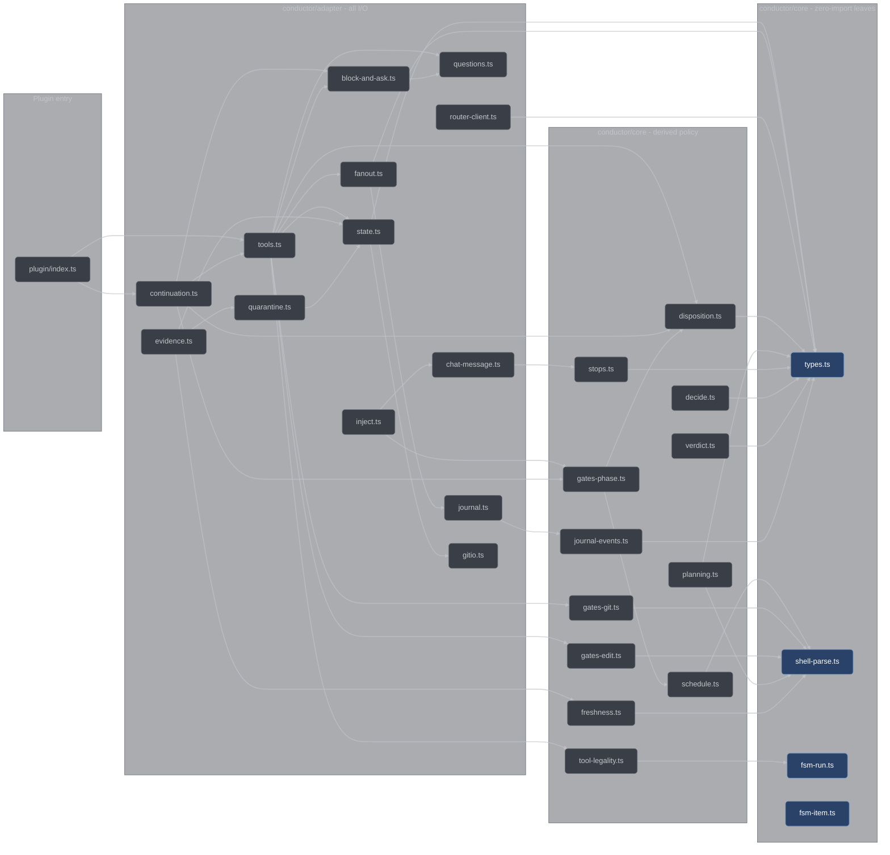

# Core and adapters

How conductor's TypeScript layer is split: a pure decision core that touches nothing, a thin
adapter layer that owns every side effect, and the guard tests that keep the boundary from
eroding. For anyone reading, changing, or adding a module under `conductor/`.

## The rule

Every policy decision is a pure function `(parsedInput, stateSnapshot) -> decision`, and it
lives in [`conductor/core/`](../../conductor/core). Core modules import **only** other core
modules — never `node:fs`, never `node:child_process`, never the opencode client, never
`Bun`. All I/O lives in [`conductor/adapter/`](../../conductor/adapter). This is guard rule
G3 in the plan's global constraints, and it is why every gate is deterministic and
replay-testable: a gate
that reads the disk or the clock can only be tested by staging a world, while a gate that
reads its arguments can be tested by passing arguments.

The rule reaches further than "no I/O". Core also has no wall clock and no environment:

| Forbidden in core           | Why                                                            | Where it lives instead          |
| --------------------------- | -------------------------------------------------------------- | ------------------------------- |
| `node:fs`                   | a decision that reads the disk is not a function of its inputs | adapter                         |
| `node:child_process`        | same, plus subprocesses are the largest trust boundary         | `gitio.ts`, `evidence.ts`       |
| `Bun` / the opencode client | single-runtime, and untestable without a live host             | adapter, `plugin/index.ts`      |
| `fetch(`                    | network I/O                                                    | `router-client.ts`              |
| `process.env`               | an invisible input makes a test irreproducible                 | adapter, passed in              |
| `Date.now`                  | a clock makes the same inputs produce different outputs        | adapter; `nowMs` is a parameter |

Adapters are the mirror image: they may spawn, read, write, stamp, and call out, but they hold
as little judgment as possible. `adapter/tools.ts` sequences the gates in `plan §3.5` order and
turns a `deny` into a thrown `Error`; the decisions come from `core/gates-git.ts` and
`core/gates-edit.ts`. `adapter/evidence.ts` runs the test command and writes the ledger; the
failure classification comes from `core/freshness.ts`.

## How it is enforced

Two guard tests, both in [`conductor/tests/purity.test.ts`](../../conductor/tests/purity.test.ts).
They are trivially green today and bite the moment someone reaches for the wrong import. Both
scan file text and **do not strip comments** — a commented-out forbidden call is still a smell,
which is why adapter file headers say "no single-runtime import (the purity guard scans it)"
rather than naming the runtime.

### The purity guard

Two assertions over every `.ts` file under `conductor/core/`:

- **`1.4-core-imports`** — every import specifier must start with `./` or `../`, must end in
  `.ts`, and must resolve inside `conductor/core/`. A bare specifier fails on the first rule, so
  `@opencode-ai/plugin`, `node:fs`, and every npm package are rejected by the same check that
  rejects `../adapter/state.ts`.
- **`1.4-core-forbidden`** — no line may contain `node:fs`, `node:child_process`, `Bun`,
  `fetch(`, `process.env`, or `Date.now`.

Both assertions require at least one file under `conductor/core/`, so a scanner aimed at the
wrong directory fails loudly instead of passing vacuously.

### The dual-runtime guard

Adapter and plugin code runs under opencode's Bun runtime in production and under Node type
stripping in tests (G14, [`conductor/DECISIONS.md`](../../conductor/DECISIONS.md) (f)), so it
may use only Node-compatible built-ins. Two more assertions, over `conductor/adapter/` and
`conductor/plugin/`:

- **`1.4-adapter-guard`** — no `Bun` reference, no `` $` `` shell tag, and no import of `bun` or
  any `bun:*` module. The shell tag is called out by name because it is the one API that
  silently works in production and cannot run in any test.
- **`1.4-subprocess`** — a file containing a subprocess-shaped call (`spawn(`, `spawnSync(`,
  `exec(`, `execSync(`, `execFile(`, `execFileSync(`) must import `node:child_process`.

The mechanical check is the import; the call shape is a discipline the two spawning adapters
keep. `gitio.ts` uses `execFileSync("git", args, …)` and `evidence.ts` uses
`spawnSync(cmd[0], cmd.slice(1), …)` — both argv arrays, neither passing a `shell` option, so
`shell:false` holds by default. There is no shell string anywhere, which is what lets the `-z`
git parsers trust NUL as their only delimiter: a path with a space or a metacharacter is one
argv element and is never re-tokenized.

A third guard, [`conductor/tests/single-source.test.ts`](../../conductor/tests/single-source.test.ts),
pins the other half of the split. `RUN_STATES` in `core/fsm-run.ts` and `ITEM_STATES` in
`core/fsm-item.ts` must equal the `state` enum of the `Run` and `Item` schemas, read at runtime
out of the exported `SCHEMAS` record. `types.ts` keeps its own vocabulary arrays module-private
and exports only the erased TS unions, so the schema enum is the sole runtime-derivable source
— and it is exactly the one the validator checks persisted records against.

## Erasable TypeScript

Node's type stripping runs the same `.ts` files that opencode loads, with no build step
(G1/G2). Stripping erases types; it does not compile. So the plugin uses no TypeScript
construct that emits runtime code:

| Forbidden                                       | Use instead                                   |
| ----------------------------------------------- | --------------------------------------------- |
| `enum`                                          | an `as const` array plus `(typeof X)[number]` |
| `const enum`                                    | the same                                      |
| `namespace`                                     | a module                                      |
| parameter properties (`constructor(private x)`) | an explicit field assignment                  |

That is why closed vocabularies throughout core look like `const RUN_STATES = [...] as const`
with `export type RunState = (typeof RUN_STATES)[number]` — one array is the single source for
both the runtime list and the type.

Imports between conductor's own files carry explicit `.ts` extensions
(`import { globMatch } from "./shell-parse.ts"`).
[`conductor/tsconfig.json`](../../conductor/tsconfig.json) pins all of it mechanically:

```jsonc
{
  "compilerOptions": {
    "erasableSyntaxOnly": true,         // rejects enum / namespace / parameter properties
    "allowImportingTsExtensions": true, // permits the explicit .ts specifiers
    "noEmit": true,                     // there is no build output; opencode loads source
    "strict": true,
    "module": "nodenext",
    "moduleResolution": "nodenext",
    "target": "es2023",
    "lib": ["es2023"],
    "types": ["node"],
    "skipLibCheck": true
  },
  "include": ["core/**/*.ts", "adapter/**/*.ts", "plugin/**/*.ts", "tools/**/*.ts", "tests/**/*.ts"]
}
```

`tsc --noEmit` runs as part of the canonical gate, so an `erasableSyntaxOnly` violation
surfaces in the same command that runs the tests.

## The module graph



The arrows are a readable subset of the real import graph — twenty-eight core modules and eighteen
adapter modules do not fit on one page — and they only ever point down. Three of the accented
leaves import nothing at all — `fsm-run.ts`, `fsm-item.ts` and `shell-parse.ts` have no imports
whatsoever — and `types.ts`, which takes only the vet-criteria and review-witness declarations it
builds schemas out of, is the root the rest of core builds on. No arrow points from core back into
adapter, and the purity guard is what keeps it that way. Every module is described below, in the
same two groups.

## The core modules

Line counts are a size cue, not a contract.

### core/types.ts — 1653 lines

Every `plan §2` schema, once: each exists as a TypeScript type **and** a hand-written JSON
Schema object in the exported `SCHEMAS` record. Exports `CONDUCTOR_NAME`, the closed-vocabulary
unions (`RunState`, `ItemState`, `StopKind`, `FailureClass`, `Severity`, `AnomalyKind`,
`GitMode`, and the rest), the record interfaces (`Config`, `Run`, `Queue`, `Item`,
`EvidenceRecord`, `DecisionRecord`, `QuestionRecord`, `Findings`, `Verdict`, `JournalRecord`, …),
`SCHEMAS`, and `validate(schemaName, value) -> {ok, errors}`.

**Easy to get wrong:** the schema keyword subset. Every schema restricts itself to `type`,
`required`, `enum`, `properties`, `items`, and `additionalProperties`, and `validate` rejects
any other keyword at any depth rather than silently ignoring it — that is what makes it
impossible for this validator and the router's full validator to disagree about a payload. See
[schemas.md](schemas.md).

### core/shell-parse.ts — 528 lines

Quote-aware shell tokenizing, operator segmentation, git command detection, and glob matching —
the parsing substrate both write-facing gates and the scheduler stand on. Exports
`shellTokens`, `splitOnOperators`, `commandWordLocation`, `gitInvocation`, `isGitCommand`,
`gitSubcommand`, `globMatch`, `isWildcardHeaded`, `scopesIntersect`.

**Easy to get wrong:** `scopesIntersect` compares only the *literal heads* of globs and
deliberately over-approximates — `src/*.ts` and `src/*.md` report as intersecting, and heads
compare case-insensitively because the reference filesystem is. A false positive only
serializes work; a false negative would let two implementers write the same file. Note that
`scopesIntersect([], X)` is `false`, which is why the scheduler handles empty scopes separately.

### core/freshness.ts — 227 lines

The `plan §2.6` freshness rule and the `plan §2.6.1` failure-class table:
`verifyFreshFor(record, inputs) -> {fresh, why}` and
`classifyFailure(stderr, stdout, exitCode, itemFileScope, runnerRules) -> FailureClass`, plus
the `RunnerRules` shape. Per-runner extraction rules arrive as **data** (regex sources), so this
stays a truth table rather than a regex someone tweaks in an adapter.

**Easy to get wrong:** non-finite timestamps. `Math.max(...NaN)` is `NaN` and every `< NaN` is
false, so a stale record would read fresh; any non-finite input is treated as stale up front.
And the failure class is decided by output *shape*, never exit code, because runners disagree —
pytest exits 2 on a collection error.

### core/stops.ts — 166 lines

The `plan §2.9` stop vocabulary, the single definition of terminality, and the computed stop
kinds: `STOP_KINDS`, `isTerminal(run)`,
`shouldTerminate(run, counters, itemsSummary, config) -> {stop, kind?}`.

**Easy to get wrong:** `done` and `interrupt` are never computed here — `conductor_report`
records one and halt handling records the other. And the counters outrank the item summary:
`futileRePrompts` reaching 3 (`noop`) and an exhausted override budget (`env`) stop the run even
with open items, because a wedged loop must end loudly rather than burn tokens.

### core/disposition.ts — 417 lines

The one answer to "is this item finished, waiting, hopeless, or workable?" and the one closer that
picks a run's stop kind: `DISPOSITIONS` (`actionable`, `waiting-human`, `stuck`, `settled`),
`dispositionsOf(items, ctx)`, `runDispositionOf(...)`, `STOP_CAUSES`, and
`stopKindOf(input) -> {kind, reason}`.

**Easy to get wrong:** re-deriving either question at a call site. The question was once answered
by four separate predicates with subtly different closures, and every recorded wedge in this build
lived in a disagreement between them rather than in an FSM edge — each execution mode (no-git,
worktrees, debug, blocked dependencies) had minted its own hole. `stopKindOf` is total over the six
§2.9 stop kinds for the same reason: `blocked` and `surfaced` were computed by core and written by
nobody, so a run whose every item waited on a human closed as "the run completed". Adding an
execution mode means extending these two functions, not writing a third opinion.

### core/verdict.ts — 53 lines

Skeptic-verdict aggregation and nothing else: `verdictKind(verdict)` classifies one verdict as
`upheld`, `refuted`, or `abstained`, and `findingSurvives(verdicts, k)` is true iff the count of
seats that did *not* refute reaches `⌈k/2⌉`.

**Easy to get wrong:** a refutation without symmetric evidence is an abstention, and an
abstention upholds. A verdict counts as a refutation only when its `refutationEvidence` names all
three of the discriminating input, what was run, and the reading under which the finding fails;
anything less is a seat that could not evaluate the finding, and incapacity must not convert into
a verdict. A tie upholds too: at the default `skepticsPerFinding: 2` the threshold is 1, so a
finding two skeptics split on survives into a fix round.

### core/decide.ts — 177 lines

The `plan §6.2` decision-protocol helpers: `scoreOptions(options) -> {winner, tie}` sums the
five `plan §2.7` ladder-5 keys (`capability`, `testability`, `movingParts`,
`validationEarliness`, `singleSource`); `isHumanTerritory(question)` is a conservative classifier
over four of the five `plan §6.2` human-territory categories — taste, money, irreversible
commitments, and secrets; `requireTwoOptions(record) -> {ok, why}` is the two-option rejection
rule. The fifth category, a genuine ladder-5 tie, is not recognizable from a question's text, so
it is raised by `scoreOptions` returning `{winner: null, tie: true}` rather than by the
classifier. See [design-constraints.md](design-constraints.md).

**Easy to get wrong:** an unscored option totals 0, so `scoreOptions` alone would happily rank a
record of unscored options. `requireTwoOptions` is the gate that rejects them — a
`kind: "derived"` record needs at least two options, each scored; `kind: "human"` is exempt,
because taste has no objective score.

### core/journal-events.ts — 165 lines

The closed, per-component event-name vocabulary: eight components (`fsm`, `gates`, `fanout`,
`evidence`, `continuation`, `inject`, `router-client`, `state`), each with a non-empty list of
the names an adapter may emit. Exports `COMPONENTS`, `EVENTS`, `isKnownEvent(component, event)`,
`DEFAULT_LEVEL` (`"info"`), `DEFAULT_CONSOLE_LEVEL` (`"warn"`).

**Easy to get wrong:** inventing an event name at the call site. Logs you cannot grep by name
are logs you cannot debug, so `journal.ts` calls `isKnownEvent` on every write and an unlisted
name is caught at its source. Widening the vocabulary means adding a name here.

### core/fsm-run.ts — 246 lines

The `plan §3.1` run state machine: `RUN_STATES` (the eight positions) and
`legalRunTransition(from, to, context) -> {ok, why}`.

**Easy to get wrong:** `INTAKE` lists three successors, but exactly one is legal for a given
classification — the selection is enforced inside the transition check, not by the successor
table. The run is forward-only; the majors → revise → re-review loop is internal to the
plan-review handler and never regresses run state. See [state-machines.md](state-machines.md).

### core/fsm-item.ts — 183 lines

The `plan §3.3` item state machine: `ITEM_STATES` (the seven positions), the `ItemFailureClass`
vocabulary, and `legalItemTransition`.

**Easy to get wrong:** `blocked`, `deferred`, and `debugging` are annotations, never positions.
The blocked rule is orthogonal to the transition table and is applied before it — a blocked item
makes no transition at all until it is answered.

### core/gates-phase.ts — 441 lines

Tool legality per FSM position:
`legalTools(run, items, questions, repoConfigured, publishEnabled = true) -> {legal, recommended, why}`.
`legal` maps a tool name to its args hint (a per-item stage tool carries the ids it may target),
`recommended` is the single next call or `null`.

It is one derivation with four readers, so none of them can hold a private opinion about what may
run: the phase-order choke point in `adapter/tools.ts`, the doctrine injection in
`adapter/inject.ts`, the continuation engine in `adapter/continuation.ts`, and the doctrine
mechanics renderer in `core/mechanics.ts`. Only the first three describe a live workspace; the
renderer pins `repoConfigured` and `publishEnabled` to named constants because it renders the
pipeline the FSM defines into a checked-in pack rather than a verdict about any repo.

**Easy to get wrong:** `recommended` must be invariant under item-array reordering, which is why
the `EXECUTING` recommendation is computed through `nextWave` — the scheduler's own ordering —
rather than by scanning items in array order. An unconfigured repo legalizes only
`conductor_setup` and `conductor_status`, in every state. `publishEnabled` is the §3.9 no-git
input: with it false, `conductor_publish` is suppressed at `REVIEWED` in both `legal` and
`recommended`, so a no-git run is never handed a tool that cannot work. It carries a default so
the pinned five-parameter type stays assignable, and
[`conductor/tests/legaltools-callsites.test.ts`](../../conductor/tests/legaltools-callsites.test.ts)
fails if any production call site stops passing it explicitly. Dependency readiness is a veto in
`legal`, not only a preference in `recommended`: a stage tool is not offered for an item whose
`dependsOn` are unfinished.

### core/tool-legality.ts — 417 lines

The declaration table every `conductor_*` call passes through before its handler runs:
`TOOL_LEGALITY` (one row per tool name), `PHASE_RULES`, `legalityRowOf`, `callerAllowed`,
`undeclaredToolWhy`, plus the closed §3.6 override vocabulary `OVERRIDE_GATES`, `isOverrideGate`,
and `unknownOverrideGateWhy`.

A row answers two independent questions. `phase` says *where in the run* the tool may be called,
drawn from the closed vocabulary `always`, `verdict`, `non-terminal`, `once-at-intake`, and
`stage` — where `stage` delegates the phase question to a committed legality path the row must
name. `callers` says *who* may call it: `orchestrator`, `sub-session`, or both.

**Easy to get wrong:** assuming `legalTools` covers everything. It does not, and that was the
defect: it had two production consumers — the per-item stage check and the wave driver — so
`conductor_classify` and every meta name reached its handler with no legality question asked of
it at all. A tool with no row here is refused rather than run, which is what stops the next tool
from being born guarded by nothing. The override gate names are closed
for a related reason — an unknown gate has no consumption point, so granting one would taint the
item and spend both budget meters for a bypass that can never happen. It is refused before the
budget check and spends nothing.

### core/tool-bindings.ts — 266 lines

`TOOL_BINDINGS`: one row per §3.4 tool declaring which `adapter/tools.ts` handler serves it, which
input fields the composition root supplies from its own context (`infrastructure` — store, runId,
config, journal, fanout, tree state, and the rest), and which it pins to a constant (`fixed`).

**Easy to get wrong:** treating it as documentation. The composition root consumes this table when
it binds handlers to the plugin's tool map, and the guard test asserts for every bound tool that
the handler's required input fields are exactly the declared args, plus `infrastructure`, plus
`fixed`. Two rows pin a value. `conductor_decide` fixes `kind: "derived"` — a decision recorded
through a tool call was not asked of a human — and `conductor_answer` fixes `via: "tool"`, because
the channel an answer arrived through is a fact about the call rather than something the caller
may assert; the one path that records `human-file` is the ingest of a file from the state area no
session may write.

### core/gates-git.ts — 705 lines

The `plan §3.5` git deny matrix — an enumerated-allow, **default-deny** posture over a possibly
adversarial local model:
`decideGit(command, sessionRole, gitMode, runActive, branchPolicy) -> GitDecision`.

**Easy to get wrong:** the decision is taken over the full parsed token segment, not the
one-word subcommand — `stash list` and `stash push`, `branch` and `branch -D`, `worktree list`
and `worktree add` differ only in their operands. Matching on tokens rather than substrings is
what keeps `git add src/config.ts` from parsing as anything but `add`. An unresolvable command
word denies outright, and any denied segment denies the whole command. See [gates.md](gates.md).

### core/gates-edit.ts — 736 lines

The session-registry gate, the edit-scope gate, and the bash write-shape extractor:
`decideSession(input) -> Decision`, `decideEdit(input) -> Decision`,
`writeShapedPaths(command) -> string[]`, `interpreterWritePaths(script) -> string[]`,
`interpreterStateAreaScript(command) -> string | null`.

**Easy to get wrong:** the spawn deny in `decideSession` is unconditional — every session,
registered or not. A registry gate whose registry can be grown by a tool call is not a gate. In
`decideEdit`, a path that is not under the session tree denies at normalization rather than
falling through to a scope match, because `**` spans the leading separator and would otherwise
match any absolute path on the machine; and the implementer's writable set is `fileScope` minus
`testScope`, checked in that order. `writeShapedPaths` shares the tokenizer and operator
segmentation with the git gate but keeps its own twelve-name wrapper list, unwrapped iteratively,
and recurses into a shell `-c` string — so a write behind `env sh -c "..."` is analyzed
identically to a bare one, which is not true of the git gate. See [gates.md](gates.md).

### core/schedule.ts — 255 lines

The `plan §4.2` wave scheduler and the per-stage read fan-out:
`nextWave(queue, items, config) -> {parallel, rationale}` and `readFanout(stage, config)`.

**Easy to get wrong:** degenerate scopes. An empty `fileScope` reads as disjoint from everything
under `scopesIntersect` and would otherwise join every wave; a wildcard-headed glob has an empty
literal head and is the mirror trap. The scheduler treats both as conflicting with all other
items, explicitly. Acyclicity is deliberately *not* checked here — the scheduler may assume an
acyclic queue because decompose rejected a cyclic one. See
[scheduling-and-fanout.md](scheduling-and-fanout.md).

### core/planning.ts — 924 lines

The `plan §3.2` decomposition validation table and the `plan.md` placeholder doctrine, as pure
decisions: `validateQueue(queue, config) -> {ok, violations}`, `findDependsOnCycles`,
`firstIntersectingGlob`, `vagueAcceptance`, `acceptanceClusters`, `findingBlocksItems`,
`scanPlaceholders`, and the constant `ITEM_MAX_FILES = 5`. It says what is wrong and names it;
the handlers own the dispatch and the persist.

**Easy to get wrong:** every check reports *every* instance it can see in one pass. There is one
bounded re-prompt, and a check that reported only its first hit would spend it on half the truth
and then reject the run for a defect the planner was never shown. `ITEM_MAX_FILES` also owns its
own number — `config.workflow.trivialMaxFiles` is the trivial-classification ceiling, and wiring
the two together rejected every three-file item under the default config.

### core/queue-amend.ts — 256 lines

The `plan §2.4` amendment vocabulary: `AMEND_OP_KINDS` (`add`, `update`, `remove`),
`AMENDABLE_ITEM_STATES`, `parseAmendOps(raw)`, and `applyAmendOps(queue, ops, itemStates)`.

**Easy to get wrong:** the tool takes *ops*, not a queue. An amendment states the change and the
run's own queue supplies everything the change did not mention, so a caller cannot drop an item by
omitting it. `update` may not re-scope an item past `PENDING`: a `fileScope` or `testScope` rewrite
at `RED`, `TEST_VETTED`, or `GREEN` is refused with instructions to state it as a remove followed
by an add, because a scope that moves under a red test invalidates the proof already recorded
against it.

### core/provenance.ts — 126 lines

The one place that says which artifacts carry a human's authority and where a human writes them:
`ANSWERS_DIRNAME`, `answerFileNameOf`, `answerDropPath`, `isHumanProvenance(via)`,
`deferDecisionKind(authorizingAnswer)`, `awaitsOperatorConfirmation(question)`, `provenanceLabel`.

**Easy to get wrong:** letting a caller *claim* human provenance. Every `conductor_*` tool is
reachable by the model, so no tool call can prove a human spoke. Human provenance is derived from
an artifact — a file under the `.conductor` state area, which the edit gate denies to every
session, orchestrator included. No artifact, no `human` kind: an ordinary model-initiated deferral
records `kind: "derived"`, and only one resting on a human answer file records `"human"`. The
channel is exactly as strong as the bash write gate in front of the state area, and this module's
header says so rather than implying more.

### core/vet-criteria.ts — 167 lines

The five `plan §2.10` TEST_VET criteria as data, and the rule that makes a verdict on them bite:
`VET_CRITERIA` (`observableBehavior`, `wouldCatchWrongImpl`, `rightLevel`, `pinsAcceptance`,
`antiPatterns`), `vetCriterionNames`, `renderVetCriteria`, `vetRepairLine`, `impliedMustFix`.

**Easy to get wrong:** restating the list anywhere else. Three consumers read this module and none
of them re-spells it: `core/types.ts` builds `SCHEMAS.TestVet`'s `verdictsByCriterion` out of it,
so a critic's receipt is validated against the criteria themselves; `core/mechanics.ts` renders it
into the `test-vet.md` pack, so the checklist taught is the checklist scored; and `adapter/tools.ts`
composes both vet prompts from that same rendering. Adding a criterion here changes the schema, the
pack, and both prompts at once.

### core/review-witness.ts — 243 lines

The reviewer diligence witness: `witnessNonce(parts)`, `diffContact(diff)`, `createdFileDiff(files)`,
`checkReadWitness(...)`.

**Easy to get wrong:** confusing contact with judgement. A reviewer's judgement stays trusted — the
harness cannot grade it, and pretending otherwise would be theatre. Contact *is* mechanically
checkable: every lens dispatch carries a nonce derived from the dispatch itself, and every reply
carries a read witness naming that nonce back plus the ranges it read. The handler re-derives the
item's touched files and hunks from the diff it built the prompt with, and refuses a witness citing
a file the diff never touched, a span no hunk contains, or leaving a touched file uncited. An empty
findings list is still the approval — at the price of one honest read. `createdFileDiff` exists
because an item whose scope is a file it *creates* has no tracked diff at all.

### core/receipt-floor.ts — 175 lines

The fixer-receipt floor: `findingSubjects(...)`, `routeFallbackScope(route, scopes)`,
`floorExclusions(route, scopes)`, `receiptFloor(...)`.

**Easy to get wrong:** reading it as a correctness check. It is deliberately the weakest honest
floor — the fix must have touched at least one file the routed finding *names*. It says nothing
about whether the fix is right; that is the next round's job. Without it, a fix dispatch that
replied "done" and touched nothing advanced exactly as far as one that did the work.

### core/reply-protocol.ts — 102 lines

The named sub-session reply protocols and the pushback matcher: `CONCERN_PREFIX`,
`concernToken(id)`, `replyProtocols()`, `renderReplyProtocol()`, `concernNamesFinding(concern, names)`.

**Easy to get wrong:** matching a concern by substring. `concern.includes(id)` adjudicated a
concern about `F10` as a pushback on `F1`, which mis-handles exactly the careful fixer who writes a
loosely-worded concern. The token the doctrine teaches — `finding:<id>` — is the token the matcher
parses, and both come from here.

### core/commit-message.ts — 148 lines

The `plan §3.3` commit-message template: `TRAILER_DENYLIST`, `hasDenylistedTrailer(message)`,
`denylistedTrailerToken(message)`, `buildCommitMessage(item, redProof)`.

**Easy to get wrong:** trusting the generator alone. Conductor never signs someone else's name to a
commit, and the text being embedded — an item's title and rationale, a red test's failure excerpt —
is model-authored and may contain any of the denied trailer tokens. So the rule is enforced twice on
purpose: the generator neutralizes them here, and the publish handler refuses a message carrying one
even when it arrives through the injectable seam. A commit message is a record, not a judgment, so
nothing here dispatches or asks.

### core/mechanics.ts — 343 lines

The single source for what the doctrine packs say about the machine:
`renderMechanics(pack)` derives a pack's mechanics section from the tool table and the legality
machine, `mechanicsBlock`/`extractMechanics` read the generated block back out between
`MECHANICS_BEGIN` and `MECHANICS_END`, and `packSection(text, heading)` lets a dispatch prompt carry
one named section of a pack verbatim. `runStageTools`, `itemStageTools`, `nonBehavioralEntryTool`,
`metaTools`, `subSessionTools`, `renderLimits`, and `renderStuckProtocol` are the derivations it
renders from.

**Easy to get wrong:** hand-writing a pack's mechanics. Hand-written mechanics drift silently;
derived ones cannot. The stage sequences come from asking `legalTools` what it recommends at each
position, and
[`conductor/tests/doctrine-mechanics.test.ts`](../../conductor/tests/doctrine-mechanics.test.ts)
goes red the moment a pack's embedded block differs from a fresh derivation — so a renamed tool or a
moved FSM edge fails the build instead of leaving the packs quietly wrong. See
[doctrine-system.md](doctrine-system.md).

### core/vocab-registry.ts — 115 lines

`VOCABULARIES`: the four closed vocabularies the system restates in more than one place —
`stopKinds` (a TypeScript array, an exported JSON-schema enum, and a Python tuple), `runStates`
and `itemStates` (a TypeScript array and a JSON-schema enum), and `roles` (three parallel
record-key maps in one file) — each pinning its frozen spelling and naming every restatement site.

**Easy to get wrong:** assuming a grep finds every copy. A stop-kind change touches several files in
three languages, none derivable from another, and the copies are findable by grepping the *value*
rather than the concept — `grep STOP_KINDS` finds only some of them, and a Python script carrying a
verbatim tuple is reached by no TypeScript change at all. This module is pure data; the parity test
owns the extraction and asserts every site equals the pin in both directions.

### core/wiring-manifest.ts — 103 lines

`WIRING_MANIFEST`: the declarative record of every hook, tool binding, and module wire the
composition root must register for the integration to be live, plus `declaredHookKeys`,
`declaredModuleWires`, `declaredToolBinding`, and `fallbackToolDescription`.

**Easy to get wrong:** proving a helper instead of a wire. The injection layer once shipped green
while registering nothing: the hooks were built and imported but never wired, so the injection
adapter ran in no session and the suite stayed green because each test proved its own helper. The
completeness test constructs the real plugin and asserts in both directions that the wires
registered equal the wires declared here — a declared wire that is not registered is red, and a
registered wire that is not declared is red too.

### core/preflight.ts — 215 lines

The pre-live-contact go/no-go: `specCurrency(spec, inputs)` compares a spec's recorded
`verifiedAgainstHead` against the current HEAD and flags every cited file that moved since,
`extractCitedFiles(specText)` finds those citations, and `checkLiveArtifact(...)` binds a live-run
artifact to the run's own ledger — its `runId`, an evidence seq the run actually minted, a real
command line, and a content floor.

**Easy to get wrong:** treating either check as a model's job. Both are text checks precisely
because the failures they catch are cheap to fake and expensive to discover late: a spec specced
against code that moved underneath it burns a model-gated budget rediscovering drift, and a
hand-written live-run artifact flips an acceptance row in seconds. Everything arrives as an input —
the HEAD, the diff path set, the ledger facts, the artifact body — and an impure caller gathers them.

## The adapter modules

### adapter/journal.ts — 285 lines

The leveled JSONL journal with an injected console sink:
`createJournal(runDir, config, env, consoleFn?) -> {log, flushSync}`. One complete JSON line per
call, `seq` monotonic across restarts, records bounded at about 32 KiB with `data.truncated`,
rotation to `journal.N.jsonl.gz` past `retention.maxRunDirBytes`.

**Easy to get wrong:** `error` and `warn` are always written regardless of the resolved level,
and an unknown event name throws in dev and test but in production is retained on disk and
surfaced to the console rather than silently dropped.

### adapter/jsonl.ts — 60 lines

The tolerant reader the evidence and question ledgers are read through:
`readJsonlTolerant<T>(filePath) -> {records, torn}`.

**Easy to get wrong:** deciding per ledger what a torn final line means. Five ledgers — journal,
evidence, questions, decisions, publish batch — are appended a line at a time by a process that can
be killed mid-write. A per-ledger rule leaves them free to disagree, and they did: the journal and
the evidence ledger healed while the question ledger threw a raw `SyntaxError`, which made a run
*unclosable* exactly after a crash, since both the status tool and the stop-report writer read
questions. The rule is stated once here — a line that does not parse is skipped and counted.
Skipped, because a crash artifact must never wedge the reader that exists to describe the crash;
counted, because "part of this ledger was unreadable" is itself a fact a report owes its reader.
`decisions.jsonl`, `publish-batch.jsonl` and `journal.jsonl` each still carry their own local copy
of that loop in `adapter/tools.ts`.

### adapter/state.ts — 1183 lines

The crash-safe `.conductor/` state store, and **the owner of the atomic write primitive**.
`openWorkspace(opts) -> StateStore` returns a store exposing `root` (the workspace as the tree path
the gates compare against), `priorBeacon`, `createRun`, `loadRun`, `saveRun`, `currentRun`,
`archiveRun`, `resumeRun`, `loadItem`, `saveItem`, `removeItem`, `setBlocked`, `clearBlocked`,
`setDeferred`, `setDebugging`, `itemsSummary`, the stale-red registry accessors, `readBeacon`,
`isHalted`, and `release`. It also exports the primitives `writeFileAtomicSync`,
`readJsonFileSync`, `appendLedgerLineRaw`, `assertSafeId`, `registerConductorExclude`,
`pidIsAlive`, the lock readers `lockPathForRunDir` / `lockHolderForRunDir` /
`assertWorkspaceLockHeld`, and the refusal predicate `isWorkspaceLocked`.

**Easy to get wrong:** every persisted write must go through `writeFileAtomicSync` — a
pid-suffixed same-directory temp, fully written, then renamed over the target — so a crash
mid-commit can never leave a half-written state file.

The workspace lock is the second trap. A live, young, foreign holder makes `openWorkspace` **throw**
`WorkspaceLockedError` naming the holder; no store is returned and there is no read-only mode to
fall back into. A holder that is dead, or older than the staleness bound, is broken through an
identity-keyed compare-and-delete rather than overwritten in place, and exhausting the retry budget
throws a second refusal that tells the operator which files to remove by hand. `resumeRun` is
`archiveRun`'s named inverse, for a run whose stop a human answer has cleared.

The clock is the third. `openWorkspace` takes `now` as an option and defaults it to `Date.now`; the
composition root leaves that default in place, so store stamps are whole milliseconds. The
monotonic clock is handed to the handlers instead, for the comparisons that need sub-millisecond
ordering — so "every conductor timestamp is monotonic" is not a claim this module supports. See
[adapter/clock.ts](#adapterclockts--73-lines).

### adapter/config-io.ts — 181 lines

The `plan §2.1` `.conductor/config.json` reader and the only place the config path is spelled:
`configPath(root)`, `loadConfig(root) -> LoadedConfig`, and the deep-frozen `DEFAULT_CONFIG`.

**Easy to get wrong:** falling back to defaults on a malformed config. Every failure arm throws and
names the file, because a repo whose `git.mode` silently reverts to a default is a downgrade nobody
asked for. An *absent* config is a different case and is not an error at all: it is the ordinary
first-run state, reported as `repoConfigured: false`, under which only `conductor_setup` and
`conductor_status` are legal in every run state. The module's header names the five safety-critical
defaults — `git.mode`, `verify.scopes`, `verify.requiredScopes`, `verify.behavioralPaths`, and
`models.default` — that a silent fallback would have weakened.

### adapter/clock.ts — 73 lines

The injectable time source the composition root hands the handlers:
`createMonotonicClock(sources) -> () => number` and `stampResolutionMsOf(startedMs)`.

**Easy to get wrong:** assuming `Date.now()` is enough at the enforcement seams. Two §2 verdicts are
comparisons between stamps — freshness ("did an edit land after the verify started?") against
filesystem mtimes that carry sub-millisecond precision, and the stale-red rule ("has a later run
happened than the red the critics would be shown?") over records a run can append inside one
millisecond. `Date.now()` truncates and repeats, so two events inside one tick compare equal and the
verdict falls to whichever tie-break the rule happens to carry — an enforcement decision made by
machine speed. The monotonic counter orders them and cannot step backwards behind a stamp already
handed out, which a mid-run clock correction otherwise would. `stampResolutionMsOf` is how a
consumer tells a fractional stamp from a whole-millisecond one, because the freshness tie rule
differs between them.

### adapter/gitio.ts — 320 lines

Read-only git queries: `stagedFiles`, `stagedNameStatus`, `dirtyFiles`, `unstagedDrift`,
`indexMtimeMs`, `worktreeMtimes`, `headShortSubject`, `headSha`, `currentBranch`, `isRepo`. Every
function takes an explicit `cwd` first, so nothing reads a process-global repo location.

**Easy to get wrong:** the failure discipline. A non-zero exit for a legitimate repo-state reason
— unborn HEAD, detached HEAD, not a repository — maps to the `null`/`false`/empty value the
caller expects, while a git that could not be spawned at all is re-thrown so a genuine
environment fault stays loud. The discriminator is whether the thrown error carries a numeric
`.status`.

### adapter/questions.ts — 222 lines

The `plan §2.11` question ledger: `appendQuestion(runDir, input, nowMs?)`,
`readQuestions(runDir)`, `answerQuestion(...) -> {question, clearedItemIds}`.

**Easy to get wrong:** it owns its I/O end to end, including its own crash-safe writer, and never
reaches into `state.ts`'s raw ledger appender. Its temp file carries a random suffix and is
created with `{flag: "wx"}`, so a pre-planted entry at the temp path makes the write fail rather
than be followed through to whatever it points at. Callers that need the question *and* the item's
`blocked` disposition together go through
[`adapter/block-and-ask.ts`](#adapterblock-and-askts--389-lines) instead of writing the pair
themselves.

### adapter/answer-file.ts — 79 lines

The out-of-band human channel: `answerFileAbsPath(runDir, questionId)`,
`readAnswerFile(runDir, questionId)`, `pendingAnswers(runDir, openQuestionIds)`.

**Easy to get wrong:** looking for a tool that proves a human spoke. There is none — every
`conductor_*` tool is reachable by the model. The operator instead drops one file into the
`.conductor` state area, which the edit gate denies to every session including the orchestrator,
and the bash gate refuses outright any interpreter one-liner that so much as names `.conductor`.
One `echo >` by the operator is the whole protocol. What that establishes is bounded and stated as such: the file is
evidence that no session took a *known* write route to it, which is the strongest signal the
harness has.

### adapter/block-and-ask.ts — 389 lines

The transactional "block this item on a new question" primitive:
`blockItemWithQuestion(input) -> BlockAndAskResult`, plus the two repair layers
`pendingBlockIntents(runDir)`, `replayBlockIntents(input)`, and
`reconcileOrphanQuestions(...)`.

**Easy to get wrong:** writing the pair by hand. A stuck stage owes two durable writes — a §2.11
question and the §2.5 `blocked` disposition pointing the item at it — and they live in different
files, so a kill between them leaves an open question naming an item that carries no disposition.
The stage gate then re-offers the tool on an item nothing says is blocked, and answering the
question clears nothing, because `blocked` is what `conductor_answer` keys on. One class of that
bug ended up with seven separate implementations. The transaction is the temp-and-rename idiom
applied to the *pair*: an intent naming the whole ask is committed first, both halves are written,
and the intent is dropped only once they are both on disk, so a crash leaves either nothing or a
record that says exactly what to finish. First-block-wins: an already-blocked item keeps its
existing block, and `reuseOpen` (default true) attaches to an equivalent open question rather than
minting a second one.

### adapter/evidence.ts — 1059 lines

**The** evidence writer. It runs the item's test and verify commands, classifies failures through
`core/freshness.ts`, and appends the `plan §2.6` evidence ledger. It is the sole legitimate
importer of `state.appendLedgerLineRaw`: every other component reads the ledger through
`state.ts`, and only this module appends to it. Exports `runTest`, `runVerify`, `detectRunner`,
`RUNNER_PROFILES`, `substituteItemTest`, `validateEvidenceRecord`, `childEnv`.

**Easy to get wrong:** the `runVerify` order — refuse on a live same-tree marker, break a stale
one, heal an orphaned quarantine, quarantine the foreign red set out of the repo, start-stamp,
record HEAD and branch, write the marker, run each scope build-before-test, then remove the
marker and restore the quarantine on completion *including on a timeout*. The second trap is
output normalization: real Node emits an absolute realpath in a missing-module error, so cwd and
realpath prefixes are stripped before classification, or an in-scope missing module would
misclassify as `error` and kill a legal greenfield red. See
[evidence-and-quarantine.md](evidence-and-quarantine.md).

### adapter/quarantine.ts — 432 lines

The out-of-repo move-aside and restore of the foreign red set, with a crash-safe manifest:
`quarantineFiles(input) -> QuarantineHandle`, `restoreQuarantine(handle)`,
`replayPendingRestores({stateHome, workspaceKey})`, `quarantineDirFor`,
`moveFilePreservingMtime`.

**Easy to get wrong:** the manifest is written *before* any file moves, so a kill at any point
leaves a manifest naming every planned move and the next run replays the pending restores from
the manifest's own recorded paths. Files move by rename, not copy, so mtimes survive and
freshness is not perturbed. This module is not the evidence writer and never touches the
evidence ledger.

### adapter/worktrees.ts — 317 lines

The `plan §4.2` worktree lifecycle: `createWorktree(...)`, `mergeBack(...)`, `removeWorktree(...)`.

**Easy to get wrong:** where the worktree lives, and what a second call does. It lives *outside* the
repository, at `<stateHome>/conductor/<workspaceKey>/worktrees/<runId>/<itemId>` — the same
out-of-repo coordinates the quarantine uses, and for a stronger reason: a worktree inside the repo
is a complete second copy of every test file, which the main tree's whole-tree verify runner would
then discover and run. `createWorktree` is work-preserving and idempotent — it prunes first, adopts
a still-registered worktree only after verifying its branch, and reuses a surviving branch rather
than force-deleting and recreating it, so a crash-recovery path does not throw away committed work.
Every git call mirrors `gitio.ts`'s discipline: `execFileSync` with an argv array, no shell, under a
per-call environment scrub that strips `GIT_DIR`, `GIT_WORK_TREE`, `GIT_INDEX_FILE`, and
`GIT_COMMON_DIR` so an inherited value cannot redirect a write onto another repository.
`removeWorktree` is called per worktree-bearing item at run teardown.

### adapter/fanout.ts — 451 lines

The fan-out engine: a pool of opencode sub-sessions driven over the SDK, create → prompt →
collect, with per-model wave grouping, freeze-aware admission, and a per-job watchdog.
`createFanout(client, config, journal, registry, treeState, runId) -> Fanout`.

**Easy to get wrong:** the prompt body's `format` field does not exist at opencode 1.18.15, so
structured output is prompt-shaped and the engine independently validates each receipt through
the core `validate()`, re-prompting with the concrete validation errors appended to the original
instruction. The registry entry is written *before* the first prompt, so no sub-session can make
a gated tool call while unregistered. Timers are the global `setTimeout`/`clearTimeout` so
`node:test` mock timers can drive the watchdog.

### adapter/router-client.ts — 243 lines

The plugin-side metrics client for the C++ llama-router, plus the `plan §4.4` fail-soft
failover: `fetchMetricsSummary`, `resolveBaseUrl`, `noteRouterFailure`, `createFailoverState`.

**Easy to get wrong:** this client must absorb every failure. `fetchMetricsSummary` resolves
`null` without ever throwing or rejecting, because the router is a residual-risk dependency and
layer 1 must keep working while it is down. One failover latches the session onto the upstream
base URL and marks the run's metrics partial; a second disables probing entirely. The §4.4
failover protects conductor's own setup probes only — the run's model traffic reaches the
router through opencode's fixed provider base URL, which the plugin cannot repoint mid-session,
so mid-run resilience is the supervisor's restart, not a client-side health probe. See
[llama-router.md](llama-router.md).

### adapter/inject.ts — 423 lines

The system-prompt injection layer: `buildSystemAppend`, `paramsForRole`, `headersFor`,
`packFilesFor`, `renderNoRunStateBlock`, `composeDelivery`, `loadPacks(doctrineDir)`, and
`initPlugin(deps)`.

**Easy to get wrong:** only `loadPacks` and `initPlugin` touch the filesystem — the three
transform helpers are pure, so identical inputs produce byte-identical output. The live state
block is built from `legalTools`, the same derivation the phase gate uses, and it summarizes: it
names the single recommended tool and folds the rest into a count, never a second "do this" that
could contradict the recommendation. A missing doctrine pack is a startup error raised *before*
the liveness beacon is written, so the beacon's absence proves init failed. See
[doctrine-system.md](doctrine-system.md).

### adapter/chat-message.ts — 138 lines

The `chat.message` hook body, factored as a testable function:
`handleChatMessage(input) -> ChatMessageResult`. A thin composition over `state.ts` and
`core/stops.ts` — it touches no filesystem, spawns no process, and reads no clock of its own.

**Easy to get wrong:** a prompt arriving during a live run must be routed into it as orchestrator
context and journaled `user.midrun-prompt` — it must never start a second run. Only a prompt with
no run, or with a terminal one by `isTerminal`, creates a run.

### adapter/continuation.ts — 1502 lines

The `plan §3.7` continuation engine and the `plan §3.5(b)`/`§3.6` ask-gate: the `session.idle`
handler that re-prompts a wedged orchestrator, the run-closure fold that decides when a run is
finished, worktree teardown, and the permission adjudicator.

It dispatches zero model sub-sessions — the idle engine sends one message to the orchestrator's own
session, and the ask-gate answers a permission request. Everything durable goes through the injected
store, the injected clock, and the injected journal; every rule it applies is read from core rather
than restated here (`isTerminal` and `shouldTerminate` from `core/stops.ts`, the next action from
`legalTools`).

**Easy to get wrong:** four things, each of which was a live wedge.

- Re-prompting is gated on *actionable work*, not on the gate happening to recommend a stage tool.
  Returning early when nothing was recommended froze the counters and disabled the only wedge
  detector there is.
- The futility signature deliberately excludes counters. Hashing the whole run record makes the
  signature change every time the engine increments its own counter, which is a self-defeating rule.
- A send that throws is charged to nobody: the idle counter, the futility counter, and the debounce
  clock are all left untouched, so a transport fault cannot be mistaken for a wedged model. The
  transport floor is a separate count of consecutive failed sends.
- The ask-gate's default is **deny**. Only an `edit` permission (adjudicated against an active
  inline claim) and a `question` permission are decided; every other kind, present or future, is
  refused. A wildcard anywhere in the payload makes the ask unadjudicable outright rather than
  falling through to a scope match.

A run terminal only by a resumable stop, with an unanswered question still open, keeps its
current-run pointer so `conductor_answer` can clear the stop and resume it. See
[state-machines.md](state-machines.md) and [scheduling-and-fanout.md](scheduling-and-fanout.md).

### adapter/tools.ts — 10940 lines

The tool inventory, the tool-class derivation, the one gate entry point, and the `conductor_*`
handlers: `CONDUCTOR_TOOL_NAMES` (the 22 names), `classifyTool(toolName, command?) -> ToolClass`,
`gateBeforeToolCall(input)`, and the handler functions (`handleClassify`, `handleStatus`,
`handleDecide`, `handleSurface`, `handleAnswer`, `handleDefer`, `handleDecompose`, `handlePlan`,
`handlePlanReview`, …). Handlers are the **only** writers of run and item state: each checks
phase legality, re-derives its own evidence, writes state and journal, and returns a compact
result.

**Easy to get wrong:** the fail-closed disposition. If a pure core decision throws, the anomaly is
journaled under `gates/gate-crash` and the outcome is decided by a `guarded` flag computed from
the *real* parse — a git segment present, a write shape present, or a tool that writes, advances
state, or spawns. Guarded means deny; a harmless read is allowed. All decision logic stays in
core; this file only sequences it and turns a `deny` into the thrown `Error` opencode reads back
to the model as the refusal reason.

## The plugin entry

[`conductor/plugin/index.ts`](../../conductor/plugin/index.ts) exports exactly one thing: the
`ConductorPlugin` factory.

That is not a style preference. The opencode 1.18.15 loader iterates **every** export of a plugin
module and throws `TypeError("Plugin export is not a function")` when one is not a plugin
function — and it then skips the whole plugin. A stray `export const VERSION = "1"` in this file
does not cause a partial load; it causes an unloaded plugin and a completely ungated session,
logged and continued past. Every shared value the plugin needs therefore lives in
`adapter/tools.ts` and is imported here.

The factory itself does three things and blocks on none of them:

1. Builds the `tool` map **from** `CONDUCTOR_TOOL_NAMES`, so a renamed or forgotten tool cannot
   slip through — a name with no spec falls back to an argument-free definition rather than
   dropping the tool. A name in the inventory with no declared handler binding refuses the call
   rather than pretending the stage ran.
2. Registers six hooks, each with a thin body that parses and delegates:
   `experimental.chat.system.transform` (doctrine injection),
   `chat.params` (per-role sampling), `chat.headers` (router headers), `chat.message` (prompt
   intake), `tool.execute.before` (the gate stack), and `event` (the idle engine and ask-gate).
   The gate hook parses the opencode input, derives an edit path only for a tool `classifyTool`
   calls a write, and delegates the whole decision to the single adapter function
   `gateBeforeToolCall`, which returns to allow and throws to deny.
   [`core/wiring-manifest.ts`](../../conductor/core/wiring-manifest.ts) declares that set and the
   completeness test asserts the registration matches it in both directions.
3. Holds the per-instance session registry, the override-grant map, and the journal sink.

Every `conductor_*` call routes through one `runTool` choke point, in a fixed order: the caller
check (`callerAllowed`, against the registry — an identity the model supplies is an identity the
model can forge), then the declared-argument check, then the phase legality check
(`requireToolLegal`), then the handler's own derivation. `conductor_setup` is the one name that
answers before a workspace can be opened, so its legality is asked without a store.

Construction touches no live opencode service and does no blocking I/O, so tool registration is
unit-testable with a synthetic `PluginInput` and no running opencode. See
[opencode-integration.md](opencode-integration.md).

## Adding a module

1. **Decide core or adapter.** Ask whether the module *decides* or *touches the world*. If it
   needs the disk, a subprocess, the network, the clock, or the opencode client, it is an
   adapter. If it needs none of those, it is core — and if it needs a little of both, split it,
   the way `freshness.ts` takes mtimes and a HEAD as arguments that `gitio.ts` gathers.
2. **Write the failing test first.** G4 admits no exceptions: a test written and observed to fail
   for the real reason, then the minimal implementation, then the test observed to pass. Tests
   live in `conductor/tests/<module>.test.ts`. A module without an executing test does not exist.
3. **Keep the purity guard green.** Core imports only `./sibling.ts` core modules with explicit
   `.ts` extensions and none of the six forbidden tokens. Adapters use Node-compatible built-ins
   only — no `Bun`, no `` $` ``, and any subprocess through `node:child_process` with an argv
   array and no shell.
4. **Register any new journal event** in the right component list in `core/journal-events.ts`
   before the first call site. `isKnownEvent` is what the journal checks, so an unregistered name
   fails at its source rather than leaking into the ledger under a name no test can grep.
5. **If it introduces a state vocabulary**, pin it against its schema the way
   `single-source.test.ts` pins `RUN_STATES` and `ITEM_STATES`. A convention is not enforced until
   something enforces it.
6. **Run the canonical gate.**

   ```bash
   bash scripts/test-conductor.sh
   ```

   Never `node --test` directly for a pass/fail decision: a directory positional produces a bogus
   `MODULE_NOT_FOUND` that looks like a real red, and a glob matching zero files exits 0 — a
   vacuous green. The wrapper parses the TAP trailer, rejects skipped and todo tests, then runs
   `tsc --noEmit`, the Bun dual-runtime smoke, and the schema export. See
   [testing-and-verification.md](testing-and-verification.md).

## See also

- [architecture.md](architecture.md) — the three layers and how they fit together
- [design-constraints.md](design-constraints.md) — the G-rules these modules implement
- [gates.md](gates.md) — what the gate modules actually decide
- [extending.md](extending.md) — adding tools, doctrine packs, and runners
- [`conductor/DECISIONS.md`](../../conductor/DECISIONS.md) — the recorded decisions behind the split
