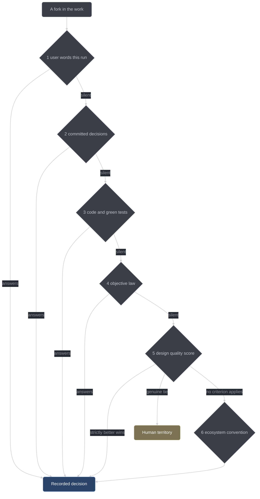

# Design constraints

The fourteen global constraints that bind every part of conductor, what each one prevents, and
what enforces it. This page is for anyone about to change the harness: it is the list of rules a
well-meaning change can quietly dismantle.

The constraints are stated in
[the plan's "Global constraints" section](../plans/2026-08-07-conductor-harness-plan.md). They are
not style preferences. Each one names a specific failure and pays for itself with a mechanism — a
test, a compiler flag, a script, or a structural fact about the code. Where a constraint has no
mechanism, that is said plainly below.

Conductor's own thesis (G9) is that an instruction nobody checks is not a rule, and that applies to
the harness's authors as much as to the model it drives. So each constraint below says what failure
it prevents, what bites when it is violated, and what breaks if the bite is removed.

| Id  | Constraint                                           | Enforced by                                                                                                                             |
| --- | ---------------------------------------------------- | --------------------------------------------------------------------------------------------------------------------------------------- |
| G1  | Zero runtime dependencies in the plugin              | [`conductor/package.json`](../../conductor/package.json) has no `dependencies` block; no build step                                     |
| G2  | Erasable TypeScript only                             | `erasableSyntaxOnly` in [`conductor/tsconfig.json`](../../conductor/tsconfig.json), checked by the M3 typecheck leg                     |
| G3  | Pure-core / thin-adapter                             | The purity guard, [`purity.test.ts`](../../conductor/tests/purity.test.ts) (`1.4-core-imports`, `1.4-core-forbidden`)                   |
| G4  | TDD for the harness itself, no exceptions            | [`test-conductor.sh`](../../scripts/test-conductor.sh) TAP rejection + [`conductor-gate.sh`](../../scripts/conductor-gate.sh) stub scan |
| G5  | Fail-closed on enforcement, fail-open on convenience | The guard in [`adapter/tools.ts`](../../conductor/adapter/tools.ts); tests `5.3-fail-closed` / `5.3-fail-open`                          |
| G6  | Records over assertions                              | Handlers re-derive their own evidence; [`single-source.test.ts`](../../conductor/tests/single-source.test.ts)                           |
| G7  | Detection over prevention, honestly documented       | Written-down bypass list; [`honest-limits-pending.md`](../build/honest-limits-pending.md)                                               |
| G8  | The orchestrator does not write code by default      | `edit: "ask"` plus the orchestrator branch of [`core/gates-edit.ts`](../../conductor/core/gates-edit.ts)                                |
| G9  | Local models are assumed weak at prose compliance    | Schemas, tools, and gates carry every obligation; handlers are the only state writers                                                   |
| G10 | Naming                                               | Tests hardcode the names (`5.3-tool-inventory`)                                                                                         |
| G11 | Wire contracts verified at build time                | `WIRE_CONTRACT_VERIFIED` stamps + [`wire-contract.test.ts`](../../conductor/tests/wire-contract.test.ts) against the installed binary   |
| G12 | Token cost accepted, wall-clock engineered           | The mandatory review lens set is not configurable                                                                                       |
| G13 | One model, many roles                                | Every sub-session resolves `config.models.default`                                                                                      |
| G14 | Dual-runtime adapters                                | The dual-runtime guard (`1.4-adapter-guard`, `1.4-subprocess`) + the Bun smoke leg                                                      |

## G1 — Zero runtime dependencies in the plugin

**The TypeScript layer uses only standard runtime built-ins plus the objects opencode hands the
plugin (`client`, `$`, `directory`, `worktree`); `@opencode-ai/plugin` is a dev dependency, and
the only value imported from it at runtime is the `tool()` registration helper, so no
third-party code sits in the plugin's decision path. There is no bundler and no build step —
opencode loads the `.ts` source directly.**

**Why.** The plugin is a security layer that has to be loadable in whatever workspace the user is
in. A runtime dependency means an install step travels with it, and a bundler means the artifact
opencode loads is not the file the tests ran against.

**Enforced by.** [`conductor/package.json`](../../conductor/package.json) declares only
`devDependencies` — `@opencode-ai/plugin` (pinned at 1.18.10), `@types/node`, and `typescript`.
There is no `dependencies` block to grow. The single runtime value import in
[`plugin/index.ts`](../../conductor/plugin/index.ts) is `tool()`, the custom-tool registration
helper the plan's §5.1 requires: its runtime value is `(input) => input` with `tool.schema`
exposing the package's bundled zod, so registering a tool executes no third-party logic, and the
`Plugin` / `PluginInput` names are type-only and erased. That G1-versus-§5.1 tension is the
plan's own; [`CORRECTIONS.md`](../build/CORRECTIONS.md) C-015 records it and task 5.3 resolved it
as stated here. The purity guard's `1.4-core-imports` assertion rejects
any non-relative import specifier under `conductor/core/`, and the dual-runtime guard rejects the
single-runtime module namespace under `conductor/adapter/` and `conductor/plugin/`. Beyond that,
G1 rides on the manifest and on the mandatory diff read in the per-task gate — no test asserts the
manifest itself stays empty.

**If violated.** The plugin stops being loadable from a bare checkout, and a build step reopens the
gap between the source under test and the code that actually gates tool calls.

G14 narrows G1: the shell `$` is one of the objects opencode hands the plugin, and G14 forbids
using it.

## G2 — Erasable TypeScript only

**No `enum`, no `const enum`, no `namespace`, no parameter properties; imports between our files
carry explicit `.ts` extensions.**

**Why.** Node's type stripping runs the same files under `node --test` that opencode's runtime
loads. Only erasable syntax survives both.

**Enforced by.** [`conductor/tsconfig.json`](../../conductor/tsconfig.json) sets
`"erasableSyntaxOnly": true` alongside `"allowImportingTsExtensions": true`, and
[`scripts/test-conductor.sh`](../../scripts/test-conductor.sh) runs `tsc -p conductor/tsconfig.json
--noEmit` as the M3 leg of the canonical gate, so a non-erasable construct fails the same command
that decides whether a task is green. The purity guard adds a second bite inside core: an import
that does not end in `.ts` is reported with a message that cites G2.

**If violated.** The type-stripping loader throws at import time. A whole test file disappears into
a load error, and the failure looks like a module resolution problem rather than a syntax rule.

## G3 — Pure-core / thin-adapter

**Every policy decision is a pure function `(parsedInput, stateSnapshot) → decision` in
[`conductor/core/`](../../conductor/core); core modules import only other core modules, and all I/O
lives in [`conductor/adapter/`](../../conductor/adapter).**

**Why.** This is what makes every gate deterministic and replay-testable. A gate decision that
reads the clock, the filesystem, or the network cannot be re-derived from a recorded input, so it
cannot be tested from a fixture and cannot be replayed from a journal.

**Enforced by.** [`conductor/tests/purity.test.ts`](../../conductor/tests/purity.test.ts), the
Task 1.4 purity guard, with two assertions:

| Assertion            | What it scans for                                                                                                                |
| -------------------- | -------------------------------------------------------------------------------------------------------------------------------- |
| `1.4-core-imports`   | Every import specifier under `conductor/core/` is relative (`./` or `../`), ends in `.ts`, and resolves inside `conductor/core/` |
| `1.4-core-forbidden` | No `node:fs`, `node:child_process`, `Bun`, `fetch(`, `process.env`, or `Date.now` token appears on any line of core              |

`Date.now` is on that list because core takes `nowMs` as an input; a core function that reads the
wall clock has a hidden argument. The scan does not strip comments — a commented-out forbidden call
is still a smell — and it assembles every token it searches for by string concatenation so the
guard can never flag its own source.

**If violated.** Gates become untestable in the only way that matters: you can no longer construct
the input that produces a deny and assert the deny. Enforcement degrades to integration testing
against a live opencode.

## G4 — TDD for the harness itself, no exceptions

**Every module lands only as: failing test written and observed to fail for the real reason →
minimal implementation → test observed to pass → commit. A module without an executing test does
not exist. No stubs, no TODOs, no placeholder bodies in committed code.**

**Why.** Conductor exists to force TDD on a model. A harness built without it would be measuring a
discipline it does not practice, and its own defects would be indistinguishable from the model's.

**Enforced by.** Two scripts, in layers:

- [`scripts/test-conductor.sh`](../../scripts/test-conductor.sh) parses the TAP trailer and fails
  unless `tests > 0`, `fail == 0`, `cancelled == 0`, `skipped == 0`, and `todo == 0`. It also greps
  every TAP point line for a `# SKIP` or `# TODO` directive at any subtest depth, because a skipped
  `describe` is invisible to the trailer counts. That closes the "turn a hard test into a skip"
  erosion route.
- [`scripts/conductor-gate.sh`](../../scripts/conductor-gate.sh) is the mechanical stub scan:
  `TODO|FIXME|XXX|not implemented|placeholder` and the bare word `stub` in production source, plus
  `test.skip` / `it.skip` / `describe.skip` / `.todo(`, trivially-true assertions, and empty catch
  blocks everywhere including tests.

The per-task gate then re-derives the red from the commit itself, so "the test was observed to
fail" is a reproduced fact. The same law applies to the C++ layer (doctest, through the
`router-tests` target) and to the Python wiring (`unittest`, stdlib-only).

**If violated.** The suite's pass count stops meaning anything, because a green run may contain
skipped tests, and committed code may contain bodies nothing exercises.

## G5 — Fail-closed on enforcement, fail-open on convenience

**A crash inside a gate while a git command or a file write is being judged must deny the action;
a crash inside an injector, logger, or metrics writer must never block work.**

**Why.** The two failure modes are not symmetric. A gate that crashes open silently ungates the
run; a logger that crashes closed stops a run for a bookkeeping bug.

**Enforced by.** [`adapter/tools.ts`](../../conductor/adapter/tools.ts) runs each pure core
decision inside a fail-closed guard, and computes the "is this call guarded?" flag once from the
real parse — so it stays reliable even when the decision function it feeds crashes. Both directions
are pinned in [`gate-wiring.test.ts`](../../conductor/tests/gate-wiring.test.ts):
`5.3-fail-closed` injects a `decideGit` crash while judging a git command and asserts the call
still throws; `5.3-fail-open` injects the identical crash while judging a harmless `ls` and asserts
the call is allowed. Either way, a `gate-crash` event is journaled.

The same asymmetry sets the layer boundary. llama-router is fail-soft by design: layer 2 dying
leaves layer 1 enforcing everything. The router never returns a status the direct path would not
have returned — its schema guard observes and records, it does not reject — and
`serve.py --no-router` running the identical process is a tested requirement, not an aspiration.

**If violated.** A gate that fails open produces exactly the outcome conductor cannot detect: a run
that looks gated, reports as gated, and was not.

## G6 — Records over assertions

**A claim counts only when a machine-checkable record exists and the harness itself produced or
re-derived the evidence. The model's say-so is never the record.**

**Why.** A ledger only the distrusted party writes, that nothing cross-checks, is process theater.
It is rejected at design time, not audited later.

**Enforced by.** Every `conductor_*` handler re-derives its own evidence before writing state — the
handler runs the verify command, not the model — and handlers are the only writers of run and item
state. Every record format in the plan names its writer, its reader, and the test that exercises
both. Where two components must agree on a vocabulary,
[`single-source.test.ts`](../../conductor/tests/single-source.test.ts) makes the agreement a
construction: it reads `RUN_STATES` and `ITEM_STATES` out of the FSM modules and the `state` enum
out of the exported `SCHEMAS` record at runtime, and fails if either pair drifts by a single
member. That enum is the array the validator actually checks persisted records against, so the
guard pins the vocabulary the system enforces, not a copy of it.

**If violated.** Records become claims again. The report says a review happened; nothing
distinguishes that from a model that said a review happened.

## G7 — Detection over prevention, honestly documented

**Gates fire on tool calls made through opencode; a human at a raw terminal is ungated, and every
known bypass is written down rather than papered over.**

**Why.** Conductor cannot be a sandbox. Claiming prevention it does not have would make its own
reports untrustworthy in exactly the way it exists to fix.

**Enforced by.** Documentation discipline plus the review process that feeds it. Bypasses found
during a phase gate are recorded as residuals in
[`honest-limits-pending.md`](../build/honest-limits-pending.md) and folded into the shipped
`HONEST-LIMITS.md`. The known ones include: a second plain `opencode` session in the same repo is
ungated and invisible; `node -e` and `python -c` bypass the write-shape extractor; verify trusts
the target repo's own test command, so vacuous tests get vacuous protection; and conductor cannot
detect its own absence — which is why the liveness beacon and the orchestrator's banner exist, and
why the first rule of operations is *no banner, no conductor*.

**If violated.** A bypass that is not written down is a bypass the reader assumes is closed. The
honest-limits list is what makes the rest of the claims credible.

## G8 — The orchestrator does not write code by default

**The primary agent's `edit` permission is `"ask"`, and the plugin rejects every ask not covered by
an active `conductor_inline_claim`; implementation happens in dispatched sub-sessions.**

**Why.** The orchestrator holds the whole run in context, which makes doing the work itself always
look cheaper than dispatching it. That instinct collapses the separation the item FSM depends on.

**Enforced by.** [`core/gates-edit.ts`](../../conductor/core/gates-edit.ts) denies every source
edit from a session whose role is `orchestrator` unless an active inline claim scopes the path,
with a deny message that names the escape and its price: *use `conductor_inline_claim` if dispatch
is genuinely more expensive than doing*. The claim changes who edits, never what is enforced — the
item FSM still applies in full, and the claim is scoped to one item's declared `fileScope`.

**If violated.** The planning context, the implementing context, and the reviewing context become
one context. Review lenses then review the session that wrote the code, which is the arrangement
the harness exists to break.

## G9 — Local models are assumed weak at prose compliance

**Every workflow obligation is a schema-constrained output, a tool the model must call, or a gate
that denies the wrong action — never only an instruction.**

**Why.** A ~27B local model follows a long prose contract intermittently. Instructions exist to
make the legal path obvious, not to carry enforcement.

**Enforced by.** The architecture, at three points. Phase legality is checked in
[`core/gates-phase.ts`](../../conductor/core/gates-phase.ts) before any handler acts, so an
out-of-order tool call is refused rather than discouraged. State transitions exist only inside
handlers, so there is no prose path to a state change. Structured outputs are checked against the
schemas exported from [`core/types.ts`](../../conductor/core/types.ts) — and because opencode
1.18.15 has no prompt-level `format: {type: "json_schema"}` field (a verified wire drift), that
output is prompt-shaped and *independently validated* by the fan-out engine with a bounded
re-prompt retry, rather than trusted because the prompt asked for it.

**If violated.** The process becomes advisory while the report still claims it was followed, which
is worse than no process — it produces a confident, false record.

## G10 — Naming

**The system is "conductor". Custom tools are `conductor_*`. Run state in a target workspace lives
under `.conductor/`, excluded via the target's `.git/info/exclude` and never by editing the
target's tracked `.gitignore`. Source lives under `conductor/` (TS), `src/router/` (C++), and
`scripts/` (wiring).**

**Why.** Names are load-bearing here. Tool ids appear in doctrine text, in phase-legality tables,
in the continuation re-prompt that names the exact next call, and in tests.

**Enforced by.** Tests hardcode them. `5.3-tool-inventory` in
[`gate-wiring.test.ts`](../../conductor/tests/gate-wiring.test.ts) asserts that
`CONDUCTOR_TOOL_NAMES` is exactly the 22-tool inventory and that the plugin's `tool` hook registers
exactly those names — a renamed or added tool fails the suite immediately. The `.gitignore` rule is
a matter of not dirtying a target repo's tracked files with the harness's presence; the exclude
file is per-clone and untracked.

**If violated.** A rename silently orphans the doctrine text that tells the model what to call, and
the run stalls with a model asking for a tool that no longer exists.

## G11 — Wire contracts are verified at build time, not assumed

**The opencode plugin API, SDK method shapes, config keys, and llama-server endpoints are
re-verified against the installed binaries before the code that depends on them is written, and the
verification is stamped in the file.**

**Why.** The plan's §5 was written against opencode 1.18.10. Two of its claims are outright false
at 1.18.15, and four further discoveries reshaped later tasks. Without re-verification, the
adapter would have been built on the false ones.

**Enforced by.** `WIRE_CONTRACT_VERIFIED: <date> <what>` comments at the top of every affected
file, and [`wire-contract.test.ts`](../../conductor/tests/wire-contract.test.ts), which starts
`opencode serve` headless against a throwaway fixture directory, stands up a fake
OpenAI-compatible server in place of llama-server, and asserts every row against *observed* binary
behavior rather than the hoped-for specification text. Findings live in
[`conductor/adapter/wire-notes.md`](../../conductor/adapter/wire-notes.md); the router's side is
the same discipline against llama-server's `/v1` contract, recorded in
[`src/router/UPSTREAM_CONTRACT.md`](../../src/router/UPSTREAM_CONTRACT.md). The rule that keeps
drift contained is: **any drift updates the adapter constants, never the core.** The two recorded
drifts are the missing prompt-level `format` field and the permission adjudication endpoint
(`POST /session/{id}/permissions/{permissionID}` with body `{response}`, not an SDK reply call).
The most consequential of the four discoveries is that `session.prompt` issues a *streaming*
provider request — which reshaped the router's schema observation into a request-side counter.

**If violated.** You build a subsystem against a documented API that does not exist, and find out
during integration, after everything depends on it.

## G12 — Token cost is accepted; wall-clock is engineered

**No gate or review stage may be weakened to save tokens. Wall-clock optimizations live in the
scheduler and llama-router, never in skipping process.**

**Why.** The POC exists to measure what mechanical process plus adversarial review buys, and what
it costs. A run that skipped a stage to save tokens measures a different system, and the number it
produces is not the number anyone wanted.

**Enforced by.** The review lens set is not configurable downward: the mandatory lenses —
spec/contract, correctness, guardrail, test-adequacy, minimality — are never truncated by
configuration or by trivial-mode compression. Session count is `clamp(itemReviewers, 3, 6)`, and
below six the lenses *merge pairwise from the tail* rather than being dropped, so a smaller budget
buys less depth per lens, never fewer subjects. Guardrails are intensity-independent. The
wall-clock levers are elsewhere: dependency-ready parallel waves in
[`core/schedule.ts`](../../conductor/core/schedule.ts), and admission control plus prefix affinity
in llama-router.

**If violated.** The measurement is gone, and with it the only reason the POC exists.

## G13 — One model, many roles

**Every sub-session and the orchestrator run the same served model (`config.models.default`,
`qwen3.6-27b`). Roles select doctrine pack, sampling temperature, priority tag, and gate posture —
never weights.**

**Why.** Two reasons, recorded in [`DECISIONS.md`](../../conductor/DECISIONS.md) entry (d).
Mechanically, role-tiered routing costs four to six weight reloads per item per review round under
`--models-max 1`. Scientifically, mixing model sizes confounds the quality delta the POC is trying
to measure with model size, which destroys the measurement.

**Enforced by.** The role table resolves everything except weights. The fan-out engine still groups
jobs by resolved model, so a future multi-model config is a config change rather than a redesign —
under the default config that grouping is the identity function. G13 is also a design filter: any
design that only pays off under multi-model routing is either inert by construction here or lives
in the stretch section.

**If violated.** Weight thrash on a 20 GB model, and a benchmark result that cannot separate
"process helped" from "we used a bigger model for the reviews".

## G14 — Dual-runtime adapters

**Adapter code runs under opencode's Bun runtime in production and under Node type-stripping in
tests, so adapters use only Node-compatible built-ins (`node:fs`, `node:child_process`,
`node:path`, `node:crypto`). The Bun-only shell `$` is never used; every subprocess goes through
`execFile` with `shell:false`.**

**Why.** The shell tag is the dangerous case: it works silently in production and cannot run in any
Node test at all. A divergence discovered at integration time, with thirty modules already built on
the adapters, is not a fixable divergence.

**Enforced by.** Two guards and one live leg.

| Mechanism                                                                       | What it checks                                                                                                                                       |
| ------------------------------------------------------------------------------- | ---------------------------------------------------------------------------------------------------------------------------------------------------- |
| `1.4-adapter-guard` in [`purity.test.ts`](../../conductor/tests/purity.test.ts) | No `Bun` token and no `$`-backtick shell tag anywhere under `adapter/` or `plugin/`, and no import targeting the single-runtime module namespace     |
| `1.4-subprocess` in the same file                                               | A subprocess-shaped call (`spawn`, `exec`, `execFile`, and their `Sync` forms) in `adapter/` or `plugin/` requires an import of `node:child_process` |
| The M9 Bun leg in [`test-conductor.sh`](../../scripts/test-conductor.sh)        | `bun test conductor/tests/bun-smoke.test.ts` must pass                                                                                               |

[`bun-smoke.test.ts`](../../conductor/tests/bun-smoke.test.ts) is a proof rather than a red: it
re-asserts already-built adapter behavior under the production runtime, covering the four things
that are genuinely runtime-observable — an atomic tmp+rename that survives an injected mid-commit
throw, the single-writer lock claim and its stale-break through the `process.kill(pid, 0)` liveness
probe, JSONL append ordering plus the torn-trailing-line heal, and one `execFile` round trip
through `gitio`.

**If violated.** An adapter that works in production and cannot be tested, or — worse — one that
passes every test and fails only under Bun, in the run that matters.

## The precedence ladder

Constraints say what may not change. The precedence ladder says how a fork that the constraints do
not settle gets decided, without a human in the loop. It is the §6.2 decision protocol, implemented
in [`core/decide.ts`](../../conductor/core/decide.ts) and injected as doctrine.

The rule is: **the first source that answers, decides.**

| Rung | Source                      | Example                                              |
| ---- | --------------------------- | ---------------------------------------------------- |
| 1    | The user's words this run   | "use the existing config file, do not add a new one" |
| 2    | Committed project decisions | ADRs, config, prior entries in `DECISIONS.md`        |
| 3    | Code + green tests          | The existing implementation already answers it       |
| 4    | Objective law               | Determinism, security, license, measurable budgets   |
| 5    | Objective design quality    | Scored on the five criteria below                    |
| 6    | Ecosystem convention        | Only when nothing above answers                      |

### The ladder-5 criteria

When the decision reaches rung 5, options are scored on five keys, and
[`scoreOptions`](../../conductor/core/decide.ts) sums them:

| Key                   | Question it asks                                            |
| --------------------- | ----------------------------------------------------------- |
| `capability`          | Is this option's capability a superset of the other's?      |
| `validationEarliness` | Which option validates earlier, and more mechanically?      |
| `testability`         | Which is easier to test, from a fixture, deterministically? |
| `singleSource`        | Which leaves one source of truth rather than two copies?    |
| `movingParts`         | Which has fewer moving parts for equal capability?          |

Two rules make this a decision procedure rather than a discussion. **A strictly better option wins
automatically** — the greatest total wins with no further deliberation. And **effort is never a
tiebreaker**: "the better design is more work" is not an argument against the better design, which
is why "still do it?" is on the never-ask list. A shared top total is a genuine tie, and
`scoreOptions` returns `{winner: null, tie: true}` for it; on a consequential choice, a genuine tie
is itself human territory.

### The two-option requirement

Every non-trivial fork records at least two real options, each scored.
[`requireTwoOptions`](../../conductor/core/decide.ts) is the rejection rule: a `kind: "derived"`
decision with fewer than two options, or with any option missing its score, is rejected with a
reason naming the unscored options. `kind: "human"` records are exempt from scoring — taste has no
objective score. The scores are the model's, but the *record* is mandatory, and the plan-review
minimality lens re-examines the consequential ones.

### Human territory and the never-ask list

Only five categories are legal asks:

- taste and aesthetics
- money and paid services
- irreversible, externally visible commitments
- secrets
- genuine ladder-5 ties on consequential choices

`isHumanTerritory(question)` in [`core/decide.ts`](../../conductor/core/decide.ts) is a
conservative keyword and shape classifier over exactly those categories; every derivable technical
question returns `false`. Misclassification fails toward surfacing — but only at run boundaries,
batched into the report or raised as surfaced questions. Mid-run interactive interruption is
reserved for the interactive session's explicit prompts (the user typing) and for `git.mode`
first-run setup.

Three questions are never asked:

| Never ask                                      | Because                                      |
| ---------------------------------------------- | -------------------------------------------- |
| "Shall I proceed?"                             | The prompt was the authorization             |
| Confirmation of a derivable answer             | Rungs 1–6 already answer it                  |
| "The better design is more work, still do it?" | Yes — ladder 5, effort is never a tiebreaker |

## The standing-decisions ledger

[`conductor/DECISIONS.md`](../../conductor/DECISIONS.md) is rung 2 made concrete. It holds the
decisions that are settled for the whole build, so that a later fork resolves at rung 2 instead of
being re-derived — differently — at rung 5.

Each entry has the same three parts:

1. **Decision** — what was settled, in the imperative, with the constraint or plan section it
   implements.
2. **Options** — at least two real options for any non-trivial fork, with the winner marked.
3. **Why the winner won** — the argument, made on the ladder-5 criteria.

Entries are **appended, never rewritten**. A superseded decision gets a later entry that supersedes
it; editing the old one would destroy the record of why the original choice looked right, which is
the part that is expensive to reconstruct.

| Entry | Decision                                                                                                    | Rejected alternative                                        |
| ----- | ----------------------------------------------------------------------------------------------------------- | ----------------------------------------------------------- |
| (a)   | The system is named "conductor"; tools are `conductor_*`; state lives under `.conductor/`                   | Improvising names per module                                |
| (b)   | Three-layer enforcement split: TS plugin (all gates) + C++ router (wall-clock, metrics) + `serve.py` wiring | A single plugin layer; pushing enforcement into the router  |
| (c)   | Gates hard-deny, with the budgeted `conductor_override` hatch                                               | An uncapped hatch; no hatch; a human-approved hatch         |
| (d)   | One model for every role (G13)                                                                              | Role-tiered routing; a two-tier judge/worker split          |
| (e)   | The stock `myprogram`/`src/main.cpp` target is replaced by the router targets                               | Keeping the stock example alongside                         |
| (f)   | Plugin tests run under Node type-stripping, with one Bun smoke test (G14)                                   | All-Bun tests; Node-only tests                              |
| (g)   | `.conductor/` excluded via `.git/info/exclude`; quarantine and worktrees live outside the repo              | In-repo placement with per-runner discovery exclusion flags |

Entry (g) is the clearest example of the ladder-5 criteria doing real work. `.git/info/exclude`
hides a directory from git and from nothing else, and every default verify runner (`node --test`,
`pytest`, `go test ./...`, `ctest`) discovers tests by walking the tree. The in-repo alternative
was rejected as per-runner and per-version fragile — *earlier, more mechanical validation* beat a
lattice of exclusion flags — and the claim was then measured rather than assumed; see
[`conductor/docs/RUNNER-DISCOVERY.md`](../../conductor/docs/RUNNER-DISCOVERY.md).

## Changing a constraint

The honest answer is that you mostly do not. The fourteen are load-bearing, and each one is
load-bearing for something specific that is written down above. Before proposing a change, find the
failure the constraint prevents and say what replaces the prevention.

The plan is **immutable**. It is never edited, and its checkboxes are never ticked — a spec you can
edit is a spec that quietly agrees with whatever was built. Progress lives in
[`docs/build/STATE.json`](../build/STATE.json), which is machine truth.

So a deviation is *recorded*, not merged into the specification. Three files carry it:

| File                                                   | Role                                                                                                                                                                                      |
| ------------------------------------------------------ | ----------------------------------------------------------------------------------------------------------------------------------------------------------------------------------------- |
| [`docs/build/CORRECTIONS.md`](../build/CORRECTIONS.md) | Append-only ledger. Each entry: the plan quote with line numbers, the observed reality with the exact command and output, the decision, the alternatives considered, and the blast radius |
| [`docs/build/HANDOFF.md`](../build/HANDOFF.md)         | The live summary a new session reads first — where the build is, what is next, and which deviations are currently in force                                                                |
| [`docs/build/STATE.json`](../build/STATE.json)         | Machine truth: per-task status, and `meta.orderingOverrides` for departures from the plan's task order                                                                                    |

### Worked examples

| Deviation                                            | Recorded as                               | What changed                                                                                                                                                                                                                                                           |
| ---------------------------------------------------- | ----------------------------------------- | ---------------------------------------------------------------------------------------------------------------------------------------------------------------------------------------------------------------------------------------------------------------------- |
| Progress tracking moved out of the plan's checkboxes | C-001                                     | The plan file became immutable; task status moved to `STATE.json`, because checkbox state dies under `git restore`, conflicts across workers, and makes the spec mutable                                                                                               |
| Bun installed at preflight                           | C-002                                     | Task 2.2 authorized skipping the Bun leg if Bun were absent; it was installed instead, so the G14 leg is active and §11 acceptance runs for real                                                                                                                       |
| The canonical test command                           | C-005                                     | `node --test` was wrapped in `scripts/test-conductor.sh` after the raw command was observed producing both a bogus red and a vacuous green                                                                                                                             |
| C++ source layout                                    | HANDOFF "C++ / src layout", user-directed | `src/tests/` replaces the plan's `src/router-tests/`, and `src/tools/` replaces a root `tools/`. The CMake *target* is still named `router-tests`, because that is the ctest name every gate row cites. The plan's §1.1 tree is stale on this point and stays unedited |
| Task ordering                                        | `STATE.json` `meta.orderingOverrides`     | `0.3 before 0.2`, `4.2 before 4.1`, `2.2 after 4.1`, and `12.1 split into 12.1-core + 12.1-G5`                                                                                                                                                                         |

The pattern in that list is the point. Every recorded deviation so far concerns layout, ordering,
tooling, or a defect a gate caught — none of them relaxes one of the fourteen. The closest any
comes is C-002, which *strengthened* G14 by converting an authorized skip into an active test leg.
That is what "load-bearing" means in practice: the constraints have absorbed thirty-one recorded
corrections without moving.

## See also

- [Architecture](architecture.md) — the three layers and how they fit together
- [Pure core and thin adapters](core-and-adapters.md) — G3 as a working code layout
- [Testing and verification](testing-and-verification.md) — the canonical gate and what it rejects
- [Gates](gates.md) — the gate stack G5 and G8 govern
- [Project status](project-status.md) — what is built, what is next, what is deferred
