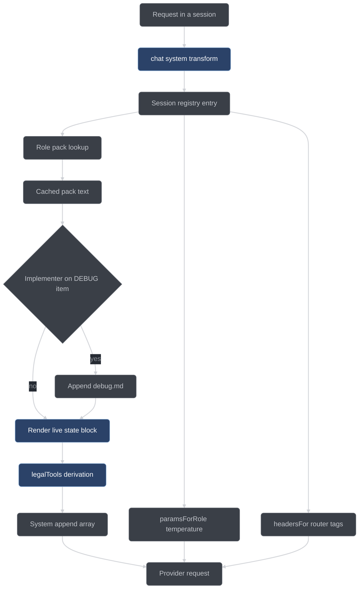

# The doctrine system

How conductor gets rules in front of the model: nine short packs in
[`conductor/doctrine/`](../../conductor/doctrine/), injected into every request by
[`adapter/inject.ts`](../../conductor/adapter/inject.ts). This page covers what is
injected, how, and what it takes to change it.

## Doctrine, not skills

Conductor inherits its working rules from two sources: a skill library (TDD,
systematic debugging, subagent-driven review, verification-before-completion) and a
minimality ruleset called ponytail. Neither is carried over in its original form,
because both are *opt-in*: the model is supposed to notice that a skill applies and
load it.

A local model self-activates an optional skill approximately never. That is the
observed failure the design starts from (plan §0.6), and it is the reason the skill
library is not shipped as skills. Instead each source skill is compiled into a short,
phase-scoped **doctrine pack**, and the plugin injects the pack into the system prompt
of exactly the session that needs it: the test-writer gets the TDD iron law, the
planner gets the ladder and the plan-writing rules, the debugger gets the four-phase
protocol. Nothing has to be activated, because nothing is optional.

Two consequences follow, and they are the whole design:

- **Compression is mandatory.** A pack distills its source skill's iron laws, gate
  functions, rationalization tables, and red-flag lists — it does not quote the skill
  wholesale. The ceiling is 120 lines per pack, pinned by test, because these packs ride
  in the system prompt of a 32k-context local model on every single request.
- **Every doctrine obligation that can be a gate is one** (constraint G9). Doctrine never
  carries enforcement on its own. `tdd.md` states the iron law, but RED before GREEN is
  enforced by the item FSM's transition order; `core.md` states the override budget, but
  `maxOverridesPerItem` is counted by the handler. The prose makes the legal path obvious;
  making the illegal path impossible is the gates' job. See [gates.md](gates.md) and
  [state-machines.md](state-machines.md).

Packs are also **client-agnostic**. No pack names opencode, Claude, or Cursor, and a
test asserts it over all nine files. Model-facing text describes the harness, not the
client that happens to host it.

## The port map

The mapping from each source skill to its enforcement point and its doctrine text is
normative (plan §6.1). Enforcement comes first; doctrine second. Some rows have no pack
at all, because the obligation is fully mechanical and prose would add nothing.

| Source                             | Enforcement (mechanical)                                                                                                                                                              | Doctrine (injected)                                                            |
| ---------------------------------- | ------------------------------------------------------------------------------------------------------------------------------------------------------------------------------------- | ------------------------------------------------------------------------------ |
| test-driven-development            | Item FSM order (RED before GREEN is structurally impossible to skip); handler-run red/green; `failureClass: "assertion"` legality; evidence ledger                                    | `tdd.md` — iron law, minimal-code rule, red-flag rationalizations table        |
| testing-anti-patterns              | TEST_VETTED critic lenses; test-adequacy review lens after implementation                                                                                                             | `test-vet.md` — the five anti-patterns as checkable questions                  |
| verification-before-completion     | Every FSM advance re-derives evidence in the handler; `conductor_report` re-runs the full verify itself                                                                               | `core.md` — evidence before claims, forbidden satisfaction phrases             |
| systematic-debugging               | DEBUG sub-state entered on validate failure; `debugFixCap` triggers a surfaced architecture escalation                                                                                | `debug.md` — four phases, one-hypothesis rule, 3-fix architecture question     |
| brainstorming                      | INTAKE classification plus skeptic check; decision records require ≥2 options with scores; human-territory classifier gates the ask                                                   | `core.md` decisions section plus the §6.2 protocol                             |
| writing-plans                      | Plan schema plus placeholder-scan lens in plan review; bite-size enforced by decomposition size checks                                                                                | `plan.md` — exact paths, complete code, no-placeholder patterns by name        |
| subagent-driven-development        | The executor loop *is* this skill: a fresh sub-session per item; spec-before-quality preserved as adjudication order; implementer status protocol including re-split escalation       | `review.md` ordering section                                                   |
| dispatching-parallel-agents        | Wave scheduler independence criteria (dependencies plus scope disjointness)                                                                                                           | `decompose.md` independence section                                            |
| requesting-code-review             | Reviewer lens prompts derive from the code-reviewer template (severity calibration, `file:line` specificity; an empty findings array *is* the approval verdict)                       | `review.md`                                                                    |
| receiving-code-review              | Surviving findings routed to the implementer with a verify-first protocol; pushback goes through one more skeptic round, never silent acceptance                                      | `receive-review.md` — no performative agreement, no gratitude, verify then fix |
| using-git-worktrees                | `adapter/worktrees.ts`                                                                                                                                                                | — (fully mechanical)                                                           |
| finishing-a-development-branch     | The `conductor_publish` and `conductor_report` handlers                                                                                                                               | — (fully mechanical)                                                           |
| executing-plans                    | Superseded by the run FSM itself                                                                                                                                                      | —                                                                              |
| using-superpowers / writing-skills | Obsolete by design: doctrine is always on by injection, so the "skills self-activate zero times" failure is designed out                                                              | —                                                                              |
| **ponytail**                       | Ladder rung plus reuse note required per item; minimality lens in plan review *and* item review; guardrail lens (security, validation, data loss, accessibility) exempt from laziness | `decompose.md` — the seven-rung ladder; `core.md` — lite reminder              |

The pack-less rows matter as much as the rest. Worktrees and branch-finishing are fully
mechanical, `executing-plans` disappears because the run FSM already sequences the work,
and the skills-about-skills row is obsolete because injection removes the problem those
skills existed to manage.

## The nine packs

The packs are the source of truth for their own content. This section says who receives
each one and what its one non-obvious rule is; read the pack itself for the rest.

### [`core.md`](../../conductor/doctrine/core.md)

Received by the orchestrator and the mechanical role, and the fallback for any session
whose role is unrecognized. It carries records-over-assertions, the forbidden completion
phrases (`should work`, `should pass`, `looks good`), the decision ladder, the ask policy,
the minimality reminder, and the override budget. Non-obvious rule: budget **exhaustion
is an `env` stop** — when `maxOverridesPerItem` or `maxOverridesPerRun` is spent, the next
attempt is not granted and is never converted into another override; the run halts. A gate
that needs overriding twice in one run is a defect in the system, and stopping keeps the
trail short enough for a human to read.

### [`decompose.md`](../../conductor/doctrine/decompose.md)

The planner's first pack. It sizes items (≤ ~5 files, one acceptance cluster, non-empty
edit scope), defines `fileScope` disjointness and the `dependsOn` DAG, states the
behavioral / non-behavioral path test, and carries ponytail's seven-rung ladder verbatim:
`skip` < `reuse` < `stdlib` < `platform` < `dependency` < `one-liner` < `minimal-code`.
Non-obvious rule: **prefer a new test file per item** — shared test files couple otherwise
independent items, and quarantine works at file granularity, so one item's quarantine
would take another item's coverage with it.

### [`plan.md`](../../conductor/doctrine/plan.md)

The planner's second pack. Three rules: exact repository-relative paths for every step,
bite-sized steps, and complete code for any step not mechanically obvious from its
description. Non-obvious rule: **"similar to task N" is a named defect**, alongside
to-be-determined steps and bare "add error handling". Cross-references hide exactly the
decisions a plan exists to fix, and they rot when the referenced step changes.

### [`tdd.md`](../../conductor/doctrine/tdd.md)

Received by the test-writer and the implementer. It carries the iron law —
`NO PRODUCTION CODE WITHOUT A FAILING TEST` — the red/green/commit cycle, the no-stubs
rule, and a table of seven rationalizations with their rebuttals. Non-obvious rule:
**delete means delete.** Production code written before its test is deleted, not kept "as
reference" and not adapted while the test is written, because adapting it is testing-after
and a test written after passes on the first run.

### [`test-vet.md`](../../conductor/doctrine/test-vet.md)

The reviewer's second pack, used when vetting a submitted test. Five anti-patterns:
testing mock behavior, test-only methods in production, mocking without understanding,
incomplete mocks, integration tests as an afterthought. Non-obvious rule: an **incomplete
mock** is a defect even when the test is green — a mock must mirror the complete structure
the real dependency returns, because downstream code reading a field the mock omitted
fails silently in the test and loudly in production.

### [`debug.md`](../../conductor/doctrine/debug.md)

Received by an implementer whose active item is in DEBUG posture. Four phases in order:
Root Cause Investigation, Pattern Analysis, Hypothesis and Testing, Implementation — one
falsifiable hypothesis at a time, tested with the smallest possible probe. Non-obvious
rule: the **3-fix rule.** After three fixes at the same failure site have each failed,
stop and question the architecture rather than attempt a fourth patch; three failed fixes
means the frame is wrong, not that the fourth guess is due.

### [`review.md`](../../conductor/doctrine/review.md)

The reviewer's primary pack. Severity triad (`major` / `minor` / `nit`), calibration
rules, `file:line` on every finding, one concern per finding, and the shape of a finding
a reader can verify; an empty findings list is a valid, complete review and *is* the
approval. Non-obvious rule: **spec before quality.** While any spec finding from a round
is still surviving, every quality finding raised in the same round is discarded rather
than carried forward — it was judged against code about to change — and re-derived after
the spec fixes land.

### [`skeptic.md`](../../conductor/doctrine/skeptic.md)

Received by the skeptic role. The job is to *refute* the finding in front of it: read the
exact lines cited, trace the path, demand specifics, and judge exactly one finding in
isolation. Non-obvious rule: **when uncertain, the verdict is refuted.** A finding
survives iff upholds reach ⌈k/2⌉ of `k` skeptics, and a tie upholds — so one agreeable
concession can carry a finding into a fix round, and the default has to lean the other way
for the panel to mean anything.

### [`receive-review.md`](../../conductor/doctrine/receive-review.md)

The pack for a session receiving surviving findings. Verify the claim against the code
before implementing it: a verified claim gets a minimal root-cause fix, a wrong claim gets
a refutation with evidence, an unclear claim gets a question. Performative agreement is
banned by phrase, starting with "You're absolutely right". Non-obvious rule: **never
weaken an assertion to make a finding disappear** — resolving a review comment by quietly
loosening the test is called out as the worst possible fix.

## Injection mechanics

[`adapter/inject.ts`](../../conductor/adapter/inject.ts) has four concerns behind one
seam.

**`buildSystemAppend(registryEntry, run, items, questions, packs, ctx)`** builds the body
of `experimental.chat.system.transform`. It returns
`[primaryPack, ...secondaryPacks, stateBlock]`: `append[0]` is the role's primary pack
**verbatim** from the cached map, and the last entry is always the live state block. The
role-to-pack table is fixed:

| Role           | Packs appended                   | Temperature | Priority tag  |
| -------------- | -------------------------------- | ----------- | ------------- |
| `orchestrator` | `core.md`                        | 0.4         | `interactive` |
| `planner`      | `decompose.md`, `plan.md`        | 0.7         | `interactive` |
| `testWriter`   | `tdd.md`                         | 0.5         | `review`      |
| `implementer`  | `tdd.md` (+ `debug.md` in DEBUG) | 0.4         | `review`      |
| `reviewer`     | `review.md`, `test-vet.md`       | 0.3         | `review`      |
| `skeptic`      | `skeptic.md`                     | 0.3         | `review`      |
| `mechanical`   | `core.md`                        | 0.1         | `batch`       |
| unknown        | `core.md` (fallback)             | 0.4         | `interactive` |

The DEBUG path is guarded tightly: the role must be `implementer`, the registry entry
must name an item, and that item must carry `debugging: true`. `tdd.md` stays `append[0]`
and `debug.md` is appended after it, never duplicated. If the primary pack is somehow
missing from the cache, an empty string is pushed so `append[0]` is always a string and
the state block is always last.

**`paramsForRole(role)`** returns the `chat.params` sampling settings — the temperature
column above, defaulting to 0.4 for an unrecognized role. The return type allows an
optional `topP`; the current table sets temperature only.

**`headersFor(registryEntry, job?)`** returns the router tags for `chat.headers`:

| Header                 | Value                                                                     |
| ---------------------- | ------------------------------------------------------------------------- |
| `X-Conductor-Role`     | the registry entry's role, verbatim                                       |
| `X-Conductor-Priority` | the priority column above (`interactive` when unknown)                    |
| `X-Conductor-Group`    | the session's `tree`, else its `itemId` — **omitted** when it has neither |
| `X-Conductor-Schema`   | `required`, only when the job flags structured output                     |

The group header is the prefix-affinity key: sessions sharing a worktree share a hot KV
prefix. A tree-less orchestrator has no natural group, so the header is left off entirely
and the router treats the request as ungrouped. See
[llama-router.md](llama-router.md).

**`loadPacks(doctrineDir)` and `initPlugin(deps)`** are the fail-closed init, and the only
functions in the file that touch the filesystem. `loadPacks` reads all nine required packs
by name and throws an error *naming the offending file* if any one is missing, unreadable,
or present but empty — a whitespace-only pack is absent doctrine, and it fails the same
way. `initPlugin({doctrineDir, logError, writeBeacon})` loads the packs first; only once
every pack is in hand does it write the liveness beacon and return the cached map. On
failure it routes the message to the injected `logError` seam (stderr, not a journal
event — the closed event vocabulary has no init event) and rethrows, and the beacon is
never written. That ordering makes the beacon's *absence* proof that init failed, which
matters because a plugin factory throw leaves opencode running completely ungated.

The three transform helpers are pure: no I/O, no clock, no randomness. Identical inputs
yield byte-identical output, which is what lets the state block be re-stated on every
request without drifting, and what makes injection replay-testable.

## The live state block

The state block is the last entry of the append array. It is re-stated on every request
and never remembered: the model is not expected to carry run state across turns, so the
block rebuilds it from the store each time. It contains, in order:

```text
Conductor live state — re-stated every request (§6.4), never remembered.
Run state: <run FSM state>
Active item: <itemId> (<item FSM state>)          # sub-sessions only
Recommended next tool: <tool> [on <itemId>]
Other legal tools available now: <n> (call conductor_status to enumerate them).
Open questions: <n>
Items blocked: <n> · deferred: <n>
Taint count: <n> · overrides remaining: <n>
```

The ceiling is **30 lines**, and it holds because the block *summarizes* rather than
enumerates. It names one recommended tool and, for a sub-session, its own active item —
never the full item list. Every other legal tool is folded into a count, deliberately:
a second named tool would read as a second instruction and contradict the
recommendation. A run with forty items produces the same size block as a run with two.

The recommendation itself comes from `legalTools(run, items, questions, repoConfigured)`
in [`core/gates-phase.ts`](../../conductor/core/gates-phase.ts) — the same single
derivation the phase gate and the continuation engine use, so injection can never
recommend a tool the gate would deny. When nothing is recommended, the block renders
`legalTools(...).why` verbatim rather than asserting terminality, because the derivation
already computed the authoritative reason (terminal run, stalled wave, non-work INTAKE).
An `itemId` in the registry entry that is not in the current item set is reported as
such rather than silently dropped.

Three values cannot be derived from the run, the items, or the questions, so they arrive
in a trailing `InjectCtx`:

| Field                | Meaning                                                                             |
| -------------------- | ----------------------------------------------------------------------------------- |
| `repoConfigured`     | forwarded to `legalTools`; an unconfigured repo recommends `conductor_setup`        |
| `taintCount`         | overrides recorded against this run so far — permanent, and headlined in the report |
| `overridesRemaining` | what is left of the budget, so the model can see the hatch closing                  |



## Ponytail intensity

`config.ponytail` in the per-repo `.conductor/config.json` (see the
[configuration reference](../user/configuration.md)) selects how hard the minimality
ladder is enforced. It changes handler behavior and prompt text, not which packs are
injected.

| Intensity        | What changes                                                                                                                                                                                                                    |
| ---------------- | ------------------------------------------------------------------------------------------------------------------------------------------------------------------------------------------------------------------------------- |
| `lite`           | The ladder rung and reuse note are recorded and advisory. The decomposition prompt says so explicitly, because telling the planner a rung "is rejected" when the handler does not reject it is a lie the model will learn from. |
| `full` (default) | The decomposition handler **rejects** any item claiming the `minimal-code` rung with an empty `reuse` note — you must show you looked. Minimality findings at plan review are `major` by default.                               |
| `ultra`          | Everything in `full`, plus the planner is instructed to challenge the requirements themselves and propose the smallest version that satisfies the request. Unrequested-abstraction findings block publish.                      |

Guardrails are **intensity-independent**. Security, input validation at trust boundaries,
data-loss handling, and accessibility are never candidates for a cheaper rung at any
setting. Both `decompose.md` and `plan.md` say so in their own words, the review
guardrail lens enforces it regardless of mode, and the guardrail and minimality lenses
sit in the mandatory review set that no configuration and no trivial-mode compression
removes.

## The decision protocol

`core.md` carries the model-facing half of the decision protocol; the mechanical half
lives in [`core/decide.ts`](../../conductor/core/decide.ts).

**The ladder.** The first source that answers decides:

1. The user's words this run.
2. Committed project decisions — config, prior ledger entries, recorded choices.
3. Code plus green tests.
4. Objective law — determinism, security, license, measurable budgets.
5. Objective design quality — capability superset, earlier and more mechanical
   validation, testability, single source of truth, fewer moving parts for equal
   capability. A strictly better option wins automatically, and **effort is never a
   tiebreaker**.
6. Ecosystem convention.

**Two options, always.** Every consequential fork records at least two real options
scored on the ladder-5 criteria. The scores are the model's; the record is mandatory,
and `requireTwoOptions` in `decide.ts` checks it.

**Human territory** is the closed list of legal asks: taste and aesthetics; money and
paid services; irreversible, externally visible commitments; secrets and credentials; a
genuine ladder-5 tie on a consequential choice. `isHumanTerritory(question)` is a
conservative keyword and shape classifier over that list, used by the ask-gate;
misclassification fails toward surfacing, and surfaced questions are batched at run
boundaries rather than fired mid-run.

**Never ask** "shall I proceed?" (the prompt was the authorization), never ask for
confirmation of an answer you can derive, and never ask "the better design is more work,
still do it?" — ladder 5 already answered that one.

## Anchor tests

[`conductor/tests/doctrine.test.ts`](../../conductor/tests/doctrine.test.ts) pins the
packs. It exists so a pack cannot be silently gutted: an editor trimming for length, or a
future rewrite, must either keep the load-bearing sentence or fail the gate.

A **pack anchor** is a required substring, matched after normalization — backticks
stripped, curly quotes folded to straight, lowercased — so a rewrite may reformat around
the words but not remove them. Short severity words are matched as whole tokens, so
`nit` is not satisfied by "unit". The TDD iron law is the exception: it is asserted raw
and case-sensitive, because the capitals are part of the doctrine. Pack files are read
relative to the test file, not the working directory.

| Test                          | What it pins                                                                                                                  |
| ----------------------------- | ----------------------------------------------------------------------------------------------------------------------------- |
| `8.1-files`                   | All nine packs exist, are non-empty, and are ≤ 120 lines                                                                      |
| `8.1-mechanism`               | `tdd.md` names its enforcing mechanism: "the handler runs the test", "your claim is not the record"                           |
| `8.1-anchors-tdd`             | `NO PRODUCTION CODE WITHOUT A FAILING TEST` verbatim, plus "delete means delete"                                              |
| `8.1-anchors-debug`           | The four phase names, "3 fixes", "question the architecture"                                                                  |
| `8.1-anchors-review`          | `major`, `minor`, `nit` as whole words, plus `file:line`                                                                      |
| `8.1-anchors-review-ordering` | "spec" and "quality", "surviving", "discarded" or "re-derived", "before"                                                      |
| `8.1-anchors-testvet`         | The five anti-pattern names                                                                                                   |
| `8.1-anchors-decompose`       | The seven rungs, `behavioral` / non-behavioral, `behavioralPaths`, `fileScope`, "disjoint", "prefer a new test file per item" |
| `8.1-anchors-core`            | `maxOverridesPerItem`, `maxOverridesPerRun`, "exhaustion", "env stop"                                                         |
| `8.1-anchors-core-forbidden`  | "should work", "should pass", "looks good", framed as a ban                                                                   |
| `8.1-anchors-core-ponytail`   | "cheaper", "reuse", "minimal" or "least"                                                                                      |
| `8.1-anchors-plan`            | Exact paths, complete code, "placeholder"                                                                                     |
| `8.1-anchors-skeptic`         | "refute", the ⌈k/2⌉ majority threshold, refuted-by-default                                                                    |
| `8.1-anchors-receive`         | "verify before implementing", the banned "You're absolutely right"                                                            |
| `8.1-no-todo`                 | No placeholder marker and no client name, over all nine files                                                                 |

The anchors are normative in the plan, and the test was written before any pack existed —
the nine packs were authored to satisfy it. Anchor coverage is itself reviewable: a pack
with no anchor row is a pack that can be rewritten into nothing without failing a test,
which is why every one of the nine has at least one.

## Writing a new pack

The checklist, in order:

1. **Stay under the ceiling.** 120 lines, enforced by `8.1-files`. If the pack does not
   fit, it is trying to be two packs or it is quoting its source instead of distilling it.
2. **Name the enforcing mechanism** for every behavior the pack calls enforced. A pack
   that says "the test must go red" without saying who runs the test invites the model to
   present its own claim as the record.
3. **Keep it client-agnostic and marker-free.** No `opencode`, `claude`, or `cursor`; no
   `TODO` or `TBD`. `8.1-no-todo` covers every pack, including yours, the moment you add
   it to the list.
4. **Decide which role receives it.** Either add the filename to that role's row in
   `ROLE_PACKS` in [`inject.ts`](../../conductor/adapter/inject.ts), or give it a
   conditional delivery signal like the DEBUG-posture path — a guarded condition in
   `buildSystemAppend` that appends the pack as a secondary entry while the primary pack
   stays at `append[0]`.
5. **Add it to `REQUIRED_PACKS`** so `loadPacks` fails closed over it at init. A pack the
   loader does not know about is a pack that can go missing without anyone noticing.
6. **Add its anchor test** to `doctrine.test.ts` — one `test()` naming the sentences that
   must survive an edit.
7. **Keep the gate green:** `bash scripts/test-conductor.sh`. See
   [testing-and-verification.md](testing-and-verification.md).

Steps 4 and 5 are separate on purpose, and `receive-review.md` is the worked example. It
sits in `REQUIRED_PACKS`, so init loads and caches it and a missing copy is a startup
error — but it appears in no `ROLE_PACKS` row, because no role receives it on every
request. Its delivery is the conditional kind: the fix-round routing that sends surviving
findings to an implementer or test-writer threads a "receiving-review" signal into
`buildSystemAppend`, which appends the pack as a secondary entry exactly the way the DEBUG
posture appends `debug.md`. A loaded pack is not a delivered pack — loading is fail-closed
and cheap to verify, delivery is a deliberate choice about which sessions need the rules.

## See also

- [gates.md](gates.md) — where doctrine obligations become mechanical denials
- [state-machines.md](state-machines.md) — the FSM order that makes `tdd.md`'s iron law structural
- [scheduling-and-fanout.md](scheduling-and-fanout.md) — the roles the packs are addressed to
- [opencode-integration.md](opencode-integration.md) — the `chat.system.transform`, `chat.params`, and `chat.headers` hooks
- [extending.md](extending.md) — adding tools, gates, and packs to the harness
