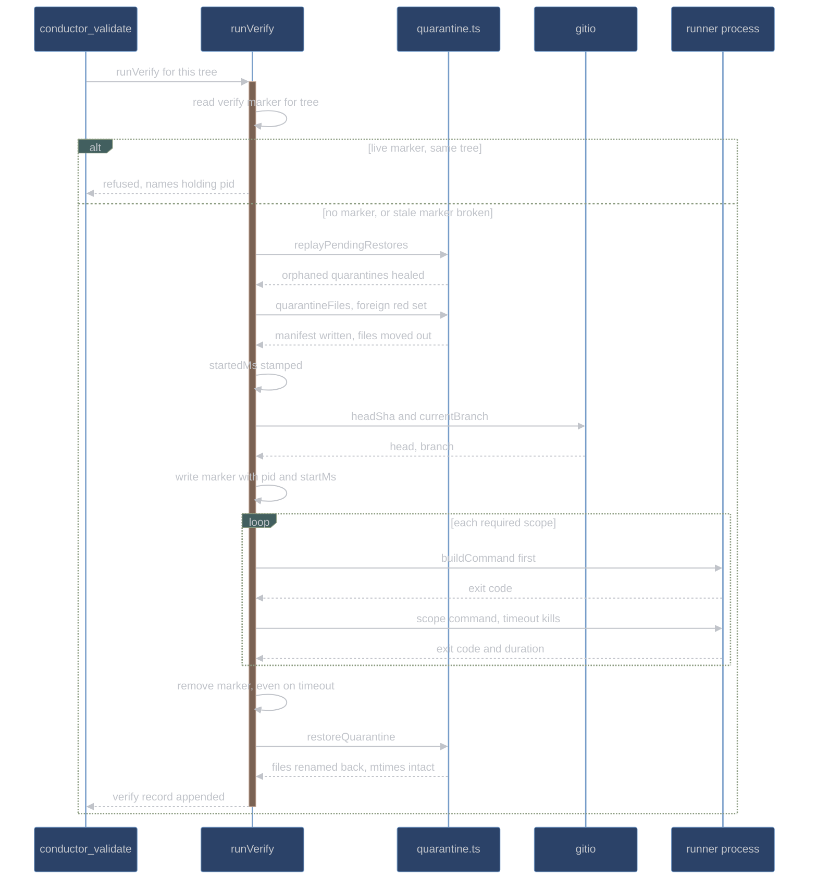

# Evidence and quarantine

How conductor turns "the tests pass" from a claim into a record: what the evidence engine
runs, what it writes, how a failure is classified, and how the foreign red set is moved out
of the repository for the duration of a verify. For contributors working on
[`adapter/evidence.ts`](../../conductor/adapter/evidence.ts),
[`adapter/quarantine.ts`](../../conductor/adapter/quarantine.ts), and
[`core/freshness.ts`](../../conductor/core/freshness.ts).

## Records over assertions, made concrete

An item advances because a handler ran a command and wrote down what happened, not because a model
said the tests pass — and the engine that runs the command is the only component allowed to write
the result down. [`adapter/evidence.ts`](../../conductor/adapter/evidence.ts) is **the** evidence
writer, and the sole legitimate importer of `appendLedgerLineRaw`, the raw one-record-per-line
appender defined in [`adapter/state.ts`](../../conductor/adapter/state.ts). Every other component
reads `runs/<runId>/evidence.jsonl` through the state store; none of them appends to it. That is
not a convention — `conductor/tests/state.test.ts` carries a source-scan test
(`[4.1-evidence-append]`) that reads every `.ts` file in `conductor/adapter/` and fails if any file
other than `state.ts` and `evidence.ts` names the export.

Three record kinds exist. The ledger's merged JSON Schema requires only the four shared fields
(`seq`, `ts`, `kind`, `itemId`); each kind's real contract is enforced by
`validateEvidenceRecord`, which runs the merged schema *and* the per-kind required fields before
anything is appended:

| Kind     | Written by                   | Required beyond the shared four                                      |
| -------- | ---------------------------- | -------------------------------------------------------------------- |
| `red`    | `runTest` on a non-zero exit | `command`, `exitCode`, `failureExcerpt`, `failureClass`, `targeted`  |
| `green`  | `runTest` on exit 0          | `command`, `exitCode`                                                |
| `verify` | `runVerify`                  | `startedMs`, `head`, `branch`, `tree`, `excluded`, `green`, `scopes` |

The split matters most for `verify`: a record missing `startedMs` or `head` passes the merged
schema and would then be read as fresh forever. `appendEvidence` throws rather than append an
invalid record, so an incomplete verify never reaches the ledger.

Sequence numbers come from `nextSeq` — the highest `seq` already in the ledger plus one, where an
unparseable line cannot advance the counter. Every append is mirrored into the journal under the
component `evidence` with the record kind as the event.

## runTest versus runVerify

`runTest` answers "does this item's test behave the way the item claims"; `runVerify` answers
"is the whole tree still green at this commit".

|                        | `runTest`                                                                                                                    | `runVerify`                                                                              |
| ---------------------- | ---------------------------------------------------------------------------------------------------------------------------- | ---------------------------------------------------------------------------------------- |
| Record kind            | `red` or `green`                                                                                                             | `verify`                                                                                 |
| Command                | the scope's `itemTest` template, substituted; the full scope command when there is no template                               | every scope `requiredScopes` selects for the changed path                                |
| Callers                | `conductor_submit_test` (the RED), `conductor_mark_green` (the GREEN)                                                        | `conductor_validate`, publish's automatic re-verify, `conductor_report`'s closing verify |
| Quarantine             | only on the fallback path, and only when the caller supplies `excludeTestFiles` plus `stateHome`, `workspaceKey` and `runId` | always, whenever the foreign red set is non-empty                                        |
| Verify marker          | none                                                                                                                         | written per tree, removed on completion                                                  |
| Freshness stamp        | none                                                                                                                         | `startedMs`, `head`, `branch`                                                            |
| Failure classification | yes, against the item's `fileScope`                                                                                          | no — a scope is green or it is not                                                       |

Both share the subprocess layer. Commands are argv arrays spawned with `shell:false`; there is
no shell to quote against. `childEnv` scrubs the inherited environment before every spawn:

| Variable                                                               | Why                                                                                                                                                                                    |
| ---------------------------------------------------------------------- | -------------------------------------------------------------------------------------------------------------------------------------------------------------------------------------- |
| `NODE_TEST_CONTEXT` removed                                            | Node marks the children its test runner forks. Inherited, a `node --test` verify command mistakes itself for a test child, misreports counts, and can mask a failing import as a pass. |
| `GIT_DIR`, `GIT_WORK_TREE`, `GIT_INDEX_FILE`, `GIT_COMMON_DIR` removed | They point the target repo's own test and build git reads at the parent conductor's checkout — a cross-repo leak.                                                                      |
| `GIT_OPTIONAL_LOCKS=0` set                                             | A child `git status` never writes an `index.lock` into the target tree.                                                                                                                |

Timeouts kill with `SIGKILL`, not the default `SIGTERM`: a hung test that installs a `SIGTERM`
handler could catch a trappable timeout signal and exit 0, which reads as a false green. A
non-numeric exit status — killed, or a spawn failure — is recorded as exit code `124`, which is
non-zero and therefore red. `buildCommand` is optional per scope and runs first; if the build
fails, the scope is red with the build's exit code and **the test command is not run at all**,
because a test executed against a stale artifact is a false green.

## Targeted tests

Running the whole suite to check one item's test is slow and noisy, so each verify scope may carry
an `itemTest` template — an argv array with placeholders that `substituteItemTest` expands against
the item's `testScope` files.

```jsonc
"unit": { "command": ["node", "--test"], "timeoutMs": 600000,
          "itemTest": ["node", "--test", "{files}"] }
```

| Token     | Expands to                                                                                                         | Detection default that uses it          |
| --------- | ------------------------------------------------------------------------------------------------------------------ | --------------------------------------- |
| `{files}` | each `testScope` file as its own argv entry                                                                        | `node --test {files}`, `pytest {files}` |
| `{dirs}`  | the unique parent directories of the `testScope` files, each in `./dir` form, each its own argv entry              | `go test {dirs}`                        |
| `{name}`  | an alternation regex over the basenames with extensions stripped, substituted into the argv token that contains it | `ctest -R {name}`                       |

`{dirs}` exists for go specifically. `go test -run` matches *test function names*, not file
basenames, so a `-run` built from file names matches nothing and exits 0 — a lie that looks
exactly like a pass. Package-directory targeting is the only form that narrows a go run honestly,
hence `./dir`.

`{name}` is valid only where the runner's registered test names actually contain the file
basenames. The ctest default assumes the file-named-test convention; a project whose ctest names
do not follow it should not use `{name}`.

```text
testScope = ["tests/parser_test.go", "tests/lexer_test.go"]

{files} -> tests/parser_test.go  tests/lexer_test.go
{dirs}  -> ./tests
{name}  -> parser_test|lexer_test
```

### The fallback, and the illegal-red rule

With no template — or when the zero-test guard fires — `runTest` runs the full scope command and
marks the record `targeted: false`. A full-scope run is a much weaker witness: any failure
anywhere in the suite produces a non-zero exit, so an unrelated breakage would otherwise be
recorded as this item's red.

Two things close that. The full-scope fallback runs **under the quarantine** (see below), and the
resulting red is legal only if the bounded failure excerpt names a file in the item's `testScope`.
`excerptNamesTestFile` reads only the ≤300-character excerpt the record actually carries, never the
full captured output, and matches the **full relative path**, never the basename — so neither a
deep tail mention of the item's file nor a same-named file in another directory can launder an
illegal red. The combined rule, as `runTest` computes it:

```ts
const legalRed =
  failureClass !== null &&
  isLegalClass(failureClass) &&
  (targeted || namesTestScopeFile);
```

### The zero-test guard

A targeted run that executed no tests is neither a legal red nor a pass. A `-R` pattern matching
no registered test, a `{files}` list the runner does not recognize, or a glob resolving to
nothing all exit 0 while proving nothing. Each runner profile therefore carries
`zeroTestPatterns`, matched against the combined stdout and stderr of a targeted run:

| Runner   | Zero-test patterns                                                                 |
| -------- | ---------------------------------------------------------------------------------- |
| `node`   | `# tests 0`, `tests 0\b`, `no tests to run`, `No tests were found`, `no tests ran` |
| `pytest` | `no tests ran`, `collected 0 items`                                                |
| `go`     | `no test files`, `no tests to run`                                                 |
| `ctest`  | `No tests were found`, `No tests to run`, `Total Tests: 0`                         |

When one matches, the run is discarded, `ranZeroTests` and `fellBack` are set, `targeted` drops to
`false`, and the full scope command runs under quarantine with the excerpt rule in force. The guard
is evaluated only after a successful build — a failed build already stands as the scope's outcome.

`runTest` returns the whole story alongside the record: `targeted`, `fellBack`, `ranZeroTests`,
`buildFailed`, `namesTestScopeFile`, and `legalRed`. The calling handler decides what to do with an
illegal red; the engine only reports.

## Failure classification

[`core/freshness.ts`](../../conductor/core/freshness.ts) owns `classifyFailure`, a pure function
over a closed three-value vocabulary. The per-runner extraction rules arrive as *data* — regex
sources, never functions — so the classifier stays a truth table rather than a regex someone
tweaks inside an adapter.

| Class             | Means                                                                                                                                     | Legal red? |
| ----------------- | ----------------------------------------------------------------------------------------------------------------------------------------- | ---------- |
| `assertion`       | the test ran, evaluated the behavior, and the behavior was wrong                                                                          | yes        |
| `missing-subject` | the run could not resolve a module or symbol, and **every** unresolved specifier resolves inside this item's declared `fileScope`         | yes        |
| `error`           | anything else: a syntax error in the test, an unresolved import pointing outside the `fileScope`, a collection or build failure elsewhere | no         |

The resolution order is fixed. Unresolved specifiers are extracted first, using the runner's
`unresolvedPatterns` and their capture group 1 — output naming an unresolved module is never a
plain assertion run, whatever else it contains. If any were found, each is normalized and tested
against the item's `fileScope` globs: all in scope gives `missing-subject`, a single one out of
scope gives `error`. Only if none were found do the `assertionPatterns` run, and anything that
matches neither is `error`, the conservative default.

`missing-subject` is what makes greenfield TDD possible. The first failing test of a new module
cannot assert-fail; it fails to import a file that does not exist yet. The test-writer is
scope-confined to `testScope` and so cannot create that file, so classifying the import failure as
illegal would kill the item after its test-repair attempts. It is not a loophole because the
unresolved thing must be *the subject this item is contracted to build*: a test that fails to
import `lodash`, or a module belonging to another item, stays `error`.

Specifier normalization does the scope arithmetic. Leading `./` and `../` carry no scope
information — a relative specifier resolves from the test file toward the tree — and are dropped;
interior `..` segments resolve against their predecessor; a `..` with nothing left to consume
survives as a leading `..`, which matches no in-repo `fileScope` glob and so classifies as `error`
rather than sneaking past a `**`. pytest sets `dotsAsSeparators`, so `slugger.core` is checked as
`slugger/core`.

Per-runner rules, selected by `detectRunner` from the argv actually run — `go test`, `ctest`,
`pytest` or `python… pytest`, `node…` or any command containing `--test`, with the node profile
as the conservative fallback:

| Runner   | Unresolved specifier                                                                | Assertion                                   |
| -------- | ----------------------------------------------------------------------------------- | ------------------------------------------- |
| `node`   | `Cannot find module '…'`, `Cannot find package '…'`                                 | `AssertionError`, `ERR_ASSERTION`           |
| `pytest` | `ModuleNotFoundError: No module named '…'`, `ImportError: cannot import name '…'`   | `AssertionError`, `^E\s+assert`             |
| `go`     | `cannot find package "…"`, `no required module provides package …`, `undefined: …`  | `--- FAIL:`, `FAIL`                         |
| `ctest`  | `Cannot find test executable …`, `Could NOT find …`, `Unable to find executable: …` | `***Failed`, `Failed`, `Assertion … failed` |

The class is decided by output shape alone. Exit codes are recorded but never consulted for
classification, because runners disagree about them — pytest exits 2 for a collection error.

### The ESM absolute-path relativization

One detail in the adapter is load-bearing for the whole `missing-subject` path. Real Node emits an
**absolute** path in a module-not-found message — and it is the *realpath*, which on macOS differs
from the cwd the command was spawned in, because `os.tmpdir()` is a `/var` symlink while the
loader reports `/private/var`. A `fileScope` glob is repo-relative, so an absolute specifier
matches nothing, an in-scope missing module classifies as `error`, and a legal greenfield red dies.

`relativizePaths` therefore strips both the cwd and its realpath from the captured output before
`classifyFailure` sees it, **longest prefix first**: the `/var` spelling is a substring of the
`/private/var` spelling, so removing the shorter one first would corrupt the longer path
(`…/private/var/…/src` becoming `/privatesrc`) instead of relativizing it. The `realpathSync` call
is wrapped, so a cwd that no longer resolves relativizes against its literal spelling rather than
throwing a legal classification away.

## The freshness rule

A verify record proves something about a tree at a moment. `verifyFreshFor` decides whether that
moment still describes the tree in front of you. It is pure — every mtime, HEAD, and timestamp
arrives as an input, gathered by the impure caller.

A record is fresh **iff both** hold:

1. `startedMs >= max(worktree mtimes of the staged behavioral files that exist, index mtime when
   any staged behavioral entry is a deletion or rename)`. Equality counts as fresh — an edit
   stamped at the start instant was visible to the verify.
2. `record.head === currentHead`.

The start stamp is taken **after** the quarantine is established and **before** the first scope
runs, and both halves matter. Stamping after the quarantine puts the quarantine's own moves inside
the verified window rather than making them look like edits that landed afterward. Stamping before
the first scope makes any edit that lands while the suite is running provably later than the
stamp, and so voids the record: an edit after the run started was never verified.

The index mtime term exists for staged deletions and renames. A staged deletion leaves no worktree
file to carry an mtime, so condition 1 would have no reference term and would hold vacuously — a
staged removal of a behavioral file could ride an older green. The index is what changed, so the
index's mtime is the reference, consulted only when a staged behavioral entry is a deletion or
rename.

The HEAD term exists because a checkout can move the tree without touching any staged file's
mtime. `git switch` between validate and publish changes what the working tree contains while
condition 1 still passes, and the record then silently describes a different tree. In no-git mode
there is no repository to have a HEAD, so condition 2 is skipped entirely.

Freshness is a proof that no edit landed after the verify, so it fails safe. A non-finite timestamp
anywhere in the inputs would make the numeric comparison false — `Math.max(…NaN)` is `NaN`, and
every `< NaN` is false — and a stale record would read fresh. Any non-finite input is therefore
treated as stale up front, with the index term checked only when it applies. The reader of the rule
is `conductor_publish`; the writer of the records is `evidence.ts`.

## The shape of a validate

The order of operations inside `runVerify` is the correctness argument, not an implementation
detail: marker check before anything else, quarantine before the stamp, stamp before the first
scope, cleanup in a `finally` so a timeout cannot strand the tree.



## The foreign red set

A deliberately-red test that does not belong to the item being verified must not poison that
item's verify. Before start-stamping, the engine quarantines:

> the `testScope` files of every **other** queue item below GREEN, unioned with every path in
> the workspace stale-red registry.

The item's own tests are never excluded — the whole point of the verify is that they pass. The
registry half is `.conductor/state/stale-red.json`, a workspace-level file that survives runs: a
blocked item leaves a deliberately-red test file behind, the next prompt creates a run whose queue
knows nothing about it, and without the registry that file would fail every subsequent verify in
the workspace. Entries leave when the file is deleted, when a later run drives the test green, or
through `conductor_forget_stale`.

The same set is applied by `runVerify`, by `runTest`'s no-template fallback, by publish's automatic
re-verify, and by `conductor_report`'s closing verify. It is recorded verbatim on the verify
record's `excluded` field, so a reader sees exactly what was not running.

Paths are validated before anything moves: `assertSafeRelPath` rejects an absolute path or any
`..` segment, before the quarantine directory is even created, so a poisoned exclude entry can
never move a file from outside the repository or restore one to an arbitrary location.

**Quarantine granularity is the file, and that is a real limitation.** When an item's
`testScope` names a file that already exists and holds *other* tests, quarantining it removes
that coverage from the verify — a narrow but genuine false-green risk. The answer is disclosure,
not silence: the handler journals every quarantined path with its test count where the runner
reports one, and every report lists the exclusions that were in force. Decomposition doctrine
(`decompose.md`) instructs a new test file per item, which makes the case rare rather than
merely undisclosed.

## Why quarantine is outside the repository

Quarantined files move to `<stateHome>/conductor/<workspaceKey>/quarantine/<runId>/`, which is
never inside the target repository. The obvious cheaper design — park them under `.conductor/`
— does not work, and the reason is worth stating plainly: **`.git/info/exclude` hides a
directory from git and from nothing else.** The verify command is the target repo's own test
command, and every default this design ships walks the tree. Moving a failing test from one
collected path to another collected path changes nothing.

That argument was measured, not assumed.
[`conductor/docs/RUNNER-DISCOVERY.md`](../../conductor/docs/RUNNER-DISCOVERY.md) records the probe:
for each supported runner, a deliberately failing test was placed (a) in an in-repo
`.conductor/runs/x/quarantine/` dot-directory, (b) at the out-of-repo quarantine path, and (c) in a
`git worktree` created inside the fixture repo, and the whole-tree command was run each time.

| Runner                   | (a) in-repo dot-directory | (b) out-of-repo path | (c) worktree inside the repo                                                                                                               |
| ------------------------ | ------------------------- | -------------------- | ------------------------------------------------------------------------------------------------------------------------------------------ |
| `node --test` v26.7.0    | not collected             | not collected        | **collected** — executed the worktree's failing test, run went red                                                                         |
| `pytest` 8.4.2           | not collected             | not collected        | **collected** — duplicate basenames interrupted the whole session at exit 2; with unique basenames it executed the worktree's failing test |
| `go test ./...` go1.26.5 | not collected by `./...`  | not collected        | not collected — the worktree's committed `go.mod` makes it a nested module                                                                 |
| `ctest` 4.4.2            | not collected             | not collected        | not collected — build-directory registration ignores the worktree's `CMakeLists.txt`                                                       |

The dot-directory column is the one that looks reassuring and is not. Every runner skipped it under
its default whole-tree pattern, and every runner *executed* the same file when it was named
explicitly: `node --test .conductor/…/fail.test.js` failed it, `pytest` on the explicit path
collected and failed it, and `go test ./.conductor/runs/x/quarantine/` compiled and failed it — the
dot-directory is still inside the go module. Any targeted `itemTest` template, config override, or
tool that expands explicit paths reaches an in-repo quarantined file. Whole-tree non-collection
there is a property of each runner's current default glob rules, not a guarantee.

The out-of-repo location was the only placement no runner reached in any probe: four runners, zero
collections, outside every glob, module, rootdir, and registration boundary by construction.

The worktree column is the same argument with more force, and it is why worktree mode also puts its
trees outside the repository: a worktree is a complete second copy of every test file in the
project, and two of the four runners walked straight into it.

## Crash safety

A verify can be killed at any instant — a timeout, a signal, a crashed editor session. The
quarantine is built so that a kill leaves the repository recoverable rather than missing its tests.

**The manifest is written before any file moves.** `quarantineFiles` computes every entry, writes
`manifest.json` atomically into the quarantine directory, and only then starts moving. A crash at
any point therefore leaves a manifest that names every planned move, including moves that had not
happened yet — replaying a move that never occurred is a no-op, while a move with no record would
be a lost file.

| Manifest field                | Purpose                                                                                            |
| ----------------------------- | -------------------------------------------------------------------------------------------------- |
| `version`, `runId`, `startMs` | format, provenance, and the owning run's start                                                     |
| `repoRoot`                    | the root to restore into — read from the manifest, because recovery may run in a different process |
| `quarantineDir`               | where the stored files actually are                                                                |
| `pid`                         | the owning run, so replay can tell a live verify from a crashed orphan                             |
| `entries[]`                   | `{original, stored, restored}` per file                                                            |

**Files are renamed, not copied.** `renameSync` is atomic and mtime-preserving on one filesystem,
and mtime preservation is not cosmetic: freshness condition 1 compares the start stamp against
worktree mtimes, so a copy would restamp every quarantined file and invalidate freshness on every
verify. The quarantine directory lives under `$stateHome` while the repo may be a different mount,
so `moveFilePreservingMtime` catches `EXDEV` — and only `EXDEV` — and falls back to stat, copy,
`utimesSync` with the original's times, unlink.

**Replay heals what a crash left.** `replayPendingRestores` runs at the top of every `runVerify`,
before this run establishes its own quarantine. It scans every `<runId>` directory under
`<stateHome>/conductor/<workspaceKey>/quarantine/`, reads each manifest, and restores every entry
not yet marked restored, using the manifest's own `repoRoot` and `quarantineDir`. Its skip rules
are the interesting part:

- A manifest whose `pid` is **alive** is skipped entirely — a live owner is an in-flight verify,
  not a crashed orphan, and stealing its files back mid-verify would corrupt a running verify.
- A manifest whose `repoRoot` no longer exists as a directory is skipped; the checkout is gone and
  replay never recreates it.
- If the repo slot has been **refilled** since the crash, the entry is not restored and is recorded
  as a conflict: the stored file stays parked and the quarantine directory is preserved rather than
  cleared, so nothing is lost and nothing is clobbered.
- An `ENOENT` on the stored file mid-restore means a peer already restored it — mark it restored
  and continue.
- Every directory is healed inside its own `try`, with errors swallowed per entry, so one bad
  manifest never aborts the sweep and replay never throws out of `runVerify`.

Marker healing follows the same shape. A `verify-running-<tree>.json` left behind by a killed run
is broken and the verify proceeds, with the broken marker surfaced on the outcome as
`staleMarkerBroken`. A marker is honored only when its pid is alive **and** it is not over-age
(default 24 hours, injectable), because a recycled pid on an ancient marker would otherwise wedge a
tree's verify forever.

Two smaller guards round it out. Stored names are the repo-relative path flattened with `__`, with
a numeric suffix when two paths collide, so nested paths need no directory tree rebuilt under the
quarantine. And a failure part-way through the moves restores everything already moved and removes
the quarantine directory before re-raising, so a failed quarantine never propagates with half the
foreign red set stranded outside the tree.

## Verify markers and the freeze

While a verify runs, the tree it is judging must not change. The mechanism is a marker file per
tree, written inside the run directory:

```json
{ "pid": 4711, "startMs": 1754560300000 }
```

The filename is `verify-running-<tree>.json`, where `tree` is `main` or the item id of a worktree.
Because the tree key composes a filename that is later removed, it is validated as a conservative
slug before use — a traversing key would otherwise write and delete outside the run directory.

*Worktree mode itself is built in task 9.6; markers, `cwd` arguments, and freeze are per-tree from
day one so that the mode drops in without changing this machinery.*

The marker does three jobs.

**It denies a second concurrent validate in one tree.** `runVerify` reads the marker first, and a
live same-tree holder means it returns a refusal naming the holding pid, runs nothing, and never
steals the marker. Two verifies in one tree produce two records that each describe a tree the other
was mutating; neither is evidence.

**It freezes edits.** While a marker is live for a tree, the edit-scope gate denies **every** edit
in that tree — production files, test files, config, all of it. The strict reading is normative and
it is exactly what the quarantine safety argument needs: a foreign test file cannot be written while
it is moved aside, so the move cannot race a writer. Freeze is per tree, so a worktree implementer
is never frozen by another tree's validate.

**It shapes scheduling.** The fan-out engine must not dispatch a write-capable sub-session — an
implementer or a test-writer — into a tree with a live marker; it holds the job until the marker
clears. The gate denial is the backstop, not the mechanism: a sub-session that works for two
minutes and then takes an exception on its first write has burned a dispatch and an attempt counter
for nothing.

Marker removal sits in its own `finally` around the scope loop, so it happens even when a scope
times out, and the quarantine restore sits in the outer `finally`, so the foreign red set comes
back whether the verify finished, failed, or threw.

## See also

- [State machines](state-machines.md) — where RED, GREEN, and VALIDATED sit in the item FSM
- [Gates](gates.md) — the edit-scope gate and the freeze it enforces
- [Scheduling and fan-out](scheduling-and-fanout.md) — waves, the freeze-aware dispatcher, and worktree mode
- [Schemas](schemas.md) — the `EvidenceRecord` union and the ledger formats
- [Runner discovery probe](../../conductor/docs/RUNNER-DISCOVERY.md) — the measurements behind the out-of-repo quarantine
