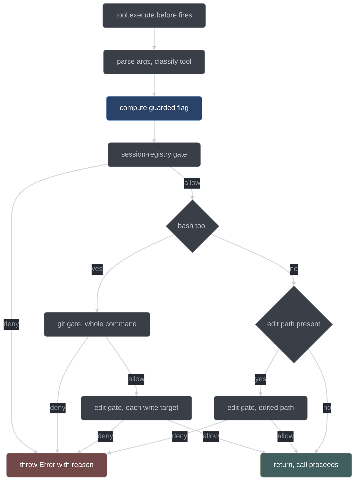

# Gates

How conductor stops a model session from doing something it must not do: where the gate
hook runs, what the shell parser gives it to reason over, the git and edit decision
tables, and the fail-closed rules around both. This is the most security-relevant page in
the set; it is written for anyone changing a gate rule.

## Where gates live

`tool.execute.before` is the only place in opencode that sees a tool call before it runs.
Every conductor gate therefore lives behind that one hook. There is no second enforcement
point and no defense in depth below it — a rule that is not expressed here is not
enforced.

Deny is a thrown `Error`. opencode reads the thrown message back to the model as the
refusal reason, so the reason text is part of the interface: it names the violated rule
and, where one exists, the legal alternative. Returning normally allows the call.

The hook body in [`plugin/index.ts`](../../conductor/plugin/index.ts) is deliberately
thin. It reads `args.command` for bash, derives an `editPath` only when
`classifyTool(hook.tool)` says the tool is a write — so a read tool that happens to carry
a `filePath` is never judged by the edit gate — builds the correlation record, and
delegates the entire decision to one adapter function, `gateBeforeToolCall`. Three layers,
with a strict rule about what may live in each:

| Layer     | File                                                                                                                                                                               | Responsibility                                                |
| --------- | ---------------------------------------------------------------------------------------------------------------------------------------------------------------------------------- | ------------------------------------------------------------- |
| Hook body | [`plugin/index.ts`](../../conductor/plugin/index.ts)                                                                                                                               | Parse the opencode input; call one function; a throw denies   |
| Sequencer | [`adapter/tools.ts`](../../conductor/adapter/tools.ts)                                                                                                                             | Order the gates, compute the fail-closed flag, journal, throw |
| Decisions | [`core/gates-git.ts`](../../conductor/core/gates-git.ts), [`core/gates-edit.ts`](../../conductor/core/gates-edit.ts), [`core/shell-parse.ts`](../../conductor/core/shell-parse.ts) | Pure functions: input in, `{action, reason}` out              |

Every decision is pure. The core modules import nothing but each other — no filesystem,
no subprocess, no wall clock, no network, no runtime globals — which is what makes each
row of every table below reproducible as a unit test from a journaled snapshot.
[`tests/purity.test.ts`](../../conductor/tests/purity.test.ts) mechanizes that rule.

`plugin/index.ts` exports exactly one symbol, the plugin factory. The 1.18.15 loader
iterates every export of a plugin module and throws when one is not a plugin function,
skipping the whole plugin and leaving the session ungated — so the shared inventory and
the gate function live in the sibling adapter module instead. See
[`adapter/wire-notes.md`](../../conductor/adapter/wire-notes.md).

A fourth gate, the ask-gate, adjudicates permission requests rather than tool calls; it
is described in [gates and hatches](../user/gates-and-hatches.md).

## The sequence

`gateBeforeToolCall` runs the gates in a fixed order. The session-registry gate is always
first. What follows depends on the tool: bash gets the git gate over the whole command
and then the edit gate once per write-shaped target; an edit/write/patch tool gets the
edit gate over the single edited path.



Two properties of the sequence matter. The git gate runs over **every** bash command, not
only commands that look git-shaped: `decideGit` allows a command with no git segment, so
running it unconditionally is how a git write hidden in a compound command such as
`ls && git commit` is still caught. And it runs for registered and unregistered sessions
alike — `classifyTool` marks a bash command `write` only when it has a write shape, so
`git commit` from an unregistered session classifies as `read`, passes the registry gate,
and is denied by the git gate instead. The two gates cover different halves of the same
surface on purpose.

## shell-parse.ts: the primitives

[`core/shell-parse.ts`](../../conductor/core/shell-parse.ts) is the only place that turns
a command string into structure. Both the git gate and the write-shape extractor consume
it, so a write hidden behind `env sh -c "..."` is analyzed identically to a bare one.

### The tokenizer

`shellTokens(command)` is quote-aware:

| Input construct                    | Behavior                                                                                                                                     |
| ---------------------------------- | -------------------------------------------------------------------------------------------------------------------------------------------- |
| `'...'`                            | Everything literal to the closing quote; the span joins the surrounding token with the quotes stripped                                       |
| `"..."`                            | Same, except `\"` and `\\` decode                                                                                                            |
| `$'...'`, `$"..."`                 | The `$` is consumed and the span parses like a bare quote, so `$'git'` tokenizes as `git`                                                    |
| Metacharacter inside quotes        | Literal; it does not split or form an operator                                                                                               |
| `\x` outside quotes                | The next character is literal                                                                                                                |
| `;`, `&`, `\|`, `<`, `>`, `(`, `)` | A maximal contiguous run emits as one standalone token (`&&`, `\|\|`, `>&`); the run breaks on any other character, so `(a)` is three tokens |
| Newline                            | Emits as the literal token `"\n"`                                                                                                            |
| Space, tab, carriage return        | Terminate the current token                                                                                                                  |

Quote-stripping matters because a model that writes `g"i"t push` or `'git' push` is
producing exactly the command a substring matcher misses and a tokenizer resolves.

### Operator segmentation

`splitOnOperators(tokens)` splits a token stream into command segments at operator tokens
and at the newline token. Operators are dropped and empty segments are never emitted, so
leading, trailing, and adjacent operators cannot produce a spurious empty command. Every
gate that reasons about "a command" reasons about one of these segments.

### Git command and subcommand detection

`commandWordLocation(seg)` finds the command word of a segment. It skips leading
`NAME=value` env-assignment tokens, then unwraps at most one leading wrapper from
`env`, `command`, `sudo`, `builtin`, `exec`, together with that wrapper's own options.
Value-taking flags are tracked per wrapper, so `sudo -u bob git push` resolves to `git`
rather than `bob`, while `env -i git push` does not eat its neighbor.

It returns one of three things:

| Result                               | Meaning                                                                                                                                                                      |
| ------------------------------------ | ---------------------------------------------------------------------------------------------------------------------------------------------------------------------------- |
| `{index}`                            | The command-word index; the caller resolves it by basename                                                                                                                   |
| `{index: null, unresolvable: false}` | An empty or prefix-only segment with no wrapper: nothing to decide                                                                                                           |
| `{index: null, unresolvable: true}`  | A wrapper was unwrapped but its options consumed the segment, or the unwrap landed on a second wrapper. The real command is decided at shell runtime; callers must fail safe |

`isGitCommand(seg)` is true when the resolved command word's basename equals `git`, so
`/usr/bin/git` and `./git` are git and `echo git status` is not. `gitSubcommand(seg)`
returns the first non-option token after the command word, skipping the value-taking
global options `-c k=v`, `-C dir`, `--git-dir <dir>`, and the inline `--git-dir=<dir>`.
Any *other* leading flag is returned verbatim as the subcommand — a deny-forcing token
that is on no allow-list — rather than being skipped, because git may itself treat the
flag's value as the real subcommand.

### Glob and scope matching

`globMatch(pattern, path)` backs the edit-scope gate: `*` never crosses `/`, `**` spans
zero or more whole segments (so `dir/**` matches `dir` itself), `{a,b}` alternation may
span segments, and dots are literal. It is memoized on `(patternIndex, pathIndex)` and
collapses runs of consecutive `**` segments, which bounds a match at
`O(pattern * path)` — the gate runs on every edit, so one degenerate glob must not be
able to wedge a run.

`scopesIntersect(globsA, globsB)` is the scheduler's conservative disjointness test,
comparing the *literal heads* of globs case-insensitively. It over-approximates
deliberately; see [scheduling and fan-out](./scheduling-and-fanout.md).

### Why parsed tokens and not substring regex

The plan states the rule and the code enforces it: matching is on parsed tokens, never a
substring regex. The concrete false positives that rule buys:

| Command                           | Substring match                  | Token match                           |
| --------------------------------- | -------------------------------- | ------------------------------------- |
| `git add src/config.ts`           | `config` looks like `git config` | subcommand is `add`                   |
| `git log --grep config`           | same                             | subcommand is `log`                   |
| `git commit -m "fix reset logic"` | `reset` looks destructive        | subcommand is `commit`                |
| `git stash push -m drop`          | `drop` looks like `stash drop`   | subcommand is `stash`, operand `push` |
| `echo git status`                 | looks like a git call            | command word is `echo`, not git       |
| `cat tools/git/helper.txt`        | `git` appears                    | command word is `cat`, not git        |

A regex fails in both directions. A false *positive* denies a legal read and trains the
model to work around the gate; a false *negative* — `g"i"t push`, `env git push`,
`/usr/bin/git apply` — lets a write through. Tokens resolve both.

## gates-git.ts

### Enumerated allow, default deny

[`core/gates-git.ts`](../../conductor/core/gates-git.ts) allows an enumerated set of
read-only git operations and denies everything else: `decideGitSegment` ends in
`return deny(defaultDenyReason(sub))`, which is reached by any subcommand that matched no
row above it.

The posture follows from an asymmetry in the failure modes. A missing *allow* row annoys
the model: it gets a refusal naming the subcommand and inviting `conductor_surface`. A
missing *deny* row lets `git apply` write arbitrary files, bypassing the edit-scope gate
entirely. The two costs are not comparable, so completeness of the deny list is never
load-bearing — completeness of the *allow* list is, and that list is short and closed.

### The disposition matrix

Every row is decided over the segment's full parsed tokens.

| Segment                                                                                                                                                                                                                                 | Disposition                                                                                 |
| --------------------------------------------------------------------------------------------------------------------------------------------------------------------------------------------------------------------------------------- | ------------------------------------------------------------------------------------------- |
| `status`, `log`, `diff`, `show`, `ls-files`, `ls-tree`, `rev-parse`, `rev-list`, `cat-file`, `blame`, `shortlog`, `describe`, `grep`                                                                                                    | allow, regardless of operands                                                               |
| `add`, `mv`, `rm`                                                                                                                                                                                                                       | deny — staging is `conductor_publish`'s job                                                 |
| `stash list`                                                                                                                                                                                                                            | allow                                                                                       |
| `stash push`, bare `git stash`                                                                                                                                                                                                          | deny — staging                                                                              |
| `stash drop`/`clear`/`pop`/`apply`/`save`/anything else                                                                                                                                                                                 | deny — mutates the stash                                                                    |
| `commit`, in any spelling                                                                                                                                                                                                               | deny — publishing is `conductor_publish`'s job                                              |
| `push`, in any spelling including force, `+refspec`, `:refspec`                                                                                                                                                                         | deny — handler-only, mode-gated                                                             |
| `reset`, `rebase`, `filter-branch`, `filter-repo`, `clean`, `merge`, `cherry-pick`, `revert`, `am`, `apply`, `update-ref`, `symbolic-ref`, `sparse-checkout`, `submodule`, `bisect`, `gc`, `prune`, `notes`, `replace`, `fetch`, `pull` | deny — destructive, history-manipulating, network-mutating, or a write around the edit gate |
| `worktree list`                                                                                                                                                                                                                         | allow                                                                                       |
| `worktree add`/`remove`/`move`/`prune`                                                                                                                                                                                                  | deny — worktrees are the adapter's job                                                      |
| `remote -v`, `remote --verbose`                                                                                                                                                                                                         | allow                                                                                       |
| `remote` with anything else                                                                                                                                                                                                             | deny — mutates remotes                                                                      |
| `config --list`, `config -l`, `config --get*`                                                                                                                                                                                           | allow                                                                                       |
| `config` with anything else                                                                                                                                                                                                             | deny — writes or unsets configuration                                                       |
| `reflog show`                                                                                                                                                                                                                           | allow                                                                                       |
| `reflog` with anything else                                                                                                                                                                                                             | deny — expire/delete mutate the reflog                                                      |
| `branch` list forms                                                                                                                                                                                                                     | allow                                                                                       |
| `branch` with a mutating flag                                                                                                                                                                                                           | deny (see below)                                                                            |
| `checkout --`, `checkout -B`, `checkout -f`/`--force`/`--discard-changes`                                                                                                                                                               | deny, unconditionally                                                                       |
| `checkout` with two or more positionals, or one path-like positional                                                                                                                                                                    | deny — discards working-tree files                                                          |
| `checkout -b <br>`, `checkout <br>`                                                                                                                                                                                                     | branch movement, policy-gated                                                               |
| `switch -C`/`--force-create`, `switch -f`/`--force`/`--discard-changes`                                                                                                                                                                 | deny, unconditionally                                                                       |
| `switch <br>`                                                                                                                                                                                                                           | branch movement, policy-gated                                                               |
| `restore --worktree`/`-W`                                                                                                                                                                                                               | deny, even alongside `--staged`                                                             |
| `restore --staged`/`-S`                                                                                                                                                                                                                 | allow — index only                                                                          |
| `restore` without `--staged`                                                                                                                                                                                                            | deny — the default target is the working tree                                               |
| bare `git` with no subcommand                                                                                                                                                                                                           | deny — nothing on the allow-list matches                                                    |
| any other subcommand                                                                                                                                                                                                                    | **deny** by default, reason naming the subcommand                                           |

The `branch` mutating flags are `-d`, `-D`, `--delete`, `-m`, `-M`, `--move`, `-c`, `-C`,
`--copy`, `-f`, `--force`, `-u`, `--set-upstream-to`, `--unset-upstream`,
`--edit-description`. `git branch -D x` is the required false-allow trap: `branch` is on
the allow-list and the flag is what turns the read into a write.

Note that `tag` appears on no list, so every spelling of `git tag` is default-denied, not
only `tag -d`. That is the enumerated-allow posture working as intended: an unlisted verb
needs no row of its own.

### Seeing through prefixes, wrappers, and paths

Detection is not fooled by the ordinary ways of spelling a command:

```bash
GIT_DIR=.git git push          # env-assignment prefix
env git push                   # one wrapper
sudo -u bob git push           # wrapper with a value-taking option
/usr/bin/git apply patch.diff  # absolute path, resolved by basename
./git apply patch.diff         # relative path, resolved by basename
```

All five reach `decideGitSegment` as git invocations. Exactly one wrapper level is
unwrapped; `sudo env git push` is *unresolvable* rather than parsed, and unresolvable
denies.

Two fail-safe denies close the residual gap where a static parser cannot know the command:

| Condition                                                                                                                                          | Example                                             | Disposition            |
| -------------------------------------------------------------------------------------------------------------------------------------------------- | --------------------------------------------------- | ---------------------- |
| `commandWordLocation` reports `unresolvable`                                                                                                       | `sudo -u bob`, `sudo env git push`                  | deny the whole command |
| The command word still carries an unresolved expansion sigil — a backtick, a backslash, or a `$` opening `$'…'`, `$"…"`, `${…}`, `$(…)`, or `$VAR` | `$x push`, `` `which git` push ``, `$'\x67it' push` | deny the whole command |

Both deny with the same reason, pointing the model at `conductor_surface`. The second case
matters because detection resolves the command word by token equality: an unresolved
residual reads as "not git" and would otherwise let a git write straight through.

### Deciding over the full segment, not a single word

`gitSubcommand` returns one word. The decision is taken over the full parsed token
segment, because the two-word discriminators are load-bearing:

| Verb       | Allowed form             | Denied form                |
| ---------- | ------------------------ | -------------------------- |
| `stash`    | `stash list`             | `stash push`, `stash drop` |
| `worktree` | `worktree list`          | `worktree add`             |
| `remote`   | `remote -v`              | `remote add`               |
| `config`   | `config --get user.name` | `config user.name x`       |
| `reflog`   | `reflog show`            | `reflog expire`            |
| `branch`   | `branch --list`          | `branch -D x`              |
| `restore`  | `restore --staged f`     | `restore f`                |

Operands are the tokens after the subcommand, sliced at its first index in the segment.
That slice can only ever *widen* the operand list relative to the true position, never
narrow it — so the discriminators can only tighten a decision, never loosen one.

### Composition rules across segments

`decideGit` scans every segment of the command and applies three rules:

1. **Any denied git segment denies the whole command.** `git status && git push` is a
   deny.
2. **A non-git segment never denies.** `ls -la; echo hi` reaches the git gate and is
   allowed; its write shapes, if any, are the edit gate's business.
3. **An allowed read never rescues a later denied write.** The scan does not stop at the
   first allow, and there is no notion of a net verdict.

### Branch movement under `branchPolicy`

`switch <br>`, `checkout <br>`, and `checkout -b <br>` move `HEAD`. They are the only rows
that read run state:

| `git.branchPolicy` | Run active | Disposition                                                    |
| ------------------ | ---------- | -------------------------------------------------------------- |
| `pin`              | yes        | deny — the run is pinned to its branch until it terminates     |
| `pin`              | no         | allow                                                          |
| `check-only`       | either     | allow — publish's `HEAD` check catches the consequence instead |

The force-create and worktree-discard forms (`checkout -B`, `switch -C`, `checkout --`,
`checkout -f`) never reach this rule. They are unconditional denies decided by their
callers, so no branch policy can enable them.

Git policy is otherwise role- and mode-uniform for model sessions. `decideGit` takes
`sessionRole` and `gitMode` for interface symmetry and voids them: the publish handler
runs git through `execFile` inside the plugin, which is not a tool call and never reaches
this gate.

## gates-edit.ts

[`core/gates-edit.ts`](../../conductor/core/gates-edit.ts) holds two separate gates and
the write-shape extractor.

### The session-registry gate

`decideSession` runs first, for every tool call, and dispatches on whether the session has
a registry entry (`sessionID → {role, itemId, tree}`) and on the tool's class. The
registry is written by the fan-out engine when it creates a sub-session, and by the
`chat.message` hook for the orchestrator.

| Tool class                                                              | Registered                       | Unregistered                                            |
| ----------------------------------------------------------------------- | -------------------------------- | ------------------------------------------------------- |
| `spawn` (opencode's `task`)                                             | **deny**                         | **deny**                                                |
| `read`                                                                  | allow                            | allow                                                   |
| `write` (`edit`, `write`, `patch`, `apply_patch`, or write-shaped bash) | allow, subject to later gates    | **deny** — no item assignment                           |
| `conductor` (any `conductor_*` tool)                                    | allow, subject to phase legality | **deny** — state advances only from registered sessions |

A registered session passes this gate for any non-spawn call. Its role and scope are a
later gate's job, not this one's. A stray unregistered reader is allowed because it is
harmless and not worth a confusing failure.

The spawn deny is the load-bearing half. Without it, an implementer could create a child
session conductor never registered — no role, no item, no scope — and have that child
perform exactly the writes the implementer is gated out of. A registry gate whose registry
can be grown by a tool call is not a gate. Conductor's own fan-out is unaffected: it
creates sessions through the SDK, not through a model-visible tool. The static half of the
same rule is `agent.<name>.tools: {"task": false}` in the generated agent definitions.

### The edit-scope gate

`decideEdit` applies five checks in a fixed order. The order is the specification: each
step reads the result of the one before it.

1. **Tree-relative normalization.** Strip the session tree prefix from the path.
2. **Path traversal.** Any `..` segment in the normalized path denies outright.
3. **Freeze.** A live verify marker for *this* tree denies every edit here.
4. **`.conductor/**`.** The state area is handler-written only, for everyone.
5. **Per-role scope.**

The role table:

| Role                                           | May write                                                   |
| ---------------------------------------------- | ----------------------------------------------------------- |
| `orchestrator`                                 | nothing, unless an active inline claim scopes the path (G8) |
| `implementer`                                  | paths matching the item's `fileScope`                       |
| `test-writer`                                  | paths matching the item's `testScope`                       |
| `reviewer`, `skeptic`, `planner`, `mechanical` | nothing — they read and report                              |
| any unknown role                               | nothing — fail safe                                         |

For the orchestrator, a present-but-non-matching inline claim still denies: the claim must
scope the specific path. The claim changes *who* edits, never *what* is enforced — the
item FSM applies in full either way.

The `..` deny exists because `normalizeUnderTree` does not collapse `..` and `globMatch`
treats it as a literal segment that `**` swallows. Without the check, a scope of
`src/a/**` would match `src/a/../../.conductor/state/run.json`. No legitimate in-scope
edit path contains a `..` segment, so denying them all costs nothing and closes the
escape.

### The freeze and its strict reading

While a verify marker is live for a tree, **every** edit in that tree is denied:
production files, test files, config, and a test-writer editing inside its own
`testScope`.

Two readings of this rule were possible — "source edits only" and "all edits" — and they
were load-bearing in opposite directions. The strict reading is normative because §4.2's
quarantine safety argument depends on it: during a verify, the `testScope` files of other
below-GREEN items are physically moved outside the repository, and a foreign test file
must not be written while it is moved aside. Under the loose reading, a test-writer could
create a file at a quarantined path and have the restore either clobber it or fail. See
[evidence and quarantine](./evidence-and-quarantine.md).

The freeze is keyed on explicit tree equality, not on the mere presence of a marker
somewhere and not on any freshness field a record could leave undefined:

```ts
if (verifyInFlightTree !== null &&
    stripTrailingSlashes(verifyInFlightTree) === stripTrailingSlashes(sessionTree)) { ... }
```

A different tree's marker does not freeze this tree, so a worktree implementer is never
frozen by another tree's validate. The gate denial is the backstop, not the mechanism: the
fan-out engine holds a write-capable job rather than dispatching it into a frozen tree,
because a sub-session that works for two minutes and then takes an exception on its first
write has burned a dispatch and an attempt counter for nothing.

### Tree-relative path normalization

Item scopes are tree-relative. Session paths are absolute. `normalizeUnderTree` strips the
session tree prefix so both sides of every comparison are in the same coordinate system:

| Session tree                               | Incoming path     | Normalized        | Effect                                                   |
| ------------------------------------------ | ----------------- | ----------------- | -------------------------------------------------------- |
| `/repo`                                    | `/repo/src/a.ts`  | `src/a.ts`        | matched against `fileScope`                              |
| `<stateHome>/…/worktrees/<runId>/<itemId>` | `<tree>/src/a.ts` | `src/a.ts`        | the same scope matches in a worktree                     |
| `<stateHome>/…/.conductor/…/<itemId>`      | `<tree>/src/a.ts` | `src/a.ts`        | the tree's own `.conductor` prefix does not false-deny   |
| `/repo`                                    | `/elsewhere/x.ts` | `/elsewhere/x.ts` | matches no tree-relative scope, denied by the role check |

The `.conductor/**` deny is applied to the normalized path — the current tree's state
area — never to the worktree root prefix, which is why a worktree living under a
`.conductor` state home is still writable by its implementer.

## The write-shape extractor

`writeShapedPaths(command)` surfaces the paths a bash command *writes*. It reuses the same
tokenizer and operator segmentation the git gate uses, and re-runs itself over the inner
string of a shell `-c` wrapper, bounded at eight levels of nesting.

| Shape                                             | Extracted target                                        |
| ------------------------------------------------- | ------------------------------------------------------- |
| `> f`, `>> f`, `&> f`, `&>> f`, `>\| f`, `&>\| f` | the token following the operator run                    |
| `>&`                                              | nothing — that duplicates a file descriptor, not a file |
| `tee [-a] f...`                                   | every non-flag operand                                  |
| `sed -i`, `sed --in-place`                        | every non-flag operand after the script                 |
| `mv`, `cp`                                        | the last non-flag operand only; the sources are reads   |
| `rm`                                              | every non-flag operand                                  |
| `perl -i`, `-pi`, `-ni`, `-pi.orig`               | every non-flag operand after the script                 |
| `dd of=FILE`                                      | `FILE`                                                  |
| `awk`/`gawk -i inplace`                           | every non-flag operand after the program                |
| `ex`, `ed`                                        | every non-flag operand                                  |
| `sh`/`bash`/`dash`/`zsh`/`ksh -c "<inner>"`       | recurse into `<inner>`                                  |
| `cat`, `grep`, `echo`, `printf`, anything else    | nothing                                                 |

Targets are de-duplicated preserving first-seen order, and each one is judged separately
by the edit gate. The same function decides the tool class: a bash command with at least
one write target classifies as `write` for the registry gate, and one with none classifies
as `read`.

The honest limit: an in-session interpreter bypasses this entirely. `node -e "require('fs')
.writeFileSync(...)"` and `python -c "open(...,'w')"` are single tokens whose contents the
extractor does not evaluate, and evaluating them would mean writing an interpreter. The
extractor covers the shell-shaped writes a model actually reaches for; it is not a
sandbox, and the design says so rather than implying otherwise.

## Fail-closed in practice

A gate that crashes must not become a gate that permits. `gateBeforeToolCall` computes one
`guarded` flag, once, from the real parse:

```ts
const guarded =
  gitSegmentPresent ||
  writeTargets.length > 0 ||
  toolClass === "write" ||
  toolClass === "conductor" ||
  toolClass === "spawn";
```

`gitSegmentPresent` is computed with the same tokenizer and segmentation `decideGit` uses
internally, not by asking `decideGit`. That is the point: the flag stays reliable even
when `decideGit` is the thing that crashed.

Every core decision then runs inside `guardedDecide`, which catches, journals
`gates/gate-crash` at `error` with the crash context and the flag, and disposes:

| Call                                                                     | Crash disposition                         | Why                                                                              |
| ------------------------------------------------------------------------ | ----------------------------------------- | -------------------------------------------------------------------------------- |
| Guarded — a git segment, a write shape, a write/`conductor_*`/spawn tool | **deny**, with the crash message attached | A gate that cannot judge a dangerous call has not judged it                      |
| Unguarded — a harmless read                                              | allow                                     | Denying every read on a parser bug makes the harness unusable and buys no safety |

The asymmetry is deliberate. Failing closed on reads would turn any bug in the tokenizer
into a total outage of an agent that is mostly reading, and a read cannot corrupt the
repository. Failing open on writes would turn the same bug into a silent removal of every
gate. The crash is journaled either way, so neither disposition hides it.

## Journaling a denial

The debuggability law (§7.4) requires that every deny appear in the journal with enough
input context to reproduce the decision through the pure core function in a test. `denyThrow`
is the only path to a refusal, and it journals before it throws:

```ts
function denyThrow(input: GateHookInput, reason: string): never {
  input.journal.log("warn", "gates", "deny", denySnapshot(input, reason), input.corr);
  throw new Error(reason);
}
```

The snapshot carries:

| Field      | Content                                           |
| ---------- | ------------------------------------------------- |
| `toolName` | The tool that was refused                         |
| `args`     | The raw tool arguments as opencode delivered them |
| `reason`   | The exact text thrown back to the model           |
| `command`  | The bash command text, when there was one         |
| `editPath` | The edited path, when there was one               |
| `corr`     | `runId`, `sessionID`, and `itemId` where known    |

Denies are logged at `warn`, not `debug`, so the journal always persists them. The bar is
concrete: given a `gates/deny` line, you can call `decideGit(command, ...)` or
`decideEdit({path, ...})` directly in a test and get the same `{action, reason}` back,
because the decision functions are pure and the snapshot holds their whole input. A gate
that denies without journaling its snapshot fails its own test.

## Adding or changing a rule

The gate tables live in three files and are covered by three suites:
[`tests/gates-git.test.ts`](../../conductor/tests/gates-git.test.ts),
[`tests/gates-edit.test.ts`](../../conductor/tests/gates-edit.test.ts), and
[`tests/gate-wiring.test.ts`](../../conductor/tests/gate-wiring.test.ts), with the parser
itself covered by [`tests/shell-parse.test.ts`](../../conductor/tests/shell-parse.test.ts).

The working rules:

1. **Write the table row as a test first.** A gate row is a behavioral change; it starts
   red. The matrix suites are written as row tables precisely so a new rule is one new
   row, and the red is a failing assertion rather than a missing module.
2. **Keep the default-deny posture.** Never add a catch-all allow, never invert the final
   `return deny(defaultDenyReason(sub))`, and never move a decision out of the core into
   the adapter. The adapter sequences; it does not judge.
3. **Never widen an allow without a matching false-positive test.** If you add a verb to
   the read-only list, add the case that proves the neighboring write still denies —
   `branch` and `branch -D`, `stash list` and `stash push`, `restore --staged` and
   `restore`. An allow row without its trap is how a deny row goes missing.
4. **Prefer a two-word discriminator to a broadened verb.** If a verb is read-only in one
   spelling and a write in another, give it a `decideX(operands)` function like the seven
   that already exist rather than putting the verb on the simple allow-list.
5. **Keep the reason text useful and the core pure.** The reason reaches the model, so name
   the violated rule and the legal alternative — `conductor_publish` for staging and
   committing, `conductor_surface` for a genuinely needed command, `conductor_inline_claim`
   for the orchestrator's edit. And no filesystem, clock, or subprocess in core: every claim
   on this page about reproducing a decision from a journal line depends on it.

Run the suites through the wrapper, never `node --test` directly:

```bash
bash scripts/test-conductor.sh 'conductor/tests/gates-*.test.ts'
bash scripts/test-conductor.sh                 # the whole suite before committing
```

The wrapper parses the TAP trailer and fails on zero tests, on any skip or todo, and on a
directory positional that resolves as a module — all of which look like a pass otherwise.
See [testing and verification](./testing-and-verification.md).

## See also

- [Gates and hatches](../user/gates-and-hatches.md) — the same rules from the operator's side, plus the inline claim and override budgets
- [Evidence and quarantine](./evidence-and-quarantine.md) — the verify marker the freeze reads, and why it must be strict
- [Core and adapters](./core-and-adapters.md) — the purity rule the gate decisions live under
- [opencode integration](./opencode-integration.md) — the hook surface, the loader constraint, and the wire drifts
- [Testing and verification](./testing-and-verification.md) — the canonical test gate
