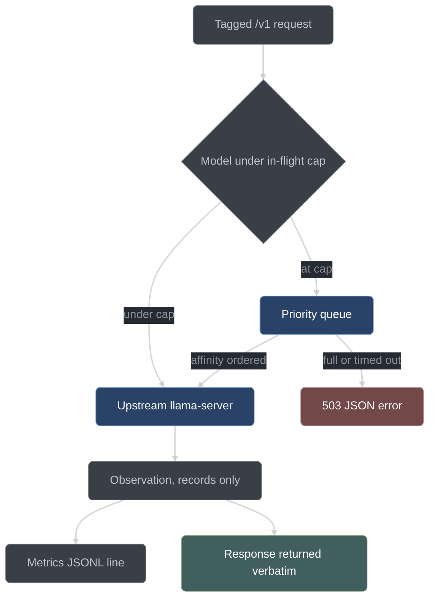

# llama-router

llama-router is the C++23 reverse proxy conductor puts between the opencode plugin and
`llama-server`. This page is for developers working on `router/`: what the router is
for, what it is forbidden to do, how each module behaves, and how it is built and tested.

*Not yet wired: the router is built across tasks 11.1–11.8; the build scaffold (11.1) and
the config layer (11.2) have landed, and the proxy, admission, affinity, schema observer,
metrics, and live smoke are still ahead. See [project status](project-status.md).*

## Why a second layer at all

Conductor's layer 1 — the opencode plugin — is the only layer that can see a tool call, so
every gate lives there and nothing about correctness depends on the router. Layer 2 exists
because four jobs are structurally out of the plugin's reach: it does not own the model
server, it cannot influence slot scheduling, it cannot independently check a claim it
made itself, and it sees only its own traffic.

| Router job                                                                                               | Why the plugin structurally cannot do it                                                                         | Payoff                                                                                                                                       |
| -------------------------------------------------------------------------------------------------------- | ---------------------------------------------------------------------------------------------------------------- | -------------------------------------------------------------------------------------------------------------------------------------------- |
| Admission control — cap in-flight requests, priority queue                                               | The plugin does not own the server. Concurrent sub-sessions would thrash a 20 GB model and exceed its slot count | Six parallel reviewers do not grind generation to a halt                                                                                     |
| Group affinity — requests sharing a declared prefix group run contiguously                               | The plugin cannot influence server slot-reuse timing                                                             | N reviewers share one huge prefix (diff + plan + rubric); keeping it KV-hot is the largest single wall-clock lever available under one model |
| Schema observation — a tagged request should carry a schema; non-stream responses are checked against it | The claimant would be validating its own claim                                                                   | An independent record of how often local-model structured output actually conforms                                                           |
| Metrics ledger — tokens, timings, queue wait per request                                                 | The plugin sees only its own requests                                                                            | The POC's cost numbers are measured rather than estimated                                                                                    |

Swap-cost batching is deliberately absent. Under G13 one model serves every role, so there
are no swaps to batch and a batcher would be untestable dead weight carrying a fake clock.
It lives in the plan's stretch section alongside per-role model routing, which is the only
thing that would make it pay (plan §4.4, §10).

## The prime directive

**The router observes and schedules. It never enforces process, and it never returns a
status the direct path would not have returned.**

That is constraint G5 in the plan, and it is the reason the dependency direction works:
layer 1 fail-closed, layer 2 fail-soft. `serve.py --no-router` runs the identical workflow
over the same code path, and task 12.1 tests that claim rather than asserting it — the
scripted end-to-end run executes twice, with and without the router, and must produce the
same terminal state, the same item dispositions, and the same commit set.

What the directive rules out is concrete. An earlier design had the router return `400`
when a request tagged as needing structured output arrived without a schema field, and
wrap a non-conforming response body in an error envelope. Both give the router the power
to fail a request the direct path would have served, and both are rejected:

- A plugin bug that is survivable without the router becomes fatal with it. If the plugin
  forgets to attach a schema to one request, the direct path still gets an answer and the
  fan-out engine's receipt validation catches the malformed result and re-prompts. With an
  enforcing router, the same bug is a hard failure.
- The fail-soft dependency direction inverts. Once the router can fail requests, process
  integrity depends on the router being correct and up, which is exactly what layer 2 is
  designed never to be responsible for.

Enforcement of structured output belongs to the fan-out engine's receipt validation, which
runs in both configurations: it re-prompts with the validation error appended, up to two
retries, then marks the sub-task `env`-failed. What the router uniquely provides is an
*independent* record of how often real local-model output conforms — a POC deliverable
that needs no authority over the request to produce.

`schema.rejectOnMissing` exists in the config and defaults to `false`. It is present so
that the stricter posture is a configuration change rather than a fork, and it must stay
`false` in the base build.

## The request path



The proxy itself is transparent pass-through of `/v1/*` — chat completions, embeddings,
models — to the upstream, including SSE streaming, where `text/event-stream` chunks are
forwarded unbuffered. Everything outside `/v1/*` and `/conductor/*` returns `404`. An
upstream that is down produces a `502` with a JSON error body.

## Tagging

Conductor attaches four headers per request through opencode's `chat.headers` hook.

| Header                 | Values                                                                                      | Meaning                                                                      |
| ---------------------- | ------------------------------------------------------------------------------------------- | ---------------------------------------------------------------------------- |
| `X-Conductor-Role`     | `orchestrator`, `planner`, `testWriter`, `implementer`, `reviewer`, `skeptic`, `mechanical` | Which role issued the request; recorded in metrics                           |
| `X-Conductor-Priority` | `interactive`, `review`, `batch`                                                            | Dequeue class; `priorities` in the config maps each to a number, lower first |
| `X-Conductor-Group`    | Prefix-affinity group id, for example `run:r-…:review:I3`                                   | Requests sharing a group share a large prompt prefix                         |
| `X-Conductor-Schema`   | `required`                                                                                  | This request is expected to carry a structured-output declaration            |

`chat.headers` output reaching the provider as real HTTP headers is verified against
opencode 1.18.15 in [wire-notes.md](../../conductor/adapter/wire-notes.md), which also pins
a fallback: a key set through `chat.params` lands as a top-level provider-body field
`x_conductor`. The router extracts tags from that field and strips it before proxying if it
ever appears; with working `chat.headers` it never does.

**Untagged requests are priority `interactive` and bypass nothing.** A request with no
conductor headers still passes through admission, still gets a metrics line, and still
competes for slots. There is no privileged path around the router; the only way around it
is not to run it.

## Admission

The router keeps a per-model in-flight counter, inferring the model from the request
body's `model` field. Under G13 there is exactly one model, but the accounting is
per-model so a second one does not interfere: a request for model B passes while model A
is capped.

- Under the cap, the request goes straight upstream.
- At the cap, the request is enqueued. Dequeue order is priority first, then FIFO within a
  priority class.
- Queue overflow past `maxQueued`, or a wait past `queueTimeoutMs`, produces a `503` with a
  JSON error body the fan-out engine understands: it backs off and retries, bounded.

`queueTimeoutMs` is deliberately smaller than the fan-out engine's
`parallel.subSessionTimeoutMs`, so a queue timeout is reported as a queue timeout and not
as two simultaneous unrelated failures.

**The load-bearing invariant:** `admission.maxInflightPerModel` must be at most
`llama-server`'s `--parallel` slot count. If admission cheerfully admits four requests
into a server with one slot, the fan-out serializes upstream and every parallelism claim
in the design is imaginary. The two numbers are never written independently: task 12.1's
`serve.py` derives both the server's `--parallel` and the generated router config's
`maxInflightPerModel` from the same `parallel.maxReaders` value, so they cannot drift
apart.

Queued requests block their handler thread, so the HTTP server's task queue is sized
explicitly at startup rather than left at the library default: threads ≥ `maxQueued` plus
the sum of `maxInflightPerModel` plus a margin, with config validation clamping `maxQueued`
when the arithmetic exceeds a sane thread budget. cpp-httplib's default pool would starve
under exactly the fan-out load this system generates. The consequence that is worth
testing is the pool-exhaustion case: with a full queue, `/conductor/health` still answers.

## Group affinity

Among queued requests, the router dequeues same-`X-Conductor-Group` requests contiguously.
`llama-server`'s slot reuse then keeps the shared prompt prefix KV-hot instead of evicting
and re-ingesting it between interleaved requests from unrelated groups.

This matters because of how conductor fans out. Item review dispatches up to six reviewer
lenses over the same diff, the same plan, and the same rubric; the wave driver batches like
stages across items so all members' vet critics dispatch together and all members' review
lenses dispatch together. Every one of those requests shares an enormous prefix. Under one
model there are no model swaps to amortize, so prefix locality is the router's principal
wall-clock lever — the single largest one available.

Contiguity is not starvation. The ordering rules the affinity module owns are:

- Same-group requests dequeue contiguously among queued requests.
- Groups interleave fairly; a low-priority group still drains rather than waiting forever
  behind a busy high-priority one.
- Ordering is stable under arrival jitter.
- Untagged requests never jump the queue.

`affinity.contiguousDequeue` defaults to `true`; setting it `false` reduces the queue to
plain priority-then-FIFO.

## Schema observation

A request tagged `X-Conductor-Schema: required` is expected to carry a structured-output
declaration: `response_format` with a `json_schema`, or a `grammar` / `json_schema` body
field. `llama-server` natively converts a JSON schema to GBNF and constrains sampling
accordingly, so the declaration is what makes the output well-formed.

A tagged request **without** one is journaled, counted as `schemaMissing`, and **proxied
unchanged**. That is the whole point of the module: the router records that the plugin
failed to attach a schema, and the request is served exactly as it would have been served
without the router in the path. Untagged requests pass untouched.

For a non-streaming tagged response, the body is validated against the declared schema
with `nlohmann_json_schema_validator` and the verdict is recorded in the request's metrics
line. The body is returned **verbatim** either way — conforming or not.

### What streaming does to this

Whether opencode's fan-out traffic streams was a scoping input, resolved in task 0.2
*before* Phase 11 was scoped rather than discovered while writing C++. The answer, verified
against opencode 1.18.15 and recorded in
[wire-notes.md](../../conductor/adapter/wire-notes.md):

> `session.prompt` issues a **streaming** provider request: body `stream: true` with
> `stream_options: {include_usage: true}`, and the reply is consumed as SSE
> `chat.completion.chunk` events terminated by `data: [DONE]`.

Three consequences follow directly:

1. Response observation on fan-out traffic sees no single JSON body to validate. The
   router's response path must parse SSE, and `schemaConformed` is recorded as `null` for
   streamed responses.
2. Task 11.6 shrinks to the request-side `schemaMissing` counter plus a recorded note.
   Stream-body validation is out of scope and is recorded as an honest limit.
3. The router is justified by scheduling and metrics alone, and the schema dataset narrows
   to "how often did conductor actually ask for constrained output".

`schema.validateResponses` remains in the config and governs the non-streaming case, which
is what a `curl` probe or any non-streaming client produces.

## Metrics

The router writes one JSONL line per request to `metrics.ledgerPath`
(`.data/router/metrics.jsonl` by default). The ledger is the POC's cost and conformance
dataset.

| Field group | Contents                                                                                                     |
| ----------- | ------------------------------------------------------------------------------------------------------------ |
| Identity    | model, role, group, priority                                                                                 |
| Timing      | queue-wait ms, upstream ms                                                                                   |
| Tokens      | prompt and completion tokens, plus timings, read from `llama-server`'s `usage` and `timings` response fields |
| Observation | `schemaMissing`; `schemaConformed` as true, false, or `null` for streamed responses                          |
| Outcome     | status                                                                                                       |

Two endpoints sit outside `/v1/*`:

- `GET /conductor/health` — `200` when the router is up. It answers even when the queue is
  full, which is what makes the plugin's health probe meaningful under load.
- `GET /conductor/metrics` — the aggregate view: count, p50 and p95 queue wait, token
  totals, and the schema-conformance rate.

The plugin's typed view of that aggregate is `MetricsSummary` in
[router-client.ts](../../conductor/adapter/router-client.ts): `totalRequests`,
`schemaMissing`, `schemaConformed`, `statusCounts`, `promptTokens`, `completionTokens`.
`conductor_report` reads it for the run report's metrics section.

## Fail-soft

`serve.py` execs into the session shell and cannot supervise anything directly, so the
router runs under a small supervisor loop process that restarts it with capped exponential
backoff — delays grow, are capped, and reset after a healthy run — and dies with the shell
the way the existing server watchdog does.

The other half of fail-soft lives in the plugin, in
[router-client.ts](../../conductor/adapter/router-client.ts). Every call it makes is
bounded by `probeTimeoutMs` and absorbs failure: `routerHealthy` resolves `false` and
`fetchMetricsSummary` resolves `null` for a refused connection, a socket error, a non-200,
a hang, or an unparseable body. Neither ever throws.

Failover is a per-session latch, `FailoverState`:

| Field             | Set when                       | Effect                                                                                           |
| ----------------- | ------------------------------ | ------------------------------------------------------------------------------------------------ |
| `failovers`       | Every `noteRouterFailure` call | Counts router request failures this session                                                      |
| `useUpstream`     | First failover                 | `resolveBaseUrl` returns the upstream origin for the rest of the session                         |
| `metricsPartial`  | First failover                 | The run's metrics are marked partial in `conductor_report`                                       |
| `probingDisabled` | Second failover                | `routerHealthy` short-circuits `false` with zero network calls; the router is never probed again |

`resolveBaseUrl(routerCfg, upstreamCfg, failoverState)` is a synchronous pure resolver over
that latch: the router origin normally, the upstream origin once `useUpstream` or
`probingDisabled` is set.

Failover is what makes "layer 2 is fail-soft" a real claim. Without it, the sentence would
mean only "the process would have been fine if the crash had happened at a different time"
— in-flight sub-sessions still die and the run still takes `env` failures. With it, a
router that dies mid-run costs some wall clock and a `partial` flag on the metrics, and
nothing else.

## Configuration

The router reads a single JSON document, `.data/configs/conductor-router.json`, generated
by `serve.py` and hand-editable. Its shape is plan §2.2:

```json
{
  "version": 1,
  "listen": { "host": "127.0.0.1", "port": 8088 },
  "upstream": { "host": "127.0.0.1", "port": 8080 },
  "admission": {
    "maxInflightPerModel": 4,
    "maxQueued": 64,
    "queueTimeoutMs": 600000
  },
  "priorities": { "interactive": 0, "review": 1, "batch": 2 },
  "affinity": { "header": "X-Conductor-Group", "contiguousDequeue": true },
  "schema": {
    "observeHeader": "X-Conductor-Schema",
    "validateResponses": true,
    "rejectOnMissing": false
  },
  "metrics": { "ledgerPath": ".data/router/metrics.jsonl" },
  "logging": { "level": "info" }
}
```

Three keys are documented as optional and are filled in by the parser when absent:

| Key                          | Default  |
| ---------------------------- | -------- |
| `logging.level`              | `"info"` |
| `schema.rejectOnMissing`     | `false`  |
| `affinity.contiguousDequeue` | `true`   |

### Parsing and error reporting

[`router/config.hpp`](../../router/config.hpp) is header-only and defines
`parseRouterConfig(json, schemaPath)`, which runs in a fixed order:

1. Parse the input text as JSON.
2. Fill the three documented-optional keys with their defaults, so the completed document
   can satisfy the exported schema — which marks every key required. A block of the wrong
   type is left alone, for the schema to reject it by name.
3. Validate the completed document against the schema read from `schemaPath`.
4. Range-check `listen.port` and `upstream.port` to 1..65535 inclusive; the schema types
   them as plain numbers, so the range is the parser's job. Then check that
   `logging.level` is one of `trace`, `debug`, `info`, `warn`, `error` — a level the router
   can actually apply, never a silent fallback.

Every violation throws `ConfigError`, whose contract is what makes a bad config
actionable:

- `field()` is the dotted path of the offending field — `listen.port`, `admission.bogus`,
  `logging.level`, `batching`. It is empty only when the schema file itself could not be
  read or parsed, in which case `what()` names that path instead.
- `what()` always contains `field()` verbatim. The constructor guarantees this
  structurally, whatever the throw site composed.

Building that path takes some care: the validator reports an RFC 6901 JSON Pointer that
stops at the enclosing object, naming the offending property only inside its message
("required property 'listen' not found in object"). `detail::offendingField` converts the
pointer to dotted form and extends it with the quoted name, so the path reaches the leaf.

`applyLoggingLevel(cfg)` maps the validated level onto spdlog: `trace`, `debug`, `info`,
`warn` map by name and `error` maps to `spdlog::level::err`. An unrecognized level reaching
that function is still refused by name rather than silently ignored.

### Where the schema comes from

The parser validates against whatever schema **file** it is handed; it carries no copy of
the shape. That file is `router/tests/schemas/RouterConfig.schema.json`, exported from
`conductor/core/types.ts` by `conductor/tools/export-schemas.ts` — the same single source
the plugin's own validation uses — into a gitignored directory regenerated by
`scripts/test-conductor.sh`. Every object in it carries `additionalProperties: false`, so
an unknown key anywhere is rejected and named: a top-level `batching` block, which belongs
to the stretch design and not to the base shape, fails validation by that name.

## Building and testing

Two CMake targets carry the router, plus `membench` under [`tools/`](../../tools/README.md):

| Target         | What it is                                                 |
| -------------- | ---------------------------------------------------------- |
| `llama-router` | The router binary                                          |
| `router-tests` | The doctest suite, registered with ctest as `router-tests` |

Both compile as C++23 and both take `src/` as their only user-code include root.
**Every in-workspace header is included by its full path relative to `src/`** —
`#include "router/version.hpp"`, never `#include "version.hpp"` — so an include names where
the header actually lives no matter which file includes it.

Dependencies come from vcpkg: `cpp-httplib`, `nlohmann-json`, `json-schema-validator`,
`doctest`, and `spdlog`. Neither target links `llama` or `ftxui`.

```bash
cmake --preset clang-relwdebinfo
cmake --build .out/build/clang-relwdebinfo --target llama-router
cmake --build .out/build/clang-relwdebinfo --target router-tests
ctest --test-dir .out/build/clang-relwdebinfo
```

**Always build a named target.** `extern/llama-cpp` is added with `add_subdirectory` so its
configure step runs and its packages resolve, but `llama-router` links neither `llama` nor
`ftxui`: it proxies to a separately-launched `llama-server`, so it needs neither library. A
bare `cmake --build` therefore compiles the entire vendored tree for nothing. The
`llama-server` this workspace runs comes from `scripts/fetch_models.py build`, out of tree.

Router unit tests run entirely against in-process fakes: a stub upstream `httplib::Server`
started by the test on an ephemeral port. No model and no `llama-server` are needed until
the live smoke task. `AUTOFORMAT_SRC_ON_CONFIGURE` (default `OFF`) runs clang-format over
`src/` at configure time.

## The upstream contract

[`router/UPSTREAM_CONTRACT.md`](../../router/UPSTREAM_CONTRACT.md) is the file
where the *measured* behavior of `llama-server` is recorded, stamped
`WIRE_CONTRACT_VERIFIED: <date>`. It is the router's equivalent of the plugin's
[wire-notes.md](../../conductor/adapter/wire-notes.md): assumptions about an external
program are measured against the real program and written down, never inferred.

The measurement is currently deferred to task 12.1, and the file says so in place of a
stamp. The reasoning is worth reading as a pattern:

- The measurement's own procedure runs the probe against `scripts/serve.py --no-shell`, and
  the router-aware `serve.py` — the one that encodes the correct `llama-server` invocation
  for this design, context size, `--parallel <N>`, host and port — arrives with task 12.1.
  Measuring with hand-guessed flags first risks producing a *misleading* number, which the
  live-task discipline treats as nearly as harmful as a fabricated one.
- Nothing consumes the number before 12.1. The router modules test against a stub upstream,
  not the live model; the number is 12.1's config input.

The assets were confirmed present so the deferral is clean rather than a hidden block: a
prebuilt `llama-server` binary and the `qwen3.6-27b` model directory both exist. The file
records the exact procedure to run:

1. `scripts/serve.py --no-shell` with `qwen3.6-27b`, then probe `GET /v1/models` for its
   shape in router mode.
2. `response_format` / `json_schema` acceptance and GBNF constraining — send a schema'd
   completion and confirm the output conforms.
3. `usage` and `timings` fields present in a non-stream response.
4. SSE chunk framing for a streamed response.
5. A request for a non-resident model — router-mode autoload latency, visibly.
6. **The effective concurrent slot count:** issue N concurrent trivial completions for
   N ∈ {1, 2, 4, 8}, with and without `--parallel`, and record where latency starts scaling
   linearly with N.

Step 6 is the one that decides whether the parallelism claims are real. That number is what
`parallel.maxReaders`, `admission.maxInflightPerModel`, and `serve.py`'s `--parallel` must
respect, and it is an acceptance row in its own right. **If it comes back 1, every "six
reviewers in parallel" claim in the design is false**, and `serve.py` must set `--parallel`
before any of the rest of it matters. Recording an honest 1 is a useful result; recording a
guessed 4 would poison every downstream number the POC produces.

Only observed output goes into that file. If the measurement cannot run, the rule is to
record `BLOCKED` plus the exact command lines — fabrication is the single worst outcome.

## See also

- [Architecture](architecture.md) — the three layers and the dependency direction
- [Scheduling and fan-out](scheduling-and-fanout.md) — the traffic the router schedules
- [Build system](build-system.md) — presets, vcpkg, and the target rules in full
- [Observability internals](observability-internals.md) — journal, ledgers, and the metrics path
- [`router/UPSTREAM_CONTRACT.md`](../../router/UPSTREAM_CONTRACT.md) — the measured upstream behavior
