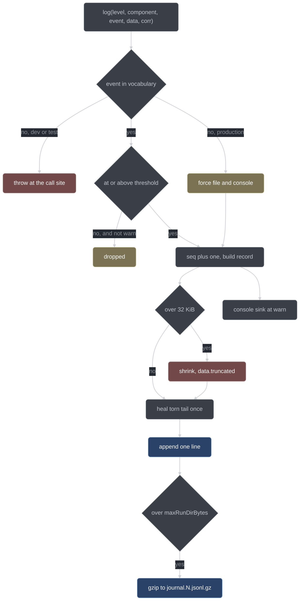

# Observability internals

How conductor logs, what it writes to disk, and why every ledger names a writer, a reader,
and a test. This page is for people changing the journal, the state store, or any handler
that has to leave a trace behind. The user-facing view of the same machinery is
[Observability](../user/observability.md).

## The debuggability law

Every deny, every FSM refusal, every disengage, and every schema-validation retry must
appear in the journal with enough input context to reproduce the decision through the pure
core function in a test (plan §7.4). The bar is concrete: when a bug report is "conductor
did something weird", the journal plus fixtures must be sufficient to write the failing
test. A gate that denies without journaling its snapshot fails its own test.

This is affordable only because of the pure-core split (G3). A gate decision is
`(parsedInput, stateSnapshot) → decision`, so the journal only has to carry the inputs;
the decision is re-derivable by calling the same core function with them. That is what
[`denySnapshot`](../../conductor/adapter/tools.ts) collects before every throw:

```ts
// conductor/adapter/tools.ts
function denySnapshot(input: GateHookInput, reason: string): Record<string, unknown> {
  const data: Record<string, unknown> = { toolName: input.toolName, args: input.args, reason };
  if (input.command !== undefined) data.command = input.command;
  if (input.editPath !== undefined) data.editPath = input.editPath;
  return data;
}
```

Four consequences fall out of the law and shape everything below.

- **Denies are logged at `warn`.** `error` and `warn` are written regardless of the
  configured level, so turning the journal down never turns security refusals off.
- **A gate crash is never invisible.** `guardedDecide` journals `gates/gate-crash` at
  `error` with the crash context and the `guarded` flag, then denies (guarded) or allows
  (a harmless read) — the disposition follows G5, the record happens either way.
- **The fan-out engine journals each schema retry** (`fanout/subsession.retry`) with the
  validation errors that caused it, so a run that burned its retry budget shows *what* the
  model failed to produce, not just that it failed.
- **Ledger appends are journaled too**, so one file gives the whole timeline.

## The closed event vocabulary

Event names are a closed, per-component vocabulary declared once in
[`core/journal-events.ts`](../../conductor/core/journal-events.ts), and
`isKnownEvent(component, event)` is the check the journal adapter runs on **every** write.
An unlisted event, or an unknown component, is caught at its source rather than leaking
into the journal under a name no test and no replay filter can find. The reason is blunt:
logs you cannot grep by name are logs you cannot debug with.

Widening the vocabulary means adding a name in that file — plus a test that greps for it —
never inventing one at a call site.

| Component       | Events                                                                                                                         | What it records                                                                            |
| --------------- | ------------------------------------------------------------------------------------------------------------------------------ | ------------------------------------------------------------------------------------------ |
| `fsm`           | `transition`, `refusal`, `guard-reject`, `invalid-transition`                                                                  | run/item state movement, and every refusal to move                                         |
| `gates`         | `deny`, `allow`, `snapshot`, `gate-crash`, `override-granted`                                                                  | gate dispositions, the §2.8 gate-crash anomaly, the budgeted override hatch                |
| `fanout`        | `subsession.dispatched`, `subsession.hold`, `subsession.complete`, `subsession.retry`, `subsession.abort`                      | the sub-session lifecycle the fan-out engine drives                                        |
| `evidence`      | `red`, `green`, `verify`                                                                                                       | one per evidence-ledger append; the names are the §2.6 evidence kinds                      |
| `continuation`  | `reprompt`, `idle`, `disengage`                                                                                                | idle re-prompts and the futile-re-prompt wedge detector                                    |
| `inject`        | `system-append`                                                                                                                | the doctrine + live-state append made to each request's system array                       |
| `router-client` | `request`, `response`, `failover`, `retry`                                                                                     | request tagging and the fail-soft failover to the upstream base URL                        |
| `state`         | `run.created`, `lock.acquired`, `lock.released`, `lock.stale-break`, `lock.contended`, `item.updated`, `user.midrun-prompt`, `decision.recorded`, `question.surfaced`, `run.stop-report` | run and lock lifecycle, item mutations, a prompt arriving mid-run, decision- and question-ledger appends, the §2.9 stop-report artifact |

`decision.recorded` shows the rule working. A `conductor_decide` or `conductor_defer`
changes no run or item state, so borrowing `item.updated` would have made every decision
ungreppable; it gets its own name instead. `question.surfaced` is the same case one ledger
over: `handlePublish`'s `git.preexistingDirty: "refuse"` arm appends a §2.11 question and
changes nothing about the item, so it does not borrow `item.updated` either.

The rule cuts the other way just as hard, and the §3.6 override hatch is the example. Its
three records all reuse names that already existed: minting a grant is `gates: override-granted`,
the gate decision that spends it is `gates: allow` (with the spent grant in `data`), and an
over-budget refusal is `gates: deny`. None of them earned a new name, because each of those
names already says what happened.

## The journal writer

[`adapter/journal.ts`](../../conductor/adapter/journal.ts) exports one factory:

```ts
createJournal(runDir, config, env, consoleFn?) -> { log, flushSync }
log(level, component, event, data, corr)
```

Its contract, exactly:

- **One complete JSON line per call**, appended atomically to `<runDir>/journal.jsonl` with
  a single `appendFileSync`. There is no in-memory buffer, so `flushSync` is a named
  barrier for callers about to read the journal back and has nothing further to force.
- **Level filter**, with `error` and `warn` always written whatever the threshold.
- **Per-component thresholds**, resolved in this order:

    | Order | Source                            | Example                                  |
    | ----- | --------------------------------- | ---------------------------------------- |
    | 1     | `CONDUCTOR_LOG`, per component    | `CONDUCTOR_LOG=fanout:trace,gates:debug` |
    | 2     | `CONDUCTOR_LOG`, bare level       | `CONDUCTOR_LOG=debug`                    |
    | 3     | `logging.components[<component>]` | `{"gates": "debug"}`                     |
    | 4     | `logging.level`                   | `"info"`                                 |

  Env beats config; within each, per-component beats global. A segment naming a level that
  does not exist is ignored rather than applied, so a typo cannot silence a component.
- **Unknown events throw in dev and test** — the error names the offending event and
  component and points at `core/journal-events.ts` — and in production (`NODE_ENV=production`)
  are *retained on disk and surfaced to the console sink* instead. Never silently dropped:
  a record you cannot see is worse than a name you have to add later.
- **`seq` is monotonic and continues across a fresh journal on the same directory.**
  `createJournal` scans the existing file backwards for the first parseable record with a
  numeric `seq` and resumes from it, so a plugin restart mid-run does not restart numbering.
- **~32 KiB per record.** If line plus newline exceeds `MAX_RECORD_BYTES`, `shrinkToFit`
  replaces `data` with `{ truncated: true, preview: … }` and halves the preview until the
  record fits. The flag lives *inside* `data`, never as a top-level key, so the record
  shape stays fixed.
- **Rotation past the retention ceiling.** After a write, a `journal.jsonl` larger than
  `retention.maxRunDirBytes` is gzipped to `journal.N.jsonl.gz` (real deflate, via
  `node:zlib`) and a fresh empty journal starts. `N` is found by probing upward, so a
  restart never clobbers an existing archive.



## The record shape

Every record carries the correlation triple — `runId` always, `itemId` and `sessionID` only
when the caller supplies them — plus `seq`, `ts`, `level`, `component`, `event`, and a free
`data` object. The type is `JournalRecord` in
[`core/types.ts`](../../conductor/core/types.ts), and it has an exported JSON Schema, so
records validate in tests like any other conductor artifact.

```jsonc
{ "seq": 141, "ts": 1754560000000, "level": "info", "component": "fanout",
  "runId": "r-20260807-a1b2", "itemId": "I3", "sessionID": "ses_…",
  "event": "subsession.dispatched",
  "data": { "role": "reviewer", "lens": "correctness", "model": "qwen3.6-27b" } }
```

A deny is the same shape with the §7.4 snapshot in `data`:

```jsonc
{ "seq": 142, "ts": 1754560000100, "level": "warn", "component": "gates",
  "runId": "r-20260807-a1b2", "sessionID": "ses_…", "event": "deny",
  "data": { "toolName": "bash", "args": { "command": "git push origin main" },
            "command": "git push origin main",
            "reason": "git push is handler-only and mode-gated (git.mode); it never runs from a model session" } }
```

`args` is the raw tool argument object, not a summary of it. That is the difference between
a log line that tells you a deny happened and one you can paste into a test.

## Sinks

| Sink                                                  | Gets                                                                                          | Purpose                                     |
| ----------------------------------------------------- | --------------------------------------------------------------------------------------------- | ------------------------------------------- |
| `runs/<runId>/journal.jsonl`                          | everything at or above the resolved per-component level, plus every `error`/`warn` regardless | machine-readable truth; the input to replay |
| stderr, via opencode's log surface (`client.app.log`) | records at or above the console level, default `warn`, independent of the file threshold      | live debugging without opening files        |
| `runs/<runId>/report.md`                              | a curated summary, written on **every** terminal stop                                         | the human's read                            |
| llama-router: `spdlog` plus `metrics.jsonl`           | one line per proxied request                                                                  | wire truth, independent of the plugin       |

The console sink is an injected function, not a hard-wired `console.error`: `createJournal`
takes `consoleFn` and calls it for every record at or above `warn`, plus any forced
unknown-event record in production. Injection is what lets the tests assert on the console
stream without capturing process stderr.

The router's ledger is deliberately not part of the journal. Its path is
`metrics.ledgerPath` in the router config (default `.data/router/metrics.jsonl`), its level
is `logging.level` there, and it records what the *wire* saw: model, role, group, priority,
queue-wait, upstream duration, token counts and timings from llama-server's `usage` and
`timings` fields, `schemaMissing`, `schemaConformed`, and status. Because the router
observes rather than enforces (G5), it is an independent conformance dataset produced by a
component with no authority over the outcome. See [llama-router](llama-router.md).

## The ledgers

G6 is "records over assertions": a claim counts only when a machine-checkable record exists
*and* the harness itself produced or re-derived the evidence. The model's say-so is never
the record. The clause that does the work is the second half — **a ledger only the
distrusted party writes, that nothing cross-checks, is process theater and was rejected at
design time.** So every record format names a writer, a reader, and the test that exercises
both.

| File                         | Sole writer                                                                  | Reader                                                                            | Test                                                                                                                                       |
| ---------------------------- | ---------------------------------------------------------------------------- | --------------------------------------------------------------------------------- | ------------------------------------------------------------------------------------------------------------------------------------------ |
| `runs/<id>/journal.jsonl`    | [`adapter/journal.ts`](../../conductor/adapter/journal.ts)                   | the replay tool, humans                                                           | [`tests/journal.test.ts`](../../conductor/tests/journal.test.ts)                                                                           |
| `runs/<id>/evidence.jsonl`   | [`adapter/evidence.ts`](../../conductor/adapter/evidence.ts)                 | `conductor_publish` (the freshness check)                                         | [`tests/evidence.test.ts`](../../conductor/tests/evidence.test.ts)                                                                         |
| `runs/<id>/questions.jsonl`  | [`adapter/questions.ts`](../../conductor/adapter/questions.ts)               | `conductor_report`, `shouldTerminate`, `legalTools`, the injection state block    | [`tests/questions.test.ts`](../../conductor/tests/questions.test.ts)                                                                       |
| `runs/<id>/decisions.jsonl`  | the stage handlers in [`adapter/tools.ts`](../../conductor/adapter/tools.ts) | the human, asynchronously; `conductor_defer` links its `decisionId` onto the item | [`tests/tools-9.1.test.ts`](../../conductor/tests/tools-9.1.test.ts), [`tests/tools-9.2.test.ts`](../../conductor/tests/tools-9.2.test.ts) |
| `runs/<id>/anomalies.jsonl`  | the handler that triggers it, write-ahead                                    | `report.md`, which headlines taint                                                | task 9.5c's override and stop-report tests                                                                                                 |
| `state/stale-red.json`       | [`adapter/state.ts`](../../conductor/adapter/state.ts)                       | the quarantine computation, run start, every report, `conductor_forget_stale`     | [`tests/state.test.ts`](../../conductor/tests/state.test.ts)                                                                               |
| `.data/router/metrics.jsonl` | the router's metrics module                                                  | `/conductor/metrics` aggregates, the POC bench                                    | the router's doctests (task 11.7)                                                                                                          |

Two structural rules keep "sole writer" true rather than aspirational. `appendLedgerLineRaw`
is defined in `state.ts` and may be imported **only** by `state.ts` and `evidence.ts` — a
source-scan test enforces it, so no future adapter can quietly become a second evidence
writer. And `questions.ts` owns its I/O end to end, its own atomic writer and its own
reader, never reaching into the state store's raw appender. Ownership is a file boundary,
not a convention.

The cross-check is what makes these records evidence rather than testimony. `evidence.jsonl`
is written by the handler that *ran the command*, never by the model that claims the test
passed; `conductor_publish` then re-reads it and applies the freshness rule (start-stamp
versus staged behavioral mtimes, and `record.head === currentHead`) before it will publish.
Writer and reader are exercised by the same test, including the branch-switch case.

## Crash-safe state

The state store's whole premise is that a crash mid-commit must never leave a corrupt state
file. Four mechanisms carry it.

**The atomic write primitive.** `writeFileAtomicSync` writes to a pid-suffixed, randomly
named temp file in the *same* directory — so the rename is a true same-filesystem atomic
swap — then renames it over the target. On a throw or a failed rename it removes the temp
and re-raises, leaving the old target byte-for-byte intact; an `onBeforeRename` seam lets a
test fire a crash in exactly that window. `questions.ts` uses the same shape with
`{flag: "wx"}` so a pre-planted entry at the temp path fails the write rather than being
followed. Write *order* is chosen the same way: `createRun` writes `run.json` before
creating `items/`, because a directory without a readable `run.json` could never be pruned;
and `answerQuestion` clears every blocked item before marking the question answered, because
the reverse order would wedge an item on an already-answered question.

**The beacon.** `.conductor/state/alive.json` holds `{pid, startMs, version, sessionID}` and
is written atomically during store init. Every gate assumes the plugin is loaded, and
opencode logs a plugin factory throw and then continues completely ungated — so the beacon's
*absence* is the proof that init failed. A missing doctrine pack is deliberately a startup
error raised before the beacon is written, which keeps that inference sound. The
operational rule that follows is the first rule of running conductor: no banner, no
conductor.

**The advisory run lock and the dead-holder rule.** `.conductor/state/run.lock` holds
`{pid, startMs}`. A fresh claim uses an exclusive create (`wx`) so two cold starts that both
saw no lock cannot both become writers. Against a lock that already exists:

| Holder         | Test                                   | Outcome                                                           |
| -------------- | -------------------------------------- | ----------------------------------------------------------------- |
| Our own pid    | `existing.pid === pid`                 | overwrite in place; an idempotent re-open                         |
| Dead           | `process.kill(pid, 0)` reports `ESRCH` | stale-break: journal `state/lock.stale-break` at `warn`, claim it |
| Over-age       | `startMs` older than 24h, alive or not | stale-break, same path                                            |
| Live and young | neither of the above                   | this conductor drops to read-only; the lock is left intact        |

The asymmetry is deliberate. `EPERM` and any other `kill` error count as *alive*, so a lock
is never stolen from a process we cannot prove is dead — the independent over-age threshold
is what stops a crashed opencode from wedging a workspace forever. A read-only store refuses
`createRun` and never deletes the foreign lock on `release()`. The verify marker
(`verify-running-<tree>.json`) uses the identical rule with the same 24h ceiling, and a
broken marker rides out on the verify outcome as an anomaly rather than inventing a journal
event outside the closed vocabulary.

**Torn-line healing.** A crash mid-append leaves a partial line with no terminating newline.
On its first file write, each journal instance checks the trailing byte once; if the file
does not end in `\n` it prepends one, so the torn fragment is isolated on its own
unparseable line and the new record stays a complete line. Readers are built for the same
artifact: `readLastSeq` scans backwards past unparseable lines, the evidence `nextSeq` skips
them, and the decision-id mint reads raw text with a regex over `"id":"D-<n>"` rather than
parsing lines — so a torn tail neither wedges the mint nor lets the next id collide with it.

## Levels and what they cost

Five levels: `error` > `warn` > `info` > `debug` > `trace`. The default is `info` for the
journal and `warn` for the console sink.

| Level   | Adds                                                                    | Cost                                                         |
| ------- | ----------------------------------------------------------------------- | ------------------------------------------------------------ |
| `error` | gate crashes, unrecoverable failures                                    | always written                                               |
| `warn`  | every deny, stale-lock break, watchdog abort, router failover           | always written                                               |
| `info`  | FSM transitions, dispatches, evidence appends, lock and decision events | the default; journals stay reviewable                        |
| `debug` | gate decisions carry their full input snapshot, including allows        | grows with tool-call volume                                  |
| `trace` | full sub-session prompts and raw structured outputs                     | large slices of the repo, once per lens, per round, per item |

`trace` deserves the warning it gets in plan §7.1. The journal lives inside the user's
repository, under a directory git has been told to ignore via `.git/info/exclude` — which
means nothing else will ever notice it growing. Retention is therefore configured rather
than hoped for: `retention.keepRuns` (default 20) prunes old run directories at run
creation, oldest `createdIso` first and never the live run, and `retention.maxRunDirBytes`
(default 256 MiB) rotates the journal to `journal.N.jsonl.gz`. Turn `trace` on for a
component, not globally, and turn it off again:

```bash
CONDUCTOR_LOG=fanout:trace,gates:debug opencode
```

## Replay and status

Two readers consume all of this, one offline and one live.

`conductor/tools/replay.ts` — which arrives with task 15.0 — renders a journal into a human
timeline: per-item swimlanes, gate denials highlighted, a fan-out duration table, and review
verdict tables, with `--component`, `--level`, and `--item` filters. It is built as pure
render functions (journal lines in, rows out) with a thin argv/stdout shell at the bottom,
so the rendering is unit-testable against a fixture journal:

```bash
node conductor/tools/replay.ts .conductor/runs/r-20260807-a1b2 --component gates --level warn
```

`conductor_status` serves the live equivalent in-session and is strictly read-only — it
mutates no persisted byte. It returns the run id and run state, the classification kind,
one row per item (`id`, `state`, `blocked`, `deferred`), and the open questions by id, which
is the same set the injection state block summarizes into every request.

The router's ledger has its own readers: `/conductor/metrics` serves aggregates (counts,
p50/p95 queue wait, token totals, schema-conformance rate), and the ftxui dashboard — which
arrives with task 15.2 — tails the ledger for in-flight and queue lanes, group-affinity hits
and schema-conformance markers, an optional build target with no runtime coupling.

## See also

- [Observability](../user/observability.md) — the same machinery from the operator's side
- [Core and adapters](core-and-adapters.md) — why the pure-core split is what makes replay work
- [Gates](gates.md) — what a deny snapshot has to contain
- [Evidence and quarantine](evidence-and-quarantine.md) — the evidence ledger and the freshness rule
- [Project status](project-status.md) — what is built, what is next
