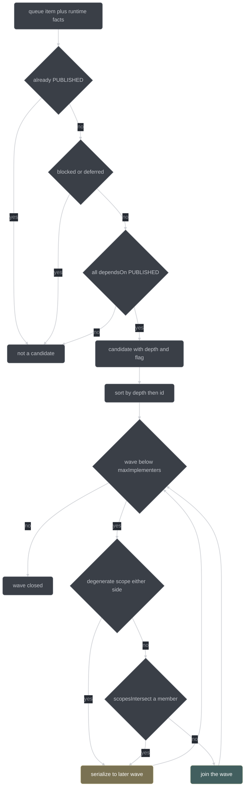
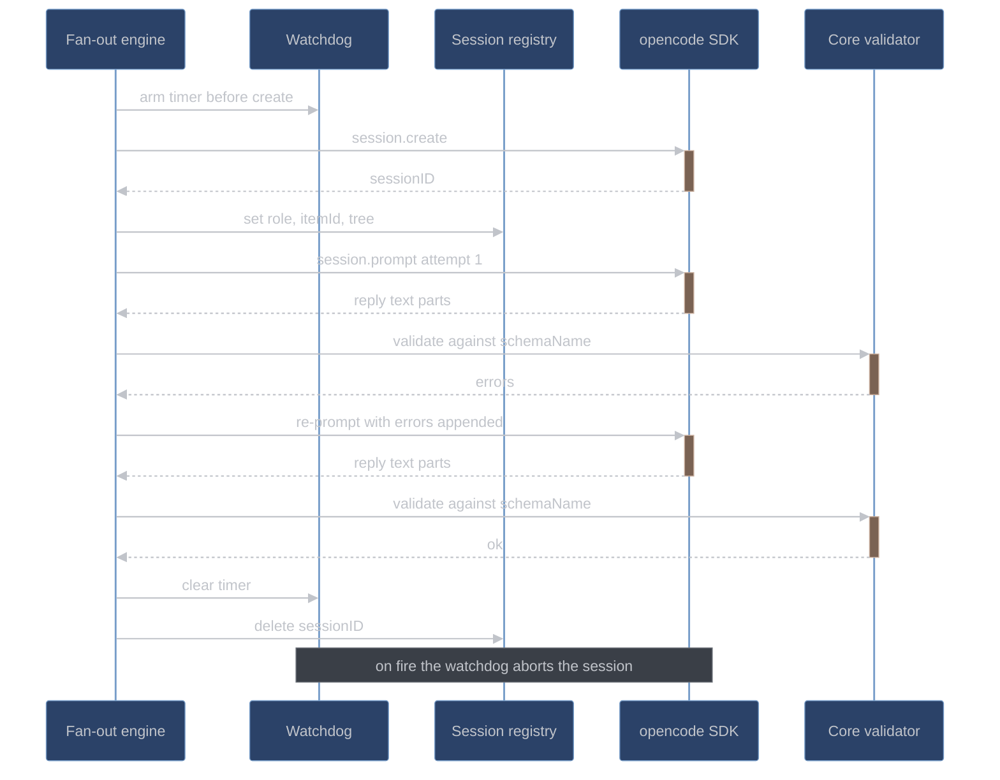

# Scheduling and fan-out

How conductor decides which items run together, who drives them, and how sub-sessions are
created, prompted, validated, and collected. This page is for anyone changing
[`core/schedule.ts`](../../conductor/core/schedule.ts),
[`adapter/fanout.ts`](../../conductor/adapter/fanout.ts), or
[`adapter/router-client.ts`](../../conductor/adapter/router-client.ts).

Two modules split the work. `core/schedule.ts` is pure: it answers "which items may run at
the same time" from the queue, the runtime item facts, and the config caps — no I/O, no
clock, no globals. `adapter/fanout.ts` is the engine that actually runs them: it creates
opencode sub-sessions over the SDK, prompts them, validates what comes back, and collects
results. The scheduler decides; the engine executes.

## The wave

A wave is the maximal set of queue items that may be worked simultaneously.
`nextWave(queue, items, config)` returns `{parallel: string[], rationale: string}`, where
`rationale` is always a non-empty sentence explaining the selection or the empty result.

Membership is four conditions, each checked explicitly in the candidate loop:

| #   | Condition                 | How it is checked                                                                                       |
| --- | ------------------------- | ------------------------------------------------------------------------------------------------------- |
| a   | Dependency-ready          | every id in `dependsOn` is in the PUBLISHED set; nothing below PUBLISHED unlocks a dependent            |
| b   | Pairwise scope-disjoint   | `scopesIntersect(candidate.fileScope, chosen.fileScope)` is false against every already-selected member |
| c   | Not blocked, not deferred | the runtime item's `blocked` and `deferred` annotations are both `null`                                 |
| d   | Within the cap            | the wave is closed once it reaches `parallel.maxImplementers`                                           |

Two filters sit alongside them: an item already in state `PUBLISHED` is never a member, and
an item with no runtime record is not schedulable — the scheduler has no facts about it, so
it is skipped rather than guessed at.

### Order is intrinsic

Candidates are sorted by **DAG depth ascending, then item id ascending**, and that sorted
order is both the order the wave is emitted in and the order the greedy selection walks.

Depth is the longest dependency chain over the *full* queue graph: 0 for an item with no
`dependsOn`, otherwise `1 + max(depth of its dependencies)`. It is computed from the edges
alone, independent of publish state, so an item's ordinal never changes as the run
progresses. An unknown dependency id contributes 0, and an in-progress set makes a
malformed cyclic edge terminate rather than recurse forever — the queue is a DAG by schema,
so that guard is a floor, not a live path.

Order invariance matters because the wave is the input to everything downstream: which
sub-sessions get created, which trees get frozen, and the order `conductor_publish` walks.
If shuffling the queue array changed the wave, two runs over identical work could produce
different commits, different journals, and different reviews. A content-derived sort key
makes the wave a pure function of the queue's *content*, not its arrangement.

### The degenerate-scope defence

`scopesIntersect([], X)` returns `false`. An empty `fileScope` therefore reads as *disjoint
from everything* under a naive intersection, and an item carrying one would join every
wave — the exact opposite of what an unbounded write scope should do. A wildcard-headed
glob such as `*/foo.ts` is the mirror trap: its literal head is empty, so it prefixes every
path, and a check that trusted head comparison alone would have to get the empty case right
in two places.

The scheduler does not rely on `scopesIntersect` for either case. It classifies the scope
first, with `isDegenerateScope`:

```ts
// conductor/core/schedule.ts
function isDegenerateScope(fileScope: string[]): boolean {
  if (fileScope.length === 0) return true;
  for (const glob of fileScope) {
    const segments = glob.split("/").filter((seg) => seg.length > 0);
    if (segments.length === 0) return true;
    const head = segments[0];
    if (head.includes("*") || head.includes("?") ||
        head.includes("{") || head.includes("[")) return true;
  }
  return false;
}
```

A degenerate scope on **either** side of a comparison forces a conflict, so a
degenerate-scope item never shares a wave with anything. It still runs — it simply runs
alone. The wildcard vocabulary here (`*`, `?`, `{`, `[`) is deliberately the same set
`shell-parse.ts` uses to compute a literal head, so the two modules agree on what
"wildcard-headed" means.

## scopesIntersect is conservative

The intersection test lives in
[`core/shell-parse.ts`](../../conductor/core/shell-parse.ts). It takes each glob's
**literal head** — the leading path segments before the first wildcard construct — and
reports intersection when any pair of heads is a segment-wise prefix of the other.

```ts
scopesIntersect(["src/parser/*.ts"], ["src/parser/lexer.ts"]);  // true  (correct)
scopesIntersect(["src/*.ts"],        ["src/*.md"]);             // true  (over-approximate)
scopesIntersect(["src/a/**"],        ["src/b/**"]);             // false (disjoint)
scopesIntersect(["src"],             ["src2/lib.ts"]);          // false (segment-wise)
```

Three properties follow from that definition:

- **Segment-wise, not string-wise.** `src` is not a prefix of `src2/...`, because the
  comparison walks whole path segments. A string-prefix test would have merged unrelated
  directories.
- **Case-insensitive.** On a case-insensitive filesystem — the reference host is macOS —
  `Src/**` and `src/**` name the same real directory, so folding case is the safe
  direction.
- **Symmetric by construction**, since overlap is checked on both heads.

The over-approximation is the point. `src/*.ts` and `src/*.md` are genuinely disjoint file
sets, and the test still reports them as intersecting. That false positive costs
parallelism — the two items serialize into consecutive waves — and never costs correctness,
because two items that *do* overlap are never placed in the same wave. Errors in the
permissive direction would let two implementers write the same file concurrently; errors in
this direction just make the run slower. It is one of the project's recorded honest limits,
recorded as a limit precisely because it is a deliberate trade rather than a bug.

## Wave selection



## Who drives the wave

`conductor_dispatch_wave`'s handler runs an internal driver: **one async pipeline per wave
member**, each walking that item's FSM by calling the same handlers the per-item tools
call, all sharing the fan-out engine's concurrency budget. The orchestrator model does not
interleave items.

This is the only arrangement that works, and the reason is mechanical rather than
aesthetic. A single opencode session executes tool calls **sequentially**. Under a
marker-only `dispatch_wave` — a tool that merely records "these items are now in flight"
and returns — the advertised overlap, item B's test being written while item A implements,
would require the orchestrator model to emit concurrent tool calls. That is a dependency on
model behavior for a *concurrency guarantee*, and the design refuses it explicitly: fan-out
does not depend on the model emitting parallel task calls. Concurrency lives in the engine,
which is deterministic, testable against the fake SDK, and cannot forget.

The per-item tools stay callable — single-item runs, inline claims, and recovery all use
them. The driver and the model reach the same handlers, so there is one implementation and
one set of gates either way.

## Ordering guarantees

The driver owns three ordering rules that the scheduler's disjointness check alone cannot
provide.

| Guarantee                                                            | Why                                                                                                         |
| -------------------------------------------------------------------- | ------------------------------------------------------------------------------------------------------------- |
| Implementer writes serialize per tree under `parallel.writes: "off"` | there is one working tree, so two concurrent implementers would race on it regardless of scope disjointness |
| `conductor_publish` runs serially in item order                      | the git index is a singleton; two concurrent stages would interleave into one commit                        |
| No write-capable dispatch enters a tree with a live verify marker    | the freeze is a scheduling rule, not only a gate — a held job waits rather than being denied                |

Test-writing is deliberately exempt from the first rule. Each test-writer is confined by
the edit-scope gate to its own item's `testScope`, and decomposition doctrine prefers a new
test file per item, so two test-writers in one wave do not target the same file; the one
window where their writes would genuinely be unsafe — a verify in flight — is already
covered by the freeze. Under `off`, then, a wave runs **one implementer at a time per
tree** while its members' RED tests are still written wave-wide (plan §4.3). What that
leaves overlapping in the default mode is every read stage plus test-writing against an
implementer that is thinking rather than verifying; full write concurrency is worktree
mode's job.

The third guarantee is where the scheduler and the engine meet. The edit-scope gate denies
every edit in a frozen tree, production and test files alike; the engine additionally
*holds* the dispatch, so a write-capable job never reaches a session that would immediately
be denied.
The gate is the correctness guarantee and the hold is the scheduling behavior that keeps
the gate from being hit in the first place.

## Stage batching

Within a wave the driver batches like stages: all members' vet critics dispatch together,
all members' review lenses dispatch together. The read fan-out for a stage is the stage's
configured reader count clamped to the ceiling:

```ts
readFanout(stage, config) === min(stageCount(stage, config), config.parallel.maxReaders)
```

| Stage        | Config key                    |
| ------------ | ----------------------------- |
| `planReview` | `workflow.planReviewers`      |
| `itemReview` | `workflow.itemReviewers`      |
| `vet`        | `workflow.vetCritics`         |
| `skeptics`   | `workflow.skepticsPerFinding` |

Under one model, batching saves no model swaps — there are none to save. What it still buys
is **KV prefix locality**: like stages across wave members share most of their prompt
prefix, so dispatching them contiguously lets llama-router's group affinity dequeue them
together and llama-server's slot reuse keep that prefix hot. Batching also keeps the read
fan-out saturated, which is where most of a run's usable concurrency lives.

## Worktree mode

*Not yet wired: worktree mode is built in task 9.6; the default `parallel.writes: "off"`
runs one implementer per tree until then.*

Under `parallel.writes: "worktrees"`, each wave implementer gets its own worktree at
`<stateHome>/conductor/<workspaceKey>/worktrees/<runId>/<itemId>` — **outside the
repository**, for the same reason quarantine is, with more force. A worktree is a complete
second copy of every test file in the project. Placed inside the repo, a whole-tree runner
in the main tree would discover and execute all of them, including another item's
in-progress red test. Quarantine moves a handful of files out of the walked tree; a
worktree inside it would add an entire second tree's worth of collectable tests.

The rest of the mode is four rules:

- **Edit-scope binding.** Each session's edit-scope gate binds to its worktree path, so an
  implementer cannot write into the main tree or into another item's worktree.
- **Serial merge-back in item order.** `git merge --ff-only` where possible, otherwise a
  normal merge performed by the handler.
- **Re-validation against the integrated tree.** After each merge the item re-validates
  before reaching PUBLISHED. A green in isolation is not a green in company, and the
  integrated tree is the only place where that distinction can be observed.
- **Conflict fallback.** Scope disjointness makes conflicts structurally rare; a conflict
  anyway drops the later item to GREEN, and it re-validates from there.

The groundwork is already in place: `gitio` and `evidence.runVerify` take an explicit
tree/`cwd` argument, and verify markers are per-tree from day one.

## The fan-out engine

`createFanout(client, config, journal, registry, treeState, runId)` returns
`{dispatch, dispatchWave}`. A job is `{role, itemId, tree, writeCapable, prompt,
schemaName, priority, lens?}`; a result is `{sessionID, value?, error?, timings}` with
`timings: {startedMs, endedMs, durationMs}`. `dispatchWave` writes results positionally, so
`results[i]` always corresponds to `jobs[i]` regardless of completion order.

Each job is create, prompt, collect:

1. **Create** — `session.create({body: {title: "<role>:<itemId>"}})`. A create that returns
   no usable id ends the job with an `env` error rather than proceeding.
2. **Prompt** — `session.prompt({path: {id}, body: {parts: [{type: "text", text}], model}})`.
3. **Collect** — the reply's text parts are joined, parsed as JSON, validated, and the
   registry entry is deleted.

### The registry is written before the first prompt

Immediately after `session.create` returns an id, the engine writes
`registry.set(sessionID, {role, itemId, tree})` — **before** the first prompt is sent.

The session-registry gate is the first gate in the stack: a session with no registry entry
may read, but every write-shaped call and every `conductor_*` call is denied. A sub-session
that was prompted before its entry existed would be a live session capable of making tool
calls that the gates cannot classify. Ordering the two operations this way is what makes
"no unregistered writer" a structural property rather than a timing hope. The entry is
deleted on every terminal path, including the watchdog path.

### Independent schema validation with bounded retry

The prompt body carries **no `format` field**. The prompt-body
`format: {type: "json_schema"}` field does not exist at opencode 1.18.15 — it is accepted
silently and produces neither `response_format` nor `json_schema` in the provider request,
so no schema'd body field is emitted at all. Structured output is therefore prompt-shaped,
and independent validation by the engine is not a belt-and-braces extra: it is the only
mechanism holding receipts to their schema.

The loop runs at most three prompts per session — the initial attempt plus at most two
re-prompt retries:

```ts
const MAX_ATTEMPTS = 3;
```

Each attempt parses the joined text parts as JSON and runs the pure core `validate(schemaName, parsed)`.
On success the job finishes with the parsed value. On failure below the attempt cap, the
retry prompt keeps the **original instruction** and appends the concrete validation errors
as a bulleted list, so the model is correcting a named defect rather than guessing at what
went wrong. When the budget is spent, the job finishes with an `env` error carrying the
final error list — an env-failed *completion*, never confused with a watchdog abort.

### The watchdog

A per-job timer is armed on the global `setTimeout` **before** `session.create`, so
`parallel.subSessionTimeoutMs` bounds the entire job including the create phase. If create
itself hangs, nothing else in the system would abort it and the whole wave would stall
behind one slot.

On fire the watchdog aborts the session over the SDK if an id exists yet, journals
`subsession.abort` at `warn` with `reason: "watchdog-timeout"`, and produces an `env` error
result. A `done` flag makes completion exactly-once across every path, so a `create` that
resolves *after* the watchdog fired cannot double-finish — and if that late create did
produce a session id, it is aborted so it does not leak.

### Freeze-aware admission

Within a model group the engine admits up to `parallel.maxReaders` jobs at once. Before
admitting a job it checks the freeze:

```ts
if (entry.job.writeCapable && treeState.isFrozen(entry.job.tree)) { hold(entry); continue; }
```

A write-capable job for a frozen tree is **held** — not dispatched, and not denied. It
subscribes to `treeState.onClear` and is re-queued when the marker for its tree clears, so
release is event-driven: no timers, no polling. A read-only job for the same tree is
admitted immediately, because a verify in progress does not stop anyone reading.

Holding is registered before subscribing, because a `TreeState` may notify synchronously
from inside `onClear` when the tree is already clear. Registering first means a synchronous
clear finds the entry and releases it, instead of stranding a job and hanging the wave. The
release itself is idempotent across the synchronous path and a later marker-clear
notification.

### Per-model wave grouping

Jobs are grouped by resolved model — `config.models.roles[role] ?? config.models.default` —
preserving first-appearance order of groups and input order within each group, and one
group drains fully before the next starts. Given jobs for models A and B interleaved, the
dispatch order is AABB, not ABAB.

Under the single-model configuration this is the identity function on one group: every role
resolves to the same model, so there is exactly one group and the barrier never fires. It
stays anyway because it costs one `groupBy` and it is the difference between a future
multi-model configuration being a config change and being a redesign.

## A fan-out job, end to end



## Roles

Every sub-session runs `config.models.default` — `qwen3.6-27b`. There is no role-to-weights
mapping in the base build, so no stage boundary costs a model swap. A role selects doctrine,
sampling, gate posture, and a router priority tag; it never selects weights.

| Role         | Doctrine pack                   | Temp | Gate posture                   | Priority    |
| ------------ | ------------------------------- | ---- | ------------------------------ | ----------- |
| orchestrator | `core.md`                       | 0.4  | edit: ask (inline claims only) | interactive |
| planner      | `decompose.md` / `plan.md`      | 0.7  | edit: deny                     | interactive |
| testWriter   | `tdd.md`                        | 0.5  | edit: `testScope` only         | review      |
| implementer  | `tdd.md` (+`debug.md` in DEBUG) | 0.4  | edit: `fileScope` only         | review      |
| reviewer     | `review.md` / `test-vet.md`     | 0.3  | edit: deny                     | review      |
| skeptic      | `skeptic.md`                    | 0.3  | edit: deny                     | review      |
| mechanical   | `core.md` (lite)                | 0.1  | edit: deny                     | batch       |

The single-model decision is also what makes the POC's measurement meaningful: a quality
delta measured this way is attributable to process, not to a bigger model doing the
reviewing.

## Review adjudication

Item review dispatches fresh reviewers over the item's diff, spec, and test, one lens each:

| Lens                      | Looks for                                                            | Mandatory                    |
| ------------------------- | -------------------------------------------------------------------- | ---------------------------- |
| spec/contract             | missing requirements, unrequested extras, API and contract soundness | yes                          |
| correctness               | defects in the change itself                                         | yes                          |
| guardrail                 | security, trust-boundary validation, data loss                       | yes                          |
| test-adequacy             | does the test still honestly pin the change now that the impl exists | yes                          |
| minimality/simplification | unnecessary machinery, simpler equivalents                           | yes                          |
| perf                      | performance consequences                                             | added at `itemReviewers` ≥ 6 |

Session count is `clamp(itemReviewers, 3, 6)`. At 6 each lens gets its own session. Below 6,
lenses **merge pairwise from the tail** of the priority list: 5 merges minimality with perf;
4 additionally joins test-adequacy to spec/contract; 3 gives spec+correctness,
guardrail+minimality, test-adequacy+perf. Values below 3 clamp to 3 with a journal warning.
Merging never drops a mandatory lens, and configuration cannot truncate the mandatory five
away.

Every finding then faces `skepticsPerFinding` refuters, and survival is a threshold on the
uphold count:

```ts
// conductor/core/verdict.ts
export function findingSurvives(verdicts: readonly Verdict[], k: number): boolean {
  let upholds = 0;
  for (const verdict of verdicts) if (verdict.upheld) upholds += 1;
  return upholds >= Math.ceil(k / 2);
}
```

**A tie upholds.** At the default `k = 2` the threshold is `⌈2/2⌉ = 1`, so a finding two
skeptics split on survives — a finding worth arguing about is worth a fix round. At `k = 3`
the threshold is 2, a strict majority.

Adjudication is two-stage. Surviving spec/contract findings are fixed **first**, and
quality-lens findings from a round that produced surviving spec findings are **discarded
and re-derived** after the fix. Judging not-yet-spec-compliant code is wasted judgment: the
quality findings were derived against code that is about to change shape. All lenses still
dispatch in parallel — the two-stage rule is an ordering over adjudication, not over
dispatch, so it costs nothing in wall-clock.

Surviving findings are routed by the paths their fix touches, not by a fixed recipient —
see [state machines](state-machines.md) for the routing table and the re-vet requirement.

## The router client

[`adapter/router-client.ts`](../../conductor/adapter/router-client.ts) is the plugin's
metrics client for llama-router. It is an adapter because it does network I/O,
and it is strictly fail-soft, because the router is a residual-risk dependency that the
process must survive losing.

| Function                                                | Returns                           | Failure behavior                                                                                                      |
| ------------------------------------------------------- | --------------------------------- | --------------------------------------------------------------------------------------------------------------------- |
| `fetchMetricsSummary(routerCfg, log?)`                  | `Promise<MetricsSummary \| null>` | `null` on request failure, non-200, unparseable body, or a body that is not an object; journals the reason at `debug` |
| `resolveBaseUrl(routerCfg, upstreamCfg, failoverState)` | `string`                          | synchronous and pure — no I/O, so it cannot fail                                                                      |
| `noteRouterFailure(failoverState, log?)`                | `void`                            | records one failover and journals `failover` at `warn`                                                                |
| `createFailoverState()`                                 | `FailoverState`                   | a fresh, unlatched state                                                                                              |

Absorption is total. The single underlying GET settles exactly once and never rejects: a
refused connection, a socket error, a body-read error, and a hang past the probe timeout all
resolve to `null`, and the timeout destroys the socket so no probe can wedge the event loop.
The probe timer is `unref`'d so a pending probe never keeps the process alive on its own.

### The failover latch

`FailoverState` is `{failovers, useUpstream, metricsPartial, probingDisabled}`, threaded
through the session by the fan-out engine. When the engine observes a router request
failure it calls `noteRouterFailure`, and the first failover:

- increments `failovers`,
- sets `useUpstream`, which pins `resolveBaseUrl` to the **upstream** origin for the
  remainder of the session,
- sets `metricsPartial`, which `conductor_report` reads and reports.

The latch is deliberate. Without it, "layer 2 is fail-soft" would mean only "the process
would have been fine if the crash had happened at a different time" — in-flight
sub-sessions still die and the run still takes `env` failures. Pinning the base URL for the
rest of the session converts a flapping dependency into one clean, recorded transition.
Marking metrics partial is the honesty half: the router's ledger has a hole in it, and the
report says so rather than presenting a partial dataset as complete.

### The second-failover rule

A second failover in one session sets `probingDisabled`, and from that point `resolveBaseUrl`
keeps returning the upstream with **zero network calls**. Two failures is enough evidence that
the router is not coming back within this session; continuing to probe it would spend a probe
timeout per check to learn something already known. The §4.4 failover protects conductor's own
setup probes only — the run's model traffic reaches the router through opencode's fixed
provider base URL, which the plugin cannot repoint mid-session, so a router that dies mid-run
takes `env` failures on its in-flight sub-sessions and the supervisor's restart is the
resilience story, not a client-side probe.

The endpoints are `/conductor/health` and `/conductor/metrics`. `MetricsSummary` carries
`totalRequests`, `schemaMissing`, `schemaConformed`, `statusCounts`, `promptTokens`, and
`completionTokens` — the POC's cost and conformance dataset. See
[llama-router](llama-router.md) for what serves them.

## See also

- [State machines](state-machines.md) — the item FSM the wave driver walks per member
- [Gates](gates.md) — the session registry, edit-scope, and freeze gates the engine feeds
- [Evidence and quarantine](evidence-and-quarantine.md) — verify markers and the foreign red set
- [llama-router](llama-router.md) — admission, group affinity, and the metrics ledger
- [opencode integration](opencode-integration.md) and
  [`adapter/wire-notes.md`](../../conductor/adapter/wire-notes.md) — the verified wire contract
