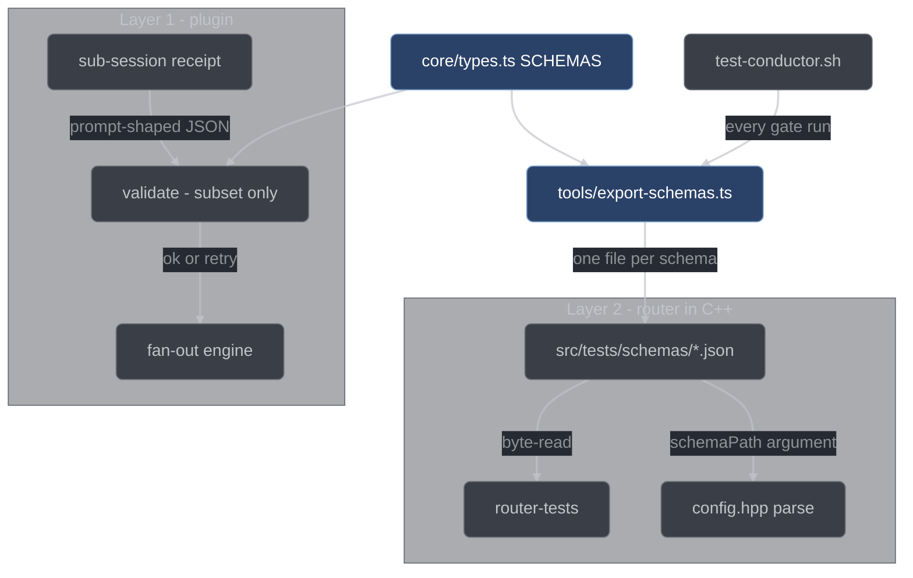

# Schemas

Every document conductor writes, reads, or asks a model to produce is described by one
schema, defined once in [`conductor/core/types.ts`](../../conductor/core/types.ts). This
page covers how that single source is written, why it is deliberately weaker than JSON
Schema, how it reaches the C++ router tests, and what to do when you need to change one.

## One source

`core/types.ts` is a core module in the sense of [core and adapters](./core-and-adapters.md):
pure, and it imports nothing at all. Each schema of plan §2 exists in it exactly three
times, in three coupled forms:

| Form                                      | What it is             | Who uses it                                  |
| ----------------------------------------- | ---------------------- | -------------------------------------------- |
| A TypeScript `interface` or `type`        | compile-time shape     | every module that touches the document       |
| A hand-written JSON Schema object         | runtime shape          | the subset validator, the router             |
| An entry in the exported `SCHEMAS` record | the name-to-schema map | `validate`, the fan-out engine, the exporter |

There is no code generator between them. The schema objects are written by hand — that is
the zero-dependency choice, and it is why the discipline below matters. The TS type and
the schema object sit next to each other in the file, so an edit that touches one and not
the other is visible in the diff.

`SCHEMAS` is a plain mutable `Record<string, unknown>`, so tests can register a temporary
schema through it and `validate` resolves the name at call time rather than closing over a
snapshot.

```ts
const result = validate("Item", parsedItemJson);
// { ok: false, errors: ['Item.state: value is not one of the enum members'] }
```

`validate(schemaName, value)` returns `{ ok: boolean; errors: string[] }`. It never throws,
never mutates its input, and an unregistered name is itself an error
(`no schema named "X" is registered`). Errors carry dotted instance paths —
`Item.attempts.green`, `Queue.items[3].fileScope` — so a failure names the field rather
than the document.

## The keyword-subset discipline

The validator implements six keywords, and nothing else:

| Keyword                | Behavior                                                                         |
| ---------------------- | -------------------------------------------------------------------------------- |
| `type`                 | a JSON type name, or an array of them (`["object", "null"]` for nullable fields) |
| `required`             | listed properties must be present on an object                                   |
| `enum`                 | the value must be `===` one of the members                                       |
| `properties`           | per-property subschemas                                                          |
| `items`                | one subschema applied to every array element                                     |
| `additionalProperties` | `false` rejects unlisted properties; a schema value validates them               |

Every shipped schema restricts itself to that subset. The important half is what happens
to a schema that does not: `validate` walks the whole schema with `scanKeywords` *before
it looks at the value at all*, and any keyword outside the subset — at any depth, in any
branch, whether or not this particular value would exercise it — is an error naming the
keyword:

```text
TaskOneOne-OutOfSubset-Pattern: schema keyword "pattern" is outside the validator subset
TaskOneOne-OutOfSubset-Minimum.properties.a: schema keyword "minimum" is outside the validator subset
TaskOneOne-OutOfSubset-OneOf: schema keyword "oneOf" is outside the validator subset
```

Tuple-form `items` (an array of subschemas) is rejected for the same reason: JSON Schema
2020-12 replaced it with `prefixItems`, so a schema carrying it would be read one way here
and another way by a 2020-12 validator.

**Why reject rather than ignore.** llama-router validates the *same exported schemas* with
a full JSON Schema implementation. If a schema used a keyword this validator silently
ignored, the two layers would reach different verdicts about the same payload, and the
fan-out engine would see rejections it could not reproduce locally — the worst class of
bug in a system whose whole premise is mechanical enforcement. Rejecting the keyword makes
that divergence impossible to introduce quietly. The schemas are constrained to the weaker
validator on purpose.

Two consequences fall out of the subset, and both are handled explicitly rather than
worked around:

- **No combinators.** `EvidenceRecord` and `AnomalyRecord` are discriminated unions in
  TypeScript. The schema encoding is a single object carrying the union of every variant's
  fields, requiring only the shared ones — `seq, ts, kind, itemId` for evidence,
  `ts, kind` for anomalies. The writer owns the per-kind shape.
- **No cross-field rules.** The §2.10 `Classification` rule — `trivialItem` must be a
  complete queue item when `kind` is `"trivial"`, and `null` otherwise — cannot be
  expressed in the subset, so it is hand-coded in `validate` after the structural pass:

  ```text
  Classification: kind "trivial" requires a complete non-null trivialItem
  Classification: trivialItem must be null unless kind is "trivial"
  ```

  The *completeness* half is still schema-enforced, by the `trivialItem` subschema's own
  `required` list.

Subset-cleanness is not left to review. A test in
[`conductor/tests/types.test.ts`](../../conductor/tests/types.test.ts) walks every entry
in `SCHEMAS` and asserts the offense list is empty, with a self-test on the walker first
so it cannot pass vacuously.

## The exported schemas

`SCHEMAS` holds 18 entries. Five groups:

**Configuration.**

| Name           | Document                                                                                                                                                            |
| -------------- | ------------------------------------------------------------------------------------------------------------------------------------------------------------------- |
| `Config`       | `.conductor/config.json` — the per-target-repo manifest: verify scopes, format rules, git policy, workflow caps, parallelism, models, retention, logging            |
| `RouterConfig` | `.data/configs/conductor-router.json` — the llama-router document: listen/upstream endpoints, admission, priorities, affinity, schema observation, metrics, logging |

**Run state.**

| Name    | Document                                                                                                                                                                        |
| ------- | ------------------------------------------------------------------------------------------------------------------------------------------------------------------------------- |
| `Run`   | `runs/<runId>/run.json` — run id, prompt, session, FSM state, classification, start `HEAD`/branch/dirty set, stop record, counters                                              |
| `Queue` | `runs/<runId>/queue.json` — the ordered item list; also the receipt schema for the decompose sub-session                                                                        |
| `Item`  | `runs/<runId>/items/<itemId>.json` — item FSM state, assignee, worktree, attempt counters, the `blocked`/`deferred`/`debugging` annotations, evidence refs, taint, inline claim |

**Ledger records.** One record per line of the corresponding `.jsonl` file.

| Name             | Document                                                                                                                                                            |
| ---------------- | ------------------------------------------------------------------------------------------------------------------------------------------------------------------- |
| `EvidenceRecord` | `runs/<runId>/evidence.jsonl` — a `red`, `green`, or `verify` observation, with the command, exit code, failure class, and the verify's start stamp and judged tree |
| `DecisionRecord` | `runs/<runId>/decisions.jsonl` — a fork with its options, per-option scores, choice, rationale, and where it was applied                                            |
| `AnomalyRecord`  | `runs/<runId>/anomalies.jsonl` — an `override`, `gate-crash`, or `disengage` event                                                                                  |
| `QuestionRecord` | `runs/<runId>/questions.jsonl` — a surfaced question, its origin, the items it blocks, and its answer                                                               |
| `JournalRecord`  | the structured log line: sequence, level, component, event, the `(runId, itemId?, sessionID?)` correlation triple, and a free-form `data` object                    |

**Sub-session receipts.** These are the structured outputs the fan-out engine asks a
sub-session to produce and then validates itself.

| Name                  | Receipt                                                                                 |
| --------------------- | --------------------------------------------------------------------------------------- |
| `Classification`      | intake's `question` / `trivial` / `work` call, plus the synthesized item when trivial   |
| `ClassificationCheck` | the second opinion on that call: agreed, corrected kind, note                           |
| `Plan`                | the plan document plus the decision proposals the planner wants recorded                |
| `Findings`            | a reviewer's findings, each with id, severity, lens, claim, evidence, and suggested fix |
| `Verdict`             | one skeptic's `upheld` / not-upheld ruling on one finding, with reasoning               |
| `TestVet`             | the five-criterion test verdict plus the `mustFix` list                                 |
| `ImplementerResult`   | status, summary, concerns, needed context, block reason                                 |

**Workspace registry.**

| Name               | Document                                                                                                                       |
| ------------------ | ------------------------------------------------------------------------------------------------------------------------------ |
| `StaleRedRegistry` | `.conductor/state/stale-red.json` — paths known to be red for reasons outside the current run, quarantined before every verify |

Two of these schemas are *derived* rather than re-listed, so a field added to the parent
cannot drift the child:

- `Plan`'s decision proposals are `DecisionRecord` minus the two fields the handler mints
  (`id`, `tsIso`) — `Omit<DecisionRecord, "id" | "tsIso">` on the TS side, and a filter
  over `decisionRecordSchema.properties` on the schema side. A hand-copied list would
  surface its drift only as the fan-out engine rejecting well-formed plans.
- `Classification.trivialItem` reuses the queue item's own property and required lists, so
  "a complete queue item minus `id` and `dependsOn`" stays literally true.

## How a schema reaches its two consumers



The plugin never reads the exported files, and the router never reads `types.ts`. Both
sides are looking at the same objects, which is the point.

## Export mechanics

[`conductor/tools/export-schemas.ts`](../../conductor/tools/export-schemas.ts) is a
dev/test-time script with no runtime dependencies — Node built-ins only, erasable
TypeScript, so it runs directly under type stripping.

```ts
export function exportSchemas(outDir: string): string[];
```

It creates `outDir` (and any missing parents), writes one file per entry as
`<Name>.schema.json`, and returns the names written. The bytes are pinned:
`JSON.stringify(schema, null, 2)` — two-space indent, **no trailing newline** — because
[`src/tests/config_test.cpp`](../../src/tests/config_test.cpp) and its successors read
those files as bytes and re-serialize them.

The CLI leg is guarded so the module is side-effect-free on import:

```ts
if (process.argv[1] && process.argv[1].endsWith("export-schemas.ts")) {
  exportSchemas(process.argv[2] ?? path.resolve("src/tests/schemas"));
}
```

Node type stripping has no `import.meta.main`, so the `argv[1]` suffix check is the robust
equivalent, and importing the module — which the test does — never touches the filesystem.

Regeneration is not a manual step.
[`scripts/test-conductor.sh`](../../scripts/test-conductor.sh) runs
`node conductor/tools/export-schemas.ts src/tests/schemas` at the end of every gate run,
after the TAP, typecheck, and Bun legs. It is a *generation* step, not an assertion — a
nonzero exit means the exporter itself is broken and fails the gate; correctness of the
output is the job of
[`conductor/tests/export-schemas.test.ts`](../../conductor/tests/export-schemas.test.ts),
which pins four things: the returned names equal `Object.keys(SCHEMAS)` exactly, every
file round-trips to a deep-equal object and to the exact pinned bytes, the directory
contains exactly those `.schema.json` files and nothing else, and a missing `outDir` is
created.

`src/tests/schemas/` is listed in `.gitignore`. The files are build output; the schemas
are the source.

## Closed vocabularies

Every enumerated vocabulary is an `as const` array, and that array is the single source
for both the TypeScript union type and the schema's `enum` member list:

```ts
const ITEM_STATES = [
  "PENDING", "RED", "TEST_VETTED", "GREEN", "VALIDATED", "REVIEWED", "PUBLISHED",
] as const;
export type ItemState = (typeof ITEM_STATES)[number];

// ...and in the schema object, the same array:
const itemSchema = { properties: { state: { enum: ITEM_STATES } /* ... */ } };
```

A TypeScript `enum` would be the obvious alternative and is unavailable: guardrail G2
restricts the codebase to erasable TypeScript so Node's type stripping can run the same
files that opencode's Bun runtime loads, and `conductor/tsconfig.json` pins that
mechanically with `"erasableSyntaxOnly": true`. `enum`, `const enum`, `namespace`, and
parameter properties are all out. The `as const` array is the erasable equivalent, and it
is strictly better here anyway: the runtime value and the type are the same declaration,
so they cannot disagree.

| Vocabulary           | Members                                                                                                              |
| -------------------- | -------------------------------------------------------------------------------------------------------------------- |
| Log levels           | `error`, `warn`, `info`, `debug`, `trace`                                                                            |
| Run states           | `INTAKE`, `DECOMPOSED`, `PLANNED`, `PLAN_REVIEWED`, `EXECUTING`, `REPORTED`, `TRIVIAL_DONE`, `ANSWERED`              |
| Item states          | `PENDING`, `RED`, `TEST_VETTED`, `GREEN`, `VALIDATED`, `REVIEWED`, `PUBLISHED`                                       |
| Stop kinds           | `done`, `noop`, `blocked`, `surfaced`, `env`, `interrupt`                                                            |
| Classification kinds | `question`, `trivial`, `work`                                                                                        |
| Evidence kinds       | `red`, `green`, `verify`                                                                                             |
| Failure classes      | `assertion`, `missing-subject`, `error`                                                                              |
| Decision kinds       | `derived`, `human`                                                                                                   |
| Anomaly kinds        | `override`, `gate-crash`, `disengage`                                                                                |
| Question origins     | `surface-tool`, `plan-review-cap`, `debug-architecture`, `implementer-blocked`, `review-round-cap`, `scope-conflict` |
| Severities           | `major`, `minor`, `nit`                                                                                              |
| Implementer statuses | `DONE`, `DONE_WITH_CONCERNS`, `NEEDS_CONTEXT`, `BLOCKED`                                                             |
| Ladder rungs         | `skip`, `reuse`, `stdlib`, `platform`, `dependency`, `one-liner`, `minimal-code`                                     |

`Config`'s own vocabularies — git modes, branch policies, dirty-tree handling, format
modes, parallel write modes, ponytail levels — follow the same pattern; see the
[configuration reference](../user/configuration.md) for what each one means.

The journal's vocabularies live one file over, in
[`core/journal-events.ts`](../../conductor/core/journal-events.ts), under the same
pattern: eight components — `fsm`, `gates`, `fanout`, `evidence`, `continuation`,
`inject`, `router-client`, `state` — and a closed list of event names per component, with
`isKnownEvent(component, event)` as the check the journal adapter runs on every write. An
unlisted event name is caught at its source rather than landing in the journal under a
name no test can grep for.

`types.ts` keeps its vocabulary arrays module-private; only the erased TS unions are
exported. That makes the schema `enum` the sole runtime-derivable copy — and it is exactly
the copy the validator uses.
[`conductor/tests/single-source.test.ts`](../../conductor/tests/single-source.test.ts)
exploits this: it reads `SCHEMAS.Run.properties.state.enum` and
`SCHEMAS.Item.properties.state.enum` at runtime and asserts set equality against the
`RUN_STATES` and `ITEM_STATES` the [state machines](./state-machines.md) export. A state
added to an FSM but not to its schema, or the reverse, turns the suite red.

## The C++ side

[`src/router/config.hpp`](../../src/router/config.hpp) is the first router consumer of the
exported schemas, and it demonstrates the rule the rest of the router follows: it
validates against whatever schema **file** it is handed, never a copy of the shape baked
into the header.

```cpp
RouterConfig parseRouterConfig(const std::string& json, const std::string& schemaPath);
```

`parseRouterConfig` runs four steps in order:

1. **Parse** the input text as JSON. A syntax error throws immediately.
2. **Fill the documented defaults.** Three §2.2 keys are optional in the hand-edited
   document — `logging.level` (`"info"`), `schema.rejectOnMissing` (`false`), and
   `affinity.contiguousDequeue` (`true`) — and are filled in before validation, because the
   exported schema marks every key required. A block of the wrong type is left alone for
   the schema to reject by name.
3. **Validate** the completed document against the schema read from `schemaPath`. The file
   is opened, parsed, and compiled on every call.
4. **Range-check both ports** to `1..65535`, since the schema types them as plain numbers.
   `logging.level` is likewise checked against the levels the router can actually apply, so
   an unusable level is refused by name rather than falling back silently.

Every failure is a `ConfigError`, whose `field()` is a dotted path — `listen.port`,
`admission.bogus`, `logging.level` — built by converting the validator's RFC 6901 instance
pointer to dots and extending it with the property name the diagnostic quotes, since the
validator's pointer stops at the enclosing object for missing-property and
additional-property violations. `what()` is guaranteed to contain `field()` verbatim.
`field()` is empty when the offender cannot be named — a syntax error in the input
document, a schema violation the validator could not attribute to a property, or a schema
file that could not be read, parsed, or compiled (that last case names the path in
`what()`).

That the file drives the decision is itself tested: the router tests reject a stray
`batching` block under the exported schema, then accept the identical document under a
copy of that schema with `batching` permitted. A parser carrying a hand-written copy of the
shape would produce the same answer twice and fail the test.

## Changing a schema

1. **Edit [`core/types.ts`](../../conductor/core/types.ts) once**, updating the TS type and
   the JSON Schema object in the same change. They sit adjacent for exactly this reason.
2. **Stay inside the subset:** `type`, `required`, `enum`, `properties`, `items`,
   `additionalProperties`. For a constraint the subset cannot express, hand-code it in
   `validate` next to the `Classification` rule and say why in a comment.
3. **New vocabulary goes in an `as const` array** referenced by both the type and the
   schema's `enum`. Never write the member list twice.
4. **Prefer deriving over copying.** If the new shape is another shape plus or minus a
   field, derive it the way `Plan`'s decision proposals derive from `DecisionRecord`.
5. **Run the gate**: `bash scripts/test-conductor.sh`. It runs the suite, typechecks, runs
   the Bun smoke, and regenerates `src/tests/schemas/`, so the C++ side picks the change up
   on its next build with no separate step.
6. **Expect a guard to fire — and know which one.** A drifted FSM vocabulary fails
   `single-source.test.ts`; an out-of-subset keyword fails the subset-clean test in
   `types.test.ts`; a *renamed* schema fails that same file's hardcoded `SCHEMA_NAMES` list
   ("SCHEMAS contains a JSON Schema object for each of the 17 §2 names"). A newly *added*
   schema fires nothing: `export-schemas.test.ts` derives both sides of every assertion
   from `Object.keys(SCHEMAS)` at runtime, so an addition moves both sides together. Add the
   new name to `SCHEMA_NAMES` by hand. That list is also why it still reads 17 while
   `SCHEMAS` holds 18: `Plan` arrived later and was never added to it. If nothing went red
   at all, check that what you changed is actually reachable from `SCHEMAS`.

## See also

- [Core and adapters](./core-and-adapters.md) — the purity rule that keeps `types.ts` importing nothing
- [State machines](./state-machines.md) — the FSMs whose vocabularies the schemas pin
- [Scheduling and fan-out](./scheduling-and-fanout.md) — the receipt validation and re-prompt retry
- [llama-router](./llama-router.md) — the router's own use of the exported schemas
- [Testing and verification](./testing-and-verification.md) — the gate that regenerates them
