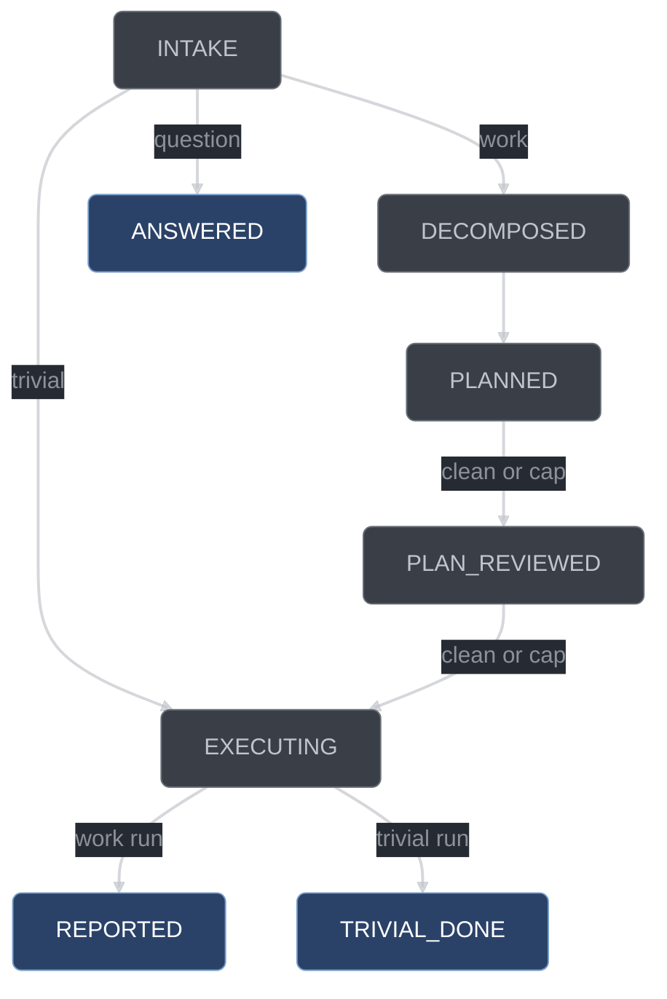

# State machines

conductor has two finite state machines — one per run, one per work item — and a third
derivation that turns their combined position into a set of legal tool calls. This page
covers all three at implementation depth: the exact vocabularies, the transition tables,
the evidence each edge consumes, and the rules that keep the derivation deterministic.
It is for anyone modifying [`core/fsm-run.ts`](../../conductor/core/fsm-run.ts),
[`core/fsm-item.ts`](../../conductor/core/fsm-item.ts),
[`core/gates-phase.ts`](../../conductor/core/gates-phase.ts), or
[`core/stops.ts`](../../conductor/core/stops.ts).

## Why the FSMs are pure

The FSM modules never advance anything. They answer one question — *is this edge legal
given this evidence?* — and return `{ok, why}`. The `conductor_*` tool handler is what
runs the test, reads the tree, writes the state file, and appends the journal record.

That split is load-bearing. The handler re-derives evidence itself, so the FSM must not be
able to acquire any of its own; if it could, there would be two places a red could be
"proven" and only one of them would have run a test. Every fact a transition needs
therefore arrives as a plain context argument: a classification, a count of surviving
majors, a test exit code, a failure class. The purity is mechanically enforced —
`conductor/tests/purity.test.ts` fails the run if any file under `conductor/core/` imports
anything but a relative `.ts` module resolving inside `core/`, or contains `node:fs`,
`node:child_process`, `Bun`, a `fetch(` call, `process.env`, or `Date.now`.

So a `why` string like `"GREEN->VALIDATED: full verify runs green, fresh"` names an
obligation the *handler* discharged before calling in. The FSM did not check freshness. It
checked that `GREEN → VALIDATED` is on the diagram and that nothing orthogonal vetoes it.

## The run FSM

A run is one user prompt's worth of work. `RUN_STATES` in
[`core/fsm-run.ts`](../../conductor/core/fsm-run.ts) is the closed vocabulary, exactly
eight positions:

```ts
export const RUN_STATES = [
  "INTAKE", "DECOMPOSED", "PLANNED", "PLAN_REVIEWED",
  "EXECUTING", "REPORTED", "TRIVIAL_DONE", "ANSWERED",
] as const;
```



### Transition table

`legalRunTransition(from, to, context)` is the whole surface. The context type carries
four optional fields — `classification`, `survivingMajors`, `round`, `max` — and each
edge consumes only what it needs.

| From                                   | To              | Advancing tool            | Context consumed                  | Rejected when                                                                                                                   |
| -------------------------------------- | --------------- | ------------------------- | --------------------------------- | ------------------------------------------------------------------------------------------------------------------------------- |
| `INTAKE`                               | `DECOMPOSED`    | `conductor_decompose`     | `classification === "work"`       | no classification recorded; classification is `trivial` or `question` (the `why` names the route that classification does take) |
| `INTAKE`                               | `EXECUTING`     | `conductor_classify`      | `classification === "trivial"`    | no classification; classification is `work` (the `why` names `DECOMPOSED`) or `question`                                        |
| `INTAKE`                               | `ANSWERED`      | `conductor_classify`      | `classification === "question"`   | no classification; classification is `work` or `trivial`                                                                        |
| `DECOMPOSED`                           | `PLANNED`       | `conductor_plan`          | none                              | any other target                                                                                                                |
| `PLANNED`                              | `PLAN_REVIEWED` | `conductor_plan_review`   | `survivingMajors`, `round`, `max` | majors survive and `round < max`                                                                                                |
| `PLAN_REVIEWED`                        | `EXECUTING`     | `conductor_dispatch_wave` | `survivingMajors`, `round`, `max` | majors survive and `round < max`                                                                                                |
| `EXECUTING`                            | `REPORTED`      | `conductor_report`        | `classification === "work"`       | the run is trivial — it closes report-lite to `TRIVIAL_DONE`                                                                    |
| `EXECUTING`                            | `TRIVIAL_DONE`  | `conductor_report`        | `classification === "trivial"`    | the run is work — it closes to `REPORTED`                                                                                       |
| `REPORTED`, `TRIVIAL_DONE`, `ANSWERED` | —               | —                         | —                                 | always: terminal, no successor is legal                                                                                         |

Every rejection carries a non-empty `why`, and an off-diagram rejection always names a
legal successor of `from`. That is not decoration — the phase-order gate denies by
`throw`ing the reason text at the model, so a rejection that does not say where the run
*can* go leaves the orchestrator guessing.

### Forward-only, and the plan-review loop

`RUN_SUCCESSORS` is a forward-only DAG. No state lists a predecessor as a successor, so
there is no legal edge that regresses a run.

The obvious objection is plan review, which is genuinely a loop: reviewers find majors,
the planner revises, review runs again. That loop lives entirely inside the
`conductor_plan_review` handler, which fans out reviewers, refutes findings through
skeptics, re-prompts the planner, increments `round`, and repeats — all while the run sits
at `PLANNED`. Only when the round is clean, or the cap is reached, does it call
`legalRunTransition` once.

Both plan-review edges share one gate function with exactly two exits.
`survivingMajors === 0` is the clean exit. `round >= max` is the `planReviewMaxRounds`
exit, at which point each surviving major becomes a question in `questions.jsonl`, every
item it names is annotated `blocked`, and the run proceeds on the rest. Anything else —
majors surviving below the cap — is a rejection. Keeping the loop in the handler means the
run's state file never records a backward step, so anything reading run history sees a
monotone sequence and needs no loop detection of its own.

### The two branching states

Six of the eight positions have at most one successor. Two branch, and both branch on data
the handler already recorded rather than on anything the model asserts at transition time.

**`INTAKE` routes on classification.** `RUN_SUCCESSORS` lists all three of its exits, but
`legalRunTransition` narrows them to one: `work → DECOMPOSED`, `trivial → EXECUTING`,
`question → ANSWERED`. With no classification present, every exit is rejected — the run
cannot leave `INTAKE` at all until `conductor_classify` has run. The `trivial` route
enters `EXECUTING` directly with one synthesized item and skips `DECOMPOSED`,
`PLANNED`, and `PLAN_REVIEWED`; it compresses fan-out width, never the item FSM.

**`EXECUTING` splits on the close.** The same `classification` decides which terminal the
run reaches: a work run closes to `REPORTED` with the full report, a trivial run closes
report-lite to `TRIVIAL_DONE`. Crossing the two is rejected in both directions, so a
trivial run cannot borrow the full-report terminal and a work run cannot close lite.

## The item FSM

An item is one queue entry: a bounded change with a `fileScope`, a `testScope`, and
dependency edges. `ITEM_STATES` in
[`core/fsm-item.ts`](../../conductor/core/fsm-item.ts) is the closed vocabulary, exactly
seven positions:

```ts
export const ITEM_STATES = [
  "PENDING", "RED", "TEST_VETTED", "GREEN",
  "VALIDATED", "REVIEWED", "PUBLISHED",
] as const;
```

Two chains share one tail. A behavioral item owes a proven failing test before it may go
green; a non-behavioral item has no constructible red and goes straight to `GREEN`.


### Transition table

`legalItemTransition(from, to, context)` takes `{item: {behavioral, blocked}, testExit,
failureClass}`. Two edges carry a real evidence gate; the rest are structural, with the
evidence re-derived by the handler.

| From          | To            | Advancing tool          | Context consumed                              | Rejected when                                                                                                                               |
| ------------- | ------------- | ----------------------- | --------------------------------------------- | ------------------------------------------------------------------------------------------------------------------------------------------- |
| `PENDING`     | `RED`         | `conductor_submit_test` | `item.behavioral`, `testExit`, `failureClass` | item is non-behavioral (the `why` routes to `GREEN`); `testExit` absent or `0`; `failureClass` is neither `assertion` nor `missing-subject` |
| `PENDING`     | `GREEN`       | `conductor_mark_green`  | `item.behavioral`                             | item is behavioral — it owes a proven `RED` first                                                                                           |
| `RED`         | `TEST_VETTED` | `conductor_vet_test`    | none                                          | any other target                                                                                                                            |
| `TEST_VETTED` | `GREEN`       | `conductor_mark_green`  | `testExit`                                    | `testExit !== 0` — the implementer is never done by assertion                                                                               |
| `GREEN`       | `VALIDATED`   | `conductor_validate`    | none                                          | any other target                                                                                                                            |
| `VALIDATED`   | `REVIEWED`    | `conductor_item_review` | none                                          | any other target                                                                                                                            |
| `REVIEWED`    | `PUBLISHED`   | `conductor_publish`     | none                                          | any other target                                                                                                                            |
| `PUBLISHED`   | —             | —                       | —                                             | always: terminal, no successor is legal                                                                                                     |

`failureClass` is the closed `assertion` / `missing-subject` / `error` vocabulary from the
evidence layer. Only the first two are a legal red: the behavior was evaluated and was
wrong, or the subject this item is contracted to build does not exist yet. Class `error` —
a syntax error, or a failure to resolve something outside the item's scope — goes back to
the test-writer for repair. A test that passes immediately is not a red either; that is
the `testExit === 0` rejection.

The `behavioral: false` chain is the only weakening in the item FSM, and it is bounded
arithmetically rather than by judgment: an item may declare `behavioral: false` only if
every path in its `fileScope` is disjoint from `verify.behavioralPaths`. That makes "skip
the failing test" mechanically impossible for real code and trivially legal for a comment
fix.

### Annotations are not positions

`blocked`, `deferred`, and `debugging` are fields on the item record, not FSM positions.
Any state may carry any of them. `ITEM_STATES` deliberately excludes all three, and
`conductor/tests/fsm-item.test.ts` asserts their absence directly.

They are orthogonal to progress. An item can be blocked at `PENDING` waiting on a
decomposition question, or blocked at `VALIDATED` because a review round hit its cap.
Modelling those as positions would double the state count and force every transition rule
to be written twice.

The `blocked` rule is applied **before** the transition table, not inside it. The first
statement in `legalItemTransition` reads `item.blocked` and, if it is neither `null` nor
`undefined`, returns a rejection naming the blocking `questionId` — whatever `from` and
`to` are, and whatever evidence the context carries. A blocked item therefore makes no
transition at all, including one that would otherwise be legal, until `conductor_answer`
resolves the named question. Putting the check first is what makes that statement total:
as a per-row condition, every new row would be a fresh chance to forget it, and the
failure mode would be an item advancing past a question the human never answered.

`deferred` is read by the scheduler and by tool legality rather than by the transition
function: a deferred item is a settled disposition a report can close on, and it never
joins a wave. `debugging` is a posture annotation only — it selects the `debug.md`
doctrine pack for the implementer's sub-session and vetoes nothing.

## Terminality

Terminality has exactly one definition, in
[`core/stops.ts`](../../conductor/core/stops.ts):

```ts
const TERMINAL_STATES: readonly string[] = ["ANSWERED", "REPORTED", "TRIVIAL_DONE"];

export function isTerminal(run: RunLike): boolean {
  return run.stop !== null || TERMINAL_STATES.includes(run.state);
}
```

The `stop !== null` disjunct is the important half. A run can stop anywhere — a wedged
loop, an exhausted override budget, an interrupt — so "EXECUTING with a stop recorded" is
terminal, and terminal for every subsystem at once because run creation, the continuation
engine, and tool legality all call this one function. A run that was terminal for the
re-prompt loop but live for the phase gate would both refuse to advance and refuse to
close.

Stop kinds are a closed vocabulary of six:

| Kind        | Recorded by             | Meaning                                                |
| ----------- | ----------------------- | ------------------------------------------------------ |
| `done`      | `conductor_report`      | the run closed with a full or lite report              |
| `noop`      | the continuation engine | `futileRePrompts` reached 3 — a wedged loop            |
| `blocked`   | `shouldTerminate`       | no open item remains and blocked items remain          |
| `surfaced`  | `shouldTerminate`       | no open and no blocked item remains, questions pending |
| `env`       | `shouldTerminate`       | the override budget is exhausted                       |
| `interrupt` | halt handling           | a halt file was present                                |

`STOP_KINDS` is exported as runtime data, `as const satisfies readonly StopKind[]`, so
consumers iterate exactly the list the type is drawn from.

`shouldTerminate(run, counters, itemsSummary, config)` is the termination rule the
continuation engine and the report tool both consult. It returns `{stop, kind?}` and
applies its rules in a fixed order:

1. An already-terminal run returns `{stop: false}` — computing a second stop for it would
   double-record.
2. `futileRePrompts >= 3` returns `noop`, **even with open items**: a wedged loop must end
   loudly rather than burn tokens.
3. Override-budget exhaustion returns `env`, also with open items allowed. Exhaustion
   means at least one override was *used* and the count reached
   `workflow.maxOverridesPerRun`; a zero cap at rest is not exhaustion, so a run cannot
   `env`-stop at start.
4. Otherwise an open item outranks the rest: `itemsSummary.open > 0` returns
   `{stop: false}`.
5. With no open items, `blocked > 0` returns `blocked`, then `surfacedQuestions > 0`
   returns `surfaced`.

`done` and `interrupt` are never computed here — the report tool and halt handling record
them directly. Deferred items influence no rule at all: they are settled, never
actionable.

## Tool legality

`legalTools(run, items, questions, repoConfigured)` in
[`core/gates-phase.ts`](../../conductor/core/gates-phase.ts) turns the two FSM positions
into a verdict with three parts:

| Part          | Type                              | Meaning                                     |
| ------------- | --------------------------------- | ------------------------------------------- |
| `legal`       | `Map<string, {itemIds?}>`         | every `conductor_*` tool callable right now |
| `recommended` | `{tool, args: {itemId?}} \| null` | the single next call, or nothing            |
| `why`         | `string`                          | a non-empty rationale, always               |

It reads only what it needs: the run's state, its recorded classification and its stop
record's *presence*, each item's state plus `blocked`/`deferred` plus the scheduler inputs
(`dependsOn`, `fileScope`), whether any question is unanswered, and whether the repo is
configured. The parameter interfaces `GateRun`, `GateItem`, and `GateQuestion` are
deliberately narrower than the full schema records, so real state files and minimal test
fixtures both assign under `tsc --strict`.

Precedence runs top to bottom; each level returns or falls through:

| Situation                                 | `legal`                                                                                                                       | `recommended`                                               |
| ----------------------------------------- | ----------------------------------------------------------------------------------------------------------------------------- | ----------------------------------------------------------- |
| repo not configured                       | `conductor_setup`, `conductor_status`                                                                                         | `conductor_setup`                                           |
| terminal run                              | `conductor_status`, plus `conductor_answer` if a question is open                                                             | `null`                                                      |
| any non-terminal run                      | `conductor_status`, `conductor_decide`, `conductor_surface`, `conductor_defer`, plus `conductor_answer` if a question is open | —                                                           |
| `INTAKE`, unclassified                    | `+ conductor_classify`                                                                                                        | `conductor_classify`                                        |
| `INTAKE`, classified `work`               | `+ conductor_decompose`                                                                                                       | `conductor_decompose`                                       |
| `INTAKE`, classified `trivial`/`question` | meta tools only                                                                                                               | `null`                                                      |
| `DECOMPOSED`                              | `+ conductor_plan`                                                                                                            | `conductor_plan`                                            |
| `PLANNED`                                 | `+ conductor_plan_review`                                                                                                     | `conductor_plan_review`                                     |
| `PLAN_REVIEWED`                           | `+ conductor_dispatch_wave`                                                                                                   | `conductor_dispatch_wave`                                   |
| `EXECUTING`                               | `+` each actionable item's next stage tool, `+ conductor_report` when every item is settled                                   | wave-order-first item's stage tool, else `conductor_report` |

An unconfigured repo short-circuits everything: nothing else runs, in any state, until
`conductor_setup` has run. A terminal run keeps `conductor_status` (read-only, legal in
every state including terminal) and `conductor_answer` (the human's resume path), and the
non-terminal meta tools do not leak in.

### Per-item stage tools carry the ids they may target

In `EXECUTING`, legality is per item. `nextStageTool` maps an item's position to the one
tool that advances it:

| Item state                | Stage tool              |
| ------------------------- | ----------------------- |
| `PENDING`, behavioral     | `conductor_submit_test` |
| `PENDING`, non-behavioral | `conductor_mark_green`  |
| `RED`                     | `conductor_vet_test`    |
| `TEST_VETTED`             | `conductor_mark_green`  |
| `GREEN`                   | `conductor_validate`    |
| `VALIDATED`               | `conductor_item_review` |
| `REVIEWED`                | `conductor_publish`     |
| `PUBLISHED`               | none                    |

An item contributes its stage tool only if it is *actionable*: neither `blocked` nor
`deferred`, and not already `PUBLISHED`. Contributions are aggregated by tool, so the map
value is the sorted list of item ids that tool may target right now — items `I1`
(`PENDING`, behavioral) and `I2` (`TEST_VETTED`) yield
`conductor_submit_test → {itemIds: ["I1"]}` and
`conductor_mark_green → {itemIds: ["I2"]}`, while two items both at `TEST_VETTED` yield a
single `conductor_mark_green → {itemIds: ["I1", "I2"]}`. Ids are sorted on insert, so the
hint is invariant under item-array order too.

`conductor_report` is legalized only when the item list is non-empty and every item is
*settled* — `PUBLISHED`, `blocked`, or `deferred`. This holds for trivial runs as well as
work runs. An earlier reading legalized `conductor_report` for any trivial `EXECUTING`
run; that permitted closing a trivial run to `TRIVIAL_DONE` with its sole item still
`PENDING`, and the handler's closing verify could not catch it because the foreign-red-set
exclusion removes exactly that unsettled item's own red test. The correction is recorded
as C-018 in [`docs/build/CORRECTIONS.md`](../build/CORRECTIONS.md).

### The recommendation is wave order, not array order

In `EXECUTING`, `recommended` is the next stage tool of the *wave-order-first* item.
`legalTools` does not compute that ordering itself — it calls `nextWave` from
[`core/schedule.ts`](../../conductor/core/schedule.ts), the same derivation the scheduler
uses, and takes `wave.parallel[0]`. It passes `maxImplementers` and `maxReaders` equal to
the item count, so the concurrency cap cannot truncate the recommendation; only the
ordering selects.

That ordering is DAG depth ascending, then item id ascending. Depth is the longest
dependency chain computed from `dependsOn` edges alone, independent of publish state, so
an item's ordinal is intrinsic to the queue's content. `nextWave` also excludes blocked,
deferred, dependency-unready, and already-published items, so `parallel[0]` is the single
deterministic first actionable item.

The recommendation is therefore a pure function of content, not arrangement: reading the
item files back in a different directory order yields the same recommended call. When no
item is schedulable it falls through to `conductor_report` if that is legal, and to `null`
otherwise, with `why` naming which case applied.

### "Exactly one legal tool" is false

Earlier drafts of the design asserted that exactly one tool is legal at any moment, and
three subsystems were specified against that claim. It is false in two independent ways.
With more than one item in flight, `conductor_mark_green {I1}` and
`conductor_submit_test {I2}` are simultaneously legal. And it was never true of
`conductor_status`, `conductor_decide`, or `conductor_surface`, which are legal in every
non-terminal state regardless of item positions.

The honest contract that replaced it is a **legal set plus a single recommended action**.
The set is what the gate enforces; the recommendation is what the model is told to do.
Because the recommendation is deterministic, the model still receives one unambiguous
instruction, and nothing has to pretend the set is a singleton.
`conductor/tests/gates-phase.test.ts` pins this with a two-item wave that asserts both
stage tools are in the set, that exactly one is recommended, and that reversing the item
array changes neither.

## One derivation, three consumers

`legalTools` is the single source for three subsystems that would otherwise each grow
their own copy of the phase rules:

| Consumer                | Reads                              | Uses it for                                                                                               |
| ----------------------- | ---------------------------------- | --------------------------------------------------------------------------------------------------------- |
| the phase-order gate    | `legal`, `recommended`, `why`      | denying any `conductor_*` call not in `legal`, with a reason naming what is legal and what is recommended |
| the injection layer     | `recommended`, `legal.size`, `why` | the live state block appended to every request's system array                                             |
| the continuation engine | `recommended`, `why`               | the re-prompt message on `session.idle`, naming the exact next tool call                                  |

[`adapter/inject.ts`](../../conductor/adapter/inject.ts) shows the pattern: it calls
`legalTools`, names the single recommended tool and its `itemId` when it has one, counts
the other legal tools, and — when nothing is recommended — reports `legalTools`' own `why`
rather than asserting terminality itself. The gate is the enforcement, the injection is
the courtesy; they agree because they are the same call.

## Testing an FSM change

Each FSM has a dedicated test file, and both open with a **vocabulary test** that
hardcodes the expected state list and compares it to the exported array:

- `conductor/tests/fsm-run.test.ts` asserts `RUN_STATES` sorted equals the eight expected
  positions, then enumerates all 8×8 pairs: legal pairs must pass under a satisfying
  context; illegal pairs must be rejected with a non-empty `why` naming a legal successor
  of `from`, probed under a permissive context so a rejection can only mean the pair does
  not exist.
- `conductor/tests/fsm-item.test.ts` asserts `ITEM_STATES` equals the seven expected
  positions **and** that `blocked`, `deferred`, and `debugging` are not members. It then
  enumerates all 7×7 pairs of the behavioral chain, plus groups for the non-behavioral
  chain, the red-evidence gate, the green-evidence gate, and the blocked rule — the last
  asserting that a blocked item rejects every otherwise-legal edge with a `why` naming the
  blocking `questionId`.
- `conductor/tests/single-source.test.ts` reads the `state` enum out of the exported
  `SCHEMAS` record at runtime and asserts `RUN_STATES` equals the `Run` schema's enum and
  `ITEM_STATES` equals the `Item` schema's, member for member. `core/types.ts` keeps its
  own arrays module-private, so the schema enum is the sole runtime-derivable source — and
  it is exactly the one the validator uses.
- `conductor/tests/stops.test.ts` asserts `STOP_KINDS` is exactly the six, and that
  `interrupt` is never computed by `shouldTerminate` for any input.

So adding a state is not a one-line change: the vocabulary is closed and five places
hardcode it — the FSM's own `*_STATES` array, its successor record, the expected-state
array and successor record in its test file, the `state` enum in `core/types.ts` (which
the single-source test pins and the JSON Schema export publishes), and the `switch` in
`legalTools` or, for an item position, the `nextStageTool` map. A change that misses any
of them goes red rather than silently diverging, which is the point.

Run the FSM tests through the canonical wrapper, never `node --test` directly:

```bash
bash scripts/test-conductor.sh 'conductor/tests/fsm-*.test.ts'
bash scripts/test-conductor.sh                 # the whole suite
```

The wrapper parses the TAP trailer and fails unless tests ran and none failed, skipped, or
were marked todo. A glob matching zero files exits 0 under `node --test` — a vacuous green
that looks exactly like a pass.

## See also

- [Architecture](architecture.md) — the three layers and where the FSMs sit
- [Gates](gates.md) — the gate stack the phase-order gate belongs to
- [Scheduling and fan-out](scheduling-and-fanout.md) — `nextWave` and the wave contract
- [Schemas](schemas.md) — the `Run` and `Item` records these vocabularies pin
- [Testing and verification](testing-and-verification.md) — the canonical test gate
