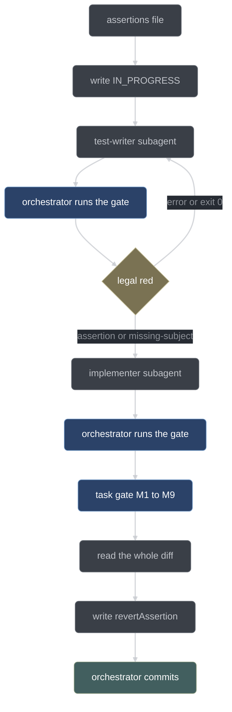

# Testing and verification

How this project proves its own work. This page covers the law every module lands under,
the canonical test gate and why nothing else counts, the guard tests and fixtures, the C++
suite, and the per-task gate ladder the build runs before every commit.

## The law

G4 is the plan's hardest rule and the one the whole build is arranged around. Every module
lands only as this sequence:

1. a failing test, written first and **observed to fail for the real reason**;
2. the minimal implementation that satisfies it;
3. the test **observed to pass**;
4. the commit.

Two consequences follow, and they are enforced rather than encouraged:

- **A module without an executing test does not exist.** Not "is untested" — does not
  exist. There is no path by which code reaches a commit without a test that imports it and
  fails without it.
- **No stubs, no TODOs, no placeholder bodies in committed code.** A placeholder is a claim
  that work is done when it is not, and it is exactly what a model produces when it runs out
  of budget.

The same law applies to all three languages in the workspace: TypeScript under
`node --test`, C++ under doctest, and the Python wiring under stdlib `unittest`. Nothing is
exempt because it is "just glue" — glue arriving late as an untested fix is the
stub-shaped outcome G4 exists to prevent.

The plan states the law. It supplies no mechanism for it. The mechanisms are
[`scripts/test-conductor.sh`](../../scripts/test-conductor.sh),
[`scripts/conductor-gate.sh`](../../scripts/conductor-gate.sh), and the nine-check task gate
described below.

## The canonical gate

```bash
bash scripts/test-conductor.sh
```

That is the only command whose exit code is allowed to decide anything. **Never run
`node --test` directly for a gate decision.** Two behaviors on Node v26.7.0 make raw
`node --test` unsafe as a gate, and both were re-verified on this machine, with the
transcript recorded in [`docs/build/GATES.json`](../build/GATES.json):

| Trap                 | What node does                                                                                 | Why it is dangerous                                                                                 |
| -------------------- | ---------------------------------------------------------------------------------------------- | --------------------------------------------------------------------------------------------------- |
| Directory positional | Resolves the directory as a *module* and reports a `MODULE_NOT_FOUND` **failing test**, exit 1 | Looks exactly like a legitimate red. A test-writer's "it fails" is satisfied by a typo in the path. |
| Zero-match glob      | Exits **0** with no tests run                                                                  | A vacuous green. The suite "passes" because nothing ran.                                            |

The wrapper closes both. It converts a directory argument into a glob before node ever sees
it, runs `node --test --test-reporter=tap`, and then judges the TAP output itself rather
than trusting node's exit code.

### The wrapper's legs

The script runs five legs in order and stops at the first failure.

**1. TAP trailer thresholds.** The counts are parsed out of the TAP trailer and the run
fails unless all of these hold:

| Condition        | Failure message                              | What it means                                                                             |
| ---------------- | -------------------------------------------- | ----------------------------------------------------------------------------------------- |
| `tests > 0`      | `zero tests ran (wrong glob or empty suite)` | The vacuous green. The glob matched nothing, or the suite is empty.                       |
| `fail == 0`      | `N test(s) failing`                          | An ordinary red.                                                                          |
| `cancelled == 0` | `N test(s) cancelled`                        | A test was aborted — usually a timeout or an unhandled rejection tearing the runner down. |
| `skipped == 0`   | `N test(s) skipped (skips forbidden, G4)`    | Someone turned a hard test into a skip.                                                   |
| `todo == 0`      | `N todo test(s) (todos forbidden, G4)`       | Same erosion route, different keyword.                                                    |

The `skipped`/`todo` rejection is not pedantry. The cheapest way for a model to turn red
into green is to mark the test `skip`, and node reports that as a clean exit.

**2. The SKIP/TODO directive scan.** The trailer counts are not sufficient. On node 26.7.0
a skipped *suite* reports `# suites 1` with `# skipped 0` — a `describe`-level skip is
invisible to the counts, and can hide a failing test underneath it. This was found by
breaking the gate on purpose during the phase-0 gate review (`C-015`). The wrapper therefore
also greps every TAP point line for a `# SKIP` or `# TODO` directive at any subtest depth,
and fails on any hit:

```text
GATE FAIL: 1 SKIP/TODO directive(s) in TAP output (describe-level skips evade the trailer counts, C-015)
```

**3. Typecheck.** `tsc -p conductor/tsconfig.json --noEmit`, run from
`conductor/node_modules/.bin/tsc`. If `conductor/tsconfig.json` exists but tsc is not
installed, that is a gate failure telling you to run `npm install` in `conductor/` — a
missing typechecker must never silently degrade to a pass. This leg is the strongest
available detector of invented SDK shapes and cross-module signature drift, which is the
failure mode unit tests written by the same author will never catch.

**4. The Bun dual-runtime smoke.** `bun test conductor/tests/bun-smoke.test.ts`, and only
that file — it is the one test authored to be runtime-agnostic. A failure here is reported
as `G14 dual-runtime divergence`. If the `bun` binary is missing the leg emits a loud
`GATE WARN` rather than failing, because Bun was installed at preflight and its
disappearance is a regression to investigate, not a normal condition.

**5. The JSON Schema export.** `node conductor/tools/export-schemas.ts router/tests/schemas`
regenerates the §2 JSON Schemas from the `SCHEMAS` record in `conductor/core/types.ts` — the
single source — into `router/tests/schemas/`, so the C++ `router-tests` validate against the
exact objects the fan-out engine uses. This is a *generation* step, not an assertion:
correctness is covered by `conductor/tests/export-schemas.test.ts`, and a nonzero exit here
means the exporter itself is broken.

On success the script prints `GATE PASS` and exits 0. On failure it prints the non-`ok`
lines from the TAP output so the red is visible without a second run.

## The stub scan

```bash
bash scripts/conductor-gate.sh              # all tracked sources
bash scripts/conductor-gate.sh path/to/file.ts
```

This is a separate mechanical scan for the G4-forbidden *shapes* — the things a test run
cannot see because the code compiles, typechecks, and passes. With no arguments it scans
every tracked file under `conductor/` (TypeScript) and `router/` (C++). Markdown files
are skipped; documentation is governed by anchor tests, not by this scan.

| Pattern                                                     | Scope                  | Rationale                                                                    |
| ----------------------------------------------------------- | ---------------------- | ---------------------------------------------------------------------------- |
| `TODO`, `FIXME`, `XXX`, `not implemented`, `placeholder`    | production source only | These name unfinished *product*.                                             |
| the bare word `stub`                                        | production source only | Forbidden in product code; it is the plan's own vocabulary for test doubles. |
| `test.skip`, `it.skip`, `describe.skip`, `t.skip`, `.todo(` | universal              | An unfinished test is a defect wherever it lives.                            |
| `assert.ok(true)`, `assert.equal(1, 1)`, `expect(true)`     | universal              | A trivially-true assertion is a test that asserts nothing.                   |
| empty `catch {}` blocks                                     | universal              | Swallowed errors are how fail-closed becomes fail-silent.                    |

The split between production-scoped and universal patterns is deliberate and was learned the
hard way (`C-013`, `C-026`). In test files those marker tokens appear legitimately: as test
*data* (a `git grep TODO` command fed to the shell parser), as the *subject* of anti-stub
enforcement ([`doctrine.test.ts`](../../conductor/tests/doctrine.test.ts) asserts that no
doctrine pack carries a placeholder marker), and inside example strings. Scanning tests for
them produced false positives that pressured the gate toward being weakened, which is the
worst possible outcome for a gate. The real test-file risk — an unfinished test — is caught
independently and does not rely on this scan at all: `test-conductor.sh` hard-fails any
skipped or todo test and any SKIP/TODO directive at any depth, and the skip patterns above
still apply to test files. `XXX` is word-bounded so a genuine `XXX` marker trips while a
longer `XXXX` random-suffix token in an example path does not.

Two checks G4 implies are deliberately **not** in this script:

- **Empty function bodies** are checked by eye during the mandatory diff read. The shapes
  are too idiom-dependent for a regex — an empty arrow body, an interface default, and a
  legitimately no-op unsubscribe handler are indistinguishable to `grep`, and a scan that
  cries wolf gets disabled.
- **A new source file that no test imports** is checked separately at acceptance, not here.

## The guard tests

Guard tests assert properties of the source tree rather than the behavior of a function.
Most are trivially green the day they are written; they exist to bite months later, when
someone reaches for a convenient API in the wrong layer.

**The purity guard** — [`conductor/tests/purity.test.ts`](../../conductor/tests/purity.test.ts),
four tests. It enforces G3, the pure-core rule:

| Test                 | What it asserts                                                                                                                              | What it catches                                                                                                                           |
| -------------------- | -------------------------------------------------------------------------------------------------------------------------------------------- | ----------------------------------------------------------------------------------------------------------------------------------------- |
| `1.4-core-imports`   | Every import under `conductor/core/` is a relative `./` or `../` specifier ending in `.ts` that resolves inside `conductor/core/`            | Core reaching into an adapter, or into `node_modules`                                                                                     |
| `1.4-core-forbidden` | No core file mentions `node:fs`, `node:child_process`, `Bun`, `fetch(`, `process.env`, or `Date.now`                                         | Core acquiring I/O, network, environment, or a wall clock — core takes `nowMs` as an input, which is what makes gate decisions replayable |
| `1.4-adapter-guard`  | No file under `conductor/adapter/` or `conductor/plugin/` mentions `Bun`, uses the ``$` `` shell tag, or imports the `bun:` module namespace | Code that works in opencode's runtime and cannot run under Node type-stripping — G14                                                      |
| `1.4-subprocess`     | Any adapter file containing a subprocess-shaped call must import `node:child_process`                                                        | A subprocess spawned through a single-runtime API instead of `execFile` with `shell:false`                                                |

The file is written to be immune to itself: every token it scans *for* is assembled by
string concatenation, and match extraction never uses a call-shaped method token, so the
guard cannot flag its own source even if the scan globs widen. Comments are deliberately not
stripped — a commented-out forbidden call is still a smell.

**The dual-runtime guard** is `1.4-adapter-guard` plus its runtime half,
[`bun-smoke.test.ts`](../../conductor/tests/bun-smoke.test.ts). The static half proves no
single-runtime API is *referenced*; the smoke proves the adapters actually *behave* the same
under both runtimes. It re-drives the state store, the journal, and gitio through throwaway
temp directories and asserts four runtime-observable behaviors: an atomic write surviving an
injected mid-commit throw; the single-writer lock claim, its stale-break, and the live-foreign
read-only path (both branches of the `process.kill(pid, 0)` liveness probe); JSONL append
ordering plus the torn-trailing-line heal; and one `execFile` round trip through gitio. It is
written with `node:test` and `node:assert/strict` only — the subset confirmed to run under
both runtimes. Catching a divergence here, at three adapters, is why Phase 13 will not have
to find it under thirty modules.

**The single-source test** —
[`single-source.test.ts`](../../conductor/tests/single-source.test.ts) — enforces G6 for the
FSM vocabularies. The Run FSM owns `RUN_STATES`, the Item FSM owns `ITEM_STATES`, and the Run
and Item schemas each own the same vocabulary as their `state` enum. The test reads the
schema half at runtime out of `SCHEMAS.Run.properties.state.enum` and
`SCHEMAS.Item.properties.state.enum` — the arrays every persisted run and item and the
router's validator are actually checked against — and asserts exact set equality with the FSM
arrays. Add a state to an FSM without adding it to the schema, or vice versa, and the run goes
red. It also rejects an emptied or malformed schema, so the guard cannot pass vacuously.

**The doctrine anchor tests** — [`doctrine.test.ts`](../../conductor/tests/doctrine.test.ts)
— pin the shape and required content of all nine doctrine packs mechanically. Anchor strings
are normative and quoted verbatim from the source material the port map cites: the
four debugging phases and the three-fix rule in `debug.md`, the five testing anti-patterns in
`test-vet.md`, the TDD iron law and "delete means delete" in `tdd.md`, the finding-schema
severity triad in `review.md`, the seven-rung ladder in `decompose.md`, the override budget
and `env`-stop-on-exhaustion in `core.md`. Every pack is capped at 120 lines, must be
client-agnostic (no pack may name opencode, Claude, or Cursor), and none may carry a
placeholder marker. This is what makes doctrine drift detectable: reword a pack and remove an
anchor, and the suite names the missing phrase.

## Fixtures

Fixtures live in [`conductor/tests/fixtures/`](../../conductor/tests/fixtures/). Each exists
to make one thing testable without a model, a server, or a network.

| Fixture                                                                   | Makes testable                                                                                                                                                                                                                                                                                                                                                                                                                                                                                                                                                                                                                                        |
| ------------------------------------------------------------------------- | ----------------------------------------------------------------------------------------------------------------------------------------------------------------------------------------------------------------------------------------------------------------------------------------------------------------------------------------------------------------------------------------------------------------------------------------------------------------------------------------------------------------------------------------------------------------------------------------------------------------------------------------------------- |
| [`fake-sdk.ts`](../../conductor/tests/fixtures/fake-sdk.ts)               | The fan-out engine. An in-process, per-test-programmable stand-in for the opencode SDK client: `session.create` / `prompt` / `abort` / `messages`, with a responder that can reply, **park** a prompt (so wave barriers and concurrency are observable), **hang** it (so the watchdog can be driven under mock timers), or return an SDK error envelope. Every call is recorded. Two witnesses matter: `hasFormatField` on every prompt, which pins that the engine never leans on the non-existent `format:{json_schema}` field, and `registeredAtStart`, which pins that a sub-session's registry entry exists **before** its first prompt is sent. |
| [`stub-llm-server.ts`](../../conductor/tests/fixtures/stub-llm-server.ts) | The opencode tool loop, model-free. A fake OpenAI-compatible server standing in for `llama-server`: it records every request's headers and parsed body, answers with canned SSE `chat.completion.chunk` responses, and emits tool calls when it sees a scenario marker in the last user message — so a test can drive opencode deterministically.                                                                                                                                                                                                                                                                                                     |
| [`recorder-plugin.ts`](../../conductor/tests/fixtures/recorder-plugin.ts) | The plugin hook surface. Loaded by a real `opencode serve` via an absolute path in a throwaway config, it exports every hook the wire contract names and appends one JSONL record per firing to `CONDUCTOR_RECORDER_FILE`, so assertions run against observed binary behavior rather than hoped-for documentation.                                                                                                                                                                                                                                                                                                                                    |
| [`crashing-plugin.ts`](../../conductor/tests/fixtures/crashing-plugin.ts) | Plugin-init failure. Its factory throws, and a dedicated `opencode serve` run records what the runtime does — the answer (log and continue, completely ungated) is what scopes the liveness beacon.                                                                                                                                                                                                                                                                                                                                                                                                                                                   |
| [`wire-markers.ts`](../../conductor/tests/fixtures/wire-markers.ts)       | Shared marker constants for the above. It is a separate module for a load-bearing reason: the 1.18.15 plugin loader walks **every** export of a plugin file and throws when one is not a plugin function, so a plugin module may export its factory and nothing else.                                                                                                                                                                                                                                                                                                                                                                                 |

The integration test that uses them,
[`wire-contract.test.ts`](../../conductor/tests/wire-contract.test.ts), starts `opencode serve`
headless against a fixture directory and asserts every row of the task 0.2 assertions file
against observed behavior. Its skip policy is itself asserted: the suite is skip-tagged only
when no opencode binary exists, and an unconditional guard test at the bottom asserts the skip
flag is exactly coupled to binary absence. On a machine with opencode installed, a skip is a
gate failure — `test-conductor.sh` rejects `skipped > 0`. The drifts this test pinned are
recorded in [`conductor/adapter/wire-notes.md`](../../conductor/adapter/wire-notes.md).

## Running a subset

```bash
bash scripts/test-conductor.sh 'conductor/tests/gates-*.test.ts'
bash scripts/test-conductor.sh conductor/tests            # directory, converted to a glob
```

Quote the glob so the shell hands it to node intact. A directory argument is converted to
`<dir>/**/*.test.ts` before node sees it, so the directory-positional trap cannot fire.

Remember what a subset run does *not* tell you: a glob matching zero files exits 0 under raw
node, and that is a vacuous green, not a pass. The wrapper's `tests > 0` check is the only
thing standing between a mistyped glob and a false all-clear — and it is why a subset run
still ends in a real `GATE PASS` line rather than silence. The typecheck, Bun, and schema
export legs run regardless of the glob, so a subset run still catches a cross-module
signature break.

A subset is for iterating. **No gate decision is ever made on a subset.**

## The C++ suite

The router's tests are doctest cases compiled into a single `router-tests` executable and
registered with ctest by [`CMakeLists.txt`](../../CMakeLists.txt):

```cmake
add_executable(router-tests
  "${CMAKE_CURRENT_SOURCE_DIR}/router/tests/scaffold_test.cpp"
  "${CMAKE_CURRENT_SOURCE_DIR}/router/tests/config_test.cpp"
)
add_test(NAME router-tests COMMAND router-tests)
```

Sources grow one file per task. The target keeps the name `router-tests` even though the
directory is `router/tests/` — the target name is what every gate record cites. `src/` is the
only user-code include root, so a test includes a header by its full path relative to `src/`:
`#include "router/config.hpp"`, never `#include "config.hpp"`.

```bash
cmake --preset clang-relwdebinfo
cmake --build .out/build/clang-relwdebinfo --target router-tests
ctest --test-dir .out/build/clang-relwdebinfo --output-on-failure
```

**Build only named targets.** A bare `cmake --build` also compiles the whole vendored
`extern/llama-cpp` tree, which no target here links. The three legal targets are
`llama-router`, `router-tests`, and `membench`. See
[build-system.md](build-system.md) for the full picture.

The C++ red shape is a **compile failure**, not an assertion failure: a test file is written
against a header that does not exist yet, so `router-tests` fails to build. That is the
intended red for a C++ task, and the red re-derivation below moves the header aside and
confirms the build breaks again, naming the missing file.

## The per-task gate ladder

The build orchestrator runs a nine-check mechanical gate before every commit. It costs no
model tokens and it is stronger than a hurried reviewer, which is why most tasks get no model
review at all. Every result is recorded in [`GATES.json`](../build/GATES.json).

| Check                            | What it runs                                                                                                                                                                  | What it catches                                                                                                                                                                                                                                                                                                                                     |
| -------------------------------- | ----------------------------------------------------------------------------------------------------------------------------------------------------------------------------- | --------------------------------------------------------------------------------------------------------------------------------------------------------------------------------------------------------------------------------------------------------------------------------------------------------------------------------------------------- |
| **M1 — Green**                   | `bash scripts/test-conductor.sh`                                                                                                                                              | Anything red, skipped, todo, or vacuous.                                                                                                                                                                                                                                                                                                            |
| **M2 — Pass-count monotonicity** | Compare `# pass` against the previous task; it must not decrease, and must strictly increase for a task that adds tests                                                       | A weakened or deleted assertion. Weakening is invisible in a red/green signal and obvious in a count. A decrease halts the build until explained in `CORRECTIONS.md`, naming the tests removed and why.                                                                                                                                             |
| **M3 — Typecheck**               | `tsc --noEmit` over the conductor project                                                                                                                                     | Invented SDK shapes, cross-module signature drift.                                                                                                                                                                                                                                                                                                  |
| **M4 — Red re-derivation**       | From the **commit**, in a detached scratch worktree: remove or revert the task's implementation paths, run the task's tests there, then remove the worktree                   | The heart of the gate. Catches tests written after the implementation, tests that assert the mock, tests that would pass against an empty file, and implementations that quietly landed earlier. The failure must classify as `assertion` or `missing-subject`, never `error`, and its text must name a symbol or path inside the task's own scope. |
| **M5 — Stub scan**               | `bash scripts/conductor-gate.sh` plus the eyeball checks it cannot regex                                                                                                      | Stub markers, skipped tests, trivially-true assertions, empty catch blocks, empty function bodies, and any new source file no test imports.                                                                                                                                                                                                         |
| **M6 — Diff scope**              | `git diff --name-only HEAD` ⊆ the task's declared files ∪ `docs/build/*`                                                                                                      | Scope creep. **Any edit to a file first added by an earlier task is a hard stop** requiring written justification — that is the exact mechanism by which a subagent "fixes" an earlier test to make its own work pass, and by which a long suite silently erodes.                                                                                   |
| **M7 — Assertion coverage**      | Every row in `docs/build/specs/task-<id>.assertions.json` maps to a named test that exists in the diff                                                                        | Built-something-else. An unmapped row is a gate failure, not a note.                                                                                                                                                                                                                                                                                |
| **M8 — Live-artifact integrity** | Live tasks only: the artifact exists, carries the required fields, records **verbatim command lines and raw output**, and at least one of those commands is re-run and diffed | A measurement claim backed only by prose.                                                                                                                                                                                                                                                                                                           |
| **M9 — Language legs**           | `ctest` on `router-tests` (Phase 11+), `python3 -m unittest` (Phase 12+), `bun test` (from task 2.2)                                                                          | A change that is green in one language and broken in another.                                                                                                                                                                                                                                                                                       |

M4 has three variants, because not every task has an ordinary red:

- **Guard tasks** use **mutation** instead of removal: inject the violation the guard exists
  to catch (a `node:fs` import in a `core/` file; a Bun shell tag in an adapter), assert the
  guard fails, then inject a *legal* variant and assert it still passes — so the guard is
  proven to bite **and** proven not to be over-broad.
- **Documentation tasks** revert the markdown and assert the anchor test fails naming the
  missing anchor. The stronger form strips one anchor phrase while leaving the file in place,
  which proves the anchors pin content rather than file presence.
- **Live tasks** have no red; M8 replaces it.

Above the task gate sits the **phase gate**, adversarial and run at every phase boundary. Its
mechanical prelude is the highest-value single check against hollowness: build a fresh
worktree from `HEAD` and run the complete green gate there, from scratch. That catches work
that only passes because of uncommitted files, a wrong-cwd glob, absolute paths baked into
tests, or files never `git add`ed — all of which produce a perfectly green main tree and a
dead repository.

Two rules keep the gate from becoming theater. The gate is **self-tested**: each mechanical
check is deliberately broken once — a file with a marker, a test that skips, a
`describe`-level skip hiding a failure, a zero-match glob — and the transcript is recorded,
with the self-test re-run at phase boundaries. And every gate record **credits its catches**:
a gate that has rejected nothing across three phases is itself reported as suspected gate
weakness.

## Observing red yourself

The single rule that makes everything above trustworthy:

> **A subagent's claim of red or green is never accepted as evidence.**

In practice that means the orchestrator, not the author, runs the canonical command at both
ends of every task. Before implementation, it runs the test and records the exit code and
failure excerpt, and classifies the failure with the closed three-way rule: `assertion` and
`missing-subject` are legal reds, `error` is not — an `error` means the test itself is broken
and goes back to the test-writer. If the red step exits 0, the task fails outright: the test
proves nothing. After implementation, the orchestrator runs the command again and reads the
counts itself. Then it reads the **whole diff**, not the subagent's summary, and writes a
`revertAssertion` into `STATE.json` naming the specific assertion that would fail if the
implementation were reverted. If it cannot name one, the test tests nothing and the task is
not done.



Two traps this discipline has already caught, both recorded in
[`HANDOFF.md`](../build/HANDOFF.md):

- A subagent returned a confident "done" having made **zero edits**. Always check the actual
  tree — `git status` plus the test run — before trusting a green.
- A review workflow returned an **empty finding set**, which can mean the lenses crashed
  rather than that the diff is clean. Check the run's failures and journal before treating an
  empty review as a pass.

Only the orchestrator runs git write commands and only the orchestrator commits. One commit
chokepoint is what guarantees the gate actually runs; a subagent that commits bypasses every
check on this page.

## Build-state artifacts

Everything the build knows about itself lives in `docs/build/`, git-tracked, with the
`STATE.json` update riding in the **same commit** as the task it records — so committed state
and `git log` cannot disagree, and any disagreement is itself a signal that a task was
interrupted.

| File                                         | What it is                                                                                                                                                                 | How to read it                                                                                                                                                                                                                                                                                                                                                                                                                                                                                               |
| -------------------------------------------- | -------------------------------------------------------------------------------------------------------------------------------------------------------------------------- | ------------------------------------------------------------------------------------------------------------------------------------------------------------------------------------------------------------------------------------------------------------------------------------------------------------------------------------------------------------------------------------------------------------------------------------------------------------------------------------------------------------ |
| [`STATE.json`](../build/STATE.json)          | Machine truth. A `meta` block (plan file, revision, manifest count, canonical test command, verified environment, ordering overrides) plus one `tasks` record per task id. | Per-task: `status`, `commitSha`, `commitMessage`, `planLines`, the `tap` counts at commit, `redEvidence` (`cmd`, `exitCode`, `class`, `excerpt`), `filesTouched`, `revertAssertion`, `attempts`, `deviations`, timestamps. Status is one of `NOT_STARTED`, `IN_PROGRESS`, `RED_OBSERVED`, `GREEN`, `COMMITTED`, `BLOCKED`, `PARKED_MANUAL`, `SKIPPED_UNMET`. Git is authoritative for "committed": a row claiming `COMMITTED` with no matching commit is a lie, and the state gets fixed, never the history. |
| [`HANDOFF.md`](../build/HANDOFF.md)          | The boot document — the first thing a fresh instance reads.                                                                                                                | Where the build is, what is in flight, what is parked, what to do next, plus the standing facts that must not be re-derived wrong and the deferred bindings still owed to future tasks.                                                                                                                                                                                                                                                                                                                      |
| [`GATES.json`](../build/GATES.json)          | Gate outcomes.                                                                                                                                                             | Four sections: `selfTests` (the deliberate-breakage transcripts), `taskGates` (M1–M9 per task, plus an `orchestratorReverify` note recording what was observed first-hand), `phaseGates`, and `rejections` — the running list of what the gates actually caught, which is how gate weakness becomes visible.                                                                                                                                                                                                 |
| `JOURNAL.jsonl`                              | Append-only event log, one JSON object per line.                                                                                                                           | `{ts, event, detail}`. Useful for reconstructing what happened between commits.                                                                                                                                                                                                                                                                                                                                                                                                                              |
| `IN_PROGRESS.json`                           | The in-flight marker, written before the first edit of a task and deleted only in the completing commit.                                                                   | `{taskId, step, intendedFiles, startedAt}`. Its presence on boot means the previous instance died mid-task; the recovery is to stash under a named stash and restart that task from the top.                                                                                                                                                                                                                                                                                                                 |
| [`CORRECTIONS.md`](../build/CORRECTIONS.md)  | Append-only record of every deviation from the plan.                                                                                                                       | Each `C-NNN` entry carries the plan quote with line numbers, the observed reality with the exact command and output, the decision, alternatives considered, and blast radius. The plan itself is immutable; this file is where reality is recorded.                                                                                                                                                                                                                                                          |
| `docs/build/specs/task-<id>.assertions.json` | The per-task contract, extracted from the plan before any code is written.                                                                                                 | One row per enumerated behavior: `{id, text, planLine, coveredByTest}`. `coveredByTest` starts null and is filled with the exact test name. This file is what makes M7 — "did we build what was asked" — mechanically checkable rather than a judgment call.                                                                                                                                                                                                                                                 |

`docs/prompt-lifecycle.md` is **stale** and is not a description of the current process; do
not use it. The current process is the one on this page, sourced from
[`docs/conductor-build-orchestrator-prompt.md`](../conductor-build-orchestrator-prompt.md).

## See also

- [project-status.md](project-status.md) — what is built, what is next, what is deferred
- [build-system.md](build-system.md) — CMake presets, targets, and the include rule
- [schemas.md](schemas.md) — the `SCHEMAS` single source and the export
- [evidence-and-quarantine.md](evidence-and-quarantine.md) — how conductor verifies *other*
  people's code, and the failure classes reused here
- [`conductor/docs/RUNNER-DISCOVERY.md`](../../conductor/docs/RUNNER-DISCOVERY.md) — measured
  test-runner discovery behavior
