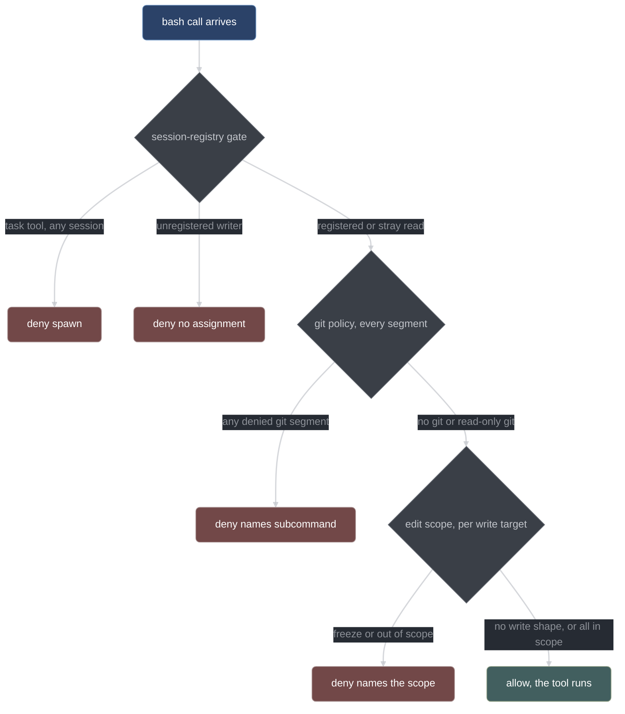

# Gates and hatches

What conductor refuses, why it refuses it, and what to do instead. This page is for the
person watching a session get denied — not for the person implementing the gate. For the
internals, see [gates.md](../developer/gates.md).

## How a denial works

Conductor's gates run in opencode's `tool.execute.before` hook, which fires for every tool
call in every conductor-managed session — the orchestrator and every sub-session alike.
The hook has exactly two outcomes: it returns, and the tool runs, or it throws, and the
tool never runs.

A deny is `throw new Error(reason)`. opencode turns the thrown message into the tool
result the model reads back, so the refusal text *is* the feedback channel. Every deny
message names the rule that was violated and, where one exists, the legal alternative:

```text
git commit publishes changes — publishing is conductor_publish's job, not a model session's
```

That is the whole design. The model does not need to be taught the rules up front; it
discovers the boundary by hitting it and reads the correct next move out of the error.
Denials are cheap and expected — a run with a handful of them is normal, not a failure.

Every deny is also journaled at `warn` under `gates/deny` with an input snapshot: the tool
name, the raw arguments, the offending command or path, and the reason. That snapshot is
enough to reproduce the decision through the pure gate function in a test, which is how a
disputed refusal gets settled.

## Gate order for a bash call

The gates run in a fixed order, and the first deny wins. `bash` is the interesting case
because one command can trip all three.



An `edit`/`write`/`patch` call skips the git stage and goes straight from the registry gate
to the edit-scope gate over the edited path. A `conductor_*` call is checked by the
registry gate and then by the phase gate inside its own handler, which is a separate
mechanism — see [run-lifecycle.md](./run-lifecycle.md).

## The session-registry gate

Conductor keeps a registry mapping `sessionID` to `{role, itemId, tree}`. The fan-out
engine writes an entry when it creates a sub-session; the `chat.message` hook writes one
for the orchestrator. A session with no entry is a session conductor did not create, so it
has no role, no item, and no file scope.

The registry gate runs first, before every other gate, and dispatches on the tool's class.

| Tool class | Example                                                      | Disposition for a session with no registry entry                           |
| ---------- | ------------------------------------------------------------ | -------------------------------------------------------------------------- |
| read       | `read`, `grep`, `glob`, `list`, `bash` with no write shape   | allow — a stray reader is harmless, and failing it would only be confusing |
| write      | `edit`, `write`, `patch`, `apply_patch`, write-shaped `bash` | **deny** — "this session has no conductor item assignment"                 |
| conductor  | any `conductor_*` tool                                       | **deny** — state advances only from registered sessions                    |
| spawn      | opencode's `task` tool                                       | **deny in every session, registered or not**                               |

A registered session passes this gate for anything except a spawn. What it may *write* is
the edit-scope gate's question, not this one's.

**Why spawning is denied everywhere.** This is the load-bearing half of the gate. Without
it, an implementer could call `task`, get a child session conductor never registered — no
role, no item, no scope — and have that child perform exactly the writes the implementer
is gated out of. A registry-based gate whose registry can be grown by a tool call is not a
gate. Conductor's own fan-out is unaffected: it creates sessions through the opencode SDK,
which is not a tool call and never reaches this gate.

One detail worth knowing: a `bash` command with no write shape classifies as `read`, even
if it contains a git write. That is deliberate. The git gate runs for registered and
unregistered sessions alike, so `git commit` from a stray session is still denied — just by
the next gate down, with a message about publishing rather than about registration.

## Git policy

Git is the widest hole in any edit gate: `git apply` writes arbitrary files, `git checkout
--` destroys them, and `git reset` rewrites history, none of which look like an edit tool
call. So git gets its own gate with an **enumerated-allow, default-deny** posture. Any git
subcommand not explicitly listed is denied, and the denial names the subcommand.

The asymmetry is the argument. A missing allow row costs an annoyed model one
`conductor_surface` call. A missing deny row costs the entire edit-scope gate, because
`git apply` walks straight around it. The two failure modes are not comparable, so the
default goes to deny.

### Dispositions

| Command                                                                                                                                                                                                                                 | Disposition                                                                                                                                                              |
| --------------------------------------------------------------------------------------------------------------------------------------------------------------------------------------------------------------------------------------- | ------------------------------------------------------------------------------------------------------------------------------------------------------------------------ |
| `status`, `log`, `diff`, `show`, `ls-files`, `ls-tree`, `rev-parse`, `rev-list`, `cat-file`, `blame`, `shortlog`, `describe`, `grep`                                                                                                    | allow, whatever the operands                                                                                                                                             |
| `branch` list forms, `stash list`, `worktree list`, `remote -v`, `config --get`/`--list`, `reflog show`, `restore --staged`                                                                                                             | allow                                                                                                                                                                    |
| `add`, `mv`, `rm`, `stash push` (and bare `git stash`)                                                                                                                                                                                  | deny — staging is `conductor_publish`'s job                                                                                                                              |
| `commit`, in any spelling                                                                                                                                                                                                               | deny — publishing is `conductor_publish`'s job                                                                                                                           |
| `push`, in any spelling including force and refspec forms                                                                                                                                                                               | deny — handler-only and mode-gated by `git.mode`                                                                                                                         |
| `reset`, `rebase`, `filter-branch`, `filter-repo`, `clean`, `merge`, `cherry-pick`, `revert`, `am`, `apply`, `update-ref`, `symbolic-ref`, `sparse-checkout`, `submodule`, `bisect`, `gc`, `prune`, `notes`, `replace`, `fetch`, `pull` | deny — destructive, history-manipulating, network-mutating, or a write path around the edit gate                                                                         |
| `stash drop`/`clear`/`pop`/`apply`/`save`                                                                                                                                                                                               | deny — mutates the stash                                                                                                                                                 |
| `worktree add`/`remove`/`move`/`prune`                                                                                                                                                                                                  | deny — worktrees belong to conductor's own worktree adapter                                                                                                              |
| `remote` anything but `-v`                                                                                                                                                                                                              | deny — mutates remotes                                                                                                                                                   |
| `config <key> <value>`, `config --unset`                                                                                                                                                                                                | deny — only the `--get`/`--list` read forms are allowed                                                                                                                  |
| `reflog expire`/`delete`                                                                                                                                                                                                                | deny — only `reflog show` is allowed                                                                                                                                     |
| `branch` with `-d`/`-D`/`--delete`/`-m`/`-M`/`--move`/`-c`/`-C`/`--copy`/`-f`/`--force`/`-u`/`--set-upstream-to`/`--unset-upstream`/`--edit-description`                                                                                | deny — those flags turn a list into a write                                                                                                                              |
| `checkout --`, `checkout <path>`, multi-operand `checkout`, `checkout -B`, `checkout -f`                                                                                                                                                | deny — discards or force-creates, unconditionally                                                                                                                        |
| `switch -C`, `switch -f`/`--force`/`--discard-changes`                                                                                                                                                                                  | deny — force-create or discard, unconditionally                                                                                                                          |
| `restore` without `--staged`, `restore --worktree`                                                                                                                                                                                      | deny — the default restore target is the working tree                                                                                                                    |
| branch movement: `switch <br>`, `checkout <br>`, `checkout -b`                                                                                                                                                                          | deny while a run is non-terminal under `git.branchPolicy: "pin"` (the default); allowed under `"check-only"`, where publish's HEAD check catches the consequence instead |
| bare `git` with no subcommand                                                                                                                                                                                                           | deny                                                                                                                                                                     |
| anything else                                                                                                                                                                                                                           | **deny by default**, naming the subcommand and inviting `conductor_surface`                                                                                              |

`conductor_publish` itself is not affected by any of this: it runs git through `execFile`
inside the plugin, which is not a tool call and never reaches the gate.

### Matching is parsing, not pattern matching

The gate never runs a substring regex over the command text. It tokenizes with a
quote-aware splitter, splits on shell operators and newlines, and decides over the parsed
tokens of each segment. That is what keeps the false-positive rate at zero on ordinary
commands:

| Command                           | Parses as                | Disposition                                                      |
| --------------------------------- | ------------------------ | ---------------------------------------------------------------- |
| `git add src/config.ts`           | `add`                    | deny (staging) — the path's `config` is a path, not a subcommand |
| `git log --grep config`           | `log`                    | allow — `config` is a search string                              |
| `git commit -m "fix reset logic"` | `commit`                 | deny (commit) — `reset` inside a message is not `git reset`      |
| `git stash push -m drop`          | `stash push`             | deny (staging) — not `stash drop`                                |
| `git branch -D old`               | `branch` + mutating flag | deny — `branch` is allow-listed, the flag is not                 |

Detection also sees through the ways a command can be dressed up. It skips leading
`NAME=value` env assignments, unwraps one command wrapper (`env`, `command`, `sudo`,
`builtin`, `exec`) along with that wrapper's own options, and resolves the command word by
basename, so `/usr/bin/git` and `./git` are git. Every segment of a compound command is
scanned, so `ls && git commit -am x` is denied by its second segment; an allowed git read
earlier in the line never rescues a denied write later in it.

Two cases fail safe rather than fail open. A second wrapper level (`sudo env git …`) and a
command word the static parser cannot resolve (`$CMD`, a backtick substitution, an ANSI-C
escape residual) both deny the whole command, because the word could resolve to a git write
at shell runtime and no static parser can know.

## Edit scope

The edit-scope gate applies to `edit`/`write`/`patch` calls and to each write-shaped target
extracted from a `bash` command — redirect targets, `tee` operands, `sed -i` and
`perl -i` files, `mv`/`cp` destinations, `rm` targets, `dd of=`, `gawk -i inplace` files,
and `ex`/`ed` operands. A write hidden behind `sh -c "…"` is re-analyzed by running the same
extraction over the inner string.

| Role                  | May edit                                               |
| --------------------- | ------------------------------------------------------ |
| orchestrator          | nothing, unless an active inline claim scopes the path |
| implementer           | only paths matching its item's `fileScope`             |
| test-writer           | only paths matching its item's `testScope`             |
| planner               | nothing                                                |
| reviewer              | nothing                                                |
| skeptic               | nothing                                                |
| mechanical            | nothing                                                |
| any unrecognized role | nothing — unknown roles fail safe                      |

Three rules apply to everyone, whatever the role:

- **`.conductor/**` is denied.** The state area is handler-written only. Ledgers, item
  files, and the run state are records of what the harness derived; a session that could
  edit them could fabricate a green.
- **A `..` path segment is denied outright.** Scope globs are matched literally, and `**`
  will happily swallow a `..`, so a traversal could carry an in-scope glob into the state
  area or a sibling item. No legitimate edit path contains one.
- **A live verify marker for the tree denies everything.** See the next section.

**Paths are normalized against the session's tree first.** Every scope is tree-relative, so
an implementer working in a worktree under
`<stateHome>/…/worktrees/<runId>/<itemId>/src/router/config.hpp` is judged on
`src/router/config.hpp`. The `.conductor/**` deny is applied to the normalized path — the
state area of the *current* tree — so a tree that happens to live under a `.conductor`
directory does not false-deny every write inside it. A path that is not under the session's
tree at all is left alone, matches no tree-relative scope, and is denied by the role check.

## The freeze

While a verify marker is live for a tree, **every** edit in that tree is denied. Production
files, test files, config, an implementer inside its `fileScope`, a test-writer inside its
own `testScope` — all of it, until the verify clears.

The strict reading is deliberate. A verify quarantines the foreign red set by moving those
test files outside the repository and restoring them afterwards from a manifest. If a
session could write a file while it is moved aside, the restore would either clobber the
new content or resurrect the old — so "no edits at all, in this tree, right now" is what
makes the quarantine safe. The freeze is keyed on tree equality, so a different tree's
verify never freezes yours, and under worktree mode two implementers never freeze each
other.

**Freeze is scheduling, not just denial.** The fan-out engine will not dispatch a
write-capable sub-session — an implementer or a test-writer — into a tree with a live
marker. It holds the job: not dispatched, not denied, released when the marker clears. The
gate denial is the backstop, not the mechanism. A sub-session that reads for two minutes
and then takes an exception on its first write has burned a dispatch and an attempt counter
for nothing, which is exactly the cost the scheduler exists to avoid.

## The ask-gate

Sub-sessions are not allowed to stall waiting for a human. Each conductor sub-agent
definition carries `question: "ask"` in its permission block, and the plugin subscribes to
opencode's `permission.asked` bus event and adjudicates it over HTTP
(`POST /session/{id}/permissions/{permissionID}` with a `{response}` body).

A sub-session's ask is rejected at the wire, and the fan-out engine converts the resulting
blocked state into one of two things:

- **`NEEDS_CONTEXT`** — the orchestrator supplies what the sub-session was missing and the
  job continues; or
- **a surfaced question** — `conductor_surface` appends it to the run's question ledger and
  marks the named items `blocked` until `conductor_answer` clears them.

Either way the question becomes a fact about the *run*, visible in status and in the
report, rather than a session sitting idle in a corner. The orchestrator's own questions to
the human are allowed, but counted and journaled with a human-territory verdict, and the
decision protocol governs what may be asked at all — taste, money, irreversible external
commitments, secrets, and genuine ties. Human-territory questions reach the human batched
at run boundaries, in the report or as surfaced questions, not as mid-run interruptions.

## Fail-closed

Gate evaluation is ordinary code and can crash. When it does, the disposition depends on
what the call was about to do, computed from the real parse rather than from the gate that
just failed:

| The call                                        | Crash disposition |
| ----------------------------------------------- | ----------------- |
| contains a git segment, or has a write shape    | **deny**          |
| is an `edit`/`write`/`patch`/`apply_patch` tool | **deny**          |
| is a `conductor_*` tool, or the `task` tool     | **deny**          |
| is a harmless read                              | allow             |

A denied crash carries the crash message into the refusal, so it is legible rather than
mysterious. Either way the crash is journaled under `gates/gate-crash` at `error` — the
failure is never invisible, whichever way it resolves.

The reason a harmless read fails open is proportionality: denying every `grep` because a
gate module has a bug converts one defect into a dead session, and a read cannot damage the
repository.

## The two hatches

Two gates can be stood down on purpose. Both leave a permanent trail.

### `conductor_inline_claim {itemId, reason}`

For work where dispatching a sub-session costs more than doing the work — a one-line fix
surfaced by review, a mechanical rename. It grants the orchestrator edit permission scoped
to that item's `fileScope`, until the item leaves its current state. Mechanically, the
orchestrator's `edit` permission is `"ask"`, and the plugin allows the ask if and only if
an active claim's scope covers the path. No claim, no edit; a claim that does not cover the
path is still a deny.

What a claim does **not** do is weaken anything else. The item FSM applies in full — inline
work still goes through red, vet, green, validate, and review like any other item. The
claim changes *who* edits. It never changes *what* is enforced. It records a decision entry
whose reason is the why.

### `conductor_override {gate, reason}`

The real hatch. It records an anomaly, appends the override to the item's `taint[]`, and
disables the named gate for exactly **one** next action in the same session. The second
action is gated again. There is deliberately no bulk override and no timed override.

| Property        | Value                                                     |
| --------------- | --------------------------------------------------------- |
| Per-item budget | `workflow.maxOverridesPerItem`, default 1                 |
| Per-run budget  | `workflow.maxOverridesPerRun`, default 2                  |
| Scope of effect | one named gate, one next action, one session              |
| Record          | an anomaly entry, plus an entry in the item's `taint[]`   |
| Taint lifetime  | permanent for the run, headlined in `report.md`           |
| Over budget     | an `env` stop with a stop-report — never another override |

**Why there is a budget at all.** The bookkeeping cost of an override — writing a reason,
adding a ledger line, carrying a taint — is a cost the *human* pays at reading time. The
model does not feel it during the run. An uncapped hatch that the deny messages themselves
advertise is a hatch a struggling local model will find and keep using, and at that point
every gate in this system is advisory while the report still claims a process was followed.
The budget turns "the trail is visible" into "the trail is short enough to read, and the run
stops before it gets longer". A gate that needs overriding twice in one run is a bug in
conductor, and stopping is the correct response to a bug in conductor.

## Responding to a denial

| Denial                                                                | What it means                                            | The legal move                                                                                                         |
| --------------------------------------------------------------------- | -------------------------------------------------------- | ---------------------------------------------------------------------------------------------------------------------- |
| "sub-agent spawn (the task tool) is denied in every session"          | something tried to create an unregistered session        | let conductor fan out; `conductor_dispatch_wave` is how parallel work starts                                           |
| "this session has no conductor item assignment"                       | the write came from a session conductor did not create   | do the work in a conductor-created session; reads from here still work                                                 |
| "conductor state advances only from registered sessions"              | a `conductor_*` call from an unregistered session        | same — the run advances only from sessions conductor registered                                                        |
| "staging is `conductor_publish`'s job"                                | `git add`/`mv`/`rm`/`stash push`                         | call `conductor_publish`; it stages exactly the harness-changed paths                                                  |
| "publishing is `conductor_publish`'s job"                             | `git commit`, any spelling                               | reach PUBLISHED through the item FSM, then `conductor_publish`                                                         |
| "is not on the git read-only allow-list (default-deny)"               | an unlisted subcommand                                   | `conductor_surface` the need; if it is legitimate, the allow-list is the thing to change                               |
| "branch movement is denied while a run is active"                     | `switch`/`checkout <branch>` under `branchPolicy: "pin"` | finish or stop the run; or set `git.branchPolicy` to `"check-only"` and let publish's HEAD check catch the consequence |
| "outside the item's `fileScope [...]`"                                | the item's declared scope does not cover this path       | report the boundary back to the orchestrator, which widens or splits the scope with `conductor_queue_amend`            |
| "a test-writer may edit only its item's `testScope`"                  | a test-writer touched production code                    | that is the implementer's job; the item's `fileScope` is dispatched separately                                         |
| "a verify marker is live for this tree (freeze)"                      | a verify is running right now                            | wait; the fan-out engine normally holds the job rather than letting you hit this                                       |
| "the `.conductor` state area is handler-written only"                 | something tried to edit run state directly               | use the `conductor_*` tool that owns that state                                                                        |
| "the orchestrator may not edit source without an active inline claim" | the orchestrator tried to write code                     | dispatch an implementer, or take `conductor_inline_claim` if dispatch genuinely costs more than doing                  |
| "a security gate crashed while judging a guarded call"                | fail-closed, not a policy decision                       | read `gates/gate-crash` in the journal; this is a conductor bug                                                        |

## Where gates do not reach

Gates are a property of tool calls inside a conductor-managed opencode session. Four honest
limits follow, and none of them are bugs:

- **A human at a raw terminal is ungated.** Nothing here is operational security. Conductor
  constrains a model working through opencode; it does not constrain you.
- **A second, plain `opencode` session in the same repo is ungated and invisible.** The
  harness travels via the `OPENCODE_CONFIG` that `serve.py` exports into the shell it
  spawns. Another terminal running `opencode` in the same repo loads no plugin, takes no
  run-dir lock, and races the conductor session's freshness stamps, quarantine moves, and
  freeze windows. (Two *conductor* sessions are the benign case: the second gets a
  read-only conductor via the run-dir lock.)
- **In-session interpreters bypass the write-shape extractor.** `node -e`, `python -c`, and
  friends write files without matching any redirect, `tee`, or `sed -i` pattern. The edit
  gate catches shapes, not intent. The journal records the command either way, which is the
  detection-over-prevention posture applied honestly.
- **Declared scopes can lie.** An implementer editing outside its `fileScope` is denied —
  that direction is enforced. A scope declared *too wide* is not: it just serializes the
  wave honestly, because the scheduler treats overlapping scopes as conflicting. Similarly,
  `behavioral: false` is only as honest as the repo's `behavioralPaths` list, which is why
  first-run setup asks for it rather than guessing a default.

The complete list lives in section 9 of
[the conductor plan](../plans/2026-08-07-conductor-harness-plan.md).

## See also

- [Tool reference](./tool-reference.md) — every `conductor_*` tool, including both hatches
- [Run lifecycle](./run-lifecycle.md) — the state machines the phase gate enforces
- [Configuration](./configuration.md) — `git.mode`, `git.branchPolicy`, the override budget
- [Gates (developer)](../developer/gates.md) — the parser, the deny matrix, and the tests
- [Troubleshooting](./troubleshooting.md) — including "no banner, no conductor"
