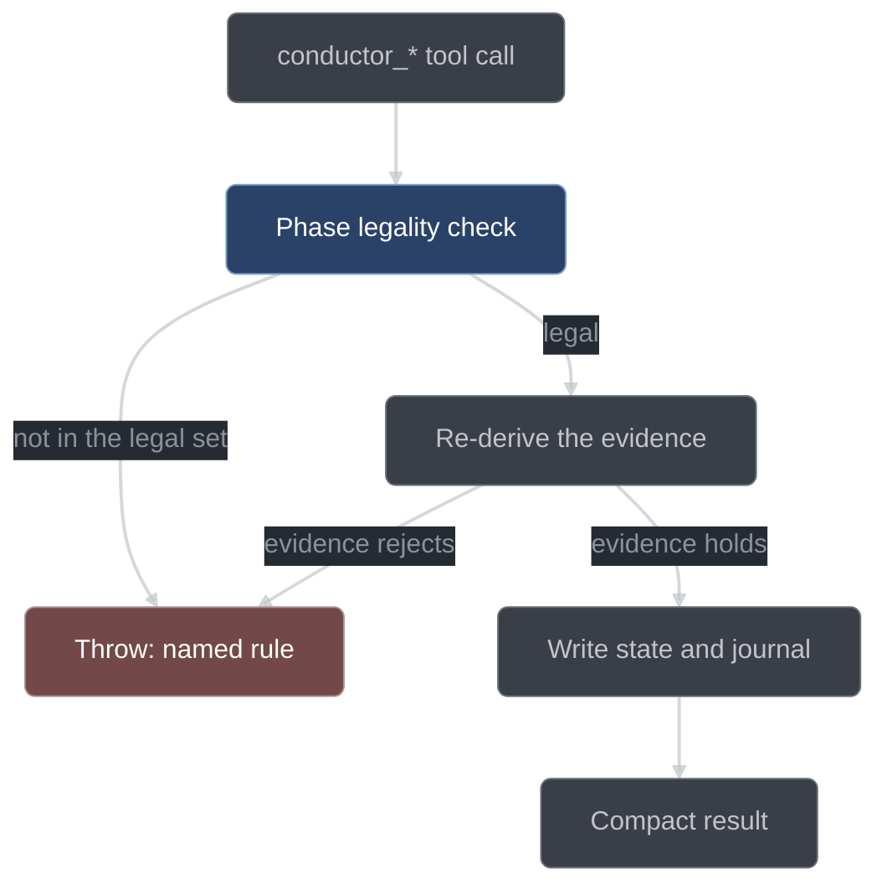

# Tool reference

The 22 `conductor_*` tools, what each one takes, what its handler re-derives before it
believes anything, and when it is legal to call. This is the reference for anyone reading
a run transcript or driving conductor by hand.

## The handler contract

Every `conductor_*` tool is a handler inside the conductor plugin, and every handler runs
the same four steps:

1. **Check legality.** [`core/gates-phase.ts`](../../conductor/core/gates-phase.ts)
   derives the legal tool set for the run's current position; a call outside it is denied.
   Handlers that advance the run FSM re-ask the specific edge through
   `legalRunTransition` as well.
2. **Re-derive the evidence.** The handler runs the command, reads the ledger, dispatches
   the sub-sessions, and judges the result itself. It never accepts a model's claim that
   a test passed, a review was clean, or a queue is valid.
3. **Write state and journal.** State files are written through the crash-safe atomic
   primitive, and the transition is journaled with its correlation ids.
4. **Return a compact result** the orchestrator can narrate — ids, counts, and the new
   state, not prose.

Two consequences matter when you read a transcript. First, **handlers are the only
writers of run and item state**: no model, no sub-session, and no shell command can move
an item from GREEN to VALIDATED, which is why `.conductor/**` is denied to every editor.
Second, **legality precedes persistence**: a rejected call writes nothing at all — no
queue, no plan, no ledger line, no item — and leaves the run in the state it started in.



## Pipeline tools

These six move the run FSM. All of them are argless: the run is the argument.

| Tool                      | Args | Handler re-derives                                                      | Advances                                                                    | Legal when                                |
| ------------------------- | ---- | ----------------------------------------------------------------------- | --------------------------------------------------------------------------- | ----------------------------------------- |
| `conductor_classify`      | none | classifier + skeptic check, then its own bounds re-check                | `INTAKE` → `ANSWERED`, or → `EXECUTING` (trivial), or stays `INTAKE` (work) | `INTAKE`, classification not yet recorded |
| `conductor_decompose`     | none | queue validity: DAG, scopes, sizes, acceptance phrasing                 | `INTAKE` (classified work) → `DECOMPOSED`                                   | `INTAKE` with classification `work`       |
| `conductor_plan`          | none | placeholder scan over `plan.md`; ≥2 scored options per derived decision | `DECOMPOSED` → `PLANNED`                                                    | `DECOMPOSED`                              |
| `conductor_plan_review`   | none | lens fan-out, skeptic verdicts, bounded revision loop                   | `PLANNED` → `PLAN_REVIEWED`                                                 | `PLANNED`                                 |
| `conductor_dispatch_wave` | none | the wave (§4.2), then drives each member's pipeline                     | `PLAN_REVIEWED` → `EXECUTING` on its first call                             | `PLAN_REVIEWED`                           |
| `conductor_report`        | none | a fresh full verify, start-stamped, with the exclusion list             | `EXECUTING` → `REPORTED`, or → `TRIVIAL_DONE` (report-lite)                 | `EXECUTING` and every item settled        |

**`conductor_classify`** dispatches a `mechanical` classifier and one `skeptic` cross-check
over the user's prompt, and takes the stricter of the two kinds on disagreement. The
handler then disposes: a `trivial` item is escalated to `work` if it names more files than
`workflow.trivialMaxFiles`, if it is behavioral with no test scope, or if it is
`behavioral: false` while its `fileScope` intersects `verify.behavioralPaths`. A surviving
trivial is synthesized into a one-item `queue.json` plus a `PENDING` item, and the run
enters `EXECUTING` flagged trivial.

**`conductor_decompose`** dispatches the `planner` for a queue and judges the reply against
the whole decomposition table in [`core/planning.ts`](../../conductor/core/planning.ts):
unique ids, resolvable `dependsOn`, no cycle, non-empty `fileScope`, `testScope` non-empty
if and only if `behavioral`, the disjoint-path guard on `behavioral: false`, acceptance
criteria phrased as observable checks, a five-file and one-acceptance-cluster item budget,
and the ponytail rung rule under intensity `full` or `ultra`. Every violation is named, all
of them are collected in one pass, and the planner gets exactly one re-prompt carrying the
complete list. A reply that still violates a rule is rejected outright.

**`conductor_plan`** writes `plan.md` and extracts the run's decision records. The plan is
rejected for placeholder defects by name — `TBD`, a `TODO`/`FIXME` marker, "add error
handling", "similar to task N", a bare elision line outside a code fence — and every
decision proposal is put through the same ≥2-scored-options gate `conductor_decide` uses.
The same single bounded re-prompt applies.

**`conductor_plan_review`** fans out fresh reviewers, one lens each: correctness,
completeness against the request, decomposition quality, and minimality. Every `major`
finding faces `workflow.skepticsPerFinding` refuters and survives only if upholds reach
⌈k/2⌉ — a tie upholds. Surviving majors send the plan back to the planner for a revision
round; the loop exits on a clean round or at `workflow.planReviewMaxRounds`. At the cap
each still-surviving major becomes a question (`origin: "plan-review-cap"`) and blocks the
items its claim and evidence name, by item id or by a file path that intersects the item's
`fileScope`. The run then proceeds on the remaining items.

**`conductor_dispatch_wave`** is the run's work engine, not a marker. Its handler computes
the wave and drives each member's item pipeline concurrently, returning when the wave is
drained or blocked, because a single opencode session executes tool calls one at a time.

**`conductor_report`** requires every item to be `PUBLISHED`, blocked, or deferred. It
re-runs the full verify itself and writes `report.md`: what shipped with each item's red
proof, review rounds and taint; what was blocked or deferred and why; open questions with
their ids; the decision-ledger summary; newly registered stale-red files; the exclusions
the closing verify applied; and the run metrics. Then it records stop `done`.

## Per-item tools

These six advance one item through the item FSM. Each takes the item id, and each is legal
only for an item sitting at the matching state with no `blocked` or `deferred` annotation.

| Tool                    | Args       | Handler re-derives                                    | Advances                                        | Legal when                                                  |
| ----------------------- | ---------- | ----------------------------------------------------- | ----------------------------------------------- | ----------------------------------------------------------- |
| `conductor_submit_test` | `{itemId}` | runs the test; asserts a legal red                    | `PENDING` → `RED`                               | item is `PENDING` and `behavioral: true`                    |
| `conductor_vet_test`    | `{itemId}` | critic fan-out over spec + test + red output          | `RED` → `TEST_VETTED`                           | item is `RED`                                               |
| `conductor_mark_green`  | `{itemId}` | runs the item test; exit 0 required                   | `TEST_VETTED` → `GREEN`, or `PENDING` → `GREEN` | item is `TEST_VETTED`, or `PENDING` and `behavioral: false` |
| `conductor_validate`    | `{itemId}` | full verify: quarantined, start-stamped, HEAD-stamped | `GREEN` → `VALIDATED`                           | item is `GREEN` and no verify marker is live for its tree   |
| `conductor_item_review` | `{itemId}` | reviewer + skeptic fan-out, path-routed fix loop      | `VALIDATED` → `REVIEWED`                        | item is `VALIDATED`                                         |
| `conductor_publish`     | `{itemId}` | branch check, staging, format, freshness, commit      | `REVIEWED` → `PUBLISHED`                        | item is `REVIEWED`                                          |

**`conductor_submit_test`** dispatches a `testWriter` restricted by the edit gate to the
item's `testScope`, then runs the test itself. A legal red is a non-zero exit with failure
class `assertion` or `missing-subject`: the behavior was evaluated and was wrong, or the
subject this item is contracted to build does not exist yet. Class `error` is not a red —
it goes back to the writer for repair, bounded by `workflow.testRepairAttempts`, after
which the item is blocked at `RED` and a question is written. A test that passes
immediately is rejected too.

**`conductor_vet_test`** dispatches `workflow.vetCritics` critics with the item spec, the
test diff and the captured red output — and deliberately not the implementation, which does
not exist yet. The lenses cover observable behavior over internals, whether the test would
fail for a subtly wrong implementation, the right test level, whether it pins this item's
acceptance, and the anti-pattern scan. `mustFix` findings go back to the test-writer and
the item re-vets, bounded by `workflow.vetMaxRounds`.

**`conductor_mark_green`** lets the implementer edit the item's `fileScope`, then re-runs
the item test itself. The implementer never declares itself done: the tool call fails until
the test actually passes. A non-behavioral item runs no item test here — its evidence is the
full verify at `VALIDATED`.

**`conductor_validate`** quarantines the foreign red set, start-stamps the verify, records
the `HEAD` it judged, and runs the required scopes with the build first where configured.
While the verify is in flight every edit in that tree is frozen, production and test files
alike, and a second `conductor_validate` against a tree with a live marker is denied naming
the running verify. A failure drops the item into the DEBUG protocol.

**`conductor_item_review`** dispatches fresh reviewers over the item's diff, spec and test,
one lens each: spec/contract, correctness, guardrail, test-adequacy, minimality and perf.
The first five are mandatory and are never truncated by configuration. Findings face
skeptic refutation, and survivors are routed by the paths their fix touches — `fileScope`
to the implementer, `testScope` to the test-writer, whose changed test then re-enters the
test discipline before re-validate. The loop is bounded by `workflow.reviewMaxRounds`.

**`conductor_publish`** runs five steps in order: `HEAD` must still equal the verify
record's head; the item's `fileScope ∪ testScope` changes are staged minus every path in
`run.startDirty`; the format rules run; freshness is re-checked and a stale verify is
re-run; and the commit is built from a pure template with no attribution trailers. Under
`git.mode: "read-only"` the prepared batch goes into the report instead of a commit.

## Questions, decisions and disposition

These six do not move the run FSM. They record why something happened, or park work that
cannot proceed. `conductor_surface`, `conductor_defer`, and `conductor_decide` are legal in
every non-terminal run state; `conductor_answer` is legal whenever a question is open,
terminal runs included.

| Tool                     | Args                                                     | Handler re-derives                                          | Advances | Legal when                                          |
| ------------------------ | -------------------------------------------------------- | ----------------------------------------------------------- | -------- | --------------------------------------------------- |
| `conductor_surface`      | `{question, blocksItems[], humanTerritory?}`             | the human-territory verdict; every named item must exist    | —        | any non-terminal state                              |
| `conductor_answer`       | `{questionId, answer}`                                   | which items that question blocked                           | —        | whenever a question is open, terminal runs included |
| `conductor_defer`        | `{itemId, reason}`                                       | the item exists; mints the decision record                  | —        | any non-terminal state                              |
| `conductor_decide`       | `{question, options[], choice, why, appliedWhere}`       | the ≥2-scored-options rule for `kind: "derived"`            | —        | any non-terminal state                              |
| `conductor_queue_amend`  | `{ops[], question, options[], choice, why, appliedWhere}` | DAG, scope and behavioral re-validation; records a decision | —        | `EXECUTING`                                         |
| `conductor_forget_stale` | `{path}`                                                 | removes the named stale-red entry                           | —        | after the human has resolved the red                |

**`conductor_surface`** appends the question to `questions.jsonl` with `origin:
"surface-tool"` and sets `blocked: {questionId}` on exactly the items it names; unnamed
items stay actionable and the run continues on them. `humanTerritory` is the core verdict
on the question text, not a caller flag: a caller may force it true, but cannot force a
human-territory question down to false. A `blocksItems` entry that names no existing item
aborts the whole call with zero writes.

**`conductor_answer`** is the human's resume path. It records the answer, clears `blocked`
on every item bound to that question, and journals each clear. It is the one non-read tool
that stays legal on a terminal run, because a terminal run may still hold an open question.

**`conductor_defer`** settles an item out of the run. It appends a decision record
explaining the deferral (`kind: "human"` — a deferral is a judgment, not a scored pick),
then sets `deferred: {reason, decisionId}`. A deferred item is settled for the purposes of
`conductor_report` and contributes no stage tool to the legal set.

**`conductor_decide`** appends one line to `decisions.jsonl`. A record with `kind:
"derived"` carrying fewer than two scored options is rejected before anything is written,
so a rejected decide leaves no ledger line and does not consume a decision id.

**`conductor_queue_amend`** is how the queue changes mid-run — usually an item re-split
after an implementer reports `BLOCKED`. The handler re-validates the DAG, the scopes and
the behavioral arithmetic exactly as decompose does, and records a decision.

**`conductor_forget_stale`** removes one path from the workspace stale-red registry at
`.conductor/state/stale-red.json`. Entries also leave on their own when the file is deleted
or a later run drives that test green; this tool is for the case where a human fixed the
situation and wants the exclusion to stop.

## Hatches

Two tools exist to let a human-shaped exception through without pretending it did not
happen. Both are described in full in [gates and hatches](gates-and-hatches.md).

| Tool                     | Args               | Handler re-derives                                       | Advances | Legal when                         |
| ------------------------ | ------------------ | -------------------------------------------------------- | -------- | ---------------------------------- |
| `conductor_inline_claim` | `{itemId, reason}` | the item's `fileScope`; records the claim and a decision | —        | the named item is live in the run  |
| `conductor_override`     | `{gate, reason}`   | the override budget; records an anomaly and the taint    | —        | budget remains under both ceilings |

**`conductor_inline_claim`** scopes the orchestrator's edit permission to one item's
`fileScope`, for work where dispatching a sub-session costs more than doing it — a one-line
fix surfaced by review, a mechanical rename. The item FSM still applies in full: inline work
goes through red, vet, green, validate and review like any other. The claim changes *who*
edits, never *what* is enforced.

**`conductor_override`** disables one named gate for exactly one next action in the same
session. It is budgeted: `workflow.maxOverridesPerItem` (1 by default) and
`workflow.maxOverridesPerRun` (2). Each use records an anomaly and appends to the item's
`taint[]`, and taint is permanent for the run and headlined in `report.md`. Going over
budget is not another override — it records an `env` stop and writes a stop-report. There is
deliberately no bulk override and no timed one: a gate that needs overriding twice in one
run is a bug in conductor, and stopping is the correct response to it.

## Meta

| Tool               | Args             | Handler re-derives                                             | Advances | Legal when                                                               |
| ------------------ | ---------------- | -------------------------------------------------------------- | -------- | ------------------------------------------------------------------------ |
| `conductor_status` | none             | nothing — every access is a read                               | —        | every state, terminal included                                           |
| `conductor_setup`  | `{reconfigure?}` | first-run detection, the setup questions, and the setup proofs | —        | `.conductor/config.json` absent, or `reconfigure: true` with no live run |

**`conductor_status`** renders the run state, the classification, every item with its
`blocked` and `deferred` annotations, and the open questions. It mutates no persisted byte,
which is why it is the one tool legal in every state.

**`conductor_setup`** writes the repo's configuration. Two of its questions have no default
and are the sanctioned interactive asks: the git mode, and confirmation of
`verify.behavioralPaths`. `reconfigure: true` re-runs it only when no run is live, and
journals a diff of what changed. Until the repo is configured, `conductor_setup` and
`conductor_status` are the only legal tools in any run state.

## Legality: the legal set and the recommended action

Earlier drafts of the design claimed exactly one tool is legal at any moment. That claim is
false as soon as more than one item is in flight — `conductor_mark_green {I1}` and
`conductor_submit_test {I2}` are simultaneously legal — and it was never true of
`conductor_status`, `conductor_decide` and `conductor_surface`, which are legal in every
non-terminal state. The honest contract is a **legal set plus one recommended action**.

`legalTools(run, items, questions, repoConfigured)` derives both, and returns a third field,
`why`, that is a plain-English rationale. Three subsystems consume that one derivation: the
phase gate that denies an illegal call, the state block injected into every request's system
prompt, and the continuation engine that re-prompts an idle orchestrator. One derivation,
three consumers — they cannot disagree.

| Run position                | Legal stage tools                                                                     | Recommended                                                     |
| --------------------------- | ------------------------------------------------------------------------------------- | --------------------------------------------------------------- |
| repo unconfigured           | `conductor_setup`, `conductor_status`                                                 | `conductor_setup`                                               |
| `INTAKE`, unclassified      | `conductor_classify`                                                                  | `conductor_classify`                                            |
| `INTAKE`, classified `work` | `conductor_decompose`                                                                 | `conductor_decompose`                                           |
| `DECOMPOSED`                | `conductor_plan`                                                                      | `conductor_plan`                                                |
| `PLANNED`                   | `conductor_plan_review`                                                               | `conductor_plan_review`                                         |
| `PLAN_REVIEWED`             | `conductor_dispatch_wave`                                                             | `conductor_dispatch_wave`                                       |
| `EXECUTING`                 | each actionable item's next stage tool; `conductor_report` once all items are settled | the wave-order-first item's stage tool, else `conductor_report` |
| terminal                    | `conductor_status`; `conductor_answer` while a question is open                       | nothing                                                         |

In every non-terminal state the always-available meta tools — `conductor_status`,
`conductor_decide`, `conductor_surface`, `conductor_defer`, plus `conductor_answer` while a
question is open — are in the legal set as well. Per-item stage tools carry the item ids they
may target, aggregated across the items sitting at that stage and sorted, so the set is
invariant under item-array reordering.

The recommendation in `EXECUTING` is deterministic: it is the wave-order-first item's next
stage tool, ordered by DAG depth and then item id through the same `nextWave` derivation the
scheduler uses. The same run content always produces the same recommendation.

Four tools are not stage tools and never appear in the legal set: `conductor_queue_amend`,
`conductor_inline_claim`, `conductor_override` and `conductor_forget_stale`. They are
governed by their own handler preconditions — the item must exist, the override budget must
hold, the stale-red entry must be registered — rather than by the run's FSM position.

## What a denial looks like

A deny is not a return value. It is `throw new Error(reason)` inside the plugin, and
opencode reads the thrown text back to the model as the refusal reason. The message names
the rule that was violated and the legal alternative, because the model's next move is
chosen from that sentence:

```text
conductor_surface: item "I9" does not exist; refusing to surface

conductor_decompose: the decomposition is REJECTED — it still violates §3.2 after the
one bounded re-prompt: item "I2" declares an empty fileScope: an item that writes
nothing is not an item (§3.2)

DECOMPOSED: conductor_plan writes the plan and advances to PLANNED (§3.2).
```

The third line is a `why` string: a phase-gate denial carries it, so the refusal states what
is legal and what is recommended instead of only what is forbidden.

Two kinds of denial reach you, and they differ in what they leave behind. A **gate denial**
happens before the handler body runs; it journals its input snapshot under `gates/deny` at
`warn` level and writes nothing else. A **handler rejection** happens inside the handler,
always before the persist step, so it too leaves no queue, no plan, no ledger line and no
state change — the tool can simply be called again once the cause is fixed.

## See also

- [Run lifecycle](run-lifecycle.md) — the run and item state machines these tools drive
- [Gates and hatches](gates-and-hatches.md) — the gate stack, the override budget, and taint
- [Configuration](configuration.md) — the `workflow.*` knobs the handlers read
- [Gates (developer)](../developer/gates.md) — the pure decision functions behind each gate
- [Project status](../developer/project-status.md) — which handlers have landed so far
