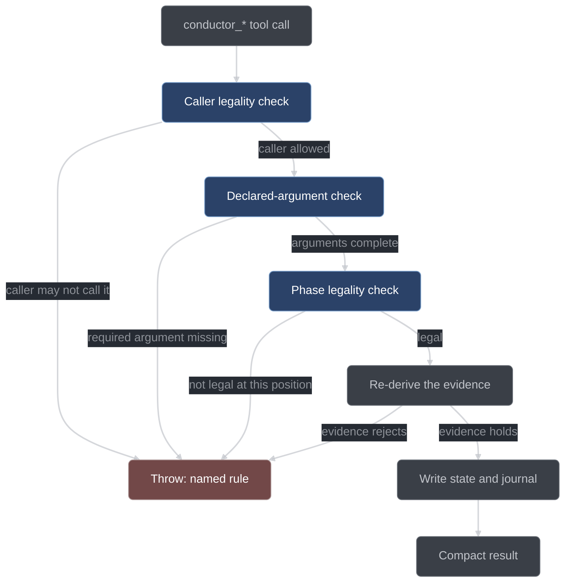

# Tool reference

The 22 `conductor_*` tools, what each one takes, what its handler re-derives before it
believes anything, and when it is legal to call. This is the reference for anyone reading
a run transcript or driving conductor by hand.

## The handler contract

Every `conductor_*` tool is a handler inside the conductor plugin, and every call runs the
same five steps in [`plugin/index.ts`](../../conductor/plugin/index.ts) `runTool`:

1. **Check the caller.** [`core/tool-legality.ts`](../../conductor/core/tool-legality.ts)
   declares one row per tool naming *who* may call it. The caller's identity comes from
   the session registry — the same map the gate hook reads — never from an argument, so a
   model cannot claim to be the orchestrator. Asked first, ahead of everything else, so a
   sub-session reaching for a tool it may not call gets the rule rather than an invitation
   to retry with different arguments.
2. **Check the arguments.** `requireDeclaredArgs` reads required-ness off the same
   argument shapes the tool map registers, and refuses a call missing one. The composition
   root never substitutes a default for an argument its caller was supposed to supply.
3. **Check the position.** The same legality row names *where* in the run the tool may be
   called, and `requireToolLegal` evaluates that rule against persisted state. Most rows
   delegate to a committed path — [`core/gates-phase.ts`](../../conductor/core/gates-phase.ts)
   `legalTools` for the run's position, `requireStageTool` for the per-item tools — and
   handlers that advance the run FSM re-ask the specific edge through `legalRunTransition`
   as well. A tool name with no declared row is refused outright rather than run unguarded.
4. **Re-derive the evidence.** The handler runs the command, reads the ledger, dispatches
   the sub-sessions, and judges the result itself. It never accepts a model's claim that
   a test passed, a review was clean, or a queue is valid.
5. **Write state and journal, then return a compact result.** State files are written
   through the crash-safe atomic primitive, the transition is journaled with its
   correlation ids, and the return value is ids, counts and the new state — not prose.

Two consequences matter when you read a transcript. First, **handlers are the only
writers of run and item state**: no model, no sub-session, and no shell command can move
an item from GREEN to VALIDATED, which is why `.conductor/**` is denied to every editor.
Second, **legality precedes persistence**: a rejected call writes nothing at all — no
queue, no plan, no ledger line, no item — and leaves the run in the state it started in.



## Who may call what

A conductor run has two kinds of caller. The **orchestrator** is the session you are
talking to — the one that drives the run. A **sub-session** is a session conductor itself
dispatched for a role: an implementer, a test-writer, a reviewer, a skeptic. The registry
records which is which, and the legality table splits on it.

Exactly three tools are callable by a dispatched sub-session: `conductor_status` (it is how
any session orients itself), `conductor_surface` (raising a blocking question is the
design's own escalation path, and `askedBy` records who raised it), and
`conductor_override` (the override budget is spent by the session working the item the
bypass applies to). Every other tool is orchestrator-only, because a dispatched session
answering its own blocking question, deferring its own item, amending the queue that
constrains it, or closing the run is marking its own homework.

## Pipeline tools

These six move the run FSM. All of them are argless: the run is the argument.

| Tool                      | Args | Handler re-derives                                                      | Advances                                                                    | Legal when                                                          |
| ------------------------- | ---- | ----------------------------------------------------------------------- | --------------------------------------------------------------------------- | ------------------------------------------------------------------- |
| `conductor_classify`      | none | classifier + skeptic check, then its own bounds re-check                | `INTAKE` → `ANSWERED`, or → `EXECUTING` (trivial), or stays `INTAKE` (work) | `INTAKE`, classification not yet recorded                           |
| `conductor_decompose`     | none | queue validity: DAG, scopes, sizes, acceptance phrasing                 | `INTAKE` (classified work) → `DECOMPOSED`                                   | `INTAKE` with classification `work`                                 |
| `conductor_plan`          | none | placeholder scan over `plan.md`; ≥2 scored options per derived decision | `DECOMPOSED` → `PLANNED`                                                    | `DECOMPOSED`                                                        |
| `conductor_plan_review`   | none | lens fan-out, skeptic verdicts, bounded revision loop                   | `PLANNED` → `PLAN_REVIEWED`                                                 | `PLANNED`                                                           |
| `conductor_dispatch_wave` | none | the wave (§4.2), then drives each member's pipeline                     | `PLAN_REVIEWED` → `EXECUTING` on its first call                             | `PLAN_REVIEWED`, and `EXECUTING` whenever the next wave has members |
| `conductor_report`        | none | a fresh full verify, start-stamped, with the exclusion list             | `EXECUTING` → `REPORTED`, or → `TRIVIAL_DONE` (report-lite)                 | `EXECUTING` and every item settled                                  |

**`conductor_classify`** dispatches a `mechanical` classifier and one `skeptic` cross-check
over the user's prompt, and takes the stricter of the two kinds on disagreement. The
handler then disposes: a `trivial` item is escalated to `work` if it names more files than
`workflow.trivialMaxFiles`, if it is behavioral with no test scope, or if it is
`behavioral: false` while its `fileScope` intersects `verify.behavioralPaths`. A surviving
trivial is synthesized into a one-item `queue.json` plus a `PENDING` item, and the run
enters `EXECUTING` flagged trivial.

**`conductor_decompose`** dispatches the `planner` for a queue and judges the reply against
the whole decomposition table in [`core/planning.ts`](../../conductor/core/planning.ts):
unique ids, resolvable `dependsOn`, no cycle, non-empty `fileScope`, `testScope` non-empty
if and only if `behavioral`, the disjoint-path guard on `behavioral: false`
(`fileScope ∩ verify.behavioralPaths = ∅`), acceptance criteria phrased as observable
checks, a five-file and one-acceptance-cluster item budget, and the ponytail rung rule
under intensity `full` or `ultra`. Every violation is named, all of them are collected in
one pass, and the planner gets exactly one re-prompt carrying the complete list. A reply
that still violates a rule is rejected outright.

Four scope rules are worth knowing before you read a decomposition refusal:

- **No wildcard-headed `fileScope` entry.** `**`, `*.ts` and `{src,lib}/**` have an empty
  literal head, so they name every path in the repository. That would grant the item's
  implementer an edit over the whole tree, and it would make the `missing-subject` failure
  class vacuous — every unresolved import would count as inside scope. Name the directory or
  file the item actually writes.
- **An item's `testScope` may not sit inside its own `fileScope`.** The implementer is gated
  to `fileScope`, so an overlap licenses the session that must *pass* the test to rewrite it.
- **No two items may claim overlapping write territory**, whatever their `behavioral` flags
  say. Two items that can edit the same file cannot be reviewed, scheduled or published
  independently — whichever publishes second commits the other's edits. Overlap is judged
  with the same conservative rule the wave scheduler uses, so `src/**` and `src/lex.mjs`
  overlap.
- **No control character in a scope entry.** Scope entries are embedded in the commit body
  and handed to the test runner as argv, so a newline in one writes a line into a record it
  does not own.

**`conductor_plan`** writes `plan.md` and extracts the run's decision records. The plan is
rejected for placeholder defects by name — `TBD`, a `TODO`/`FIXME` marker, "add error
handling", "similar to task N", a bare elision line outside a code fence — and every
decision proposal is put through the same ≥2-scored-options gate `conductor_decide` uses.
The same single bounded re-prompt applies.

**`conductor_plan_review`** fans out fresh reviewers, one lens each: correctness,
completeness against the request, decomposition quality, and minimality. The roster never
drops below the four lenses — a reader-concurrency limit lower than four would otherwise
have silently dropped two of them — and a larger fan-out buys a second independent holder of
a lens rather than a fifth kind of review.

Every `major` finding faces `workflow.skepticsPerFinding` refuters and survives only if the
seats that did not refute it reach ⌈k/2⌉ — a tie upholds. A refutation counts as a refutation
only when it names all three of a discriminating input, what was run, and the reading under
which the finding fails; a refutation without that evidence is an **abstention**, and an
abstention counts with the upholds. A skeptic who could not evaluate a finding cannot
extinguish it.

Surviving majors send the plan back to the planner for a revision round; the loop exits on a
clean round or at `workflow.planReviewMaxRounds`. At the cap each still-surviving major
becomes a question (`origin: "plan-review-cap"`) and blocks the items its claim and evidence
name, by item id or by a file path that intersects the item's `fileScope` — under the same
first-block-wins rule `conductor_surface` applies, so a later survivor drops an item an
earlier one already owns. The run then proceeds on the remaining items.

**`conductor_dispatch_wave`** is the run's work engine, not a marker. Its handler computes
the wave and drives each member's item pipeline concurrently, returning when the wave is
drained or blocked, because a single opencode session executes tool calls one at a time. It
is offered again from `EXECUTING` for as long as the wave it would compute has members, so
a run with more items than one wave holds is dispatched more than once.

**`conductor_report`** requires every item to be settled — `PUBLISHED`, blocked, deferred,
or unable ever to advance in this run. It re-runs the full verify itself and writes
`report.md`: what shipped with each item's red proof, review rounds and taint; what was
blocked or deferred and why; open questions with their ids; questions that are answered but
still standing; the decision-ledger summary; newly registered stale-red files; the
exclusions the closing verify applied; and the run metrics.

The stop kind it records is chosen from the run's persisted dispositions and the closing
verify's own result, never asserted by the writer. A green closing verify over a run that
advanced at least one item stops `done`; a run that settled everything without advancing
anything stops `noop`; a run whose remaining items wait on a human stops `blocked` or
`surfaced`. A **red** closing verify can never stop `done` — an assertion, missing-subject
or unclassifiable failure stops `blocked`, and a runner that could not run at all stops
`env`. The closing verify is a law, not a formality.

## Per-item tools

These six advance one item through the item FSM. Each takes the item id, and each is legal
only for an item sitting at the matching state with no `blocked` or `deferred` annotation.

| Tool                    | Args       | Handler re-derives                                    | Advances                                        | Legal when                                                  |
| ----------------------- | ---------- | ----------------------------------------------------- | ----------------------------------------------- | ----------------------------------------------------------- |
| `conductor_submit_test` | `{itemId}` | runs the test; asserts a legal red                    | `PENDING` → `RED`                               | item is `PENDING` and `behavioral: true`                    |
| `conductor_vet_test`    | `{itemId}` | critic fan-out over spec + test + red output          | `RED` → `TEST_VETTED`                           | item is `RED`                                               |
| `conductor_mark_green`  | `{itemId}` | runs the item test; exit 0 required                   | `TEST_VETTED` → `GREEN`, or `PENDING` → `GREEN` | item is `TEST_VETTED`, or `PENDING` and `behavioral: false` |
| `conductor_validate`    | `{itemId}` | full verify: quarantined, start-stamped, HEAD-stamped | `GREEN` → `VALIDATED`                           | item is `GREEN` and no verify marker is live for its tree   |
| `conductor_item_review` | `{itemId}` | reviewer + skeptic fan-out, path-routed fix loop      | `VALIDATED` → `REVIEWED`                        | item is `VALIDATED`                                         |
| `conductor_publish`     | `{itemId}` | branch check, staging, format, freshness, commit      | `REVIEWED` → `PUBLISHED`                        | item is `REVIEWED`                                          |

**`conductor_submit_test`** dispatches a `testWriter` restricted by the edit gate to the
item's `testScope`, then runs the test itself. A legal red is a non-zero exit with failure
class `assertion` or `missing-subject`: the behavior was evaluated and was wrong, or the
subject this item is contracted to build does not exist yet. Class `error` is not a red —
it goes back to the writer for repair, bounded by `workflow.testRepairAttempts`, after
which the item is blocked at `RED` and a question is written. A test that passes
immediately is rejected too.

**`conductor_vet_test`** dispatches `workflow.vetCritics` critics with the item spec, the
test diff and the captured red output — and deliberately not the implementation, which does
not exist yet. The lenses cover observable behavior over internals, whether the test would
fail for a subtly wrong implementation, the right test level, whether it pins this item's
acceptance, and the anti-pattern scan. `mustFix` findings go back to the test-writer and
the item re-vets, bounded by `workflow.vetMaxRounds`.

**`conductor_mark_green`** lets the implementer edit the item's `fileScope`, then re-runs
the item test itself. The implementer never declares itself done: the tool call fails until
the test actually passes. A non-behavioral item runs no item test here — its evidence is the
full verify at `VALIDATED`.

**`conductor_validate`** quarantines the foreign red set, start-stamps the verify, records
the `HEAD` it judged, and runs the required scopes with the build first where configured.
While the verify is in flight every edit in that tree is frozen, production and test files
alike, and a second `conductor_validate` against a tree with a live marker is denied naming
the running verify. A failure drops the item into the DEBUG protocol.

**`conductor_item_review`** dispatches fresh reviewers over the item's diff, spec and test,
one lens each: spec/contract, correctness, guardrail, test-adequacy, minimality and perf.
The first five are mandatory and are never truncated by configuration — the roster is
clamped to three-to-six sessions (three on a trivial run), and below six the lenses merge
pairwise from the tail of the priority list rather than dropping. The diff a reviewer is
shown includes synthesized creation hunks for files the item brings into existence, so an
item whose whole job is to create a file still has something to be reviewed against.
Findings face skeptic refutation, and survivors are routed by the paths their fix touches —
`fileScope` to the implementer, `testScope` to the test-writer, whose changed test then
re-enters the test discipline before re-validate. The loop is bounded by
`workflow.reviewMaxRounds`; at the cap one question carries the surviving finding list, the
item is blocked and stays at `VALIDATED`.

**`conductor_publish`** runs five steps in order: `HEAD` must still equal the verify
record's head; the item's `fileScope ∪ testScope` changes are staged minus every path in
`run.startDirty`; the format rules run; freshness is re-checked and a stale verify is
re-run; and the commit is built from a pure template with no attribution trailers. Under
`git.mode: "commit-and-push"` the commit is pushed as well.

Every publish appends a batch line to `publish-batch.jsonl` — the item, the mode, the files,
the diff and the suggested message — and the report renders it. Under `git.mode:
"read-only"` the paths are computed and the format rules still run, but nothing is added to
the index and no commit is made, so that batch is the whole record of what the item would
have shipped; the item still advances to `PUBLISHED`. The mode that
parks an item at `REVIEWED` instead is §3.9 no-git — a workspace that is not a git
repository at all — where `conductor_publish` is not offered and refuses if called.

## Questions, decisions and disposition

These six do not move the run FSM. They record why something happened, or park work that
cannot proceed. `conductor_surface`, `conductor_defer` and `conductor_decide` are legal in
every non-terminal run state; `conductor_answer` is legal whenever a question is open,
terminal runs included; `conductor_queue_amend` is legal anywhere in a live run; and
`conductor_forget_stale` is legal everywhere, including with no run at all.

| Tool                     | Args                                                      | Handler re-derives                                          | Advances | Legal when                                          |
| ------------------------ | --------------------------------------------------------- | ----------------------------------------------------------- | -------- | --------------------------------------------------- |
| `conductor_surface`      | `{question, blocksItems[], humanTerritory?}`              | the human-territory verdict; every named item must exist    | —        | any non-terminal state                              |
| `conductor_answer`       | `{questionId, answer}`                                    | which items that question blocked, and their successors     | —        | whenever a question is open, terminal runs included |
| `conductor_defer`        | `{itemId, reason}`                                        | the item exists; mints the decision record                  | —        | any non-terminal state                              |
| `conductor_decide`       | `{question, options[], choice, why, appliedWhere}`        | the ≥2-scored-options rule, and §6.2 human territory        | —        | any non-terminal state                              |
| `conductor_queue_amend`  | `{ops[], question, options[], choice, why, appliedWhere}` | DAG, scope and behavioral re-validation; records a decision | —        | any live (non-terminal) run                         |
| `conductor_forget_stale` | `{path}`                                                  | no handler — bound straight to the store's `removeStaleRed` | —        | every state, including with no run at all           |

**`conductor_surface`** appends the question to `questions.jsonl` with `origin:
"surface-tool"` and sets `blocked: {questionId}` on the items it names; unnamed items stay
actionable and the run continues on them. `humanTerritory` is the core verdict on the
question text, not a caller flag: a caller may force it true, but cannot force a
human-territory question down to false. A `blocksItems` entry that names no existing item
aborts the whole call with zero writes.

Blocking is **first-block-wins**. An item carries exactly one `blocked` annotation, so if a
later question names an item some earlier open question already blocks, the item keeps the
block it has. The later question is still recorded and still lists that item in its own
`blocksItems`; the tool's `blockedItemIds` result names only the items this question
actually blocked. The result also carries `answerPath` — the repo-relative file the
operator can drop an answer into.

**`conductor_answer`** is the human's resume path. It records the answer with the channel
it arrived through, clears `blocked` on the items bound to that question, and journals each
clear. Because blocking hands off, a released item is immediately **re-blocked on the
oldest still-open question that also names it**, and such an item is not listed in
`clearedItemIds` — the journal record for a cleared id says `blocked: null`, so listing a
still-blocked item would contradict the disk.

An answer can also resume a run that stopped waiting for it: `resumed: true` in the result
means the stop record was cleared and the run is live again. That revival is deliberately
narrow. It never fires for a run terminal by FSM state (a run closed by `conductor_report`
has its artifact, and reviving it would mean inventing a backwards edge), and it never
fires for a §6.2 human-territory question answered through the tool channel — that question
is released by the operator's own answer file and nothing else. The answer is still
recorded either way, and both `conductor_status` and `report.md` render it as a question
that is answered but still standing.

`conductor_answer` is the one non-read tool that stays legal on a terminal run, because a
terminal run may still hold an open question.

**`conductor_defer`** settles an item out of the run. It appends a decision record
explaining the deferral, then sets `deferred: {reason, decisionId}`. A deferred item is
settled for the purposes of `conductor_report` and contributes no stage tool to the legal
set. The record's `kind` is derived from what authorized it, not asserted. `conductor_defer`
declares no argument for citing a human answer, so a deferral taken through the tool always
records `kind: "derived"`; the handler's human-file authority path exists but has no
caller. Deferral records no
scored options — it is a judgment, not a pick — and is exempt from the two-options rule.
Deferring is free: nothing prices it, taints the item, or refuses it.

**`conductor_decide`** appends one line to `decisions.jsonl`, and faces two checks before
anything is written. A record with `kind: "derived"` carrying fewer than two scored options
is rejected. And a `kind: "derived"` record whose question is §6.2 **human territory** is
rejected as well — deriving such an answer settles, on the model's own authority, a matter
the human owns. That second rejection surfaces the question as a §2.11 question (blocking
no item, so the run can carry on with work it can still do) and tells the caller to record
the human's answer with `kind: "human"`. Either way a rejected decide leaves no ledger line
and consumes no decision id.

**`conductor_queue_amend`** is how the queue changes mid-run — usually an item re-split
after an implementer reports `BLOCKED`. `ops` is a list of structured operations, each
`{op, id?, item?}`: `remove` names an id, while `add` and `update` carry the whole §2.4
queue entry (id, title, rationale, `fileScope`, `testScope`, `acceptance`, `behavioral`,
`dependsOn` and the ponytail record). The handler re-validates the DAG, the scopes and the
behavioral arithmetic exactly as decompose does, and records a decision — so the same five
decision arguments `conductor_decide` takes are required here too.

Two amendment rules bite often enough to name. The queue is amendable only before
verification — `PENDING`, `RED`, `TEST_VETTED`, `GREEN`; at `VALIDATED` the item carries a
verify record the amended scope would invalidate, and at `REVIEWED`/`PUBLISHED` its work is
integrated. And an `update` may not rewrite a `fileScope` or `testScope` past `PENDING`:
the item's existing red or green evidence was produced under the scope being replaced, so a
re-scope must be stated as the rebirth it is — a `remove` then an `add`, which reborns the
item `PENDING` with no evidence and no attempts.

**`conductor_forget_stale`** removes one path from the workspace stale-red registry at
`.conductor/state/stale-red.json`. It is one of the three tools carrying a `phase: "always"`
rule — the others are `conductor_status` and `conductor_setup` — so it is callable with no
live run at all, because the stale-red registry precedes every run.

That registry is how a run discloses tests it left red. When a run ends, the `testScope`
files of every item still below `GREEN` — the tests that may still be failing — are
registered, provided the file actually exists on disk and is not registered already. Every
later run reads the registry at creation time into `run.excludedStaleRed` and excludes those
paths from its own verify, so one run's unfinished test cannot fail an unrelated run.
Nothing removes an entry on its own: not deleting the file, not a later run driving the test
green. `conductor_forget_stale` is the only way an entry leaves, and it exists for exactly
the case where a human resolved the red and wants the exclusion to stop.

## Hatches

Two tools exist to let a human-shaped exception through without pretending it did not
happen. Both are described in full in [gates and hatches](gates-and-hatches.md).

| Tool                     | Args                                  | Handler re-derives                                       | Advances | Legal when                                                   |
| ------------------------ | ------------------------------------- | -------------------------------------------------------- | -------- | ------------------------------------------------------------ |
| `conductor_inline_claim` | `{itemId, reason, options[], choice}` | the item's `fileScope`; records the claim and a decision | —        | any live run; the named item must exist; orchestrator only   |
| `conductor_override`     | `{gate, reason, grantedAction}`       | the override budget; records an anomaly and the taint    | —        | any live run; `gate` must be one of `session`, `git`, `edit` |

**`conductor_inline_claim`** scopes the orchestrator's edit permission to one item's
`fileScope`, for work where dispatching a sub-session costs more than doing it — a one-line
fix surfaced by review, a mechanical rename. The item FSM still applies in full: inline work
goes through red, vet, green, validate and review like any other. The claim changes *who*
edits, never *what* is enforced.

The claim is itself a §2.7 decision — dispatching the item was the other option — so it
carries `options` and `choice` exactly as `conductor_decide` does, and faces the same
two-scored-options rule. A claim with fewer than two scored options is refused before
anything is written.

**`conductor_override`** disables one named gate for exactly one next action in the same
session. Its three arguments are the gate, the justification, and `grantedAction` — the one
next action the bypass permits, recorded in the anomaly, in the item's taint entry and in
the grant itself, so the record says what was let through rather than only that something
was.

`gate` is a closed vocabulary of exactly three names: `session`, `git` and `edit`. Those are
the only gate decisions that have a place to spend a grant. A name outside the set is
refused **before** the budget is touched, and the refusal costs nothing — no meter moves, no
taint is recorded, no anomaly is appended, and the run does not stop. Re-issue naming one of
the three, or take the refusal the gate actually gave you as the answer.

Which item's budget is spent is not an argument. It comes from the session registry: the
override is spent by the session working the item the bypass applies to, so a session that
carries no item assignment is refused outright.

The budget is `workflow.maxOverridesPerItem` (1 by default) and `workflow.maxOverridesPerRun`
(2 by default). Each granted use records an anomaly and appends to the item's `taint[]`, and
taint is permanent for the run and headlined in `report.md`. Going over budget is not another
override — it records an `env` stop and writes a stop-report. There is deliberately no bulk
override and no timed one: a gate that needs overriding twice in one run is a bug in
conductor, and stopping is the correct response to it.

## Meta

| Tool               | Args                       | Handler re-derives                                             | Advances | Legal when                                                               |
| ------------------ | -------------------------- | -------------------------------------------------------------- | -------- | ------------------------------------------------------------------------ |
| `conductor_status` | none                       | nothing — every access is a read                               | —        | every state, terminal included, and with no run at all                   |
| `conductor_setup`  | `{reconfigure?, answers?}` | first-run detection, the setup questions, and the setup proofs | —        | `.conductor/config.json` absent, or `reconfigure: true` with no live run |

**`conductor_status`** is the read surface, and mutates no persisted byte — which is why it
is legal in every state and callable by any session. It returns the run state, the
classification, every item with its `blocked` and `deferred` annotations, the open questions
(each with the `answerPath` an operator can drop an answer into), the questions that are
answered but still standing with the notice explaining what is still owed, and one row per
session that has received doctrine in this run — its role, the packs delivered and a digest
of their bytes. Called in a workspace with no run at all, it returns that shape with nulls
and empty lists rather than refusing.

**`conductor_setup`** writes the repo's configuration. Two of its questions have no default
and are the sanctioned interactive asks: the git mode, and confirmation of
`verify.behavioralPaths`. A call with no `answers` returns those asks and writes nothing; a
call carrying them writes. `answers` has four optional fields:

| Field              | What it answers                                                                           |
| ------------------ | ----------------------------------------------------------------------------------------- |
| `gitMode`          | the repo's git mode — `read-only`, `commit`, or `commit-and-push`; never defaulted        |
| `behavioralPaths`  | the confirmed (or corrected) `verify.behavioralPaths` list                                |
| `initRepo`         | in a directory that is not a git repository: `true` initializes one, `false` runs no-git  |
| `acknowledgeNoTdd` | the explicit word required to accept a `behavioralPaths` list covering none of the source |

`acknowledgeNoTdd` exists because a `behavioralPaths` list that matches no source file in
the repo makes every item legally `behavioral: false` — the whole repo would run
`PENDING → GREEN` with no test at all. Setup refuses such a list and names the source globs
it detected; passing `acknowledgeNoTdd: true` configures it anyway. Setup will not turn the
TDD law off by accident.

`reconfigure: true` re-runs setup on an already-configured repo, and only when no run is
live; the journal record for a reconfigure carries the diff — each changed key with its old
and new value, and an empty change set when the rewrite moved nothing. Every setup write,
first run included, also journals the answers it was given, because `acknowledgeNoTdd` has
no config field to land in and would otherwise leave no trace at all.

Until the repo is configured, `conductor_setup` and `conductor_status` are the only tools
the phase gate offers in any run state.

## Legality: the legal set and the recommended action

Earlier drafts of the design claimed exactly one tool is legal at any moment. That claim is
false as soon as more than one item is in flight — `conductor_mark_green {I1}` and
`conductor_submit_test {I2}` are simultaneously legal — and it was never true of
`conductor_status`, `conductor_decide` and `conductor_surface`, which are legal in every
non-terminal state. The honest contract is a **legal set plus one recommended action**.

`legalTools(run, items, questions, repoConfigured, publishEnabled)` derives both, and returns
a third field, `why`, that is a plain-English rationale. Three subsystems consume that one
derivation: the phase gate that denies an illegal call, the state block injected into every
request's system prompt, and the continuation engine that re-prompts an idle orchestrator.
One derivation, three consumers — they cannot disagree.

The fifth argument, `publishEnabled`, is how §3.9 no-git mode reaches the gate. In a
directory that is not a git repository there is nothing to commit to, so `conductor_publish`
is suppressed from both the legal set and the recommendation, and an item terminates at
`REVIEWED` with its diff recorded in the report. Every production call site passes the
argument explicitly.

| Run position                | Legal stage tools                                                                                                                                | Recommended                                                     |
| --------------------------- | ------------------------------------------------------------------------------------------------------------------------------------------------ | --------------------------------------------------------------- |
| repo unconfigured           | `conductor_setup`, `conductor_status`                                                                                                            | `conductor_setup`                                               |
| `INTAKE`, unclassified      | `conductor_classify`                                                                                                                             | `conductor_classify`                                            |
| `INTAKE`, classified `work` | `conductor_decompose`                                                                                                                            | `conductor_decompose`                                           |
| `DECOMPOSED`                | `conductor_plan`                                                                                                                                 | `conductor_plan`                                                |
| `PLANNED`                   | `conductor_plan_review`                                                                                                                          | `conductor_plan_review`                                         |
| `PLAN_REVIEWED`             | `conductor_dispatch_wave`                                                                                                                        | `conductor_dispatch_wave`                                       |
| `EXECUTING`                 | each actionable item's next stage tool; `conductor_dispatch_wave` while the next wave has members; `conductor_report` once all items are settled | the wave-order-first item's stage tool, else `conductor_report` |
| terminal                    | `conductor_status`; `conductor_answer` while a question is open                                                                                  | nothing                                                         |

In every non-terminal state the always-available meta tools — `conductor_status`,
`conductor_decide`, `conductor_surface`, `conductor_defer`, plus `conductor_answer` while a
question is open — are in the legal set as well. Per-item stage tools carry the item ids they
may target, aggregated across the items sitting at that stage and sorted, so the set is
invariant under item-array reordering.

An item contributes its stage tool only when it is neither blocked nor deferred **and** every
id in its `dependsOn` names an item this run has already `PUBLISHED`. That dependency check is
the same one the scheduler applies, so the gate never offers a tool for an item the scheduler
would refuse to schedule.

The recommendation in `EXECUTING` is deterministic: it is the wave-order-first item's next
stage tool, ordered by DAG depth and then item id through the same `nextWave` derivation the
scheduler uses. The same run content always produces the same recommendation.

Four tools are hatches rather than pipeline steps, so `legalTools` does not emit them:
`conductor_queue_amend`, `conductor_inline_claim`, `conductor_override` and
`conductor_forget_stale`. They are not therefore unguarded. Every `conductor_*` call passes
through the same choke point, and each of these declares its own rule there — the first three
are legal in any live (non-terminal) run, `conductor_forget_stale` in every state including
with no run — on top of their handler preconditions: the item must exist, the override gate
must be one of the three real ones and the budget must hold, the amendment must re-validate.
The point of the choke point is that a tool cannot be added to conductor without answering
both "who may call it" and "where may it be called", because a name with no declared row is
refused rather than run.

## What a denial looks like

A deny is not a return value. It is `throw new Error(reason)` inside the plugin, and
opencode reads the thrown text back to the model as the refusal reason. The message names
the rule that was violated and the legal alternative, because the model's next move is
chosen from that sentence:

```text
conductor_surface: item "I9" does not exist; refusing to surface

conductor_decompose: the decomposition is REJECTED — it still violates §3.2 after the
one bounded re-prompt: item "I2" declares an empty fileScope: an item that writes
nothing is not an item (§3.2)

DECOMPOSED: conductor_plan writes the plan and advances to PLANNED (§3.2).
```

The third line is a `why` string: a phase-gate denial carries it, so the refusal states what
is legal and what is recommended instead of only what is forbidden.

A caller refusal reads differently, because "you may not call this at all" and "you may not
call this here" are different facts and a reader acts on them differently. It names who the
caller is, why the tool is orchestrator-only, and the complete list of tools such a session
*may* call — so a dispatched implementer is not left waiting for a run position that would
never make the call legal for it.

Three kinds of denial reach you, and they differ in what they leave behind. A **gate denial**
is the bash/edit/git gate refusing a tool call before it runs; it journals its input snapshot
under `gates/deny` at `warn` level and writes nothing else. A **legality refusal** — wrong
caller, missing argument, wrong run position, or a tool with no declared rule — happens
before the handler body is entered and writes nothing at all. A **handler rejection** happens
inside the handler, always before the persist step, so it too leaves no queue, no plan, no
ledger line and no state change. In all three cases the tool can simply be called again once
the cause is fixed.

## See also

- [Run lifecycle](run-lifecycle.md) — the run and item state machines these tools drive
- [Gates and hatches](gates-and-hatches.md) — the gate stack, the override budget, and taint
- [Configuration](configuration.md) — the `workflow.*` knobs the handlers read
- [Gates (developer)](../developer/gates.md) — the pure decision functions behind each gate
- [Project status](../developer/project-status.md) — where the build stands
